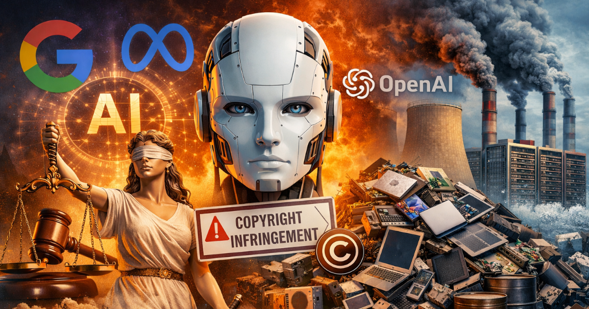

*Una estratègia intermèdia per continuar sent visible sense regalar el coneixement ni augmentar el cost energètic.*

**Sèrie:**
- **Part 1: Introducció**
- [Part 2: Estratègies tècniques](/ca/posts/limitar-acces-ia-contingut-sense-desapareixer-part-2/)
- [Part 3: Més reducció de tokens](/ca/posts/limitar-acces-ia-contingut-sense-desapareixer-part-3/)

## Taula de continguts

## Bloqueig total: la reacció inicial

Pensant que no vull que la intel·ligència artificial **aprengui ni s'entreni** amb el contingut del meu blog, la primera idea que em va venir al cap va ser **bloquejar completament l'accés als bots d'IA**. Era conscient que, en molts casos, aquest tipus de bloquejos es poden saltar, però tot i així vaig valorar recolzar-me en llistats coneguts —com *ai-robots-txt* o les llistes de bots verificats que mantenen serveis com Cloudflare— per limitar al màxim aquest accés.

## Context legal i legitimitat del bloqueig

Aquesta reacció inicial no neix només d'una preocupació individual o econòmica, sinó també d'un context molt més ampli, inclòs el **marc legal europeu** en què operem els qui publiquem contingut a la Unió Europea. Cada cop són més freqüents els textos i debats que adverteixen que el ràpid avanç de la intel·ligència artificial, impulsat principalment per grans tecnològiques, **planteja riscos legals, ètics i mediambientals gens menors**. En l'àmbit europeu, això s'ha traduït en normativa específica: la legislació de la UE reconeix excepcions per a la mineria de textos i dades (*Text and Data Mining*), però també permet als creadors i editors **reservar explícitament els seus drets** i oposar-se a l'ús dels seus continguts per a l'entrenament de sistemes d'IA.

Aquest marc legal reforça la idea que limitar l'ús automatitzat del contingut no és només una qüestió tècnica o econòmica, sinó també una decisió legítima des del punt de vista jurídic.

## El risc de desaparèixer

Tanmateix, en donar-li una volta més al problema, va aparèixer un dubte molt més inquietant.

Cada vegada més persones estan començant a utilitzar la intel·ligència artificial **per a absolutament tot**, inclosa la cerca d'informació. I encara que molts d'aquests usuaris acaben visitant les pàgines enllaçades, la realitat és que una gran majoria es queda únicament amb la resposta que ofereix el LLM. De fet, no és estrany —i jo mateix ho faig en ocasions— demanar directament *“fes-me un resum d'aquesta pàgina”* i no arribar a visitar-la mai.

Llavors sorgeix la pregunta incòmoda:
si bloquegem completament l'accés de la intel·ligència artificial al nostre blog o servei web, i el gruix dels usuaris acaba utilitzant la IA com a principal porta d'entrada a la informació, **¿no correm el risc de tornar-nos invisibles?**

## Estratègia intermèdia: què mostrar i què reservar

La solució, almenys des del meu punt de vista, **no passa per bloquejar completament l'accés al contingut**, sinó per una cosa molt més matisada: **decidir conscientment quines parts del nostre contingut poden circular i quines no**.

### Què pot veure la IA

Té sentit permetre que la intel·ligència artificial accedeixi als elements **no substancials** d'un article o servei: el títol, el resum o introducció, la data de publicació, una imatge destacada o una breu descripció del servei. Aquesta informació funciona com a aparador, com a context i com a senyal de descoberta. A més, en limitar l'accés al contingut complet, **reduïm substancialment els tokens utilitzats**, cosa que equival a una **reducció directa del consum energètic**.

### Què ha de quedar fora

En canvi, el **contingut complet de l'article** —on realment s'aporta coneixement, experiència, opinió i valor diferencial, i del qual un LLM podria aprendre— hauria de quedar **fora de l'abast dels bots d'IA**. No per ocultar-lo al lector humà, sinó per reservar-lo a qui decideix fer el pas conscient de visitar la web.

## Resum i avanç tècnic

La idea no és desaparèixer del nou ecosistema de cerca impulsat per la intel·ligència artificial, sinó **continuar sent visible sense regalar el fons del contingut**. Permetre que la IA assenyali el camí, però fer que el valor real —el que requereix temps, context i recursos— només existeixi en el teu propi espai i es consumeixi de manera conscient i responsable.

### Una solució tècnica (avanç)

Tot i que el detall tècnic es desenvoluparà a la [Part 2](/ca/posts/limitar-acces-ia-contingut-sense-desapareixer-part-2/), convé avançar la idea general. Aquesta sèrie tindrà **tres parts**: la tercera se centrarà en **com adaptar el contingut alternatiu per reduir encara més el consum de tokens** i es publicarà com a [Part 3](/ca/posts/limitar-acces-ia-contingut-sense-desapareixer-part-3/).

L'estratègia passa per **combinar diverses capes de control**, sense entrar encara en implementacions concretes:

* indicar als bots d'IA, mitjançant senyals estàndard, quines parts del lloc no haurien de rastrejar;
* limitar l'accés automàtic al contingut complet, mantenint visibles títols i resums;
* i, quan tingui sentit, **mostrar contingut alternatiu mínim als bots** (un teaser) que permeti enllaçar sense exposar tot el text.

Aquestes mesures no impedeixen l'accés a les persones, però redueixen l'ús massiu del contingut per part de sistemes automatitzats i la quantitat d'informació disponible per a l'entrenament.

Convé insistir en una idea clau: **cap d'aquestes solucions és 100 % fiable**. Són aproximacions raonables en un escenari canviant. A la [Part 2](/ca/posts/limitar-acces-ia-contingut-sense-desapareixer-part-2/) entraré en detall en com aplicar-les a nivell tècnic, amb exemples i recursos concrets, i la [Part 3](/ca/posts/limitar-acces-ia-contingut-sense-desapareixer-part-3/) aprofundirà en com ajustar el contingut alternatiu per reduir tokens sense perdre visibilitat.

> **Nota personal**: tot el que s'exposa en aquesta primera part recull opinions, reflexions i conclusions pròpies a partir de la meva experiència i observació del context actual. No pretenen ser veritats absolutes ni solucions definitives, i és molt possible que algunes d'aquestes idees evolucionin o fins i tot resultin equivocades amb el temps. Aquest article no busca fer càtedra, sinó obrir una reflexió honesta sobre un problema que encara és lluny d'estar resolt.
