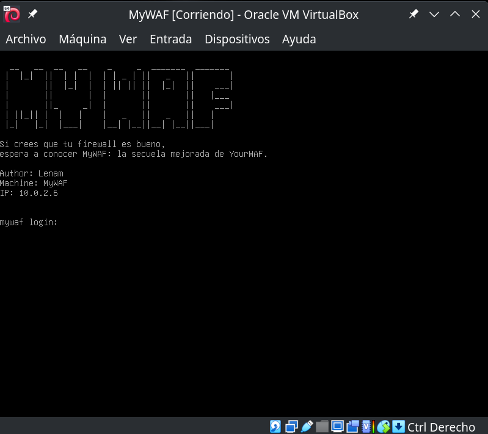
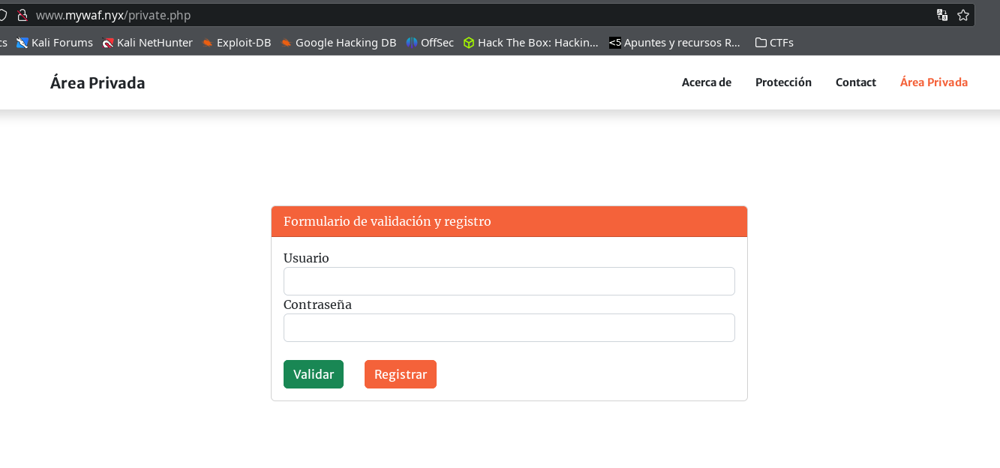
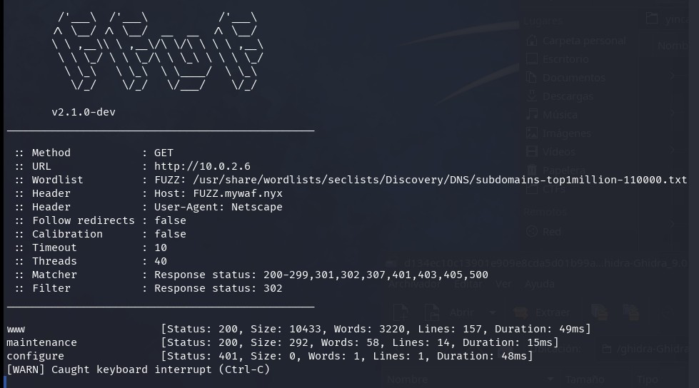
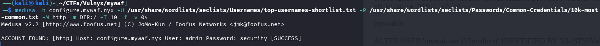
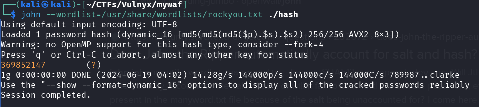
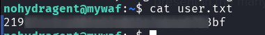
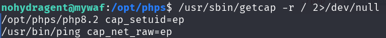
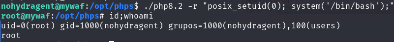

No estava content amb el resultat del CTF YourWAF, així que ara porto MyWAF, un CTF creat a partir de l'altre, completament modificat i millorat com a seqüela. Espero que això no sigui un impediment per acceptar-lo.



## Taula de continguts

## Enumeració

`$ nmap -p- -Pn -T5 10.0.2.6`


`$ nmap -sVC -p22,80,3306 -T5 10.0.2.6`


Trobem els ports mariadb, ssh i http. Reviem què hi ha en l'http i ens redirigeix a la URL [www.mywaf.nyx](http://www.mywaf.nyx/), l'afegim al fitxer /etc/hosts i observem un lloc web.


Amb una àrea privada amb registre i validació d'usuari:



Busquem possibles subdominis amb un diccionari gran.

`$ ffuf -w /usr/share/wordlists/seclists/Discovery/DNS/subdomains-top1million-110000.txt -u http://10.0.2.6 -H "Host: FUZZ.mywaf.nyx" -H "User-Agent: Netscape" -fc 302`

Ràpidament trobem `www` i `maintenance`, i en 40 segons, configurem.



Afegim tots els subdominis a `/etc/hosts` i observem què hi ha amb el navegador.

Hi ha una magnífica execució de comandes per al manteniment del servidor a maintenance.mywaf.nyx, igual que teníem a YourWAF, però aquesta vegada el WAF bloqueja gairebé tot.


D'altra banda, el domini configure.mywaf.nyx té autenticació HTTP bàsica.

## Intrusió

Intentem un atac de força bruta per passar l'autenticació del domini configure.mywaf.nyx, primer intentem amb hydra, però hi ha un problema, no hi ha manera d'eliminar la capçalera User-Agent que envia, cosa que fa que el WAF el detecti. Provem amb medusa, que no envia cap User-Agent sospitós.

`$ medusa -h configure.mywaf.nyx -U /usr/share/wordlists/seclists/Usernames/top-usernames-shortlist.txt -P /usr/share/wordlists/seclists/Passwords/Common-Credentials/10k-most-common.txt -M http -m DIR:/ -T 10 -f -v 04`



Trobem algunes credencials: admins:security, les fem servir per entrar al subdomini configure on hi ha una pàgina per configurar el nivell de paranoia de modsecurity, només ens deixa establir-ho en nivell 3 o 4, actualment està en el nivell 4, ho canviem a nivell 3.


Ara sembla que des de l'execució de comandes al subdomini maintenance podem fer més coses, ens permet introduir espais i més caràcters que abans no podíem.

Amb les següents càrregues útils, aconseguim llegir alguns fitxers:

`cat index.php|base64`


Utilitzem la mateixa càrrega útil per obtenir fitxers que creiem poden tenir dades interessants, moltes vegades el WAF ho detecta fins i tot si ho codifiquem en base64, però aconseguim llegir els següents fitxers:

**/var/www/www.mywaf.nyx/index.php**

On podem veure al principi:
```php
<?php
// Dades de connexió a la base de dades
$host = 'localhost';
$dbname = getenv("DB");
$username = getenv("DBUSER");
$password = getenv("DBPASS");
```

Intentem trobar aquestes variables d'entorn DB, DBUSER, DBPASS. Les trobem al següent fitxer:

**/etc/apache2/sites-available/www.mywaf.nyx.conf**

```
SetEnv DB "mywafdb"
SetEnv DBUSER "mywafuser"
SetEnv DBPASS "Ukf8T93VnbsXmDuh7WM4r5"
```

També obtenim el fitxer /var/www/www.mywaf.nyx/private.php, en aquest fitxer, hi ha una part del codi on es pot veure com es genera el hash per als usuaris registrats:

```php
$salt1 = bin2hex(random_bytes(16)); // Generar salt1 aleatori
$salt2 = bin2hex(random_bytes(16));
$hashed_password = md5(md5(md5($password_plain).$salt1).$salt2);
```

### Base de dades

Donat que tenim el nom d'usuari i la contrasenya de la base de dades, els utilitzem per accedir.


Trobem un usuari a la base de dades, amb un hash i dos salts.


Ens recorda a la programació en el fitxer private.php, amb la qual segurament té una connexió.

### Crackejar el hash de l'usuari nohydragent

Tenim les dades de l'usuari següent obtingudes de la base de dades:

- usuari: nohydragent
- hash de contrasenya: 53199f8a05fec6a7e686b6f816e73995
- salt1: 598afc235e17f253bfa3d5d1d221829c
- salt2: ef14766b1e61bd9392215cc3160d628d

D'altra banda, en el fitxer private.php trobem que el salt es genera de la següent manera:

`md5(md5(md5($password_plain).$salt1).$salt2);`

Busquem a john si existeix aquest format i trobem el dynamic_16, que és exactament el que estem buscant.


Preparem el hash segons indica el format:

`$dynamic_16$53199f8a05fec6a7e686b6f816e73995$598afc235e17f253bfa3d5d1d221829c$2ef14766b1e61bd9392215cc3160d628d`


I intentem crackejar-lo amb john i rockyou, ho fa súper ràpidament i aconseguim la contrasenya de l'usuari “nohydragent”.



### Bandera d'usuari

Intentem connectar-nos amb l'usuari nohydragent via ssh amb les credencials obtingudes per si hi ha reutilització de contrasenyes i ¡bingo!


Obtenim la bandera user.txt



## Escalada de privilegis

> Aquesta part del CTF no està ben executada; l'escalada de privilegis hauria d'haver-se fet via sudo amb una contrasenya. Això hauria requerit crackejar la contrasenya de l'usuari nohydragent.

L'usuari no té sudo, ni trobem res a crontab, però trobem un fitxer executable PHP que té les capacitats cap_setuid.



Escalem privilegis com indica gtfobins.




Ara som root i podem obtenir la bandera root.txt.


