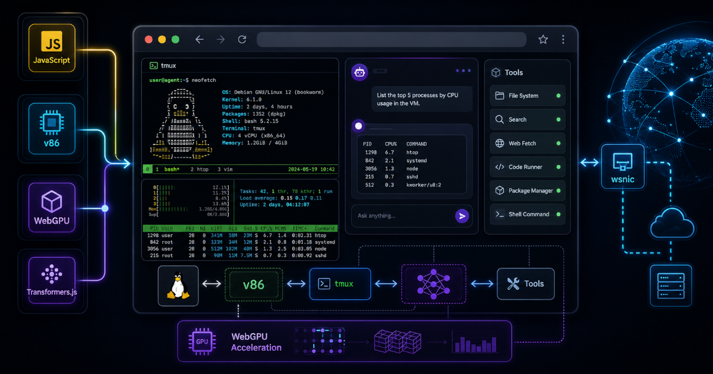
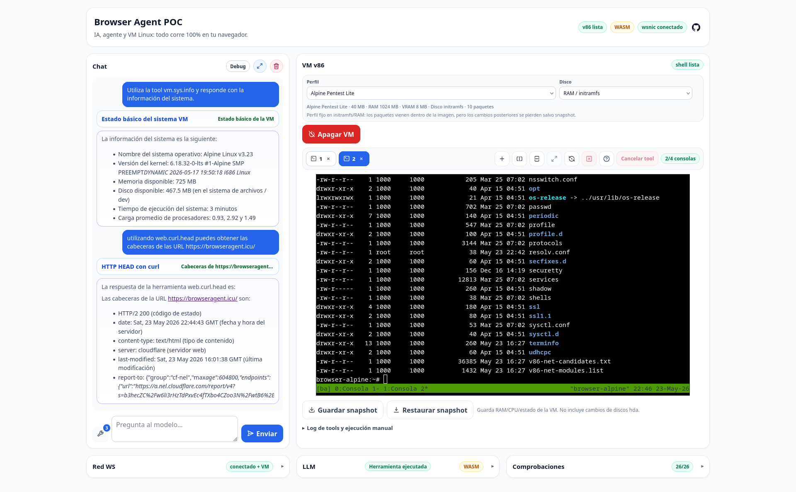
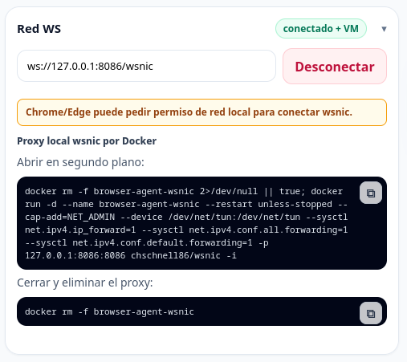

## Tabla de contenido

## Introducción

¿Y si pudieras ejecutar una **máquina virtual** directamente en el navegador? Con [**v86**](https://github.com/copy/v86) esto es realidad: emula hardware x86 configurable (**RAM**, **VRAM**, discos), así que puedes instalar un sistema operativo de 32 bits sin salir del navegador.

¿Y si además pudieras correr un **modelo de IA** en local? También es posible gracias a **Transformers.js**, que permite descargar y ejecutar modelos en el navegador. Lo explico en este [artículo](/es/transformersjs-navegador-poc), y también sobre entrenamiento en el navegador con [**TensorFlow.js**](/es/posts/transformersjs-modelos-ml-navegador/).

Por último: también puedes tener, en el navegador, un **agente de IA** que use Transformers.js para ejecutar comandos en la VM de v86; todo esto ya es posible con **Browser Agent v86 POC**, una prueba de concepto que permite experimentar ejecutando una **VM Linux x86**, un **chat con LLM local** y un conjunto de **tools de agente** directamente desde el navegador.



- Repositorio:[Len4m/browser-agent-v86-poc](https://github.com/Len4m/browser-agent-v86-poc)
- Demo:[https://browseragent.icu/](https://browseragent.icu/)

El proyecto se encuentra en fase beta, específicamente en la versión **0.9.0-beta.1** al momento de escribir este artículo. Actualmente solo está disponible en español, aunque existe la intención de añadir soporte para otros idiomas en el futuro.

## Qué es Browser Agent v86 POC

Browser Agent v86 POC es un laboratorio web para mezclar tres piezas que normalmente viven separadas:

- Una máquina virtual Linux x86 ejecutándose en el navegador con **v86**;
- Un chat con modelos locales usando **Transformers.js** y WebGPU/WASM;
- Un sistema de tools para que el agente pueda ejecutar comandos dentro de la VM.

La idea no es sustituir un entorno real de trabajo, sino crear un espacio reproducible, portable y fácil de lanzar para pruebas, formación, investigación y automatización controlada. Todo ocurre desde una aplicación web estática.

### Por qué hacerlo en el navegador

El navegador moderno ya no es solo una capa de interfaz. Con WebAssembly, WebGPU, Web Workers, `SharedArrayBuffer` y caché local, puede ejecutar cargas bastante serias sin depender siempre de un backend.

Además, lo más importante: si todo se ejecuta en tu navegador, todo es 100% privado y gratuito, siempre y cuando no tengas instalada alguna extensión o utilices un navegador que te espíe.

### Conectividad de red: proxy opcional con wsnic

Para que la VM tenga acceso a internet desde el propio navegador, es necesario recurrir a un pequeño truco: levantar un proxy local llamado **wsnic** que actúa como puente entre tu máquina real y la virtual. Es decir, aunque todo el resto funciona 100% en tu navegador, la conectividad de red solo es posible ejecutando wsnic en tu equipo. Lo más habitual es iniciarlo fácilmente mediante Docker, y la VM se conecta por WebSocket a:

```txt
ws://127.0.0.1:8086/wsnic
```

Esto implica que toda la comunicación de red de la VM pasa a través de tu equipo, nunca a través del servidor web ni intermediarios externos. Así, la VM usará **tu conexión local y estará integrada en tu red**, pudiendo hacer pruebas reales de red, participar en CTFs, explorar servicios locales, etc.




Si no tienes wsnic ejecutándose, la VM funcionará igual pero permanecerá **aislada de internet y de tu red**. En otras palabras, la red es totalmente opcional para la experiencia, y solo depende de que el proxy esté arrancado localmente.

Cuando ejecutas la aplicación publicada en internet, `127.0.0.1` sigue refiriéndose al equipo del usuario: no hay exposición ni reenvío de tráfico fuera de tu control. Los comandos necesarios para lanzar el proxy wsnic aparecen integrados en la propia app, y puedes arrancarlo/terminarlo en cualquier momento para experimentar con la conectividad según te convenga.

### Modelos de IA

Actualmente, la aplicación permite utilizar modelos de Transformers.js u Ollama. Ambos métodos emplean modelos de inteligencia artificial que se ejecutan en tu propia GPU, por lo que es importante contar con una buena tarjeta gráfica y suficiente memoria.

#### Transformers.js

Para utilizar los modelos de Transformers.js es necesario contar con un navegador que soporte WebGPU. Existen varios modelos preconfigurados, pero también puedes configurar cualquier otro modelo ONNX y se descargará automáticamente.

- Más información: https://caniuse.com/webgpu  
- Listado de modelos ONNX compatibles con Transformers.js:  
https://huggingface.co/models?pipeline_tag=text-generation&library=transformers.js&sort=trending

#### Ollama

También existe una integración opcional con **Ollama**. En este caso, el navegador realiza peticiones al servicio local del usuario en `http://127.0.0.1:11434/api/chat`.

Para que Ollama funcione correctamente, es necesario configurar la variable de entorno `OLLAMA_ORIGINS`; esto permitirá que Ollama conceda acceso.

Ejemplo:

```bash
OLLAMA_ORIGINS=https://browseragent.icu,https://www.browseragent.icu ollama serve
```

#### Rendimiento e integración

Tras varias pruebas, los modelos de Ollama ofrecen un rendimiento muy superior respecto a Transformers.js, debido tanto a las limitaciones propias del navegador como a la forma en la que Ollama se integra con las tools del agente. Mientras que en Transformers.js hay que deducir si el modelo quiere usar una herramienta analizando su respuesta, en Ollama esto se indica de forma clara y directa.

Confío en que la experiencia y compatibilidad con Transformers.js irá mejorando con el tiempo, y espero poder seguir actualizando el PoC según avancen ambas tecnologías.

### Perfiles de VM

He implementado un sistema que permite crear perfiles de máquina virtual a partir de ficheros de configuración en formato JSON, facilitando así la personalización y el mantenimiento de las distintas variantes de Alpine disponibles.

A continuación, se detallan los perfiles disponibles y los principales paquetes que incluyen en el momento de escribir este artículo:

| Perfil                | Principales paquetes instalados                                                                                                      |
|-----------------------|--------------------------------------------------------------------------------------------------------------------------------------|
| `alpine-base`         | `ca-certificates`, `curl`, `nano`, `tmux`                                                                                            |
| `alpine-pentest-lite` | `ca-certificates`, `curl`, `nano`, `nmap`, `ffuf`, `python3`, `py3-pip`, `bind-tools`, `iproute2`, `tmux` (+ wordlists SecLists Web-Content) |
| `alpine-pentest-web`  | Todos los anteriores, más `nikto`, `httpx`, `perl-net-ssleay`, `perl-io-socket-ssl`, `perl-mozilla-ca`, `openssl`                   |

Estos perfiles permiten adaptar el entorno según la necesidad, desde un sistema básico hasta uno preparado para realizar pruebas de red o auditorías web.

En cualquier caso, también puedes instalar paquetes adicionales si has configurado la conectividad de red, utilizando el comando apk.

Ejemplo de instalación de htop:

```bash
apk add htop
```

### Snapshots

Debes tener en cuenta que todo se ejecuta en el navegador; por lo tanto, si cambias de página o recargas el sitio perderás el estado de la máquina virtual. Existen dos opciones: puedes configurar la red para enviarte los datos necesarios, o bien generar un snapshot.

Sin embargo, ten precaución al restaurar un snapshot: para que todo funcione correctamente, debes configurar el mismo perfil de VM con los mismos parámetros. Además, el snapshot guarda el estado de la RAM, la CPU y la VM, pero no incluye los cambios realizados en los discos hda.

## Uso

La forma más fácil de utilizarlo es accediendo a la URL: https://browseragent.icu/, donde encontrarás todo lo necesario.

Por otro lado, si prefieres ejecutarlo en local, también puedes hacerlo, pero deberás descargar las dependencias, las imágenes y compilar el repositorio.

```bash
git clone https://github.com/Len4m/browser-agent-v86-poc.git
cd browser-agent-v86-poc
npm install                 # instala dependencias
npm run prepare:local       # primera vez: setup VM + build frontend/LLM/assets

# Puedes elegir una de estas dos opciones para levantar el servidor local:

npm start                   # Opción recomendada. Incluye cabeceras necesarias y soporte completo para los discos hd de la VM.

# O bien, lanzar un servidor simple con Python:
cd public
python3 -m http.server 5173 # Opción alternativa. ¡OJO! En este modo no tendrás las cabeceras necesarias y los discos hd de la VM i el LLM pueden no funcionar correctamente.
```

## Limitaciones actuales

Esto sigue siendo una prueba de concepto. Hay varias limitaciones importantes:

- El primer arranque puede requerir descargas pesadas;
- Los modelos locales dependen mucho del navegador, hardware y soporte WebGPU;
- La VM necesita headers concretos para rendir bien, sobre todo con los discos hda;
- La red es lenta, ten cuidado con la cantidad de peticiones.
- La VM solo cuenta con un nucleo, ten cuidado con la cantidad de procesos en ejecución.
- Las Tools en transformers.js son limitadas.

La intención es mantener el proyecto como un entorno experimental claro, no venderlo como una plataforma cerrada ni como una solución de producción.

## Conclusión

Browser Agent v86 POC integra diversas tecnologías que previamente había explorado de manera independiente: Linux en el navegador, modelos locales mediante Transformers.js, WebGPU, herramientas de agente y automatización reproducible.

El resultado es un laboratorio accesible directamente desde una URL, ejecutable en local o incluso empaquetable como un entorno estático. Aunque todavía se encuentra en fase beta, ya permite experimentar con flujos muy interesantes: una máquina virtual con Linux controlable desde la interfaz web, consola y chat, con una clara separación entre la sesión humana y las acciones automatizadas del agente.

Desarrollar este PoC ha representado un verdadero reto, en particular por la necesidad de optimizar el consumo de memoria para priorizar tanto la máquina virtual como el modelo de lenguaje, además de buscar alternativas al aislamiento impuesto por el navegador. No obstante, gracias a la colaboración de la inteligencia artificial, la motivación y el tiempo invertido, ha sido posible materializar este proyecto, el cual espero seguir mejorando.
