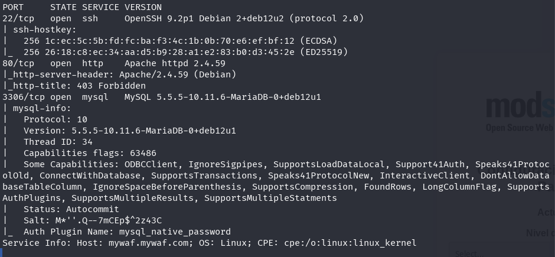
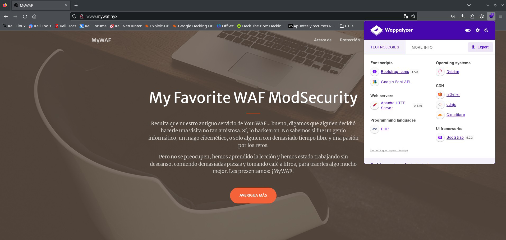
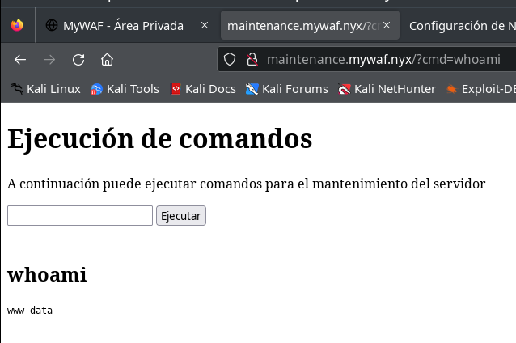
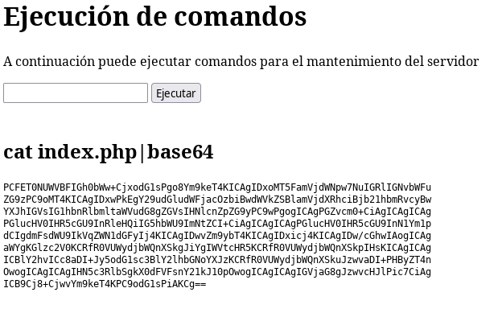
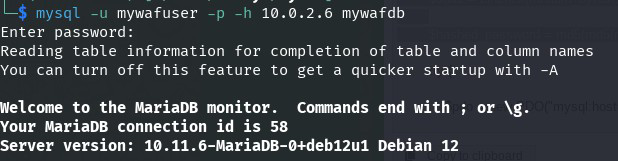
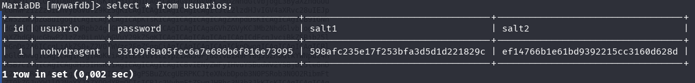
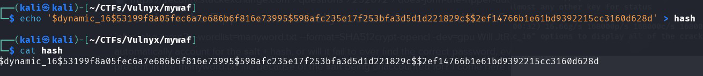
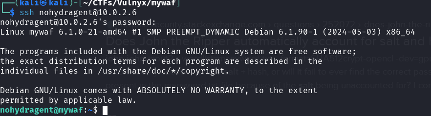

No estaba contento con el resultado del CTF YourWAF, así que ahora traigo MyWAF, un CTF creado a partir del otro, completamente modificado y mejorado como secuela. Espero que esto no sea un impedimento para aceptarlo.


## Tabla de contenido 

## Enumeración

`$ nmap -p- -Pn -T5 10.0.2.6`


`$ nmap -sVC -p22,80,3306 -T5 10.0.2.6`



Encontramos los puertos mariadb, ssh y http. Revisamos qué hay en el http y nos redirige a la URL [www.mywaf.nyx](http://www.mywaf.nyx/), lo añadimos al archivo /etc/hosts y observamos un sitio web.



Con una área privada con registro y validación de usuario:


Buscamos posibles subdominios con un diccionario grande.

`$ ffuf -w /usr/share/wordlists/seclists/Discovery/DNS/ subdomains-top1million-110000.txt -u http://10.0.2.6 -H "Host: FUZZ.mywaf.nyx" -H "User-Agent: Netscape" -fc 302`

Rápidamente encontramos `www` y `maintenance`, y en 40 segundos, configure.


Añadimos todos los subdominios a `/etc/hosts` y observamos qué hay con el navegador.

Hay una magnífica ejecución de comandos para el mantenimiento del servidor en maintenance.mywaf.nyx, al igual que teníamos en YourWAF, pero esta vez el WAF bloquea casi todo.



Por otro lado, el dominio configure.mywaf.nyx tiene autenticación HTTP básica.

## Intrusión

Intentamos un ataque de fuerza bruta para pasar la autenticación del dominio configure.mywaf.nyx, primero intentamos con hydra, pero hay un problema, no hay forma de eliminar la cabecera User-Agent que envía, lo que hace que el WAF lo detecte. Probamos con medusa, que no envía ningún User-Agent sospechoso.

`$ medusa -h configure.mywaf.nyx -U /usr/share/wordlists/seclists/Usernames/top-usernames-shortlist.txt -P /usr/share/wordlists/seclists/Passwords/Common-Credentials/10k-most-common.txt -M http -m DIR:/ -T 10 -f -v 04`


Encontramos algunas credenciales: admins:security, las usamos para entrar en el subdominio configure donde hay una página para configurar el nivel de paranoia de modsecurity, solo nos deja establecerlo en nivel 3 o 4, actualmente está en el nivel 4, lo cambiamos a nivel 3.


Ahora parece que desde la ejecución de comandos en el subdominio maintenance podemos hacer más cosas, nos permite introducir espacios y más caracteres que antes no podíamos.

Con las siguientes cargas útiles, logramos leer algunos archivos:

`cat index.php|base64`



Utilizamos la misma carga útil para obtener archivos que creemos pueden tener datos interesantes, muchas veces el WAF lo detecta incluso si lo codificamos en base64, pero logramos leer los siguientes archivos:

**/var/www/www.mywaf.nyx/index.php**

Donde podemos ver al principio:
```php
<?php
// Datos de conexión a la base de datos
$host = 'localhost';
$dbname = getenv("DB");
$username = getenv("DBUSER");
$password = getenv("DBPASS");
```

Intentamos encontrar esas variables de entorno DB, DBUSER, DBPASS. Las encontramos en el siguiente archivo:

**/etc/apache2/sites-available/www.mywaf.nyx.conf**

```
SetEnv DB "mywafdb"
SetEnv DBUSER "mywafuser"
SetEnv DBPASS "Ukf8T93VnbsXmDuh7WM4r5"
```

También obtenemos el archivo /var/www/www.mywaf.nyx/private.php, en este archivo, hay una parte en el código donde se puede ver cómo se genera el hash para los usuarios registrados:

```php
$salt1 = bin2hex(random_bytes(16)); // Generar salt1 aleatorio
$salt2 = bin2hex(random_bytes(16));
$hashed_password = md5(md5(md5($password_plain).$salt1).$salt2);
```

### Base de datos

Dado que tenemos el nombre de usuario y la contraseña de la base de datos, los usamos para acceder.



Encontramos un usuario en la base de datos, con un hash y dos salts.



Nos recuerda a la programación en el archivo private.php, con la cual seguramente tiene una conexión.

### Crackear el hash del usuario nohydragent

Tenemos los datos del siguiente usuario obtenidos de la base de datos:


- usuario: nohydragent
- hash de contraseña: 53199f8a05fec6a7e686b6f816e73995
- salt1: 598afc235e17f253bfa3d5d1d221829c
- salt2: ef14766b1e61bd9392215cc3160d628d

Por otro lado, en el archivo private.php encontramos que el salt se genera de la siguiente manera:

`md5(md5(md5($password_plain).$salt1).$salt2);`

Buscamos en john si existe este formato y encontramos el dynamic_16, que es exactamente lo que estamos buscando.


Preparamos el hash según indica el formato:

`$dynamic_16$53199f8a05fec6a7e686b6f816e73995$598afc235e17f253bfa3d5d1d221829c$2ef14766b1e61bd9392215cc3160d628d`



Y tratamos de crackearlo con john y rockyou, lo hace súper rápido y obtenemos la contraseña del usuario “nohydragent”.


### Bandera de usuario

Tratamos de conectarnos con el usuario nohydragent vía ssh con las credenciales obtenidas por si hay reutilización de contraseñas y ¡bingo!



Obtenemos la bandera user.txt


## Escalada de privilegios

> Esta parte del CTF no está bien ejecutada; la escalada de privilegios debería haberse hecho vía sudo con una contraseña. Esto habría requerido crackear la contraseña del usuario nohydragent.

El usuario no tiene sudo, ni encontramos nada en crontab, pero encontramos un archivo ejecutable PHP que tiene las capacidades cap_setuid.


Escalamos privilegios como indica gtfobins.


Ahora somos root y podemos obtener la bandera root.txt.


