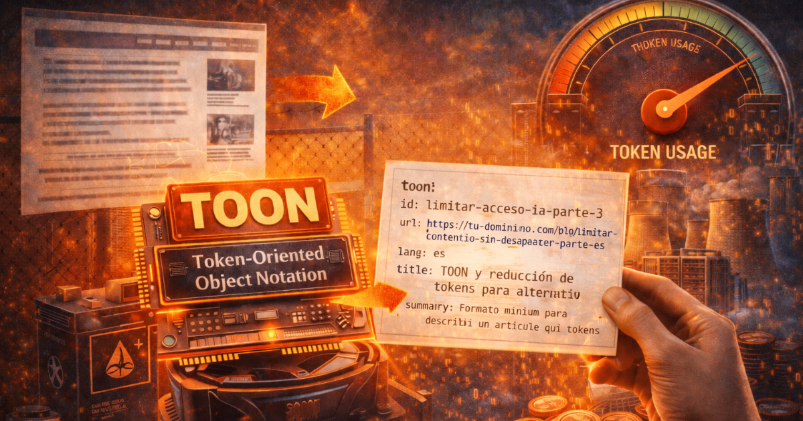

*TOON, compact summaries, and a practical pattern to publish now without giving away tokens.*

**Series:**
- [Part 1: Introduction](/posts/limit-ai-access-to-content-without-disappearing-part-1/)
- [Part 2: Technical strategies](/posts/limit-ai-access-to-content-without-disappearing-part-2/)
- **Part 3: More token reduction**

## Table of Contents

## From Part 2 to Part 3

In [Part 2](/posts/limit-ai-access-to-content-without-disappearing-part-2/) we saw how to block, allow, and serve alternative content to bots. Here I close the series with a concrete question: **if I am already going to show a summary to AI, how do I do it in a way that uses the fewest tokens possible without losing context?**

This article proposes a simple format (TOON) and a publishing flow you can apply today.

## The goal: fewer tokens, same context

We are not trying to hide everything: we are trying to **optimize what the AI sees**. The goal is for a bot to be able to:

* understand what the article is about,
* link it correctly,
* and avoid ingesting the full text.

That implies **very compact summaries** and a structure designed to reduce tokens.

## What is TOON (Token-Oriented Object Notation)

**TOON** is a compact, readable format that **encodes the JSON data model** for LLM prompts, with the goal of reducing tokens without losing structure. The official documentation defines it as a "compact and readable" representation of the JSON model for prompts. [TOON: Token-Oriented Object Notation](https://toonformat.dev/)

Although TOON was not designed specifically to **share content on the internet**, it was designed to **reduce tokens** and **improve understanding by models**. That is why it is ideal for publishing content that machines will consume.

In addition, there are **public benchmarks** that measure comprehension and data retrieval: TOON achieves **73.9% accuracy** compared to **69.7% in JSON** and uses **39.6% fewer tokens** in the tested datasets. [TOON Benchmarks](https://toonformat.dev/guide/benchmarks)

Think of TOON as an ultra-condensed equivalent of your article: **title, canonical URL, minimal summary, key points, and tags**. Everything else is unnecessary.

### TOON design principles

* **Short and stable fields**: short keys, compact values.
* **No long prose**: the summary is max 1-2 lines.
* **No duplication**: avoid repeating the same thing with other words.
* **No filler**: adjectives and unnecessary context out.
* **Always canonical**: a clear link to the full URL.

### Minimal TOON template (example)

The recommended TOON fields are designed to be easily understandable by language models, but since it is not a closed standard, you can include any field or structure you need to describe your content: `author`, `modified`, `title`, `category`, or any other TOON data key or structure that makes sense in your case.

Realistic example for an article:

```yaml
ver: 1
type: article
lang: es
url: https://tusitio.com/post/estrategia-hibrida
use: index=1,cite=1,train=0,derive=0
sum: Estrategia híbrida para controlar crawlers IA sin perder visibilidad ni regalar contenido completo.
k: [bloqueo_selectivo|feed_compacto|control_semantico|menos_tokens]
ent: [robots.txt|nginx|ai_crawlers]
ts: 2026-01-15
```

#### Field names (why these and not others)

* `ver`: clearer than `v`, shorter than `version`.
* `type`: universal in datasets.
* `lang`: standard recognized by LLMs.
* `url`: universal and expected.
* `use`: direct semantics.
* `sum`: very common in datasets.
* `k`: widely used abbreviation.
* `ent`: informal standard for entities.

Real minimum viable:

* `type`: immediate context of the content.
* `lang`: correct linguistic interpretation.
* `url`: canonical source for citation.
* `sum`: immediate answer without inference.

With these 4 fields, an LLM can **respond, summarize, and cite**.

#### `use` field (ethical-technical core)

It is a **proposal with no binding effect**: the bot can ignore it, but it could also use it in the future to understand the context and respect your preferences.

Compact format:

```yaml
use: index=1,cite=1,train=0,derive=0
```

Natural interpretation for any LLM:

* `index=1`: can be indexed.
* `cite=1`: can be cited with a link.
* `train=0`: do not train.
* `derive=0`: do not persist derivatives.

### TOON for an article vs TOON for lists

An **article TOON** is useful to explain a specific piece of content with the minimum tokens. A **list TOON** (for example, latest articles, guides, or products) is even more valuable because **you save tokens in bulk**: you share fields once and reduce a lot of repetition.

In lists, TOON shines because of the **tabular** pattern: you declare the fields once and then only send rows. That greatly lowers the cost when there are 10, 50, or 200 entries.

**Example: compact list of articles**

```yaml
toon: 1
list: articles
articles[3]{id,url,tit,summary,updated}:
  parte-1,/blog/limitar-acceso-ia-contenido-sin-desaparecer-parte-1,Intro,Ideas base y contexto,2026-01-10
  parte-2,/blog/limitar-acceso-ia-contenido-sin-desaparecer-parte-2,Estrategias,Control técnico para bots,2026-01-14
  parte-3,/blog/limitar-acceso-ia-contenido-sin-desaparecer-parte-3,TOON,Más reducción de tokens,2026-01-18
```

If you publish a feed or a content index, a list TOON **reduces tokens much more aggressively** than one per article.

## Additional token reduction techniques

TOON is the container. These techniques help **compact the content**:

* **Hierarchical summary**: a headline + 3 key points.
* **Lists instead of paragraphs**: fewer tokens and more informational density.
* **Key entities and concepts**: name the essentials (technologies, norms, risks).
* **Remove redundancies**: do not repeat the same idea with synonyms.
* **Zero long quotes**: link to the source instead of copying.

## Practical proposal to make it work today

This **works safely today** and it would be very positive to keep working in this direction, creating **standardized formats and proposals** for sharing information with machines, with the clear goal of **reducing energy consumption** and the number of **tokens** required.


This is a **minimum viable** and realistic flow:

1. **Create a TOON file per article**
   - Suggested path: `/ia-content/slug.toon`
   - Format: plain text

2. **Add it to your `llms.txt`**

```markdown
# /llms.txt (ejemplo, formato Markdown)
# Mi sitio
> Contenido técnico con alternativas compactas para IA.

Aquí publico TOONs por artículo y listados compactos para IA.

## Contenido alternativo
- [TOON Parte 3](https://tu-dominio.com/ia-content/limitar-acceso-ia-contenido-sin-desaparecer-parte-3.toon): Resumen TOON del artículo.
- [TOON Listado](https://tu-dominio.com/ia-content/indice.toon): Índice compacto de artículos.
```

3. **Link the TOON from HTML**

```html
<link rel="alternate" type="text/plain" href="/ia-content/limitar-acceso-ia-contenido-sin-desaparecer-parte-3.toon">
```

4. **Adjust `robots.txt`** to allow AI bots to access `/ia-content/` and limit the full HTML (as in Part 2).

With this flow you already have a version accessible to bots **with a very low token cost** and without changing the human content.

## How much can be reduced?

It depends on the size of the article, but the order of magnitude is clear: **you go from thousands of tokens to tens or a few hundred**. That is, less energy cost, less compute, and less exposure of the full content.

If you want to measure it, use any tokenizer for your target model and compare the HTML or full article versus the summarized TOON. The jump is immediate.

### Tools to measure tokens

* **TOON Playground**: paste your JSON and compare tokens between JSON and TOON in real time. [TOON Playground](https://toonformat.dev/playground.html)
* **OpenAI Tokenizer**: official tool to count tokens in texts and prompts. [OpenAI Tokenizer](https://platform.openai.com/tokenizer)
* **Chase Adams Tokenization Playground**: compare tokens between formats with presets. [Format Tokenization Exploration](https://www.curiouslychase.com/playground/format-tokenization-exploration?mode=preset&size=small-simple&structure=uniform-flat)

## Limits and warnings

* **TOON is not a standard**: use it as a practical format, not as a guarantee of adoption. The documentation proposes using the MIME type `text/toon` (although it is not officially registered with IANA yet) and the `.toon` extension.
* **While there is no common standard**: it is the most reasonable approximation today to reduce tokens without losing context.
* **Valid alternatives**: you can also publish JSON, Markdown, or plain text if they fit your flow better, although TOON offers the best ratio between token reduction and model understanding (especially in structured lists).
* **Avoid cloaking with classic search engines** if your priority is SEO (do not serve different content to Googlebot unless you control it well).

## Quick checklist

* [ ] I have a TOON per article in `/ia-content/`.
* [ ] My `llms.txt` points to those files.
* [ ] My HTML links the TOON with `rel="alternate"`.
* [ ] My `robots.txt` separates training vs search.
* [ ] My web server separates training vs search.

> If in the end you do not care about energy consumption but you have a production service (especially if it uses lists of objects with JSON), **using TOON will save you money**. And for those of us who do care about environmental impact, you will make us happier

## References and resources

* Part 1: [How to limit AI access to your content without disappearing from the web (Part 1 - Introduction)](/posts/limit-ai-access-to-content-without-disappearing-part-1/)
* Part 2: [How to limit AI access to your content without disappearing from the web (Part 2 - Technical strategies)](/posts/limit-ai-access-to-content-without-disappearing-part-2/)
* llms.txt (proposal): [https://llmstxt.org/](https://llmstxt.org/)
* ai-robots-txt (repository): [https://github.com/ai-robots-txt/ai.robots.txt](https://github.com/ai-robots-txt/ai.robots.txt)
* TOON (official documentation): [https://toonformat.dev/](https://toonformat.dev/)
* TOON Benchmarks (accuracy and tokens): [https://toonformat.dev/guide/benchmarks](https://toonformat.dev/guide/benchmarks)
* TOON Playground (JSON vs TOON comparison): [https://toonformat.dev/playground.html](https://toonformat.dev/playground.html)
* OpenAI Tokenizer: [https://platform.openai.com/tokenizer](https://platform.openai.com/tokenizer)
* Chase Adams Tokenization Playground [Format Tokenization Exploration](https://www.curiouslychase.com/playground/format-tokenization-exploration?mode=preset&size=small-simple&structure=uniform-flat)
