I wasn't happy with the result of the YourWAF CTF, so now I bring MyWAF, a CTF created from the other one, completely modified and improved as a sequel. I hope this is not an impediment to accepting it.

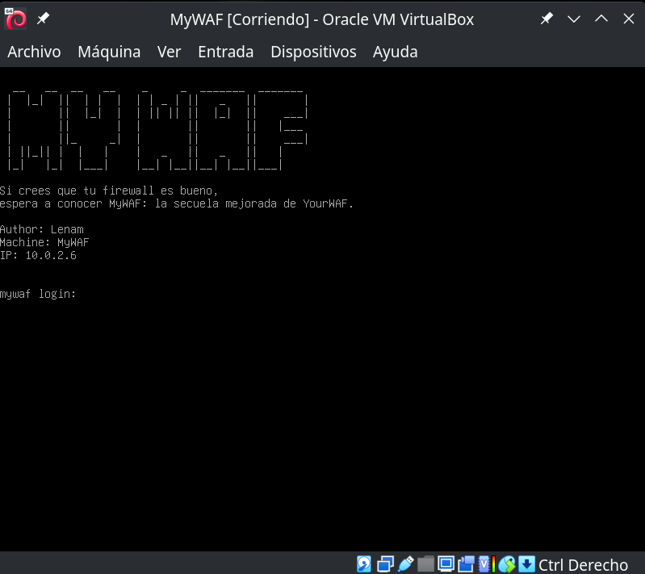

## Table of contents

## Enumeration

`$ nmap -p- -Pn -T5 10.0.2.6`

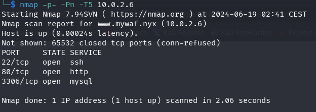

`$ nmap -sVC -p22,80,3306 -T5 10.0.2.6`

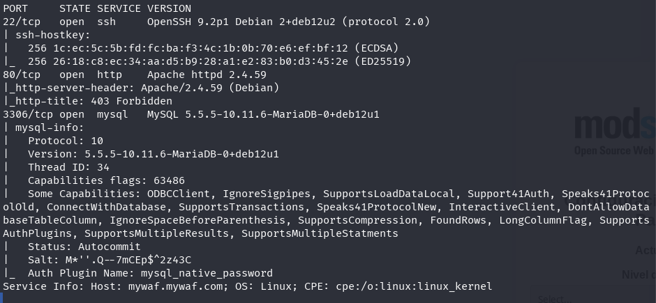

We find mariadb, ssh, and http ports. We check what's on the http and it redirects us to the URL [www.mywaf.nyx](http://www.mywaf.nyx/), we add it to the /etc/hosts file and look at a website.

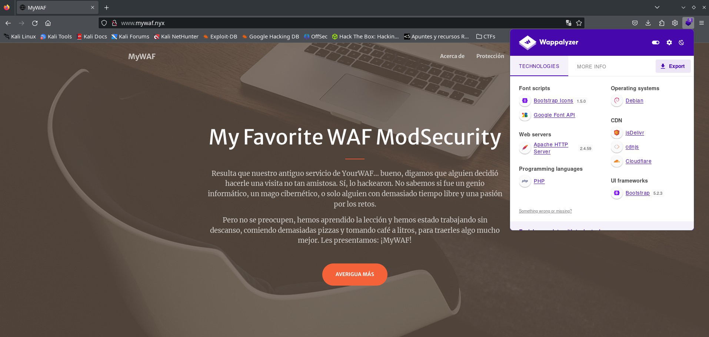

With a private area with user registration and validation:

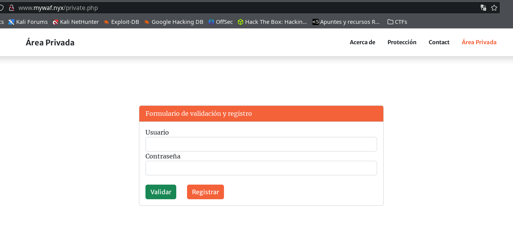

We look for possible subdomains with a large dictionary.

`$ ffuf -w /usr/share/wordlists/seclists/Discovery/DNS/ subdomains-top1million-110000.txt -u http://10.0.2.6 -H "Host: FUZZ.mywaf.nyx" -H "User-Agent: Netscape" -fc 302`

We quickly find `www` and `maintenance`, and at 40 seconds, configure.

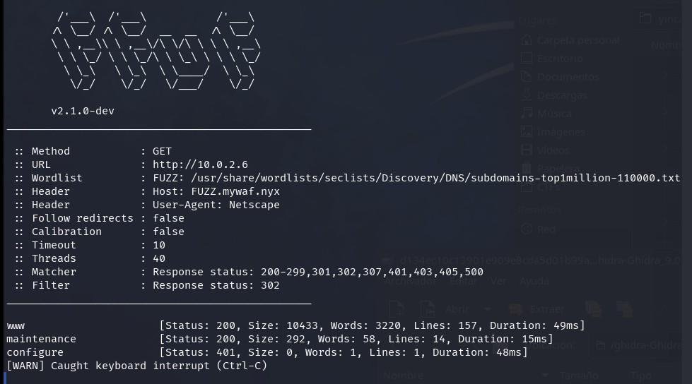

We add all the subdomains to `/etc/hosts` and observe what's there with the browser.

There's a magnificent command execution for server maintenance in maintenance.mywaf.nyx, just like we had in YourWAF, but this time the WAF blocks almost everything.

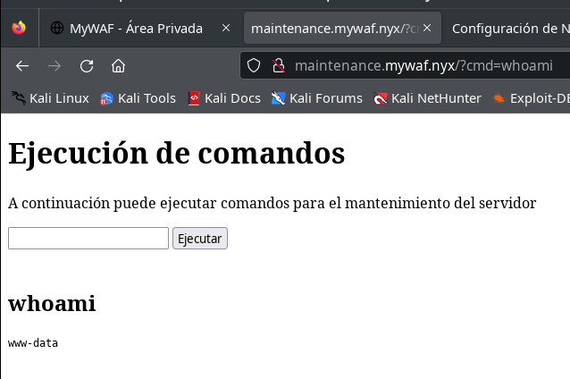

On the other hand, the domain configure.mywaf.nyx has basic HTTP authentication.

## Intrusion

We try brute-forcing to get past the authentication of the configure.mywaf.nyx domain, first we try with hydra but there's a problem, there's no way to remove the User-Agent header it sends, which makes the WAF detect it. We try with medusa, which doesn't send any suspicious User-Agent.

`$ medusa -h configure.mywaf.nyx -U /usr/share/wordlists/seclists/Usernames/top-usernames-shortlist.txt -P /usr/share/wordlists/seclists/Passwords/Common-Credentials/10k-most-common.txt -M http -m DIR:/ -T 10 -f -v 04`

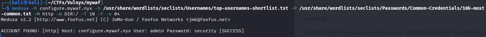

We find some credentials: admins:security, we use them to enter the configure subdomain where there's a page to configure the paranoia level of modsecurity, it only lets us set it to level 3 or 4, currently it's set to level 4, we change it to level 3.

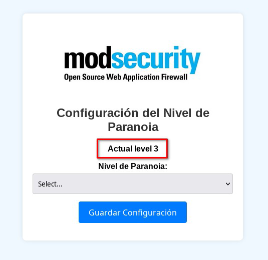

Now it seems that from the command execution in the maintenance subdomain we can do more things, it allows us to introduce spaces and more characters that we couldn't before.

With the following payloads, we manage to read some files:

`cat index.php|base64`

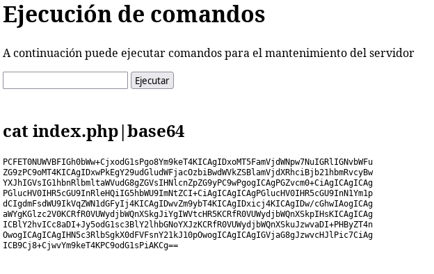

We use the same payload to obtain files that we believe may have interesting data, often the WAF detects it even if we encode it in base64, but we manage to read the following files:

**/var/www/www.mywaf.nyx/index.php**

Where we can see at the beginning:
```php
<?php
// Database connection data
$host = 'localhost';
$dbname = getenv("DB");
$username = getenv("DBUSER");
$password = getenv("DBPASS");
```

We try to find those environment variables DB, DBUSER, DBPASS. We find them in the following file:

**/etc/apache2/sites-available/www.mywaf.nyx.conf**

```
SetEnv DB "mywafdb"
SetEnv DBUSER "mywafuser"
SetEnv DBPASS "Ukf8T93VnbsXmDuh7WM4r5"
```

We also obtain the file /var/www/www.mywaf.nyx/private.php, in this file, there's a part in the code where you can see how the hash for registered users is generated:

```php
$salt1 = bin2hex(random_bytes(16)); // Generate random salt1
$salt2 = bin2hex(random_bytes(16));
$hashed_password = md5(md5(md5($password_plain).$salt1).$salt2);
```

### Database

Since we have the database username and password, we use them to access.

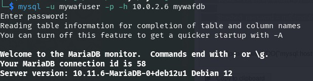

We find a user in the database, with a hash and two salts.

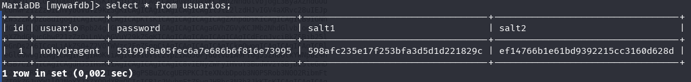

It reminds us of the programming in the private.php file, with which it surely has a connection.

### Crack hash user nohydragent

We have the data of the following user obtained from the database:


- user: nohydragent
- password hash: 53199f8a05fec6a7e686b6f816e73995
- salt1: 598afc235e17f253bfa3d5d1d221829c
- salt2: ef14766b1e61bd9392215cc3160d628d

On the other hand, in the private.php file we find that the salt is generated as follows:

`md5(md5(md5($password_plain).$salt1).$salt2);`

We search in john if this format exists and we find the dynamic_16, which is exactly what we're looking for.

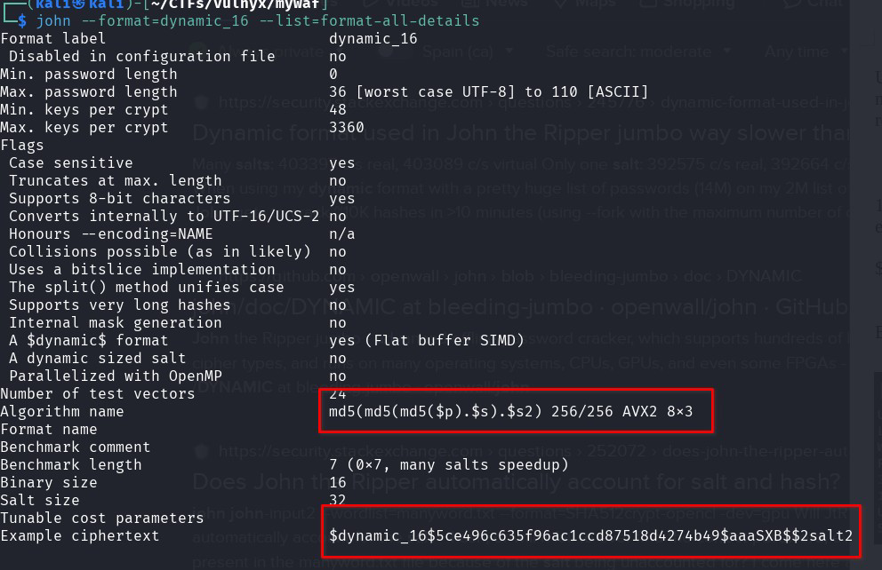

We prepare the hash as the format indicates:

`$dynamic_16$53199f8a05fec6a7e686b6f816e73995$598afc235e17f253bfa3d5d1d221829c$2ef14766b1e61bd9392215cc3160d628d`

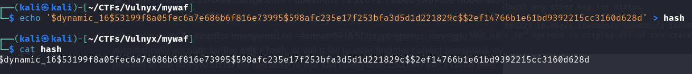

And we try to crack it with john and rockyou, it does it super fast and we get the password of the user “nohydragent”.

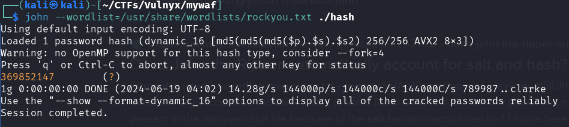

### User flag

We try to connect with the user nohydragent via ssh with the credentials obtained in case there's password reuse and bingo!

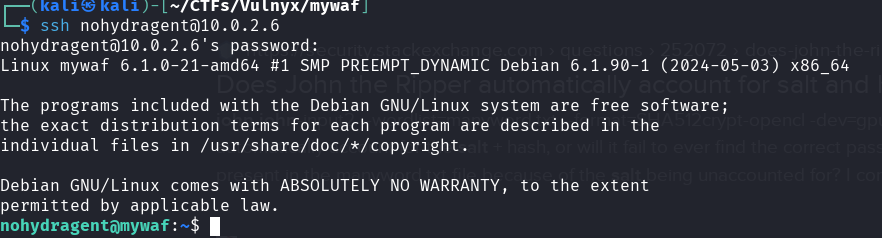

We get the user.txt flag

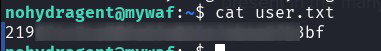

## Privesc

> This part of the CTF is not well executed; privilege escalation should have been done via sudo with a password. This would have required cracking the password of the user nohydragent.

The user has no sudo, nor do we find anything in crontab, but we do find a PHP executable file that has the capabilities cap_setuid.

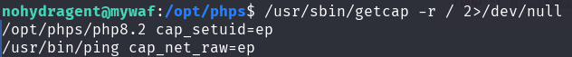

We escalate privileges as indicated in gtfobins.

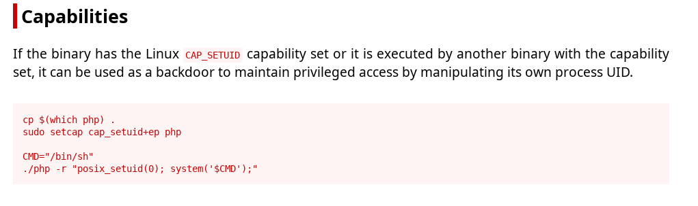

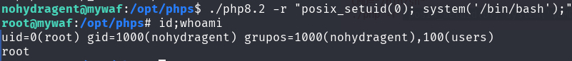

We are now root and can get the root.txt flag.

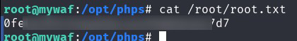

