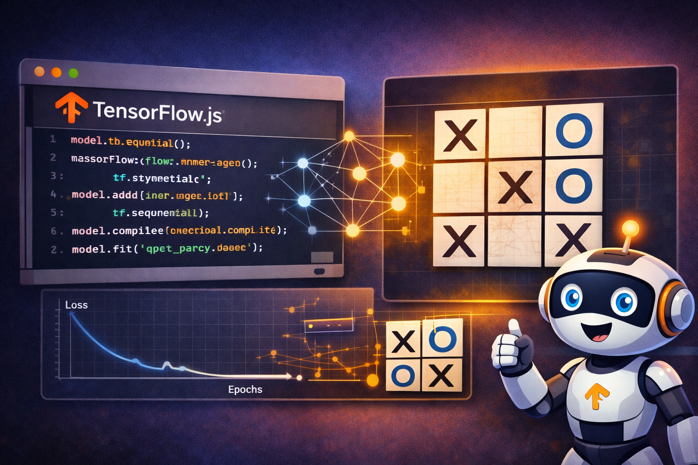

import TicTacToeML from "@components/tensorflowjs/TicTacToeML.astro";



**[TensorFlow.js](https://www.tensorflow.org/js)** lets you create, train and run *machine learning* models directly in the browser using JavaScript. That means a web page can stop being just an interface and become a small AI lab running entirely on the client.

If you are interested in the other side of the problem, in the previous article on [**Transformers.js: language models and ML in the browser**](/posts/transformersjs-ml-models-in-the-browser/) I explain how to run **inference** directly in the browser with prebuilt models. This post focuses on something different but complementary: **building and training** the model on the client itself with TensorFlow.js.

## How a model learns

Before talking about the game, it helps to understand the basic idea. A model does not start out knowing anything: first you define a structure with layers and connections, then you show it examples, and little by little it adjusts its internal numbers to make fewer mistakes. Put less dramatically, at first it guesses, then it practices, and with any luck it eventually starts doing something that looks more like intelligence than pure chance.

Training a model means repeating the same loop over and over:

- Feed it an input.
- Compare its output with the correct answer.
- Measure the error.
- Slightly adjust its internal weights.

That is what learning looks like in a neural network. It does not memorize like a parrot; it shifts thousands of tiny invisible dials until it finds useful patterns. In this example those patterns are tic-tac-toe moves. In other cases they could be text, images or audio.

## What TensorFlow.js does in the browser

What makes this interesting is not just tic-tac-toe, but the fact that everything lives inside the browser thanks to **TensorFlow.js**. With a single page we can:

- Create a model.
- Train it locally.
- Run predictions.
- Store it in **IndexedDB** so it survives reloads.

The result is a full *machine learning* workflow with no backend, no external APIs and no server doing hidden work in the background.

## Example: a neural network that learns to play tic-tac-toe

The demo below builds a small neural network that learns to play as `O`. It first generates a dataset of reasonable board positions, then the model adjusts its weights through batch training, and finally you can play against it directly in the page.

Tic-tac-toe is also here as a nod to *WarGames*, one of the earliest popular films with a hacker as the main character, where this game appears in one of its most memorable scenes.

<div class="flex justify-center">
<iframe width="560" height="315" src="https://www.youtube-nocookie.com/embed/F7qOV8xonfY?si=haUOCmX7QFiWVzi3" title="YouTube video player" frameborder="0" allow="accelerometer; autoplay; clipboard-write; encrypted-media; gyroscope; picture-in-picture; web-share" referrerpolicy="strict-origin-when-cross-origin" allowfullscreen></iframe>
</div>

How to use the demo:

1. Play a few games before training the model.
2. Generate a dataset.
3. Click `Entrenar / reanudar`.
4. Watch the batches and epochs progress.
5. Play again and compare the before and after.

<TicTacToeML lang="en" />

## Building the model with TensorFlow.js

The model definition is surprisingly compact. Here we use a 10-value input, a simple hidden layer, and an output with 9 probabilities, one for each square on the board:

```javascript
const model = tf.sequential();
model.add(tf.layers.dense({ inputShape: [10], units: 24, activation: "relu" }));
model.add(tf.layers.dense({ units: 9, activation: "softmax" }));
model.compile({
  optimizer: tf.train.adam(0.02),
  loss: "categoricalCrossentropy",
  metrics: ["accuracy"],
});
```

The input encodes the board and the current turn. The output is a probability distribution over the 9 squares. From there, the best legal move is selected based on those probabilities.

## Training inside the browser itself

Training also happens on the client. A dataset batch is taken, turned into tensors, and used to adjust the model weights:

```javascript
const xs = tf.tensor2d(batchX, [batchX.length, 10]);
const ys = tf.tensor2d(batchY, [batchY.length, 9]);
const metrics = await this.model.trainOnBatch(xs, ys);
xs.dispose();
ys.dispose();
```

It sounds humble because it is, but this is exactly how a neural network starts learning patterns. In this demo, the heavy work also runs in **Web Workers** so the UI stays responsive, and the dataset is split into chunks and stored in **IndexedDB** so training can resume without starting from scratch.

## What is really happening in the demo

Under the hood, there is more going on than it first seems:

- **Minimax** generates examples of good moves.
- **TensorFlow.js** trains the model inside the browser.
- **IndexedDB** persists both the dataset and the model.
- **Web Workers** keep the UI from freezing during generation, training and evaluation.
- The quick evaluation mode lets you compare the model against a random opponent or minimax.

In other words, this is about tic-tac-toe, yes, but more importantly it is about something genuinely useful for web developers: today you can already build small AI experiences directly in JavaScript, inside a normal web page, with immediate visual feedback.

## Conclusions

TensorFlow.js turns the browser into a legitimate environment for experimenting with real *machine learning*. It does not only support inference: it also lets you **build models**, **train them**, **evaluate them** and **store them locally**. For demos, prototypes, education or private tools, that opens up a huge range of possibilities without relying on external infrastructure.

It also leaves you with a useful takeaway: for small problems, a simple model that learns in front of you often makes more sense than a huge, power-hungry AI system built to play tic-tac-toe or answer a trivial web search.

## More demos and inspiration

If you want to see how far this idea can go, TensorFlow.js maintains an official gallery of live examples and demos, including webcam control, training visualizations, image classification, music generated by neural networks and more:

- [Official TensorFlow.js demos](https://www.tensorflow.org/js/demos?hl=es)

## References

- [TensorFlow.js](https://www.tensorflow.org/js) - Official project documentation.
- [TensorFlow.js guide](https://www.tensorflow.org/js/guide) - Introduction to models, tensors and training.
- [Official TensorFlow.js demos](https://www.tensorflow.org/js/demos?hl=es) - Gallery of live demos and examples.
- [Web Workers on MDN](https://developer.mozilla.org/en-US/docs/Web/API/Web_Workers_API) - Background work in the browser.
- [IndexedDB on MDN](https://developer.mozilla.org/en-US/docs/Web/API/IndexedDB_API) - Structured local persistence in the browser.
- [WarGames](https://en.wikipedia.org/wiki/WarGames) - Cultural reference for tic-tac-toe in popular hacking fiction.
