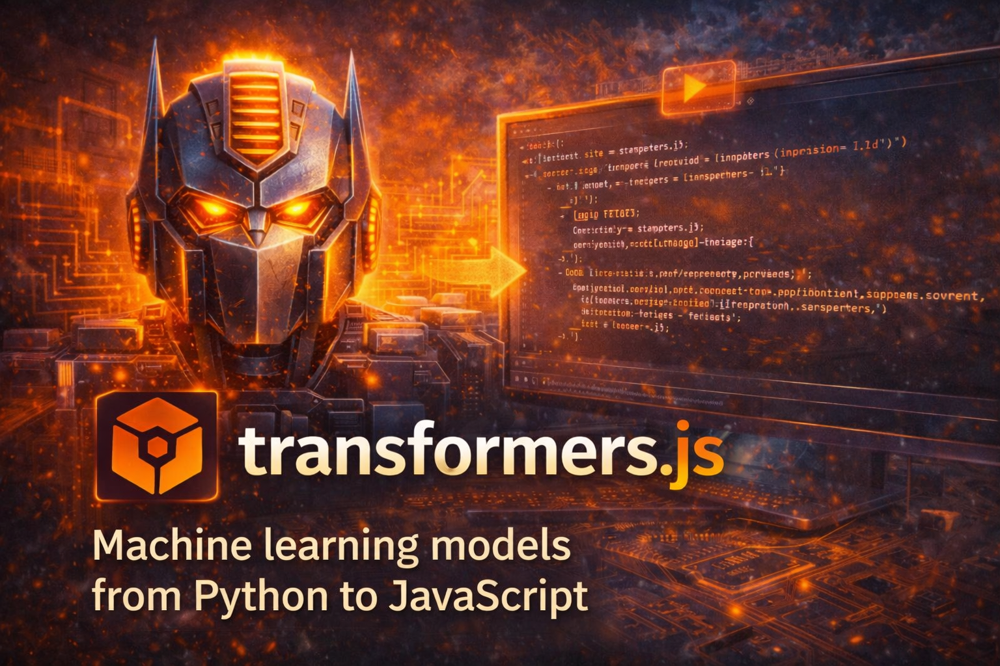

import Chat from '@components/webllm/Chat.astro';



**[Transformers.js](https://huggingface.co/docs/transformers.js)** is a JavaScript library by Hugging Face that lets you run *machine learning* models directly in the browser, with no server required. It is the JavaScript equivalent of the well-known Python *transformers* library by Hugging Face, with a similar API for web developers.

## Why run models in the browser

Running inference on the client has clear advantages:

- **Privacy:** data never leaves the user's device; all computation is local.
- **Zero cost:** no server or subscriptions needed; everything runs on your own computer.
- **Smooth experience:** you can build applications that work offline or with minimal latency once the model is loaded.

**In short: zero dollars** —everything runs on your machine— **and completely private**: no data is sent anywhere.

Transformers.js uses **ONNX Runtime** to execute models. Under the hood it can use:

- **CPU** via **WASM** (WebAssembly), compatible with virtually any modern browser.
- **GPU** via **[WebGPU](https://caniuse.com/webgpu)** when the browser and hardware support it, greatly accelerating inference.

The library automatically picks the best available backend (e.g. WebGPU if available, otherwise WASM on CPU).

## What you can do with Transformers.js

It supports many tasks and modalities:

- **Natural Language Processing (NLP):** text classification, named entity recognition, question answering, summarization, translation and **text generation** (LLMs).
- **Computer vision:** image classification, object detection, segmentation.
- **Audio:** speech recognition (ASR) and text-to-speech (TTS).
- **Multimodal:** zero-shot classification on image or audio, object detection, etc.

The high-level API is based on the concept of a **pipeline**: you choose the task and optionally the model, and the library takes care of downloading and running it.

```javascript
import { pipeline } from '@huggingface/transformers';

const pipe = await pipeline('sentiment-analysis');
const result = await pipe('I love this article!');
```

Models are downloaded from the [Hugging Face Hub](https://huggingface.co/models) and quantized versions (e.g. q4, q8) can be used to reduce size and memory requirements in constrained environments.

## Example: LLM in the browser (CPU or GPU)

The following chat runs an LLM ([SmolLM2](https://huggingface.co/HuggingFaceTB)) **entirely in your browser** using [Transformers.js](https://huggingface.co/docs/transformers.js). The model is downloaded once and cached. Inference runs in a **Web Worker** so the UI stays responsive, responses arrive via **streaming** token by token, and markdown is rendered in real time.

If your browser supports **[WebGPU](https://caniuse.com/webgpu)**, inference will be accelerated using the GPU and the [Llama 3.2 1B](https://huggingface.co/onnx-community/Llama-3.2-1B-Instruct-ONNX) model will be unlocked; otherwise **WASM** (CPU) will be used.

<Chat />

## Conclusions

Although [WebGPU is not yet available in all browsers](https://caniuse.com/webgpu), WASM provides a universal fallback that can run smaller models on CPU with acceptable results. As you can verify yourself in the chat above, WebGPU acceleration is already sufficient to hold fluid conversations with models up to 1B parameters.

The main drawback is model size: even quantized, they range from ~180 MB to over 1 GB. However, once downloaded they are stored in the browser cache, so subsequent visits load the model almost instantly without re-downloading.

This technology opens a promising path to integrate artificial intelligence into websites with no infrastructure cost, without sending data to third parties and without relying on paid APIs. Everything happens on the user's device: **zero dollars and total privacy**.

The current version (v3) still has limitations with certain quantization formats on WebGPU. However, [**Transformers.js v4**](https://huggingface.co/blog/transformersjs-v4) is already available as a preview and brings a WebGPU runtime completely rewritten in C++ together with the ONNX Runtime team. It promises support for models over 8B parameters, up to 4x faster embedding models, direct GPU weight loading without going through WASM, and full offline operation. Once it stabilizes, the landscape of AI in the browser will take a significant leap forward.

## References

- [Transformers.js — Official documentation](https://huggingface.co/docs/transformers.js) — API, guides and usage examples.
- [Transformers.js on GitHub](https://github.com/huggingface/transformers.js) — Source code and issues.
- [Official Transformers.js examples](https://github.com/huggingface/transformers.js-examples) — Demos with WebGPU, Llama, Phi, Whisper and more.
- [ONNX Runtime Web](https://onnxruntime.ai/docs/tutorials/web/) — The inference engine used by Transformers.js under the hood.
- [Working with large models in the browser](https://onnxruntime.ai/docs/tutorials/web/large-models.html) — WASM memory limitations and external data strategies.
- [WebGPU — Browser support](https://caniuse.com/webgpu) — Up-to-date compatibility table.
- [WebGPU — MDN Web Docs](https://developer.mozilla.org/en-US/docs/Web/API/WebGPU_API) — Specification and API reference.
- [Models compatible with Transformers.js](https://huggingface.co/models?library=transformers.js) — Catalog of ONNX models ready to use in the browser.
- [Quantization guide (dtypes)](https://huggingface.co/docs/transformers.js/guides/dtypes) — q4, q8, fp16 formats and when to use each.
- [WebGPU guide for Transformers.js](https://huggingface.co/docs/transformers.js/guides/webgpu) — Setup and models compatible with GPU acceleration.
