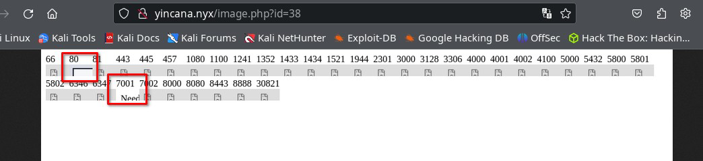

As always, I apologize for the spelling mistakes and for not knowing the names of the techniques; I am a developer intruding into the hacking world. I believe this time it is a difficult machine, although someone may find easier ways to compromise it.

For the creation, I have used some of the technologies I have worked with during my professional life: PHP, XSLT, and NodeJs. It is a difficult CTF, and patience is needed.

Enjoy the Yincana machine and **don't forget to give flowers**. 😉

Skills: XXE, XSLT, IDOR?, Password Cracking (SHA2, RSA).

## Table of contents

## Enumeration

`$ nmap -sV -sC -A -p 80,22 192.168.1.120 -oN nmap2.txt -vvv  `

`$ gobuster dir --url http://192.168.1.120/ --wordlist **/usr/share/wordlists/dirbuster/directory-list-2.3-medium.txt** -x .php,.htm,.html,.txt,.db,.bak,.pdf -t 20`

On the page chat.html, we find this information. The date updates every minute, and we find a domain name.

`# echo "192.168.1.120 yincana.nyx" >> /etc/hosts`

We continue searching for files this time in the virtual host yincana.nyx.

`$ gobuster dir --url http://yincana.nyx/ --wordlist /usr/share/wordlists/dirbuster/directory-list-2.3-medium.txt -x .php,.htm,.html,.txt,.db,.bak,.pdf -t 20 `

It seems the file image.php?id=1 is for displaying or downloading images from the pages:

If we search for subdomains, we won't find any.

## Intrusion

We enter our IP in the URL and start listening with netcat; it seems we receive a signal.

We create an example page that displays something, send it, and search for the image in images.php?id=X, we find it.

If we look more closely, it seems to be a "headless browser" (puppeteer or some similar system).

We use a small list of common ports for HTTP.

<https://github.com/danielmiessler/SecLists/blob/master/Discovery/Infrastructure/common-http-ports.txt>

and create a JavaScript script to analyze local ports using the headless browser.

and we discover port 80 (which we already had access to from outside) and port 7001 (probably only accessible from localhost, as we didn't find it with nmap from outside).

We create another script with an iframe to see the image of what is on the local port 7001.

and we get a message: "Need url parameter", it seems to be the internal service that handles generating these images, we add the URL parameter with “file:///etc/passwd” and continue testing, and it also asks for “Need id parameter”, so we pass both:

Now in yincana.nyx/image.php?id=41 we get

and in yincana.nyx/image.php?id=200 we get

We already have an LFI.

Searching and scanning various local files to get information and attempt RCE (logs, environment variables, configuration files, ...) I find the id_rsa of the user jazmin, but I get it in an image and have to convert it to text to use it.

I install tesseract OCR.

`$ sudo apt install tesseract-ocr`

I modify the image with GIMP to give it more resolution, contrast, and only take the text part. Besides tesseract-ocr, I also try Google Lens App (a good option), Gemini, ChatGPT (AI problems with security filters, long prompts), and other online OCRs, I can't get a completely correct key from the image.

I analyze the text for unacceptable characters and visually compare it to the image to correct some errors.

In the end, after some effort, I get a correct but encrypted id_rsa key for jazmin.

We crack it with john and rockyou.txt very quickly ;)

We log in with the user jazmin and the id_rsa to the server via ssh with the passphrase “flowers”:

We can switch to another user with a flower name and to another user with a flower name in a recursive loop using sudo -u user /bin/bash.

There are about 50 users with flower names and we can switch from one to another using sudo to bash. It’s like a tail-biting fish and each user can execute bash as the next one.

There are the normal users (root, mail, www-data, …), 50 users with flower names and one user named “manel”.

We have access to all users with flower names!!

In jazmin’s home directory, it seems there is the application that exposes the port 7001 service and is used to create the flower page images.

On the other hand, we also find the two websites, the default Apache one with the files chat.html and index.html, and the flower website.

In the flower website's index.php file, we see that the database credentials are obtained from the environment variables.

We try to read the Apache server's environment variables, but we can't, or try to log in as www-data by inserting a reverse shell, but we don't have permissions in the public folders of the website, nor have we found a real LFI where we can include a file to interpret in PHP. In the end, we find the database credentials configured in the yincana.nyx.conf virtual host.

We enter the database to examine the content and find a table of users with their passwords (apparently hashed).

We get all possible data, database comments, user table, and fields. We find a comment in the password field of the users table indicating the hash type (SHA256).

We try to crack the passwords but only manage to crack the password for the user "margarita".

We try to access via SSH with the user margarita and the password flores, but we don't have access. But we did have access to all the users with flower names, we access the user “margarita” from the user “jazmin”.

Now we can execute the xsltproc binary as manel with margarita’s password.

We check what this binary is and what it’s for, it’s an XSLT processor, we use it to try XXE. It’s not in gtfobins but its sudo privilege can still be abused.

Binary information.

We can read files with manel user privileges (XXE), we try to read the RSA key but it doesn't have one. We try to read the user.txt flag.

We process the XSL of the XML file with the xsltproc binary using sudo and the manel user:

We have obtained the first user.txt flag.

We create an id_rsa key to try to include the public key in manel’s authorized_keys and use it to connect via SSH.

We can execute the xsltproc binary with sudo, margarita’s password as manel and the “output” parameter. It allows us to create files with content processed by the xslt with manel’s privileges.

We create an XML file with no data and another with the XSLT to process it and have id_rsa.pub as the result.

We execute the following command to try to include the RSA public key in the manel user.

`margarita@yincana:/tmp$ sudo -u manel /usr/bin/xsltproc -o /home/manel/.ssh/authorized_keys crea_rsa.xml datos.xml` 

We try to access manel via SSH with the generated RSA key from our kali.

  
We could also perform privileged file writing using EXSLT, more information:
<https://github.com/swisskyrepo/PayloadsAllTheThings/tree/master/XSLT%20Injection#write-files-with-exslt-extension>

Great! We access the manel user, the first user without a flower name.

Out of curiosity, the authorized_keys file looks like this, we fix it.

## Get the root.txt flag

Let’s review: We have access to all users with flower names and the manel user. We try to escalate privileges to the root user or get the root flag.

We use pspy64 to monitor the processes that root might be running.

We find a root process for the xsltproc file we used earlier and it seems to create the messages for the initial /chat.html.

We can modify the /home/mensaje.xml file involved in this process because the manel user belongs to the backupchat group.

The file contains the data (in XML format) of the chat messages displayed on the initial page, we modify the /home/mensajes.xml file to try to get the root.txt flag via XXE.

We wait 1 or 2 minutes and the root.txt flag will appear at the initial address:

http://192.168.1.120/chat.html

## Escalation

We haven't achieved privilege escalation.

We try file writing with EXSLT but to achieve this we need to modify the XSL style file and we can only modify the XML data file, or we don’t know or can’t do it.

We analyze the process used for privileged file reading to get more information. We get /etc/shadow but can't crack the root password. We try to read data from the /proc/, /root, etc. directories.

After a while, many of the files can't be seen because they contain characters not allowed in XML or null bytes, some we can see and by looking at files we find the scheduled CRON task:

We find two configured tasks, the one we are exploiting with XSLT and another that executes a "chatbackup" on January 1st each year. We look for that file and find it in our directory, we can modify it but we would have to wait until January 1st to execute it. But this gives us a clue.

The task can execute this file because it’s included in the PATH (first red box in the crontab image) the /home/manel/.local/bin directory.

The command that runs every minute uses "date" without an absolute path.

We search for where the date binary is located, and it’s in /usr/bin/date, since the /home/manel/.local/bin path has write permissions and comes before /usr/bin, we can try to replace “date” with our malicious “date”.

We wait a minute to see if an SUID bash appears in /tmp.

Congratulations, we are root!
